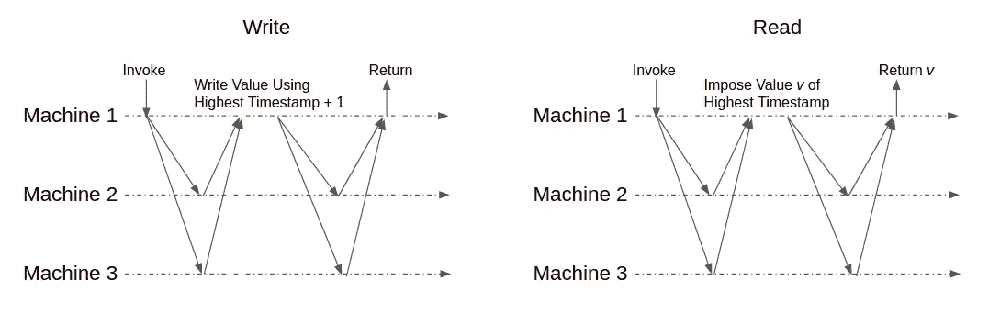
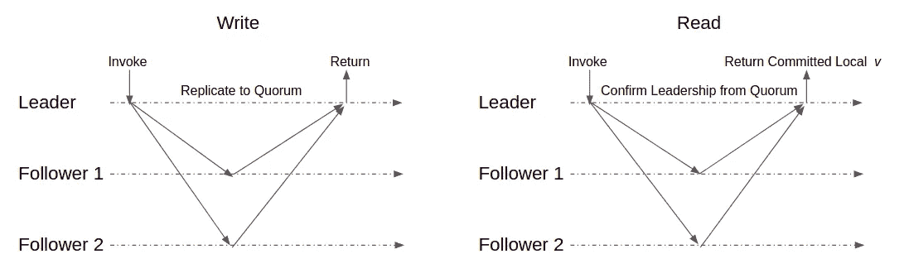
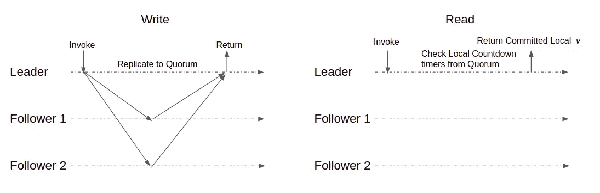
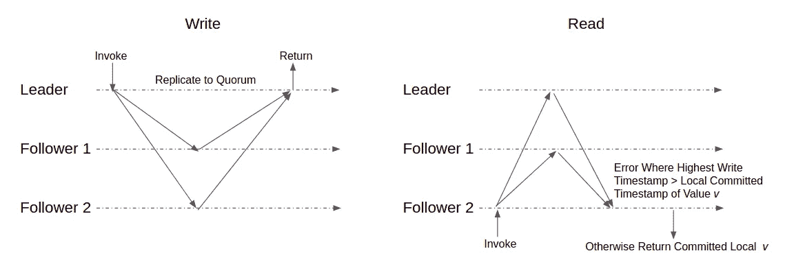

# 系统设计面试:复制的和强一致性的键值存储

> 原文：<https://levelup.gitconnected.com/system-design-interview-replicated-and-strongly-consistent-key-value-store-b690d8e15c9a>

设计一个可复制且强一致性的键值存储，听起来似乎很简单，实际上是一个相当棘手的面试问题。您需要很好地理解一些分布式系统的概念，才能很好地回答这个问题。如果你不是在一个特定领域的面试中，对于这类问题，面试官很可能只是想观察你在一个复杂的设计问题中的表现。在这种情况下，讨论本身通常比最终的解决方案更重要。因此，与其给你一个直接的答案，我认为更有成效的做法是走一遍达成各种解决方案的思考过程。这就是我在这篇博文中打算做的。

> **分析问题**

首先，我们来解开这个问题。问题中有 3 个关键短语:

1.  键值存储。它存储了键值对。规范接口包括一个用于编写新对的`Put(key, value)`和一个用于检索给定键的值的`Get(key)`。
2.  复制的。键值存储在多台机器上复制，以实现高可用性。`Put`和`Get`可以在任何机器上被调用，尽管该机器可以代理其他机器。
3.  强烈一致。客户端观察到的行为非常一致。这是一个关键概念。稍后将详细介绍。

复制和强一致性的结合已经是非常复杂的需求了。所以做一些简化来限制范围是合理的。我们将假设整个键值存储可以放在一台机器中。我们不需要处理键范围分区，这需要一个逻辑路由层来基于键引导流量。我们还观察到没有强调性能。即使我们仍然应该努力获得最佳性能，我们也不需要太关注延迟或吞吐量的实现细节。

> **什么是强一致性**

不失一般性地说，假设操作的执行周期由它的调用(执行的开始)和它的返回(执行的结束)来划分。如果操作 A 的返回发生在操作 B 的调用之前，我们说 A 在 B 之前。如果它们的执行周期有重叠，我们说 A 和 B 是并发的。

强一致性要求读操作总是返回最新写入的值。如果写操作先于读操作，读操作应该返回一个不早于写操作的值。如果写入和读取是并发的，则读取可以返回并发写入之前的值，也可以返回并发写入的值。如果读操作返回并发写操作的值，这意味着并发写操作已经生效，无论写操作是否返回。所有后续读取不应返回早于写入的值。在学术界，他们称之为线性化，也就是说，所有操作的执行似乎是在调用和返回之间的瞬间自动发生的。

为了理解其中的微妙之处，让我们来看看下面的**错误**解决方案。让我们把问题简化为 1 个作者和多个读者。在写入时，机器更新其本地值，并将写入内容广播给其他机器。只有在所有其他机器确认后，写操作才会返回。在读取时，机器返回其本地值。该解决方案可能看起来是正确的，因为如果之前的所有写入都已解决，则读取本地值会返回最新的结果。此外，当写入正在进行时，对本地值的读取返回先前的结果或新的结果，这取决于并发写入是否已经传播到调用读取的机器。但是这个解决方案还是有缺陷的。在写入期间，在已经获得新更新的机器中的读取返回更新的结果。但是随后的读取可能发生在尚未从并发写入接收到新更新的机器中，因此返回旧结果。稍后返回旧值违反了强一致性。

> **一个正确的解决方案:读-强加写-咨询-多数**

上述不正确的解决方案实际上是一个很好的起点。我们需要修改一些地方来改正它。

1.  首先，它专注于一个单一的价值。我们需要扩展它来处理键值映射。
2.  其次，这是给一个作家的。所以我们需要修改它以支持多个并发写入。
3.  第三，它要求所有机器都启动。我们应该只要求大多数机器启动。否则添加复制有什么意义。
4.  最后，需要解决稍后读取返回旧值的边缘情况。

让我们一个一个地解决它们。

第一点应该相当简单。我们将每个键值对视为一个独立的单个值。只有触到同一个键的`Put`和`Get`才需要协调。

第二点也不太复杂。对于多个并发写入者，我们需要一种方法来确定哪个写入是较新的。较新的写入总是覆盖较旧的值。忽略较旧的写入。我们将在每台机器上保存一个逻辑时间戳，并在写入时递增。我们可以对机器中的所有密钥使用一个全局时间戳，或者对每个密钥使用一个时间戳。每个键一个时间戳是更细粒度的，因此可以减少系统中的争用。从这里开始，所有关于时间戳的讨论都是指默认情况下特定于键的时间戳。如果两个写入者都发出相同时间戳的写入，我们使用机器 ID 作为平局决胜符。机器 ID 在启动时静态分配。

写入方需要首先咨询其对等方，以找出当前最高的时间戳。然后，它使用该时间戳加 1 来广播写入。为了容忍机器故障，我们只要求作者查阅大多数机器。当写入操作传播到大多数机器后，即被视为完成。乍一看，这似乎不安全。如果被咨询的大多数人不包括所有机器的最高时间戳会怎样？如果另一个并发写入程序广播一个时间戳更高/更低/相等的写入，会怎么样？

要了解为什么它是安全的，请注意咨询总是返回所有已完成写入的最高时间戳。这是因为完成的写入必须已经完成了到大多数机器的传播。因此多数人的咨询保证了至少一台机器与完成的写入重叠。

此外，并发写入者广播具有更高/更低/相等时间戳的写入也是安全的。因为它们是并发的，所以强一致性并不规定特定的顺序，只要它对客户端具有一致的外观。这是由时间戳和机器 ID 的时间顺序保证的。

客户端通过读取来观察顺序。让我们看看系统如何处理读取，这与最后一点有关。显然，每台机器不能只在读取时返回其本地值。这将违反强一致性，就像我们最初的错误解决方案一样。每次读取都需要咨询大多数机器，以找出最新值。但是仅仅从 quorum 返回最新的值是不够的。因为读取可包括来自并发写入的更新，而稍后的读取可咨询尚未获得更新的不同多数。这仍然违反了稍后读取返回旧值的规则。

修复此处违规的秘密方法是在返回之前，将来自 read 咨询的仲裁值`v`广播给大多数机器。乍一看，这似乎很疯狂。我们到底为什么要把`v`重新写回给别人？(停下来想一想……)这是因为我们想确保以后的读取将总是获得不早于`v`的值。如果`v`已经过时，那么重写它基本上是没有用的，因为在具有较新值的机器中，较旧的写入将被忽略。如果`v`是最新的，大多数在`v`之前被强制更新的机器将被返回。在这种情况下，稍后查阅大多数机器的阅读保证会遇到`v`。请注意，其他并发读取仍可能返回比`v`更老的值。这是允许的，因为强一致性只要求在前一次读取返回后调用的读取必须产生相等或更新的值。整体示意图见图 1。

图 1:读-强制写-咨询-多数

这种解决方案是用于(N 个写入者，N 个读取者)原子共享寄存器的标准读取-强加写入-咨询-多数算法。我在 github [1]上有一个演示实现，你可以随便玩玩。尽管这个解决方案是正确的，但它不是有效的。每次写入都会引发两次广播，每次读取也是如此。所以实际中一般不会用到。然而，浏览它有助于解释相关的分布式系统概念。

> **更好的解决方案:基于领导者的复制**

多年来，分布式系统中似乎有一种向基于领导者的模式发展的趋势，因为它们通常更容易推理，并且通常更有性能。使用基于领导者的日志复制可以解决复制的和强一致性的键值存储问题。Raft 就是这样一个算法。我有另一篇博文[2]来详细介绍 Raft 算法。在高层次上，机器在它们之间选举一个领导者来处理所有的客户机写请求。如果追随者收到客户端写请求，它会将其转发给领导者。价值观只会从领导者传递到追随者。多个写请求可能同时到达领导者。领导者将在日志中序列化它们，并以相同的顺序复制给追随者。

我们可以在日志条目中编码`Put(key, value)`命令。键值存储的状态可以通过从日志中提交的条目顺序应用`Put`来构建。注意:只有当一个条目在大多数机器上被复制时，它才被认为是提交的。领导者向所有追随者广播，以使日志条目被一个接一个地复制。因此，领导者也知道基于来自其追随者的确认的最新提交索引偏移。

`Get(key)`请求也去往领导者，因为它具有最新的提交索引偏移，因此维护最新的键值存储。通常领导者可以只返回本地值。但是，如果领导者与其追随者分离，追随者可能会集体决定放弃领导者，并在他们之间选举一个新的领导者。在这种情况下，老领导身上的价值观可能会变得陈旧，违背了强烈的一致性。

因此，为了避免这种边缘情况，领导者需要在返回其本地值之前咨询大多数追随者，以确认其领导地位。由于领导者已经需要主动向追随者发送心跳并复制追随者上的日志条目(详见 Raft 算法博客文章[2])，领导者可以根据这两种 RPC 的响应判断它是否仍然是集群的领导者。整体示意图见图 2。

图 2:基于领导者的复制

> **更优化的解决方案:基于租赁领导者的复制**

上述解决方案比读取-导入-写入-咨询-多数更有效，因为一旦选举了领导者，写入只需要从领导者到追随者的一轮广播。读取不会将值强加回来，也节省了一轮广播。但仍有改进的余地。请注意，如果领导者仍然是集群的领导者，那么它可以完全从其本地键值存储中提供读取，只要领导者没有失败并且仍然可以联系到大多数追随者，就应该是这种情况。为了以防万一，总是和追随者确认似乎是浪费。如果 leader 知道没有其他竞争 leader 存在，它可以在读取时安全地返回其本地值。

这可以通过使用基于时间的租约来实现。事实上，系统中已经存在隐性租赁。领导者需要向追随者发送心跳。如果一个跟随者在配置的超时时间后没有收到领导者的回复，跟随者将认为领导者已经死了，它将进行选举，试图成为下一个领导者(同样，在 Raft 算法博客帖子[2]中有更多详细信息)。所以领导者知道在暂停期间，所有的追随者都会保持顺从，不会试图推翻领导者。我们只需要更明确地跟踪它，这样 leader 就可以放心地在读取时返回它的本地值。

假设我们有一个最小超时周期`X`(通常是几秒钟)的系统级配置。领导者为每个追随者维护一个倒数计时器。每当领导者向追随者发送心跳时，它会将相应的每追随者倒计时定时器重置为`X`。如果追随者回答 OK，意味着追随者仍然认可领导者的领导地位，领导者让倒计时器继续运行。否则，领导者立即将倒计时定时器设置为 0，捕捉到它已经失去了来自追随者的支持。只要大部分倒数计时器仍在运行，leader 就会从其本地值中读取数据。

每个跟随者还维护一个倒计时器，每当它收到来自领导者的心跳时，就将它设置为`X`。跟随者一直是跟随者，直到它的倒计时结束。由于引导者首先开始倒计时(就在它发出心跳之前),而跟随者稍后开始倒计时(就在它接收到心跳之后),所以在引导者侧的倒计时更保守，因此可以依靠它来确定引导者是否仍然具有引导者租约。即使一个追随者会在倒计时结束时寻求成为新的领导者，我们要求所有的机器只在他们自己的倒计时结束时才给出他们的选举票。因此，只有当足够数量的追随者倒计时结束时，才会选出新的领导人。因此，只要领导者仍有法定数量的倒计时定时器在运行，它就肯定知道集群中不会有其他竞争领导者。整体示意图见图 3。

图 3:基于租用领导者的复制

需要注意的一点是，在分布式系统中，我们一般不希望依赖本地时钟时间。但在这种情况下，我们不依赖绝对时间。我们只依赖短时间间隔内的时间增量，在这种时间间隔内，时钟漂移非常罕见。

> **更多调整:繁重的阅读工作量和测试**

到目前为止，所有的读写都要经过领导。对于读取负载较重的工作负载，我们可能希望跟随者分担读取负载。追随者落后于领导者。所以我们需要防范陈旧的价值观。

当在从站中调用读取时，从站对大多数机器执行法定读取。时间戳不是返回值，而是返回给跟随者。跟随者检查来自法定读取的最高时间戳是否大于它自己的时间戳。如果其他机器具有更高的时间戳，这意味着写入操作正在等待复制。请注意，写入可能仍在进行，也可能已经完成。跟随者要搞清楚到底是哪种情况，代价很大。所以跟随者只会出错。这确保了读取在保守性方面出错，并且永远不会返回不一致的值。在读取繁重的工作负载中，这种设计减轻了领导者的压力。更多细节可在本文中找到[3]。整体示意图见图 4。

图 4:读取繁重的工作负载

面试官可能会问的下一个问题是，我们如何验证键值存储是强一致的。我们将做所有典型的代码审查和各种测试来检查实现。那是必然的。除此之外，本文[4]描述了一种测试机制，用于检查和量化实践中的一致性有多强。本质上，我们需要从所有机器上收集日志，根据调用时间对它们进行排序，并梳理它们以构建依赖图。依赖关系图捕获哪些读取反映了哪些写入及其时间顺序的信息。可以确定读/写的依赖性，因为每个写在测试中设置一个唯一的值。图中的圆圈表明违反了强一致性。更多的细节可以在报纸上找到。

**遗言**

我应该重申，除非你参加的是专注于分布式系统的特定领域面试，否则面试官可能只是在挑战你如何解决一个复杂的问题。所以当你第一次看到这个问题时，如果你没有一点头绪，不要感到气馁。希望这篇博文能给你一点启发。更多系统设计访谈博文，请参考此[列表](https://github.com/eileen-code4fun/SystemDesignInterviews)【5】。

**参考文献**

[1]演示实施[https://github.com/eileen-code4fun/KeyValueStore](https://github.com/eileen-code4fun/KeyValueStore)

[2] Raft 算法[https://level up . git connected . com/Raft-consensus-protocol-made-simpler-922 c 38675181](/raft-consensus-protocol-made-simpler-922c38675181)

[3] Vaibhav Arora 等人,《领导还是多数:当你可以拥有两者时，为什么要有一个？提高 Raft 类共识协议的读取可扩展性，USENIX.org，2017

[4]埃里克·安德森等人，你的键值存储实际上提供了什么样的一致性？USENIX.org 2010

[5][https://github.com/eileen-code4fun/SystemDesignInterviews](https://github.com/eileen-code4fun/SystemDesignInterviews)