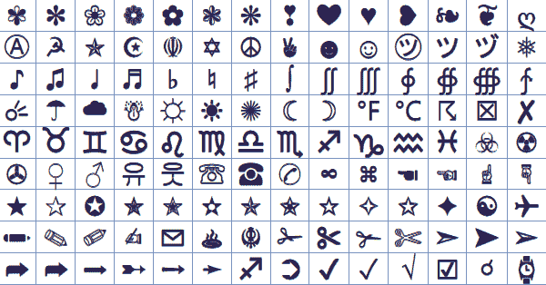

# 系统设计面试:关于字符串编码你需要知道的最起码的东西

> 原文：<https://levelup.gitconnected.com/system-design-interview-the-bare-minimum-you-need-to-know-about-string-encoding-6d57ce139942>



来源:脸书符号

> **背景**

字符串编码可能不会在系统设计面试中被直接问到。但它可能会成为一个枝节问题。假设您想通过网络发送一个长字符串，并在另一端逐段打印出来。面试官可能会问，如果字符集不是 ASCII，你有什么需要注意的吗？答案是肯定的。例如，您不能任意分割字节数组，因为一个字符可能编码在多个字节中。在这种情况下，你的分段必须尊重字符边界；否则内容可能会损坏。

即使这是一个顺便提一下的小问题，你也不想搞砸它。因为在基础上犯错很尴尬。这会给你的整体面试表现留下污点。花了这么多时间准备面试，你不想因为一些随机琐事而失败。在这篇博文中，我希望收集一些在系统设计面试中需要了解的关于字符串编码的最基本的知识。有了这些知识，你至少能够处理基本的问题。显然，如果你正在参加一个特定领域的面试，主要目的是测试你对字符串编码的理解，这篇博文只是一个开始。有太多的东西需要你自己去寻找。

> **统一码统治一切**

由于历史原因，字符串编码的世界很复杂。许多地区性、司法管辖区和特定语言的字符串编码方案来了又去，兴盛又衰落。但是如果在编码方案的海洋中有一个真正的王者，那就是 Unicode。大多数现代编程语言和工具都支持 Unicode。Unicode 涵盖了世界上的所有字符(这是一个过于简化的说法，但现在这样想就足够了)。所以如果你懂 Unicode，你就有了一条解决字符串编码问题的途径。

澄清人们经常有的第一个困惑:Unicode 本身不是一种编码方案。它不控制字符如何以字节存储。这里涉及一个两步过程。Unicode 定义了从一个字符到一个码位的一对一映射(把它当作一个幻数)。比如 A 是 0x41ǽ是 0x 01 fc；⌘是 0x2318。🚒是 0x01f692。这是第一步。第二步是以字节存储代码点。Unicode 允许一百多万个可能的唯一字符。直观地说，您可以将每个代码点的数值存储为一个`int32`。这实际上是固定长度的 UTF-32 编码。

UTF-32 很好也很容易，但是如果你的字符大部分是 ASCII，范围是 0 到 127，那就太浪费了。这就是 UTF-8 派上用场的地方。澄清第二个常见的混淆:UTF-8 并不总是每个字符 1 个字节。它试图将代码点放入 1 个字节中，这适用于所有 ASCII 字符。顺便说一下，由于 ASCII 字符的 Unicode 码位值恰好与 ASCII 编码值相同(当然这是设计出来的)，ASCII 和 UTF-8 对于 ASCII 字符是兼容的。当一个代码点不能放入 1 个字节时，UTF-8 使用 2，3，最多 4 个字节(在 2003 年标准改变之前，它最多是 6 个字节)。换句话说，UTF-8 是一种可变长度编码。

现在，您需要一种方法来判断一个字符使用了多少字节。UTF 8 保留了较高的位来表示这一点。`0xxxxxxx`的模式用于 1 个字节。`110xxxxx 10xxxxxx`为 2 字节。`1110xxxx 10xxxxxx 10xxxxxx`为 3 字节。而`11110xxx 10xxxxxx 10xxxxxx 10xxxxxx`用于 4 个字节。`x`点可以是 0 或 1，用于编码码点值。比如 A 编码为`01000001`；ǽ编码为`11000111 10111100`，⌘编码为`11101100 10001100 10011000`。🚒编码为`11110000 10011111 10011010 10010010`。

UTF-8 的 2 个字节可以表示的最高码点是 0x7FF (2 -1)，因为第一个字节有 5 位可用，第二个字节有 6 位可用。当有许多字符的码位高于 0x7FF 时，最终会大量使用 3 或 4 个字节。切换到 UTF-16 将为您节省一些字节。默认情况下，UTF-16 使用 2 个字节来存储一个码位，并在需要时加倍为 4 个字节。由于它的长度差异较小，因此它可以释放更多的位用于实际使用，从而可以比 UTF-8 在 2 个字节中存储更多的码点。例如，UTF-16 中的⌘是`00100011 00011000`，仅使用 2 个字节，而不是 UTF-8 中的 3 个字节。UTF-16 编码的细节有点复杂。我得说这超出了最低限度的范围。

最后一件事，你可能听说过 Unicode 的字节顺序标记(BOM)的概念。它有时包含在字节流的开头，以表示数据的字节顺序。它对 UTF-8 没什么用，因为 UTF-8 是面向字节的。你一次读入一个字节。但它对 UTF-16 和 UTF-32 非常有用，因为在这些情况下，您需要一次读入 1 个“字”，分别是 2 个字节和 4 个字节。字节顺序标记是一个神奇的数字，它的字节顺序告诉您是否需要反转每个字中的字节以匹配您的主机系统中的字节顺序。

> **编写代码时牢记字符串编码**

现在，您已经了解了 Unicode 的基本知识，让我们看看当您实际编写一些代码时，它是如何运行的。毕竟你可能需要写代码，或者至少在系统设计面试的时候会谈到写代码。在编写代码时，关于字符串编码，您至少需要知道两个方面:(1)字符串在源代码中是如何编码的(字符串文字)；(2)它们在记忆中是如何表征的。让我们看看几种编程语言，以获得一些具体的例子。

**戈朗**

我将从 Golang 开始，因为它是一种有趣的语言。Golang 源代码必须编码为 UTF-8。而 Golang 中的`string`类型只是一个字节数组。所以当你在 Golang 中写`var str string = "hello world"`的时候，`"hello world"`的 UTF-8 编码被存储在`str`字节数组中。

Golang 还支持字符串中的转义 Unicode 码位。例如，你可以用戈兰语写`var str string = "\u2318"`。可以检查字符串包含单个字符⌘，底层字节数组为`11101100 10001100 10011000`，与⌘'s UTF-8 编码相同。

**Java**

Java 源代码必须用 Unicode 字符编写。但是语言并没有规定具体的编码。当您将源代码编译成类时，如果您想要系统缺省值之外的其他值，您可以为`javac`指定可选的`-encoding`参数。

Java `String`对象总是在内存中以 UTF-16 表示。您可以使用各种编码方案的字节来构造一个`String`对象。您还可以从一个`String`对象中以各种编码方案获得字节。请参见下面的示例片段。

```
// Java also supports escape Unicode points.
// Can use "\u2318" as well.
String str = "⌘";// String.getBytes() uses the system default encoding,
// which is usually UTF_8.
// It prints out 0xE28C98, which is
// 11101100 10001100 10011000.
for (byte b : str.getBytes()) {
  System.*out*.printf("%x", b);
}// String(bytes), again, uses the system default encoding.
String str1 = new String(str.getBytes());// String.getBytes(Charset) returns bytes
// encoded with the given Charset.
// Using UTF_16BE instead of plain UTF_16
// to specify the endianness. Otherwise the returned
// bytes contain the byte order mark.
// It prints out 0x2318, which is 00100011 00011000.
for (byte b : str.getBytes(StandardCharsets.*UTF_16BE*)) {
  System.*out*.printf("%x", b);
}// String(bytes, Charset) uses the given Charset
// to interpret the input bytes.
String str2 = new String(
    str.getBytes(StandardCharsets.*UTF_16BE*),
    StandardCharsets.*UTF_16BE* );// All the same.
if (str.equals(str1) && str.equals(str2)) {
  System.*out*.println("All the same");
}
```

**C++**

与 Java 类似，C++中的源代码字符编码有多种选择，默认是实现定义的—通常是 UTF-8。与 Java 中字符串总是以 UTF-16 编码不同，C++有执行字符编码的概念。这也是实现定义的。C++编译器将字符串从源代码字符编码转换为执行字符编码。所以当你写`const char[] str = "hello world";`的时候，运行时的字符串文字`"hello world"`是用执行字符编码来编码的。您还可以将字符串文字运行时编码固定为 UTF-8，而不考虑实现的默认值，方法是将`u8`添加到字符串文字的前面，例如`const char[] str = u8"hello word";`。还有一些其他的前缀可以添加:`L`、`u`、`U`。它们对应的字符类型差异是`wchar_t`、`char16_t`和`char32_t`。相应的编码方案是实现定义的编码、UTF-16 和 UTF-32。与 Golang 类似，C++中的`std::string`只是一个字节数组的包装器。它根本不关心编码。

> **工具中的字符串编码**

为了完整起见，让我们也简单地讨论一下您将在日常工作中使用的工具中的字符串编码。所有现代的 ide 都允许您配置源代码文件编码。比如在 VS 代码中，可以在底栏([链接](https://code.visualstudio.com/updates/v0_3_0#_file-encoding))中修改。在 Intellij 中，您可以用类似的方式进行配置([链接](https://www.jetbrains.com/help/idea/encoding.html))。正如您可能已经猜到的那样，两者的缺省值都是 UTF-8。在大多数浏览器中，字符编码/解码的选择是检查`<header>`中的`<meta>`标签，默认为 UTF-8，以及一些其他方案的组合。

> **后记**

这篇简短的博文到此结束。我希望您现在对字符串编码更有信心了。系统设计面试中的简单策略:坚持使用 Unicode，当被问到你不太了解其他编码方案时就承认。这至少可以让你跨越字符串编码的障碍，这样你就可以在面试中专注于其他有趣的设计讨论。如果你想看更多的系统设计面试博客文章，看看这个[列表](https://github.com/eileen-code4fun/SystemDesignInterviews)。