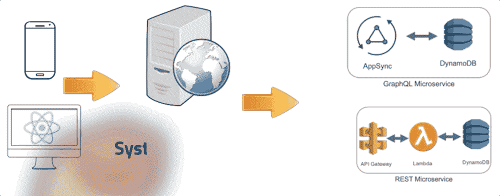
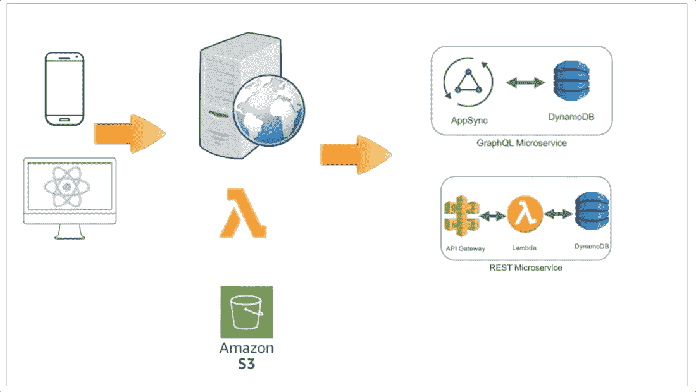

# 系统设计面试变得简单

> 原文：<https://levelup.gitconnected.com/system-design-interviews-made-easy-2c14c3e60b77>

系统设计面试变得简单

系统设计是我在面试中问的最重要的问题之一。当有人试图用一些教科书上的设计答案来解释负载平衡器或 DNS 如何工作时，我感到很困扰。其他人花很长时间收集需求，浪费了真正设计的时间。我一直在寻找一些实用的设计概念，并围绕每个解决方案的权衡进行讨论。本文将尝试介绍在现实生活中设计系统的最佳步骤，并回答系统设计面试问题。之后我会举例简单的系统设计问题。我将从基本的和已知的系统开始，然后转向定制的系统，这是我通常在面试中问的问题。

使用现实生活中的例子和实践总是好的。感谢云让这一切变得简单。我记得，20 年前，试图在家里用 DNS、负载平衡器、Web 服务器和数据库建立一个网络是不可能的。我不得不加入微软网络和企业团队，以获得建立大规模系统的经验。今天，你只需在 AWS 上点击几下就能做到。在我们进行的过程中，我将给出 AWS 的例子。

## 1.用例

从用户场景开始理解需求是很重要的。

## 2.逐一检查用例

这将有助于您理解需求并掌握设计。这就是我在现实生活中所做的。浏览用户故事，看看设计将如何保持和相应地改变。

## 3.高层架构

在这里，您需要在白板上开始绘制完整的图表

## 4.按比例增加。系统

有了最初的图表后，开始讨论如何放大它。在这里，您可能会讨论负载平衡器、自动扩展组、数据库分片、无服务器的优势和局限性…

## 5.容错能力:

容错是采访中有趣的话题之一。这是您进入负载平衡器、DNS、区域和可用性区域的地方。然而，这真的取决于面试的类型和面试官想要如何引导讨论。您的应用程序中还有容错功能。最重要的部分是确保您提到监控和警报，以便在故障发生之前预测故障。

# 示例:

最好通过例子来更好地理解过程。我会在这部分继续贴出例子和解决方案。

## 设计 Twitter:

用以下用例设计一个类似 Twitter 的系统

*   用户发布推文
*   服务向关注者推送推文，发送推送通知和电子邮件。
*   用户查看用户时间表(用户的活动)
*   用户查看家庭时间表(用户关注的人的活动)
*   用户搜索关键字
*   服务具有高可用性

您可以在此找到解决方案[:](https://www.linkedin.com/pulse/design-twitter-rany-elhousieny-phd%E1%B4%AC%E1%B4%AE%E1%B4%B0/)

 [## 设计推特

### 步骤 1:用例用户发布推文服务将推文推送给关注者，向用户发送推文通知和电子邮件…

www.linkedin.com](https://www.linkedin.com/pulse/design-twitter-rany-elhousieny-phd%E1%B4%AC%E1%B4%AE%E1%B4%B0/) 

# 设计展览

 [## 设计一个旅行社门户网站——Expedia

### 你有没有想过像 Expedia.com 这样的在线旅行社背后的设计？此处的功能要求…

www.linkedin.com](https://www.linkedin.com/pulse/design-travel-agent-portal-expedia-rany-elhousieny-phd%E1%B4%AC%E1%B4%AE%E1%B4%B0) 

## 您将如何从整体数据库迁移到微服务

这个问题可能是设计的一部分，但它是一个非常重要的学习经历。下面是详细的解决方案

 [## 从整体服务迁移到微服务的步骤

### 本文将解释我从单片系统迁移到新的域微服务所遵循的步骤。我会…

www.linkedin.com](https://www.linkedin.com/pulse/steps-migrating-from-monolith-microservices-rany-elhousieny-phd%E1%B4%AC%E1%B4%AE%E1%B4%B0/) 

另一个真实的例子:

 [## 兰尼·埃尔豪斯尼，PhDᴬᴮᴰ在 LinkedIn 上:从整体架构迁移到微服务…

### 在本文和附带的视频中，我将经历一次从……迁移的真实经历

www.linkedin.com](https://www.linkedin.com/feed/update/urn:li:ugcPost:6768923159145037824?updateEntityUrn=urn%3Ali%3Afs_feedUpdate%3A%28*%2Curn%3Ali%3AugcPost%3A6768923159145037824%29)