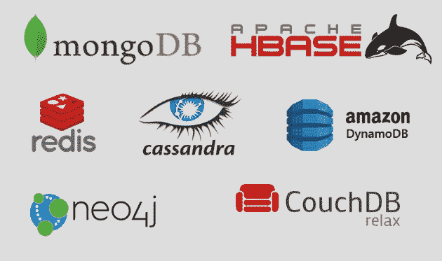
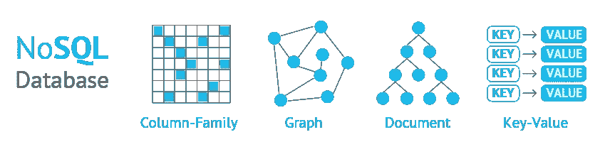

# 系统设计面试:NoSQL 数据库及何时使用它们。

> 原文：<https://levelup.gitconnected.com/system-design-interviews-nosql-databases-and-when-to-use-them-780021f4063>

# 什么是 NoSQL 数据库？

通常，“NoSQL 数据库”是指任何非关系数据库。不管它是代表“非 SQL”还是“不仅是 SQL”，大多数人都同意 NoSQL 数据库以关系表以外的格式存储数据。

NoSQL 数据库最受欢迎，因为它们允许用户以灵活的模式存储数据。

# 为什么你应该使用 NoSQL 数据库？

NoSQL 数据库具有高性能、可伸缩性和灵活性，这使得它们非常适合移动、web 和游戏应用程序。

*   **可伸缩性**:与通过添加昂贵且健壮的服务器来扩展不同，NoSQL 数据库通常通过使用分布式硬件集群来扩展。作为完全托管的服务，一些云提供商在幕后处理这些操作。
*   **灵活性** : NoSQL 数据库通常具有灵活的模式，支持更快、更迭代的开发。NoSQL 数据库具有灵活的数据模型，这使得它们非常适合半结构化和非结构化数据。
*   **高性能**:与关系数据库相比，NoSQL 数据库针对特定的数据模型和访问模式进行了优化；这导致了更高的性能。

这些是著名的 NoSQL 数据库类型。

# ◆键值数据库

键值数据库成对存储数据，每个数据包含一个唯一的 id 和一个数据值。这些数据库提供了灵活的存储结构，因为值可以存储任意数量的非结构化数据。

## **用例**

会话管理、用户偏好和产品推荐。

## **例题**

亚马逊发电机数据库，Azure 宇宙数据库，Riak。

# ◆内存中的键值数据库

与基于磁盘的数据库不同，数据主要存储在内存中。通过消除磁盘访问，这些数据库实现了最短的响应时间。因为所有数据都存储在主内存中，所以内存数据库有在进程或服务器出现故障时丢失数据的风险。内存数据库可以通过将每个操作存储在日志中或拍摄快照来将数据保存在磁盘上。

## 例子

Redis，Memcached，亚马逊 Elasticache。

# ◆文档数据库

文档数据库的结构类似于键值数据库，只是键和值存储在用 JSON、XML 或 YAML 等标记语言编写的文档中。

## 用例

用户配置文件、产品目录和内容管理。

## 例子

MongoDB，亚马逊 DocumentDB，CouchDB。

# ◆宽列数据库

宽列数据库基于表，但没有严格的列格式。行不需要在每个列中都有值，包含不同数据格式的行和列的段可以组合在一起。

## 用例

遥测、分析数据、消息传递和时序数据。

## 例子

Cassandra，Accumulo，Azure Table Storage，HBase。

NoSQL 数据库的类型

# ◆图形数据库

图形数据库使用节点和边来映射数据之间的关系。节点是单独的数据值，边是这些值之间的关系。

## 用例

社交图表、推荐引擎和欺诈检测。

## 例子

Neo4j，亚马逊海王，宇宙 DB 通过 Azure Gremlin。

# ◆时间序列数据库

这些数据库以时间顺序流的形式存储数据。数据不是按值或 id 排序，而是按收集时间、摄取时间或元数据中包含的其他时间戳排序。

## 用例

工业遥测、DevOps 和物联网(IOT)应用。

## 例子

石墨，普罗米修斯，亚马逊时间流。

# ◆ **分类账数据库**

分类帐数据库基于记录与数据值相关的事件的日志。这些数据库存储用于验证数据完整性的数据更改。

## 用例

银行系统、注册、供应链和记录系统。

## 例子

亚马逊量子账本数据库(QLDB)。

# 结论

➡要为您的用例选择最合适的 NoSQL 数据库，您应该了解各种 NoSQL 数据库之间的差异。在这篇文章中，我试图列出每个 NoSQL 数据库最重要的用例。

➡在“ [**探索系统设计面试**](https://designgurus.org/course/grokking-the-system-design-interview)**”****[**探索高级系统设计面试**](https://designgurus.org/course/grokking-the-advanced-system-design-interview) 中了解更多关于系统设计面试的信息**

**➡在 Linkedin 上关注我，了解系统设计和编码面试的技巧。**

**阅读更多关于系统设计面试的信息:**

** [## 12 大系统设计面试问题及答案(2022)

### 通过练习这些问题，你可以增加许多成功的机会！

medium.com](https://medium.com/geekculture/top-12-system-design-interview-questions-with-answers-2022-dc2b6599f39a)  [## 系统设计面试生存指南(2023):准备策略和实用技巧

### 2023 年系统设计面试剧本。

levelup.gitconnected.com](/system-design-interview-survival-guide-2023-preparation-strategies-and-practical-tips-ba9314e6b9e3)  [## 系统设计面试:是什么让你与众不同？

### 系统设计面试的目的是评估你从头到尾设计完整系统的能力…

designgurus.org](https://designgurus.org/blog/sys-design-distinguishes)**