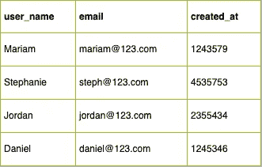
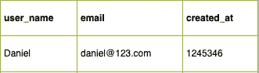
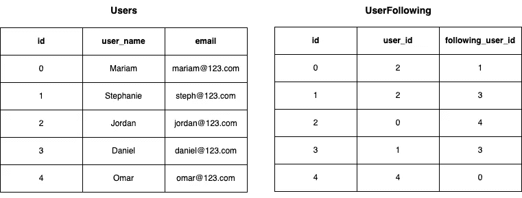
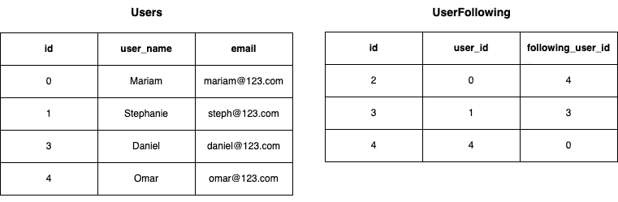
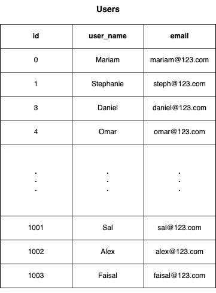
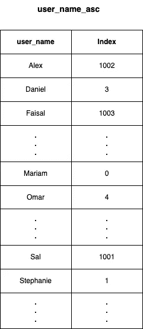

# 系统设计基础:关系数据库

> 原文：<https://levelup.gitconnected.com/system-design-relational-databases-f45980068a0f>


亚历山大·格雷在 [Unsplash](https://unsplash.com?utm_source=medium&utm_medium=referral) 上拍摄的照片

有两类数据库:

1.  关系数据库
2.  [非关系数据库](/system-design-fundamentals-nosql-databases-8390ef50cc32)

“关系型”是指存储在这些数据库中的数据的结构。

关系数据库是一种对存储在其中的数据施加类似表格的结构的数据库，即数据以表格格式存储。一个表被称为“关系”。数据存储在行和列中。每行代表一个实体的信息，每列包含与该实体相关的某种数据。



图 1:一个关系数据库

在上面的图 1 中，该表表示用户及其相关属性。表中的每一行(也称为记录)代表一个用户，每一列代表用户的属性。

关系数据库中的每个表都有一个定义好的模式。该模式指定:

*   表责任(数据代表什么。在图 1 中，它是用户表)。
*   属性，包括哪些是必需的，哪些是可选的，以保存值。
*   每列中所需的数据类型。

如果您试图向关系数据库表中添加一个不符合模式定义的条目，该条目将被拒绝持久化。

一些流行的关系数据库包括 MySQL、Oracle、SQLite 和 Postgres。

# 结构化查询语言(SQL)

SQL 是一种功能强大的查询语言，用于在关系数据库中执行复杂的查询。您有时可能会遇到关系数据库被称为“SQL 数据库”，因为大多数关系数据库支持 SQL，但也有例外。

因为 SQL 在对存储在数据库中的数据执行复杂查询时非常有用，所以如果您希望能够以这种方式搜索数据，这通常是选择使用关系数据库而不是非关系数据库的原因之一。

《出埃及记》对于图 1 中的表，假设我想找到所有在 1240000 到 300000 之间创建的用户(假设这些数字代表一个散列日期),并且他们的用户名以 A-F 开头，我希望这些数据按用户名升序排列:

```
SELECT * FROM Users 
WHERE created_at BETWEEN 1240000 AND 300000
AND user_name >= 'A' AND user_name < 'G'
ORDER BY user_name ASC;
```

该查询应返回以下行的子集:



图 SQL 查询后返回的用户表的子集

SQL 是一门非常深奥的学科，如果你有兴趣，可以参考下面的参考资料部分开始学习 SQL。

# 酸

所有主要的关系数据库都是 ACID 兼容的。酸代表 **A** 饱和度、 **C** 一致性、 **I** 溶解性、 **D** 耐久性。

## 原子数

如果一个事务由多个子操作组成，则所有子操作都必须成功才能认为该事务成功。如果一个操作失败，整个事务将会失败，子操作的任何结果都不会被持久化。



图 3:用户和用户表

我们的数据库中有两张表。第一个代表在我们的系统中注册的用户列表。第二个表示用户关注谁，其中 *following_user_id* 表示被关注用户的 id。

假设用户 2 (Jordan)从我们的系统中注销，我们需要删除他的记录。为了删除它，我们需要从 Users 表中删除该行，并删除 UserFollowing 表中的所有行(包括他关注的人和关注他的人)。

只有当这两个删除事务都成功时，该事务才是原子的。



图 4:删除用户 id 2 后的用户和用户列表。

如果由于某种原因，网络问题或其他原因导致一个或两个删除失败，则整个事务将被回滚。

## 一致性

一致性是指数据库和基于它的事务应用并且不违反数据库中设置的规则。这是为了确保数据的完整性。一致性确保了如果事务违反了规则，它将被拒绝(回滚)并且不会在数据库中持久化。

例如:如果我们的用户表有一个规则，所有的电子邮件必须是唯一的；也就是说，我们不能让两个用户使用同一个电子邮件。

```
INSERT INTO U*sers*(user_name, email)
VALUES ("Sal", *"omar@123.com"*);
```

上述交易将被拒绝，因为它违反了电子邮件唯一性的规则。

## **I** solation

多个事务按顺序执行。这确保了我们永远不会对陈旧的数据进行操作。并发进来的事务可以放入某种队列中，然后每个事务按顺序执行。实现这种并发控制有不同的方式:

1.  乐观并发控制
2.  悲观并发控制

你可以在这里阅读更多关于这个[的内容](https://www.geeksforgeeks.org/difference-between-pessimistic-approach-and-optimistic-approach-in-dbms/)。

## **D** 可用性

交易是永久的。如果事务已经被提交，则它必须被保存在非易失性存储器中。如果在事务完成后发生崩溃，您仍然应该能够在存储中找到该事务新提交的数据，并且这些数据不会被损坏。

# 数据库索引

[数据库索引](https://en.wikipedia.org/wiki/Database_index)允许您更快地搜索数据库以找到您需要的行，从而提高其性能。这在保存大量数据的数据库中特别有用。索引是通过创建一个单独的数据结构来完成的，该数据结构针对特定的一列或多列进行了优化，以便在数据库中进行搜索。这些列被复制到这个数据结构中，然后它们具有相关联的指针，这些指针指向它们在数据库表中的特定行。

例如，假设我们的用户表有更多的条目，我们希望能够通过用户名快速搜索。



图 5:有 1004 个条目的用户表(0–1003)。

如果我想查找用户名为“Alex”的用户:

```
SELECT * FROM Users WHERE user_name = 'Alex';
```

为了选择这个角色，我们必须搜索整个表来找到记录。这将是一个 O(n)操作，其中 n 是表中的行数。表越大，操作越慢。为了加快速度，我们可以将 user_name 列存储在一个单独的数据结构中，并指向该列对应的行。我们还可以按字母顺序存储用户名，以进一步加快搜索速度:



图 6:按字母顺序由用户名索引的用户表

现在，通过从 user_name_asc 中提取行索引，然后直接从 Users 表中选择该索引，我们可以更快地找到 user_name = 'Alex'。

在数据库搜索中获得额外速度的代价是，您需要存储这个表示索引的数据结构。这意味着你将需要更多的存储空间。

# 摘要

关系数据库通过 ACID 合规性为您提供数据完整性。大多数主要的关系数据库都支持 SQL，它给你复杂的查询能力。索引数据库也是一个强大的补充，可以让你有效地搜索数据库。

关系数据库是一个很深的主题，这只是对它们的一个简单介绍。如果您有兴趣了解更多信息，请查阅下面列出的一些参考资料。

如果您想了解更多关于系统设计的主题，我在这个系列中还有一些您可能感兴趣的文章:

*   [数据复制和分区](/system-design-fundamentals-data-replication-and-partitioning-ab109a46b633)
*   [负载平衡器](/system-design-fundamentals-load-balancers-e608d30afa65)
*   [分布式系统](/system-design-basics-distributed-systems-9aac8a11177c)
*   [NoSQL 数据库](/system-design-fundamentals-nosql-databases-8390ef50cc32)

感谢阅读！

# 参考

[](https://www.geeksforgeeks.org/difference-between-pessimistic-approach-and-optimistic-approach-in-dbms/) [## DBMS - GeeksforGeeks 中悲观方法和乐观方法的区别

### 悲观方法是一种并发控制算法的方法，在这种方法中，如果存在延迟，则事务被延迟

www.geeksforgeeks.org](https://www.geeksforgeeks.org/difference-between-pessimistic-approach-and-optimistic-approach-in-dbms/)  [## 数据库索引-维基百科

### 数据库索引是一种数据结构，它可以提高数据库表上的数据检索操作的速度

en.wikipedia.org](https://en.wikipedia.org/wiki/Database_index) [](https://dataschool.com/sql-optimization/how-indexing-works/) [## 索引

### 上次修改时间:2021 年 8 月 9 日索引通过创建指向数据存储位置的指针来加快列的查询速度…

dataschool.com](https://dataschool.com/sql-optimization/how-indexing-works/) [](https://www.educative.io/module/lesson/grokking-system-design-interview/N0qxZAwv7Xz) [## 教育性:软件开发人员的互动课程

### 提升你的编码技能。不再被动学习。交互式浏览器环境让您参与并测试…

www.educative.io](https://www.educative.io/module/lesson/grokking-system-design-interview/N0qxZAwv7Xz) 

# 分级编码

感谢您成为我们社区的一员！在你离开之前:

*   👏为故事鼓掌，跟着作者走👉
*   📰查看[级编码出版物](https://levelup.gitconnected.com/?utm_source=pub&utm_medium=post)中的更多内容
*   🔔关注我们:[推特](https://twitter.com/gitconnected) | [LinkedIn](https://www.linkedin.com/company/gitconnected) | [时事通讯](https://newsletter.levelup.dev)

🚀👉 [**加入升级人才集体，找到一份惊艳的工作**](https://jobs.levelup.dev/talent/welcome?referral=true)