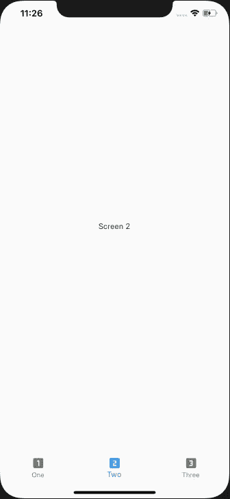

# 颤振中的标签栏导航

> 原文：<https://levelup.gitconnected.com/tab-bar-navigation-in-flutter-5363e5ee8a60>

在这篇文章中，我将介绍使用底部标签栏导航的基础知识。到本文结束时，您将拥有一个在不同屏幕之间导航的基本应用程序。



# 入门指南

创建一个新的颤振项目。清除 *main.dart* 文件中的所有内容。

现在在我们的 fresh clean 文件中，导入材料组件:

```
import 'package:flutter/material.dart';
```

定义应用程序的入口点:

```
void main(){ runApp(MyApp());}
```

此时，您肯定会得到一个错误，并且由于显而易见的原因，您的文件中没有名为 *MyApp()* 的内容。

让我们继续定义一个有状态的小部件 MyApp()。

```
class MyApp extends StatefulWidget { @override _MyAppState createState() => _MyAppState();}class _MyAppState extends State<MyApp> { @override Widget build(BuildContext context) { return MaterialApp( debugShowCheckedModeBanner: false, home: Scaffold(), ); }}
```

你现在有一个空白的白色屏幕。太好了！

# 屏幕

现在让我们从屏幕开始。

为了简单起见，我所有的屏幕都是白色背景，屏幕号在中间。

我将在返回它们的值的函数中定义它们。

屏幕 1:

```
screen1() { return Center(child: Text('Screen 1'),);}
```

同样，屏幕 2 和屏幕 3:

```
screen2() { return Center(child: Text('Screen 2'),);}screen3() { return Center(child: Text('Screen 3'),);}
```

现在我们有三个屏幕可以在应用程序的入口点之间导航，让我们继续导航:

# 底部导航栏

*脚手架*小部件有一个名为 *bottomNavigationBar* 的参数。

这个参数需要一个类型为 *BottomNavigationBar* 的值，它有自己的一些参数。最基本的有 *currentIndex、onTap* 和 *items* 。

***当前索引*** 表示当前正在显示的屏幕的索引。所以，一个 *int* 值。

***onTap*** 跟踪当前显示的小工具。

***项*** 是*BottomNavigationBarItem*的列表。这些项目的数量将等于屏幕的数量。永远！

现在让我们在 _MyAppState 类中定义所有这些参数的值。

```
int index = 0;List<Widget> _widgets = [ screen1(), screen2(), screen3()];tapped(int tappedIndex){ setState(() { index = tappedIndex; });}
```

变量 *index* 设置为 0，所以用户看到的第一个屏幕是 *screen1* 。

*_widgets* 是一个 Widget 数组，定义了所有的 Widget。

函数 *tapped()* 采用 int 类型的值，并更改*索引*变量的值。但最重要的是，通过 *setState()* 函数。尝试在不使用 setState()函数的情况下改变索引，看看会发生什么，但是要等到最后。

现在我们已经有了所有的值，让我们在*底部导航栏的*参数中使用它们。

```
currentIndex: index,onTap: tapped,
```

*项目*是*BottomNavigationBarItem*的列表，不是 *Widget* 的列表。所以*物品*绝对不能等于 *_widgets* 。

*项目*是出现在底部的内容，图标和包含图标的文本。

items 数组中的每个元素都是一个 *BottomNavigationBarItem。*这个 *BottomNavigationBarItem* 有两个强制属性，*图标*和*标题*。

```
items: [ BottomNavigationBarItem(icon: new Icon(Icons.looks_one), title: Text('One')), BottomNavigationBarItem(icon: new Icon(Icons.looks_two), title: Text('Two')), BottomNavigationBarItem(icon: new Icon(Icons.looks_3), title: Text('Three')),],
```

此时，您的应用程序应该看起来像这样:


但是不管你点击哪个底部的项目，屏幕都是空白的。

# 卡弗德车身

我们有屏幕，有导航栏，也有应用程序的入口点。但是我们还没有指定这些屏幕将在哪里显示。

我们的绞刑架需要一具尸体！

回到支架上，在身体参数中，

```
body: _widgets[index]
```

我们的 Scaffold body 将成为一个小部件，这取决于所选择的底部导航栏项目。

保存文件并再次运行。


屏幕 1

这是一个功能齐全的应用程序，底部有一个导航栏。

继续用你选择的东西替换简单的屏幕部件。

如果您的应用程序无法运行，请查看以下代码:

```
import 'package:flutter/material.dart'; void main() {runApp(MyApp());}class MyApp extends StatefulWidget { @override _MyAppState createState() => _MyAppState();}class _MyAppState extends State<MyApp> { int index = 0; List<Widget> _widgets = [screen1(), screen2(), screen3()]; tapped(int tappedIndex) { setState(() {index = tappedIndex;}); } @override Widget build(BuildContext context) { return MaterialApp( debugShowCheckedModeBanner: false, home: Scaffold( body: _widgets[index], bottomNavigationBar: BottomNavigationBar( currentIndex: index, onTap: tapped, items: [ BottomNavigationBarItem(icon: new Icon(Icons.looks_one), title: Text('One')), BottomNavigationBarItem(icon: new Icon(Icons.looks_two), title: Text('Two')), BottomNavigationBarItem(icon: new Icon(Icons.looks_3), title: Text('Three')), ], ), ), ); }}screen1() { return Center(child: Text('Screen 1'),);}screen2() { return Center(child: Text('Screen 2'),);}screen3() { return Center(child: Text('Screen 3'),);}
```