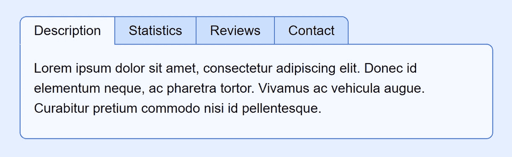

# 没有 JavaScript 的选项卡式界面

> 原文：<https://levelup.gitconnected.com/tabbed-interfaces-without-javascript-661bab1eaec8>



简单、干净、容易

****注意***编辑删除了无意义的 aria-hidden 垃圾，因为少数不支持“hidden”属性的 UA 已经赶上。记住 aria 角色的第一条规则，如果已经有 HTML 来传达所述意思，就用 HTML 来代替 ARIA。让艾瑞亚在大多数情况下变得愚蠢和毫无意义。*

越来越多花哨的界面功能依赖 JavaScript 来创建它们的工作方式，因此也带来了可访问性问题。即使今天他们不再需要实现 JS。作为开发人员，CSS3 给我们带来了一些真正的力量，它允许模态对话框、“汉堡包”移动友好菜单，甚至标签式界面的实现都不需要一行 JavaScript。

# 用 JavaScript 怎么了？

本身没什么，只要它不是你在页面上提供可用性/功能性的唯一方式。正如我在[最近的一篇文章中所说，好的 JavaScript 应该增强已经工作的页面，**而不是**是你工作的唯一方式。](https://medium.com/@deathshadow/accessibility-101-good-client-side-javascript-should-enhance-an-already-working-page-not-be-the-bf92741d2310)

如果当脚本被阻止、禁用或不相关时，基本功能无法工作，则您不符合 WCAG 标准，因此可能会受到美国 ADA 或英国 EQA 等法律的起诉或民事诉讼。屏幕阅读器*(大声阅读页面的软件)*、盲文阅读器、搜索引擎和其他非视觉用户代理很难——如果不是完全无法访问——使用 JavaScript 的页面。许多用户也出于不信任而屏蔽它，或者在故意禁用它的地方工作。 **JavaScript 不应该成为解决所有客户端问题的首选技术！**

再说一次，不是说你不能使用 JavaScript，但是它应该增强用户体验，而不是提供它的唯一手段。

# 那么，没有它，我们如何实现选项卡呢？

由于 CSS 3 和“新的”*(如果截至 2020 年的十年可以称为“新的”)*`:checked``:nth-child`和 [**通用兄弟组合符**](https://developer.mozilla.org/en-US/docs/Web/CSS/General_sibling_combinator) ，这实际上非常容易。基本上，我们通过“虐待”`<input type=”radio”>`来完成这一点。

真正的神奇之处在于，如果你点击一个`<label>`，其中`for=””`属性指向一个输入，这与点击那个输入是一样的！因此，我们可以将我们的标签放在一个列表中，以获得正确的语义，与它们的输入分开，并放在它们的输入之后。

一切都将进入一个`<div class=”tabset”>`,这样我们就可以很容易地锁定一切，而不会无缘无故地在整个标记中加入类。

## 加价

首先我们的投入:

```
<div class="tabset">
  <input
   type="radio"
   name="tabset_1"
   id="tabset_1_description"
   hidden
   checked
  >
  <input
   type="radio"
   name="tabset_1"
   id="tabset_1_statistics"
   hidden
  >
  <input
   type="radio"
   name="tabset_1"
   id="tabset_1_reviews"
   hidden
  >
  <input
   type="radio"
   name="tabset_1"
   id="tabset_1_contact"
   hidden
  >
```

它们都有相同的名字作为收音机，每个都有唯一的 ID。我喜欢用名字作为 ID 的前缀。

它们被“隐藏”起来，所以当我们的屏幕媒体 CSS 对 UA 不适用/不相关时，它们会被忽略。记住，像标签这样的概念只适用于屏幕媒体。

接下来是我们的标签列表，它将成为我们的“标签”。

```
<ul hidden>
   <li><label for="tabset_1_description">Description</label></li>
   <li><label for="tabset_1_statistics">Statistics</label></li>
   <li><label for="tabset_1_reviews">Reviews</label></li>
   <li><label for="tabset_1_contact">Contact</label></li>
</ul>
```

这些也是“隐藏的”，是一个简单的选择列表*(正确的语义，如果您省略了/LI，一些 UA 会认为这是一个胡言乱语的连续句子)。*神奇的是，点击这些标签与点击这些“用于”的输入是一样的。

然后，我们的选项卡内容可以被视为`<div>`中的`<section>`。

```
<div>
   <section>
    <h2>Description</h2>
    <p>
     Lorem ipsum dolor sit amet, consectetur adipiscing elit. Donec id elementum neque, ac pharetra tortor. Vivamus ac vehicula augue. Curabitur pretium commodo nisi id pellentesque.
    </p>
   </section><section>
    <h2>Statistics</h2>
    <p>
     Sed ut leo in turpis efficitur convallis at bibendum erat. Curabitur in egestas ex. Etiam efficitur sagittis molestie. Praesent condimentum elementum ipsum sit amet euismod. Sed vestibulum, leo ac iaculis fringilla, felis nulla placerat turpis, eu aliquam elit risus vel tellus.
    </p>
   </section><section>
    <h2>Reviews</h2>
    <p>
     Donec non nunc ac augue ornare aliquam. Aenean sed volutpat arcu. Sed molestie lacus placerat nisl gravida condimentum.
    </p>
   </section><section>
    <h2>Contact</h2>
    <p>
     Nullam nec condimentum lacus. Integer dapibus velit nec ipsum varius, a pharetra arcu imperdiet. Donec pretium libero a tincidunt vulputate. Mauris feugiat tempor lectus, quis placerat mi congue sit amet.
    </p>
   </section>
  </div>
 <!-- .tabset --></div>
```

每个都有一个`<h2>`来描述非可视 UA 的部分。如果需要，我们可以在屏幕媒体样式表中隐藏这些标题。

## 设计它

所有这些代码还将假设正在使用某种形式的“重置”。首先，我们需要定位输入，使它们不再被属性“隐藏”,这样我们仍然可以拥有键盘导航，同时仍然是隐藏的。这也修正了一个错误，IE 不会改变一个有隐藏属性的输入的状态，除非你用`display`设置它可见。

```
.tabset > input {
  display:block; /* "enable" hidden elements in IE/edge */
  position:absolute; /* then hide them off-screen */
  left:-100%;
}
```

接下来是我们的无序列表。

```
.tabset > ul {
  position:relative;
  z-index:999;
  list-style:none;
  display:flex;
  margin-bottom:-1px;
}
```

`position:relative;`和`z-index:999;`是一个“技巧”,我们可以用它来使标签和标签框架的下边框重叠。为了把所有的标签放在一行中，我们可以使用内嵌块或者浮动，但是现在 flex 变得简单多了！

因为我们所有的

框架共享相同的边框，所以一起声明它们是显而易见的。

```
.tabset > ul label,
.tabset > div {
  border:1px solid hsl(220, 100%, 60%);
}
```

*注意，我最近一直在使用 HSL，实际上重新定义你的整个配色方案更容易，因为你可以搜索/替换“hsl(220 )”,或者使用 CSS 变量来分配它。*

标签:

```
.tabset > ul label {
  display:inline-block;
  padding:0.25em 1em;
  background:hsl(220, 100%, 90%);
  border-right-width:0;
}
```

…被设置为`inline-block`，因此它们服从顶部/底部填充。你可以设置这个`display:block`来代替，但是因为它们在一行上，所以我更喜欢使用内嵌块。YMMV。请注意，它们移除了右侧边框。我们很快就会谈到这一点。

```
.tabset > ul li:first-child label {
  border-radius:0.5em 0 0 0;
}
```

在第一个拐角处。

```
.tabset > ul li:last-child label {
  border-right-width:1px;
  border-radius:0 0.5em 0 0;
}
```

将鞋楦的右上角弄圆，然后重新应用右边框。嘣，元素之间没有双边界，第一个/最后一个得到一些光四舍五入。

```
.tabset > div {
  position:relative;
  background:hsl(220, 100%, 98%);
  border-radius:0 0.5em 0.5em 0.5em;
}
```

包装我们的`<section>`标签的`<div>`得到了一个较浅的背景，并且除了左上角之外都被四舍五入，在左上角它与我们的标签齐平。

现在“复杂”的部分开始了。首先，当键盘导航发生时，我们应该有一个应用于标签的样式。一个简单的下划线:专注可以达到目的。这看起来很复杂，但事实并非如此。

```
.tabset > input:nth-child(1):focus ~ ul li:nth-child(1) label,
.tabset > input:nth-child(2):focus ~ ul li:nth-child(2) label,
.tabset > input:nth-child(3):focus ~ ul li:nth-child(3) label,
.tabset > input:nth-child(4):focus ~ ul li:nth-child(4) label,
.tabset > input:nth-child(5):focus ~ ul li:nth-child(5) label,
.tabset > input:nth-child(6):focus ~ ul li:nth-child(6) label,
.tabset > input:nth-child(7):focus ~ ul li:nth-child(7) label,
.tabset > input:nth-child(8):focus ~ ul li:nth-child(8) label,
.tabset > input:nth-child(9):focus ~ ul li:nth-child(9) label {
  text-decoration:underline;
}
```

现在，这限制了我们最多只能支持 9 个标签，但老实说，如果你有超过 9 个标签，可能是时候考虑使用不同的界面风格，可能会分成多个页面。你很少在一个网站上看到超过 5 个标签，这是有原因的。

逻辑其实比看起来简单。让我们只看一个选择器:

```
.tabset > input:nth-child(1):focus ~ ul li:nth-child(1) label,
```

在里面。当第一个输入被聚焦时，任何相邻无序列表的第一个 li 内的标签将获得我们的样式。真的就说这么多了。这意味着当你聚焦一个输入时(键盘导航或者点击它)，相关的标签会得到一个下划线。对于我们想要最大限度支持的选项卡数量，我们重复这一步骤。

然后，我们可以在检查输入时重复这个模式。

```
.tabset > input:nth-child(1):checked ~ ul li:nth-child(1) label,
.tabset > input:nth-child(2):checked ~ ul li:nth-child(2) label,
.tabset > input:nth-child(3):checked ~ ul li:nth-child(3) label,
.tabset > input:nth-child(4):checked ~ ul li:nth-child(4) label,
.tabset > input:nth-child(5):checked ~ ul li:nth-child(5) label,
.tabset > input:nth-child(6):checked ~ ul li:nth-child(6) label,
.tabset > input:nth-child(7):checked ~ ul li:nth-child(7) label,
.tabset > input:nth-child(8):checked ~ ul li:nth-child(8) label,
.tabset > input:nth-child(9):checked ~ ul li:nth-child(9) label {
  background:hsl(220, 100%, 98%);
  border-bottom-color:hsl(220, 100%, 98%);
}
```

让它们和我们的内容

有相同的颜色和底部边框，这样标签看起来就像“在顶部”。这就是我们的-1px 利润发挥作用的地方。

那么显示/隐藏内容`<section>`呢？首先让我们隐藏部分。

```
.tabset > div > section,
.tabset > div > section h2 {
  position:absolute;
  top:-999em;
  left:-999em;
}
```

我用同样的代码隐藏屏幕上的 H2。屏幕阅读器和其他一些非可视用户界面的一个大问题是，如果你把它们设置为显示，它们通常不会阅读内容:没有；或者能见度:隐藏；特别是搜索引擎会经常服从屏幕媒体的行为，当他们不应该在搜索试图使用“内容伪装”伎俩的垃圾黑帽 SEO 骗子时。通过将它从屏幕上滑下来，我们最好的情况是完全避免这个问题，最坏的情况是被标记为人工审查，谷歌的任何有能力的人都会说“是的，这很好”。

如果可能的话，不管是脚本化的还是 CSS 驱动的，尽量不要在主要内容部分使用 display:none！你冒着内容被搜索和其他非视觉用户代理忽略的风险。

接下来，我在`<section>`上除了底部的所有地方设置了一个漂亮的全面衬垫。我更喜欢填充而不是空白，以避免“折叠”的麻烦，如果你填充内容元素的底部，然后填充父元素的所有其他方向，这就更容易处理了。

```
.tabset > div > section {
  padding:1em 1em 0;
}
```

然后，我们实现与`<ul>`相同的选择器逻辑，将`<section>`切换到`display:static;`

```
.tabset > input:nth-child(1):checked ~ div > section:nth-child(1),
.tabset > input:nth-child(2):checked ~ div > section:nth-child(2),
.tabset > input:nth-child(3):checked ~ div > section:nth-child(3),
.tabset > input:nth-child(4):checked ~ div > section:nth-child(4),
.tabset > input:nth-child(5):checked ~ div > section:nth-child(5),
.tabset > input:nth-child(6):checked ~ div > section:nth-child(6),
.tabset > input:nth-child(7):checked ~ div > section:nth-child(7),
.tabset > input:nth-child(8):checked ~ div > section:nth-child(8),
.tabset > input:nth-child(9):checked ~ div > section:nth-child(9) {
  position:Static;
}
```

关于`display:static;`需要记住的一点是，它基本上忽略了所有的定位规则。这将当前选定的部分弹出到视图中，而无需更改任何其他属性。

这有利于快速而肮脏的实现。你可以用这个变得更复杂，比如利用`<div>`上的`display:flex;`并使用 position:relative 将它们全部滑动到位，打开幻想动画的大门等等。

最后，由于这些都是标签驱动的，你点击这些标签，有一个问题是，快速点击或意外拖动，而点击可以选择一个不想要的方式的文本。此外，如果有人从页面中复制/粘贴，您可能不希望这些标签出现在副本中，因为它们对 H2 来说是多余的……因为它会复制。因此:

```
.tabset > ul label {
  -webkit-touch-callout:none;
  -webkit-user-select:none;
  -khtml-user-select:none;
  -moz-user-select:none;
  -ms-user-select:none;
  user-select:none;
}
```

阻止这些标签被选中。看起来使用所有的浏览器前缀版本是浪费和不必要的，但是如果你检查“我可以使用”吗

 [## 我能用吗...HTML5、CSS3 等的支持表

### “我可以使用吗”提供了最新的浏览器支持表，以支持桌面和移动设备上的前端 web 技术…

caniuse.com](https://caniuse.com/user-select-none) 

你会看到兼容性表显示所有版本的 IE 都需要-ms-，所有版本的 Safari 仍然需要-webkit-，moz-版本只是“最近”才被删除，他们放弃了对某些旧操作系统的新构建支持，这是我们仍然要担心的一个截止点，等等。

但事实上这就是全部。

# 现场演示

下面是一个工作示例:

 [## 不带 JavaScript 的选项卡式界面

### 多亏了 CSS3，人们浪费在 javascript 上的大量东西不再需要 JavaScript 了。同样的…

cutcodedown.com](https://cutcodedown.com/for_others/medium_articles/tabsWithoutJS/tabs.html) 

文件目录:

[https://cutcodedown . com/for _ others/medium _ articles/tabsWithoutJS/](https://cutcodedown.com/for_others/medium_articles/tabsWithoutJS/)

是敞开的，容易接触到黏糊糊的东西。[我在那里放了一个标记的. txt 文件](https://cutcodedown.com/for_others/medium_articles/tabsWithoutJS/tabs.html.txt)给那些不喜欢“查看源代码”的人，还有一个[tabs.rar 文件，包含完整的代码](https://cutcodedown.com/for_others/medium_articles/tabsWithoutJS/tabs.rar)以便于下载。

注意键盘的功能。按[tab]键，直到您在其中一个选项卡上看到下划线，或者单击一个使其聚焦，然后尝试箭头键。当任何单选按钮获得焦点时，您可以使用箭头在它们之间切换。

# 利弊

不像其他人，我喜欢先列出问题。

## 不足之处

1.  你依赖于更现代的浏览器来工作。它*应该*在一切≥ IE 10 方面功能良好。这些天来，我已经养成了在传统浏览器中阻止 CSS，让事情优雅地退化到我的语义标记的习惯。
2.  对于每一个额外的标签，你必须添加 3 行 CSS 才能在三个不同的地方得到支持。这可能会变得笨拙，但是如果你真的需要九个以上的标签，你可能就不应该在网站上制作一个标签页。
3.  这种实现不会白白地用无休止的无意义的类来抛弃标记。这可能会让一些无法处理选择器的开发人员感到不安，他们相信**赤裸裸的谎言**就像无尽的无意义的类是如何导致完成工作所需的 2 到 12 倍的标记，以某种方式神奇地使“渲染更快”。*等等，那是劣势？可悲的是，对许多人来说——让我们称他们为白痴吧——的确如此。*

## 优势

1.  内容的基本结构是适当的语义标记，这意味着非可视 UA 和替代导航的可用性更好。
2.  它的所有功能都不依赖于 JavaScript，所以与其他方法不同，它不是一个活生生的 WCAG 违规。
3.  CSS 关闭在任何现代浏览器中，我们所有的 UI 控件都消失了，留给我们一个合适的可访问结构。
4.  因为它是 100% CSS 控制的，所以你可以用 CSS 过渡、动画或者你能想到的任何其他效果来扩展它。
5.  它不会用虚构的童话般的非语义标签、无休止的无意义的类以及其他“eye cans haz teh intarwebs”开发人员的愚蠢行为来破坏所有的标记。
6.  “隐藏”HTML 5 属性的使用使得屏幕阅读器、盲文阅读器、不使用 CSS 的用户等忽略所有用于创建标签的多余标记，浏览页面就像它只是带有标题的普通部分一样。
7.  它通常比你使用任何[前端框架的开发人员无知、无能和不称职的纪念碑要少得多。](https://medium.com/me/stats/post/4c1db2571de9)

# 结论

用`:checked` CSS 属性和通用兄弟组合符`~`来“滥用”`<input type=”checkbox”>`可以让你避免许多脚本化的愚蠢行为，从而避免大多数可访问性灾难。应该避免使用“只使用 JavaScript”的解决方案，我们终于有了这样做的工具！

我希望你发现这是有用的，严肃地说，伙计们:多考虑一下你的站点的可访问性，特别是关于没有 JavaScript 时会发生什么。你可能会认为碧昂斯和达美乐在法庭上因为这样的问题受到指责，这对那些为实际企业工作的开发人员来说是一个警钟；但是没有。太多的开发者把他们的头埋在沙子里，喊着“哇哇，不是”，同时带着冷漠、无知和一厢情愿的想法缓慢前行。

不要让“但是数百万人都是这样做的”——跟风谬论——或者“但是这多年来一直很好”——也就是生存偏见——欺骗你，让你无法接受更好的做事方式，或者阻止你制作实际上能够做唯一真正重要的事情的网站。

将内容传递给尽可能多的用户，而不考虑设备限制或障碍。