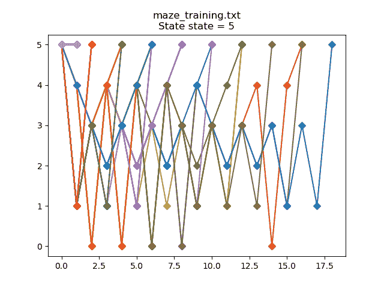

# 1KB 以下基于表格的 Q-Learning

> 原文：<https://levelup.gitconnected.com/table-based-q-learning-in-under-1kb-3cc0b5b54b43>

# 介绍

Q-learning 是一种算法，在这种算法中，智能体与其环境进行交互，并为采取理想的行动收集奖励。


Q-learning 最简单的实现被称为表格或基于表格的 Q-learning。有大量的文章、教程等。已经可以在网上找到描述 Q-learning 的方法，所以我在这里就不赘述了。相反，我想展示如何使用 [tinymind](https://github.com/danmcleran/tinymind) 高效地完成基于表格的 Q 学习。在这篇文章中，我将描述 [tinymind](https://github.com/danmcleran/tinymind) 如何使用 C++模板和定点( [Q 格式](/qformat-92b4e570235f))数字实现 Q 学习，并浏览 [repo](https://github.com/danmcleran/tinymind) 中的[示例](https://github.com/danmcleran/tinymind/blob/master/examples/maze/maze.cpp)。

# 迷宫问题

一个常见的基于表格的 Q-learning 问题是训练一只虚拟老鼠找到走出迷宫的路以获得奶酪(奖励)。 [Tinymind](https://github.com/danmcleran/tinymind) 包含一个[示例](https://github.com/danmcleran/tinymind/blob/master/examples/maze/maze.cpp)程序，它演示了 Q-learning 模板库是如何工作的。


在[示例](https://github.com/danmcleran/tinymind/blob/master/examples/maze/maze.cpp)程序中，我们定义了迷宫:

我们在一个[公共头](https://github.com/danmcleran/tinymind/blob/master/examples/maze/mazelearner.h)中定义了我们所有的类型，这样我们就可以将[迷宫学习者代码](https://github.com/danmcleran/tinymind/blob/master/examples/maze/mazelearner.cpp)与培训和文件管理代码分开。我这样做是为了让我们可以单独测量 Q 学习者所需的代码和数据量。[公共标题](https://github.com/danmcleran/tinymind/blob/master/examples/maze/mazelearner.h)定义了迷宫以及保存状态和动作所需的类型:

我们通过将老鼠放入一个随机选择的房间(或者放奶酪的房间外面)来训练老鼠。鼠标从每一步的可用动作列表中随机选择一个动作开始。老鼠只有在找到奶酪时才会得到奖励(例如，到达迷宫外的位置 5)。如果老鼠被放到位置 5，它必须学会呆在那里，不要回到迷宫中去。

# 构建示例

从 tinymind/examples/maze 开始，我将创建一个目录来保存可执行文件并构建示例。你可以用 make 来构建程序。

```
cd examples/maze
make
```

Makefile 在这里有详细说明。

```
# Simple Makefile for the table-based q-learner example
default :
#   Make an output dir to hold the executable
mkdir -p ./output
#   Build the example with default build flags
g++ -O3 -Wall -o ./output/maze maze.cpp mazelearner.cpp -I../../cpp
debug :
#   Make an output dir to hold the executable
mkdir -p ./output
#   Build the example with default build flags
g++ -g -Wall -o ./output/maze maze.cpp mazelearner.cpp -I../../cpp
# Remove all object files
clean:
rm -f ./output/*
```

这将构建一个 maze leaner 示例程序，并将可执行文件放在。/输出。现在，我们可以进入生成可执行文件的目录，并运行示例程序。

```
cd ./output
./maze
```

当程序结束运行时，您将看到最后一条输出消息，如下所示:

```
take action 5
*** starting in state 3 ***
take action 4
take action 5
*** starting in state 2 ***
take action 3
take action 2
take action 3
take action 4
take action 5
*** starting in state 3 ***
take action 4
take action 5
*** starting in state 5 ***
take action 5
```

您的消息可能会略有不同，因为我们在每次迭代中都会在随机房间中启动鼠标。在示例程序执行期间，我们将所有鼠标活动保存到文件(maze_training.txt 和 maze_test.txt)中。在训练文件中，鼠标在前 400 集采取随机动作，然后在接下来的 100 集，随机性从 100%随机降低到 0%随机。要查看前几次训练迭代，您可以这样做:

```
head maze_training.txt
```

您应该会看到类似这样的内容:

```
1,3,4,0,4,5,
4,5,
2,3,1,3,4,3,1,5,
5,5,
4,5,
1,5,
3,2,3,4,3,4,5,
0,4,0,4,0,4,0,4,5,
1,3,1,5,
5,4,0,4,3,1,3,1,5,
```

同样，您的消息看起来会略有不同。第一个数字是开始状态，其后的每个逗号分隔值是鼠标从一个房间到另一个房间的随机移动。示例:在上面的第一行中，我们从 1 号房间开始，然后移动到 3 号，然后 4 号，然后 0 号，然后回到 4 号，然后到 5 号。因为 5 是我们的目标状态，所以我们停止了。这看起来如此不稳定的原因是，在训练的前 400 次迭代中，我们从可能的行动中随机做出决定。一旦我们到了状态 5，我们得到我们的奖励，并停止。

在测试运行期间，我们已经将随机性降低到了 0%,因此我们依靠 Q 表来决定从鼠标所处的状态中采取何种行动。

# 可视化培训和测试

我已经包含了一个 [Python 脚本](https://github.com/danmcleran/tinymind/blob/master/examples/maze/mazeplot.py)来绘制训练和测试数据。如果我们绘制起始状态== 2 的训练数据(即开始时鼠标被放入房间 2):


图上的每一条线代表一集，在这一集的开始，我们将老鼠随机放入 2 号房间。你可以看到，在最坏的情况下，我们采取了 32 次随机移动来找到目标状态(状态 5)。这是因为在每一步，我们只是生成一个随机数，从可用的动作中进行选择(例如，下一步应该移动到哪个房间)。如果我们使用脚本来绘制起始状态== 2 的测试数据:


你可以看到，一旦经过训练，Q 型学习者已经学会了，通过随机实验，沿着一条最佳路径到达目标状态:2->3->4->5。

当我们把虚拟鼠标放在奶酪所在的迷宫外面会发生什么？如果我们绘制训练数据:



老鼠在训练中会随机做出决定，因此在大多数情况下都会回到迷宫中。培训后:


我们的虚拟老鼠已经学会了呆在原地并获得奖励。

# 确定 Q 学习者的规模

我们可以通过只编译[机器学习器代码](https://github.com/danmcleran/tinymind/blob/master/examples/maze/mazelearner.cpp)并使用[大小](https://linux.die.net/man/1/size)的程序来确定 Q 学习器占用了多少代码和数据:

```
g++ -c mazelearner.cpp -O3 -I../../cpp && mv mazelearner.o ./output/.
cd ./output
size mazelearner.o
```

您应该看到的输出是:

```
text    data     bss     dec     hex filename
 513       8     348     869     365 mazelearner.o
```

Q 学习器的总代码+数据占用量是 869 字节。这应该允许基于表格的 Q-learning 实现适合今天可用的任何嵌入式系统。

# 结论

使用 [tinymind](https://github.com/danmcleran/tinymind) 中提供的功能，可以非常高效地完成基于表格的 Q-learning。我们不需要浮点或花哨的解释编程语言。人们可以使用 C++模板和定点数来实例化 Q 学习者。克隆回购，并尝试自己的例子！