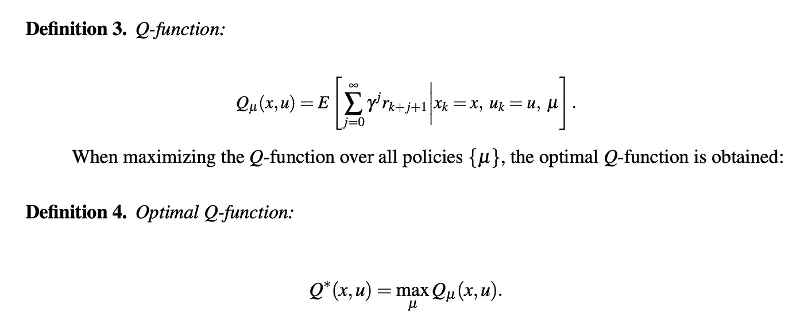
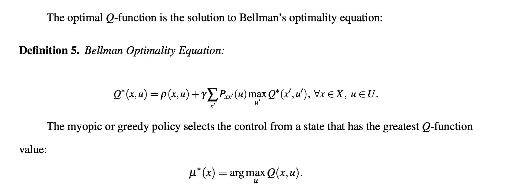
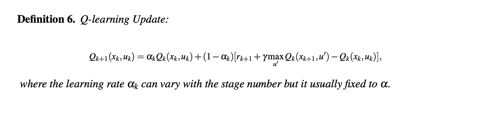

# 表格 Q 学习:一种重要的强化学习算法

> 原文：<https://levelup.gitconnected.com/tabular-q-learning-a-prominent-reinforcement-learning-rl-algorithm-db364fe2d474>

[附身摄影](https://unsplash.com/@possessedphotography?utm_source=unsplash&utm_medium=referral&utm_content=creditCopyText)在 [Unsplash](https://unsplash.com/s/photos/robot-learning?utm_source=unsplash&utm_medium=referral&utm_content=creditCopyText) 上拍照

在以前的一篇文章中，我介绍了有限贴现马尔可夫决策过程(MDP):

 [## 用于强化学习的马尔可夫决策过程

### 马尔可夫决策过程(MDP)是所有强化学习中最重要的模型之一。它允许…

medium.com](https://medium.com/@CalebMBowyer/markov-decision-processes-mdps-for-reinforcement-learning-rl-47d4a56d76f) 

在这篇文章中，你将学习如何通过使用表格 Q-learning 来优化解决上述模型的任何实例。提醒一下，任何有限贴现 MDP 环境都有有限数量的状态和有限数量的控制，因此我们可以在内存中存储一个 Q 表，其中行代表可能的状态，列代表可能的控制。

# q 函数符号

Q 函数依赖于一个策略管理单元，并将一个状态控制对映射到一个实数，该实数是永远遵循策略管理单元的代理的期望回报。

# Q-学习 Q-表更新

对于上面的数学更新，需要注意的真正重要的是 1)它可以用一行代码实现，2)我们正在为每个状态控制对更新 Q 表中的特定条目，以及 3)更新是无模型的，因此它不依赖于奖励函数或转换动态的知识。这种更新是使用来自代理-环境交互的状态、控制和回报的样本来执行的。

*首先关注本博客，从今天开始学习 RL、Python 和其他高价值主题；如果你想留在圈子里，永远不会错过我的故事，然后订阅我的电子邮件列表。* ***考虑成为媒介会员，以获得对我和其他作者作品的无限制访问:***

 [## 用我的推荐链接加入灵媒——凯莱布·鲍耶，理学硕士

### 阅读凯莱布·m·鲍耶和(媒体上许多其他天才作家)的每一个故事。您的会员费直接…

medium.com](https://medium.com/@CalebMBowyer/membership) 

*下次见，*

*迦*