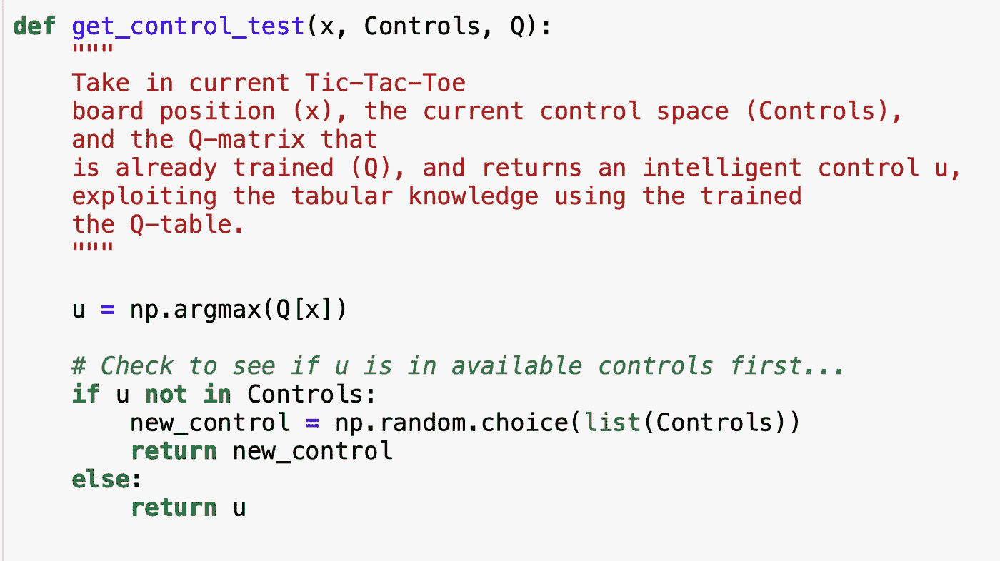

# 井字游戏中的表格 Q 学习代理与非理性代理

> 原文：<https://levelup.gitconnected.com/tabular-q-learning-agent-vs-irrational-agent-in-the-game-of-tic-tac-toe-6de6c85f0c42>

Pixabay 在 Pexels 上拍摄的照片

在之前的教程中，我描述了如何将井字游戏建模为强化学习(RL)问题，以及如何用 Python 实现该游戏。有关这些主题的更多信息，请参见下文:

 [## 将井字游戏框架化为强化学习问题

### 介绍

levelup.gitconnected.com](/framing-tic-tac-toe-as-a-reinforcement-learning-problem-eb76b6ece4de)  [## 在 Python 中为强化学习设置井字游戏

### 在我之前的媒体文章中…

levelup.gitconnected.com](/setting-up-tic-tac-toe-for-reinforcement-learning-in-python-43e2f42cfce8) 

现在，我解释我如何应用表格 Q-learning 来帮助参与人 1(代理 1)使用称为表格 Q-learning 的 RL 技术学习一个智能的接近最优的策略。这种 Q 学习技术对于少于 10，000 到 100，000 个状态的小问题是有用的；这真的取决于你拥有的计算资源，因为你系统中的状态越多，你就需要训练更长的时间来获得更好的性能。就个人而言，我认为对于超过 50，000 个状态，我永远不会使用表格方法，而是会选择一些函数近似方法，例如深度 Q 网络(DQN)。

与上一篇关于实现井字游戏的文章一样，设置是相同的，代码也没有变化:

接下来，我们可以开始设置模拟参数。

我们可以在上面看到，如果我们愿意，我们有一个随时可视化棋盘状态的字典，但我不会在本教程中使用太多。下面我们可以看到我们的 Q 表的初始化，我们将在本教程中学习。这是一个 10 维的 Numpy 数组，因为我们为状态保留了 9 维，还有一个控制维。

接下来，我们为表格 Q 学习算法设置了一些学习常数。α是学习率，γ是折扣因子，ε是确定代理 1 以何种概率进行随机控制或利用其 Q 表获得最佳可能控制的参数。简而言之，我解释了ε是如何在离散的时间间隔中衰减的。

此外，我在超过 100，000 集的训练中训练了代理 1 的 Q 表策略。我使用数组来记录玩家 1、玩家 2 的获胜记录，以及结果是平局时的记录。稍后我将使用这些数组来可视化智能代理 1、非理性代理 2 的学习性能，以及抽取率如何随时间变化。

关于所使用的ε贪婪随机训练策略的更多信息:我使用 20 个离散的衰减间隔。STAGE_LENGTH 是我用来确定在哪一集衰减 epsilon 的常数，衰减因子的量。对于这个模拟，epsilon 将每 5000 集衰减一次。然后，在所有用于模拟的常量和变量设置下方的单元格中，我打印出我们的 Q 表的形状。

接下来，我展示了一些方便的函数，我用它们来使模拟的主体更加整洁，并使用更少的代码。我可能会将更多的模拟代码打包到一些额外的函数中，但是为了训练我们的智能代理 1，当前的代码结构工作得很好，并且不太臃肿。

上面的功能是代理 1 的培训策略。

上面的函数是代理 1 的测试策略，使用经过训练的 Q 表。注意这里没有使用 greedy。在测试过程中，代理只会利用它学到的知识。

上面的函数是如上所述在离散周期衰减ε的辅助函数，在条件中使用 STAGE_LENGTH 来测试是时候进一步衰减ε了。然后，我只是做一个健全性检查，确保 epsilon 有规律地衰减，正如您将在培训模拟的底部看到的那样。

上面的函数是另一个帮助器函数，它在每一集开始时重置控制空间。

上面的方法是在导致代理 1 获胜的一集期间，对所收集的经验执行代理 1 的 Q 表更新规则。我注意到，在最后使用终端奖励只更新状态控制对的 Q 表导致学习非常慢，因此我为 Q 表提出了这种批量学习规则。缓慢和糟糕的学习是因为当代理人只在最后更新时，它没有办法将早期的游戏状态和控制关联为有效的移动，因此学习的进展被延缓。简而言之，我沿着导致代理 1 赢得这一集的完整状态控制轨迹训练 Q 表。以这种方式执行 Q 表更新会在短时间内带来出色的培训，您很快就会看到这一点。

while 循环之前模拟的开始如下所示。为了训练，我们循环播放剧集:

然后，在模拟的内部，代理人轮流玩游戏，直到游戏结束:

上面你可以看到衰减ε从 1.0 开始，然后是 0.7，…20 个衰减阶段的打印结果。

现在，让我们想象一下代理 1 的学习表现，代理 2 的表现，以及游戏以平局结束的频率。我把这些数据称为玩家 1 的胜率，玩家 2 的胜率，和局率。从频率主义概率的角度来看，我们可以将这些解释为每个结果的概率:

从训练中，我们可以看到一号玩家赢的概率大约是 86.4%。2 号玩家赢的概率大约是 9.13%，而剧集结束的概率大约是 4.52%。从 Matplotlib 图中我们可以看到，随着时间的推移，代理 1 越来越频繁地获胜，它确实在学习一个有效的策略。此外，代理 2 赢得越来越少。此外，比赛以平局收场的情况也越来越少。

现在让我们看看代理 1 在测试中表现如何:

在测试中，我们可以清楚地看到，代理 1 已经学会了一个有效的策略，赢得了近 91.1%的剧集。我敢打赌，如果多加训练，我们会做得更好。如果训练一百万集，然后考一万集会怎么样？你能改进这里显示的结果吗？下面评论和讨论！

直到下一次，

凯勒。

考虑成为一个媒体成员，永远不会错过我的故事。无限制地访问我的作品和其他作者的作品:

 [## 加入我的介绍链接媒体-迦勒鲍耶

### 作为一个媒体会员，你的会员费的一部分会给你阅读的作家，你可以完全接触到每一个故事…

medium.com](https://medium.com/@CalebMBowyer/membership)