# 用语义 HTML 正确标记你的文本

> 原文：<https://levelup.gitconnected.com/tag-your-text-the-right-way-with-semantic-html-cf3324b14d1b>

## 基本 HTML

## 超越标题和段落标签

如果你给礼物贴错标签会怎么样？😱照片由[Cloris](https://unsplash.com/@clorisyy?utm_source=unsplash&utm_medium=referral&utm_content=creditCopyText)在 [Unsplash](https://unsplash.com/s/photos/gift-tags?utm_source=unsplash&utm_medium=referral&utm_content=creditCopyText)

所有的网站都将文本作为其内容的一部分。HTML 标题和段落是文本内容最基本的结构。

然而，并非所有文本都是平等的。有些文本比其他文本更平等，我们可以使用特殊的 HTML 标签来进一步定义具有特殊含义的文本。

在这篇文章中，我们将关注 11 个可以添加到文本中的 HTML 标签。

*   `<em>`
*   `<strong>`
*   `<i>`
*   `<b>`
*   `<mark>`
*   `<q>`
*   `<cite>`
*   `<code>`
*   `<small>`
*   ``和``

# 用正确的标签构建文本

当我们得到一个带有文本内容的网页设计模型时，我们需要考虑如何在我们的 HTML 中构造它们。

虽然很容易保持使用 heading 标签作为标题，`
`作为段落和少量的``以便用 CSS 样式化部分文本，但是我们可以向浏览器、搜索引擎和屏幕阅读器传达更多关于内容的有意义的信息，以及像你的开发伙伴和读者一样依赖屏幕阅读器使用语义标签的人。

要决定使用正确的语义标签，您需要理解:

1.  找到具有特殊含义的文本的上下文
2.  我们将它与其他文本进行不同标记的原因(这些原因不应该包括需要对它们应用某种样式)
3.  考虑一下您可以随意使用的标签

# `1\. <em>`

`em`元素用于强调文本。我们可以用它来改变文本的意思，通过强调文本的某些部分，就像我们在英语中做的那样。

## 例子

我们可以通过强调课文的不同部分来改变课文“猫是可爱的动物”的意思。

在不同单词上使用 em 的例子，摘自 [w3c](https://www.w3.org/TR/html50/text-level-semantics.html#the-em-element)

# `2\. <strong>`

`strong`元素用于高亮显示

*   与其他部分相比，真正重要的部分
*   一个警告
*   用户需要在页面上首先看到的内容

我们经常用它来突出文本的重要性，强调一些警告，或者优先考虑页面上的某些内容。

## 例子

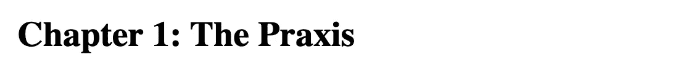

在章节名称上使用强元素，以突出其在样板内容(章节和章节编号)中的重要性，示例来自 [w3c](https://www.w3.org/TR/html50/text-level-semantics.html#the-cite-element)

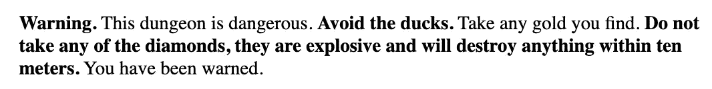

使用强元素作为警告，示例来自 [w3c](https://www.w3.org/TR/html50/text-level-semantics.html#the-cite-element)

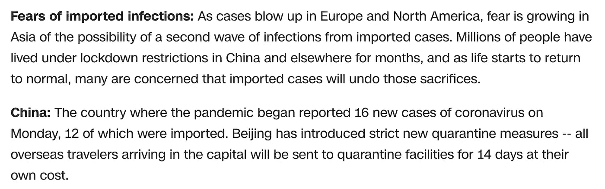

在 [CNN](https://edition.cnn.com/world/live-news/coronavirus-outbreak-03-16-20-intl-hnk/index.html) 上使用强元素

**注意:**用`strong`元素改变一段文本的重要性不会改变句子的意思。

# `3\. <i>`

`i`元素用来表示

*   以另一种声音或语气出现的一段文字，或者
*   与内容其余部分不同的文本，例如分类名称、技术术语、另一种语言的惯用短语、音译或思想以及斜体名称。

**注意:**我将斜体的名称列为`i`元素的用法之一，而不是 w3c 列出的西方文本中船舶名称的用例，因为我发现包含这样一个特定的例子很奇怪。搜索船名和样式，该示例似乎符合样式指南中的样式格式，例如芝加哥样式手册和 MLA 中强制使用斜体的船名。因此，我调整了`i`元素的用法，使其更适用于我们的日常使用。

## 例子

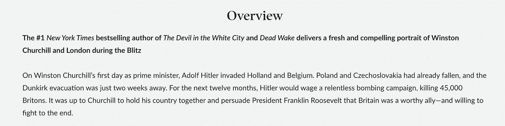

在 NYT 上使用 I 元素，在 [B & N](https://www.barnesandnoble.com/w/the-splendid-and-the-vile-erik-larson/1132287829?ean=9780593237175) 上使用书名

# `4\. <b>`

`b`元素用于突出显示文本，但不传达任何额外的意思。只有当没有其他更合适的元素时，才应该使用它。

在第一段上使用 B 元素，在 [B & N](https://www.barnesandnoble.com/w/the-splendid-and-the-vile-erik-larson/1132287829?ean=9780593237175) 上

# `5\. <mark>`

mark 元素用于突出显示为引用而标记或突出显示的文本。例如，我们可以用它来指示一个搜索词的位置。

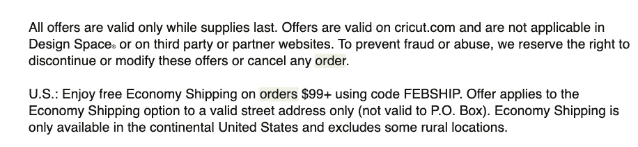

使用 mark 元素引用的电子邮件中的搜索词

# `6\. <q>`

元素的作用是显示从其他来源引用的内容。它以不同于其余文本的格式显示文本。默认情况下，浏览器会在内容中添加引号。

## 例子

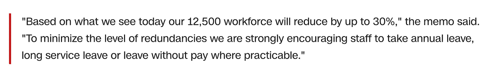

在 [CNN](https://edition.cnn.com/world/live-news/coronavirus-outbreak-03-16-20-intl-hnk/index.html) 上使用 q 元素

# `7\. <cite>`

`[cite](https://www.w3.org/TR/html50/text-level-semantics.html#the-cite-element)`元素用于创造性作品的标题、作者或 URL 引用。这可以是印刷文档、展览、艺术品、在线内容，如新闻、博客帖子、评论或书面或口头声明等。

## 例子

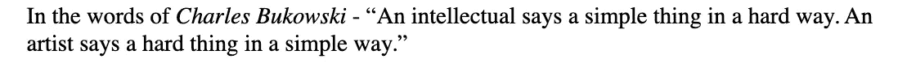

使用 cite 元素引用的引文的作者，示例来自 [w3c](https://www.w3.org/TR/html50/text-level-semantics.html#the-cite-element)

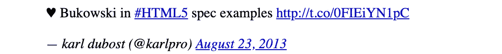

使用 cite 元素引用的 tweet 的作者，示例来自 [w3c](https://www.w3.org/TR/html50/text-level-semantics.html#the-cite-element)

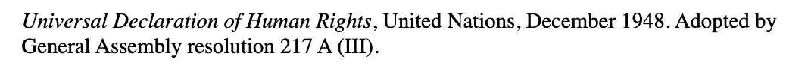

参考书目中使用 cite 元素引用的作品标题，示例来自 [w3c](https://www.w3.org/TR/html50/text-level-semantics.html#the-cite-element)

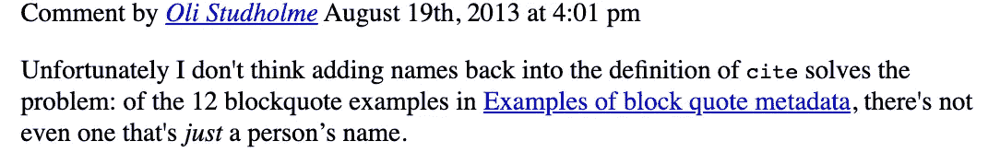

使用 cite 元素引用的博客帖子或论坛中的评论的作者，示例来自 [w3c](https://www.w3.org/TR/html50/text-level-semantics.html#the-cite-element)

# `8\. <code>`

当我们有一段计算机代码时，就要用到 code 元素。这可能是一个 HTML 元素、一个文件名、一个计算机程序或任何其他计算机可以识别的字符串。

为了用用于语法高亮脚本的语言来标记`code`元素，我们可以使用`class`属性，例如通过向元素添加一个带有前缀`language-`的类。

## 例子

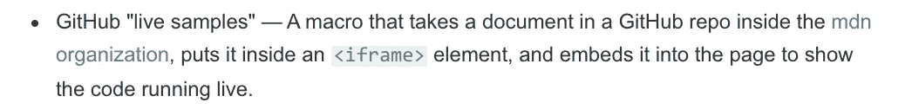

在 [MDN](https://developer.mozilla.org/en-US/docs/MDN/Contribute/Structures/Code_examples) 上使用代码元素

# `9\. <small>`

小元素用于旁注，如小字。它通常用于免责声明、警告、法律限制或版权。小字有时也用于归属，或满足许可要求。

因为它只适用于短文本，所以不应该在文本跨度较长的情况下使用，例如多个段落、列表或文本部分。

## 例子

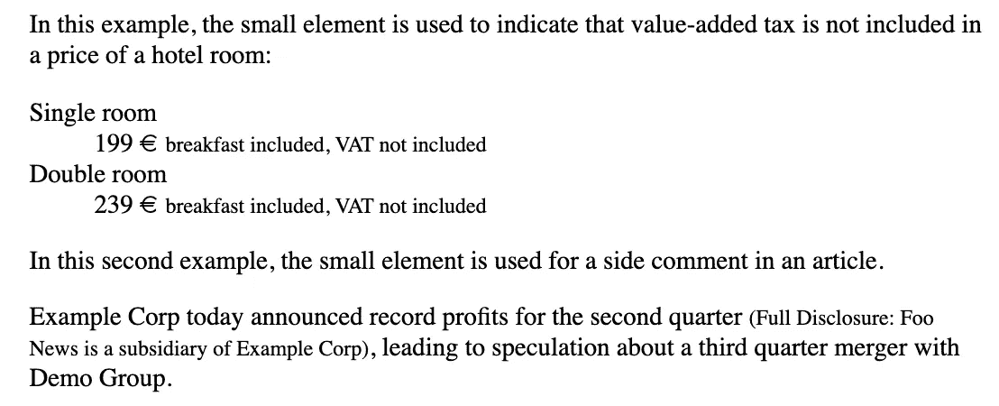

摘自 [w3c](https://www.w3.org/TR/html50/text-level-semantics.html#the-small-element)

# `10 and 11\. `和``

元素用在上标上，元素用在下标上。

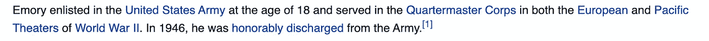

在[维基百科](https://en.wikipedia.org/wiki/Emerson_Emory)的脚注引用中使用 sup 元素

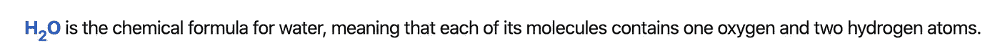

在[维基百科](https://en.m.wikipedia.org/wiki/H2O_(disambiguation))上使用水的化学分子式上的子元素

# 摘要

概括地说，我们已经浏览了以下 HTML 标签的列表:

*   `<em>`
*   `<strong>`
*   `<i>`
*   `<b>`
*   `<mark>`
*   `<q>`
*   `<cite>`
*   `<code>`
*   `<small>`
*   ``和``

我们可能需要一段时间才能适应语义 HTML 的使用，但是我们所做的额外工作使我们能够创建更好地与机器和人交流的网页。

任何时候，当您不确定应该使用哪种元素时，考虑以下因素会很有用:

1.  找到具有特殊含义的文本的上下文
2.  我们把它和其他文本区别开来的原因是

*一如既往，希望这篇文章有用！*

# 参考

*   [**来自 w3c 的文本级语义**](https://www.w3.org/TR/html50/text-level-semantics.html#the-sub-and-sup-elements)