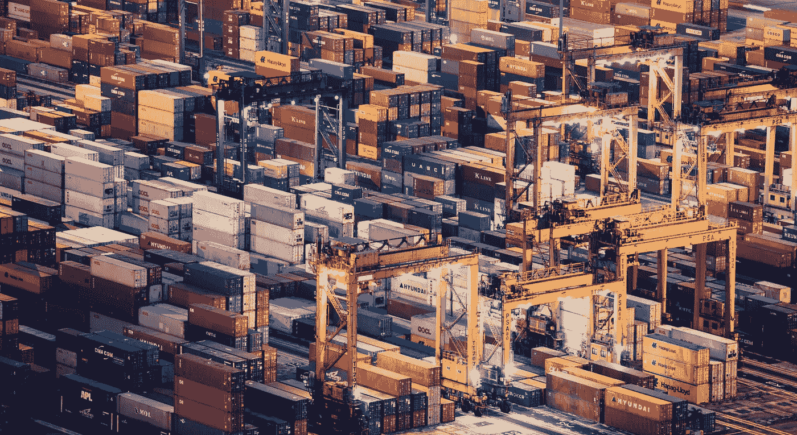

# 标记 Docker 图像的最佳实践

> 原文：<https://levelup.gitconnected.com/tagging-docker-images-9b299bce0263>

## 与 Docker 有效合作

## 作为自动化构建过程一部分的标记 Docker 图像的技术

一旦您开始使用 Docker 并创建供内部和公共消费的图像，决定如何标记这些图像就变得极其重要。标签是我们和我们图像的消费者识别容器图像的不同版本的方式。与软件中的大多数事情一样，准确地应用版本非常重要。

以下是我在过去几年中用来标记图像的实践列表，我发现这些实践对我很有效。我在我的开发中大量使用自动化，无论是构建还是发布软件，这在这些实践背后的推理中非常重要。

# 我们需要一个可以轻松自动化的解决方案

[语义版本](https://semver.org/)，也称为 SemVer，对很多事情来说都很棒。对于**公开**分发的 Docker 映像来说，这是一个理想的解决方案，因为它被广泛理解并且容易看到版本之间的关系。然而，它不太适合在连续交付部署环境中的自动化构建过程，因为它需要构建者理解构建的上下文，以便正确地修改版本号。这是一个补丁的构建，还是下一个主要版本？

如果我们发布公共图像，我们可能会对发布时间进行某种程度的控制。例如，通过基于 Git 标签发布，这可以根据需要为构建过程提供上下文，因此我们可以相对容易地使用基于 SemVer 的标签。

如果我们正在为 CD 环境构建私有映像，我们希望自动发布每个构建版本，并且不希望每次都要考虑定义服务器信息，所以我们应该寻找替代策略。

> SemVer 有它的位置，但自动化往往不是一件容易的事情。如果我们公开发布我们的图片，这是我们应该做的，但是对于内部图片，我们有其他的选择。

# 我们必须能够追踪我们集装箱里的东西

一旦我们开始使用容器，我们需要一个可靠的机制来跟踪它们的内容。这一过程必须稳健可靠。理想情况下，它允许我们将容器追溯到其 Docker 映像，然后追溯到映像中包含的 Docker 文件和代码。在自动化构建环境中，这应该会将我们带回导致 Docker 映像构建的提交。

我非常喜欢在 Git 环境中使用提交散列，或者在 Azure DevOps 这样的工具中使用构建 ID。使用这样的值可以让我们完整地追踪创建 Docker 图像的过程。如果我正在处理一个公共图像，我将添加多个标签——一个用于 SemVer 细节，一个用于构建标识符。

> 我们应该使用发起源提交或构建的一个方面来标记我们的 Docker 映像，以使易处理性尽可能容易。

# 健壮版本控制的重要性

我们需要知道我们在运行什么。如果我们重复使用一个版本号，我们可能会在 orchestrator 中运行版本不一致的容器，更糟糕的是，我们无法轻易区分这两者。

> ***我发现稳定的版本控制最适合 Docker，所以不要重用版本。Docker 映像源的任何更改都必须生成一个新的、唯一的版本。***

# 了解“最新”标签

Docker 中的“最新”标签经常被嘲笑，因为它被误解了。理解它是什么，它不是什么，以及它可能引入的潜在陷阱是很重要的。

*   “latest”只是一个标签，它可以应用于任何图像，如果没有指定，它就是默认标签。
*   它不是动态的，所以您可以用非“最新的”标签构建并标记后面的图像，而前面的图像不受影响。标记为“最新”的图像现在不是最新的。
*   很容易被改写，不管是无意的还是恶意的。
*   它不是描述性的。就其本身而言，它不会让您回到构建，以及构建的内容。因此，很难确切地说出当你拉“最新”时你会得到什么，它可能随时改变。

“latest”本质上并不是一件坏事，将它与 SemVer 和 build specific 标记结合起来在非常特殊的情况下可能会有所帮助。一般来说，我的建议是根本不要使用它，因为我认为它产生的问题比它解决的问题更多。

> Docker 使用“最新”作为标签可能会产生误导，并导致难以检测的问题。我的建议是最好避免，但是通过理解它，你可以选择最适合你的方式。

T 随着 CI/CD 流程的发展，集装箱行业也在快速发展。这些是我在这种环境下工作的想法和实践。我很想听听你们的想法！