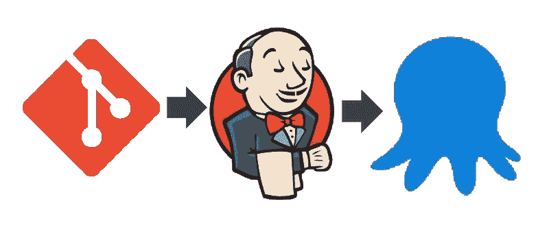
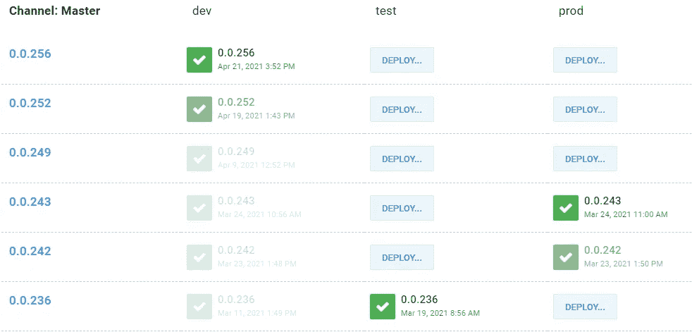
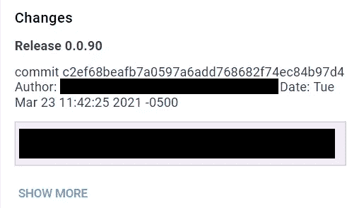

# 用 Git 提交散列和消息标记 Jenkins 构建

> 原文：<https://levelup.gitconnected.com/tagging-jenkins-builds-with-git-commit-hashes-messages-f11703effa5b>



吉特->詹金斯->码头工人

在这篇文章中，我写的是对 Jenkinsfile 的一个小的补充，它可以检索提交散列和消息，所以你可以用它来标记你的构建。在我的情况下，我在 Octopus Deploy 上标记发布，以提升生活质量。

为了提供一点背景知识，我的团队使用上面描述的 CI/CD 管道的设置，由 Git、 [Jenkins](https://www.jenkins.io/) 和 [Octopus Deploy](https://octopus.com/) 组成。Git 是我们的源代码管理工具。Jenkins 扮演一个中间人的角色，每当一个新的提交被推送到存储库时，它使用存储库中的 Docker 文件为存储库构建一个 [Docker](https://www.docker.com/) 映像，将映像上传到注册中心，然后在 Octopus Deploy 中为它创建一个相应的发布。Octopus Deploy 用于发布管理，可以方便地将不同版本的代码部署到不同的环境中，比如开发、试运行和生产。



章鱼释放

这种设置很好地满足了我们的需求，但是我们实现它的方式有一个问题，那就是我们的 Octopus 版本只标记了一个版本号，这使得很难区分它们对应于存储库中的哪些提交。例如，如果我试图将生产代码回滚到一个特定的提交，那么我必须通过尝试将提交的时间戳与发布创建时的时间戳相匹配来找出对应的 v.0.0.XX 发布，这也相差一分钟左右，因为它必须通过 CI/CD 管道。另一个同事顺便表达了对此的一些烦恼，通过在我们的 Octopus 版本中添加提交散列和消息，不到一个小时就解决了这个问题。



发布现在用相应的提交来标记，所以不用再猜了！

幸运的是，Octopus 有一个[选项，用于在通过 CLI 创建发布时指定发布说明](https://octopus.com/docs/octopus-rest-api/octopus-cli/create-release)。我们在 Jenkinsfile 中这样做，所以现在我们只需要获取提交散列和消息。事实证明，使用我们已经安装并用于从存储库中获取新代码的 [Git 插件，我们可以将提交散列作为环境变量来获取:](http://plugins.jenkins.io/git/)

```
RELEASE_NOTES = "$GIT_COMMIT"
```

获取额外的细节，如消息、作者、时间戳等。我们可以做到:

```
RELEASE_NOTES = sh (script: """git log — format="medium" -1 ${GIT_COMMIT}""", returnStdout:true)
```

它使用提交散列作为 shell 脚本运行 git log，并使用 Jenkins 的 [returnStdout 选项](https://www.jenkins.io/doc/pipeline/steps/workflow-durable-task-step/#sh-shell-script)将其作为字符串返回。

所以唯一需要的改变是一个额外的变量声明，并把它作为发布说明附加到 *octo create-release* 命令的末尾。

以前

在...之后