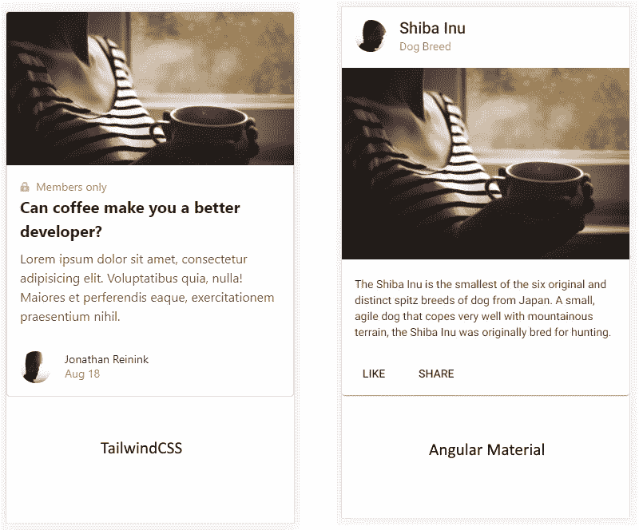

# TailwindCSS 和 Angular:很配！💙

> 原文：<https://levelup.gitconnected.com/tailwindcss-and-angular-its-a-match-7bf68c15fc54>

或者“我为什么留下有棱角的材料”

戴维·赫斯洛在 [Unsplash](https://unsplash.com/s/photos/trio?utm_source=unsplash&utm_medium=referral&utm_content=creditCopyText) 上拍摄的照片(已修改)

如果你正在寻找一篇关于如何用 Angular 设置 TailwindCSS 的文章，请看这里，它是完整的指南:

 [## 角度:配置 TailwindCSS

### 完全指南

medium.com](https://medium.com/swlh/angular-configure-tailwindcss-6816f7cc6f8e) 

我宁愿在这里把重点放在导致我离开 Angular Material 并选择像 TailwindCSS 这样的低级 UI 框架的原因上。

> **我们不打算比较一个组件库(Angular Material)和一个造型库(Tailwind)，而是比较它们如何管理 CSS 以及这种管理对我们项目的影响。**

这篇文章不想抹黑角料。这个 UI 框架有它存在的理由，我会在文章的最后解释为什么，为了你未来 UI 框架的决策。

# 怎么开始的？

在我从事 web 开发顾问职业的早期，我经常查看 Bootstrap。我真的很喜欢实用级第一的概念。

然而，我在设计、用户界面、UX 方面没有太多经验……所有这些对我来说都很模糊。

一天，一个网页设计师在我工作的时候打电话给我说:“你用 Bootstrap 吗？这种公用事业级的第一潮流真的很扯淡，而且很丑！相信我，我们必须遵循新的建议，比如材料设计！”

当时是大三，听听这位身后有多年经验的同事的建议，觉得很正常...

# 发现角状物质

所以我开始使用 Angular 团队创建的组件。我们至少可以说发展更快。

如果你看过我以前的帖子，你会发现我已经深入这个 UI 框架，找到了它背后的东西。主题管理、MatTable 等不同元素的定制…

尽管你所熟悉的材料有很多好处，但我们正逐步面临定制的问题，获得一个接近我们的设计的困难正在堆积…

# 噩梦的开始😰

## *为什么用材料定制组件变得越来越困难？*

总的来说，问题没那么大。角材料提供了一个极好的主题系统，你可以在整个应用程序中使用。很容易改变组件的颜色。

但是，当您必须更改组件中的小细节时，事情就变得棘手了。

> 细节决定成败

我们有两种方法:

*   将 CSS 放在应用程序的根样式中
*   在组件的 CSS 中。然而，如果同一个组件具有后来出现的动态元素，这种方法可能会有问题…迫使您使用像`::ng-deep`这样的技巧。

## 捆绑大小📦

我们来看看捆绑大小！

材料和顺风的做法完全不同！一个将根据指导方针设计组件的样式，另一个允许您使用一组实用程序类来创建自己的组件。

让我们首先创建一个新的空白项目，并测试每个 UI 框架来比较它们。

包大小差异(无 gzipped)

如你所见，差别是巨大的。对于开发部分，与 TailwindCSS 相比，Material 的尺寸非常轻。原因很简单:独立设计每个组件的样式，尺寸很小。理论上。

但是，如果 TailwindCSS 能显得很沉重，那只是因为它很有钱。幸运的是，我们不会剥削所有的财富！我们拿走我们需要的东西，有时是基于顾客的需求。

TailwindCSS 的生产方式显然是赢家。很难像 TailwindCSS 的创作者解释的那样超过 10kb。甚至解释了不同的优化技术。较小的包大小导致更快的网页加载。

你赢了一分，顺风！👍

## 关键渲染路径？

没听说过 CRP 吗？尽管如此，这种概念应该为我们前端开发人员所知。(别担心，我只是偶然发现的…两年前？)

通常，我们称关键渲染路径为 DOM 渲染的计算时间。
每当有一个 DOM 元素的 CSS 修改，计算 CSSOM(是的，它存在)的步骤将会重复，直到元素被渲染。它对你的 DOM 的每个元素都这样…
这个 CSSOM 的每个新计算都会导致一个所谓的**渲染阻塞 CSS** 。使用 Lighthouse，你肯定已经看到这个点显示为红色，这不是一个好的迹象…

优化这个路径将会提高你的网页第一次渲染的速度！

在我们的代码中，我们将使用一个实用类集，这将使我们更容易看到我们正在重写的元素，而没有意识到这一点。快速浏览 Chrome 检查器(或任何你每天使用的浏览器)将允许你快速找到 CSS 被重写的地方，从而优化 CSSOM 的渲染计算。

对于有角度的材质，您已经有了一组为每个组件定义好名称的类。你会想要重写一个部分，使它符合你的设计思想。这种重写导致重新计算 CSSOM。

*本文末尾有用链接。*

# 灯塔的例子🔬

一个简单的卡片例子

为了给顺风和材料相同的机会，我采取了相同的资产。这两个例子摘自各自的官网。
仍然按照每个人的文档，我准备了一个生产设置。
当我提供生产配置文件时，控制台给我的输出是:

生产配置的捆绑包大小

还有…最后的结果！

顺风

材料

正如我们所看到的，通过一个小例子，Tailwind 给出了更好的性能结果！我们可以看到，顺风能够提供两倍于材料的性能！🚀

# 原子 CSS 还是预定义的准则？🤔

本文的真正问题是:您应该更喜欢使用原子 CSS(实用程序类)的概念还是遵循 Material 的指导原则？

这取决于你想完成什么。

如果你的客户喜欢材料设计的工作方式，那么就接受它，闭着眼睛使用有棱角的材料。
相反，如果设计偏离了这个指导方针，并且您需要一个具有非常特殊的外观和感觉的应用程序，请给 TailwindCSS 一个机会。此外，如果你喜欢有棱角的材料组件，你可以很好地使用`@angular/cdk`

# 结束注释✏️

看看所有关于原子 CSS 的文章。这种 CSS 方法可以带来很多好处，并且肯定会改变你的编码方式。有点像到了 Angular 学 RxJS 的时候。

在以后的文章中，我将解释如何正确配置您的 Angular 应用程序，以便利用顺风的巨大潜力。敬请期待！

**编辑:** [文章为设置直播](https://medium.com/swlh/angular-configure-tailwindcss-6816f7cc6f8e)

# TailwindCSS 的有用链接🔗

*   **在 Angular 应用中配置 Tailwind 的完整指南:** [https://medium . com/swlh/Angular-configure-tailwindcss-6816 f 7 cc 6 f 8 e](https://medium.com/swlh/angular-configure-tailwindcss-6816f7cc6f8e)
*   **有趣资源:** [https://tailwindcss.com/resources](https://tailwindcss.com/resources)
*   **关于原子 CSS 方法的文章列表:【https://johnpolacek.github.io/the-case-for-atomic-css/】T22**
*   为了获得更多关于关键路径渲染的信息，我邀请你观看 Udacity 上的免费课程。[https://classroom.udacity.com/courses/ud884](https://classroom.udacity.com/courses/ud884)
*   **关于棱角分明和渲染阻塞 CSS 的有趣讨论:**
    [https://github.com/angular/angular-cli/issues/17764](https://github.com/angular/angular-cli/issues/17764)
*   **https://github.com/aniftyco/awesome-tailwindcss**