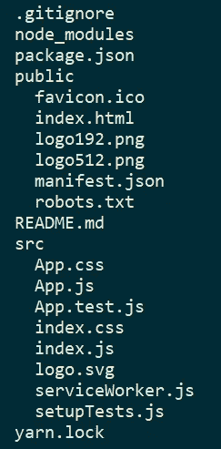

# 避免这些基本的 13 个带回家作业的错误，获得你梦想中的开发人员工作

> 原文：<https://levelup.gitconnected.com/take-home-assignment-mistakes-which-will-guarantee-someone-else-gets-the-job-36bcee1cec1d>

## #1 没有得到审查

布鲁斯·马斯在 [Unsplash](https://unsplash.com?utm_source=medium&utm_medium=referral) 上的照片

你想知道是什么让你带回家的作业失败了吗？

在我的职业生涯中，我回顾了许多带回家的作业。让我告诉你:软件开发人员在他们带回家的作业中会犯很多错误。

我过去找工作时，在带回家的作业中也犯了很多错误。这就是我如何知道一些错误的，因为我不能得到这份工作，因为他们。

当你避免了这些错误，你的作业将会大放异彩。

# 1.没有得到审查

这里有一个不受欢迎的观点:在提交作业之前，让你的作业得到审核。

但是等等，这不是作弊吗？

当我审查一个带回家的作业时，我想评估候选人的最佳作品。但是最好的软件不是由一个摇滚明星工程师制作的。通过团队合作和协作，你可以获得最佳结果。

假设你是一名糕点师，申请一家声誉良好的餐厅的工作。人力资源经理让你准备一个蛋糕，里面有胡萝卜和奶油。你会怎么做？

A.把蛋糕烤好，自己不品尝就送到餐厅。
B .烤好蛋糕，自己品尝，然后烤出更好的蛋糕送到餐厅。
C .烤好蛋糕，和你的厨师朋友一起品尝，然后烤出更好的蛋糕送到餐厅。

选项 A 是错误的。你可能会选择选项 B 或 C，这适用于你的带回家的作业。

一段代码在通过评审之前是完美的。所以，完成作业后休息一下，再回来复习。

对待代码就像别人写的一样。它满足要求吗？如何改进？有没有遗漏的边缘案例？

审查您的代码可以避免简单和明显的错误，例如留下未使用的变量或巨大的错误，例如未能理解需求。

在提交您的解决方案之前，请朋友审阅您的解决方案。一双外部的眼睛可以帮助你发现你视而不见的问题，因为你也熟悉它们。外部评估可以让你获得对任务第一印象的反馈。可读性强吗？也许你需要在自述文件中包含更多的描述？

当然，这听起来像作弊，因为你应该单独做评估。但是，称赞代码审查的重要性，然后用未经审查和时间紧迫的带回家的作业来评估候选人的表现，这难道不是有点虚伪吗？

我甚至建议让公司知道你的代码已经过审查，并按照他们的要求去做。你甚至可以提到你在代码评审中改进的地方。也许你根据朋友的反馈将一个 React 类组件重构为一个功能组件。接受评审并根据评审采取行动是您努力提高代码质量的标志，您可以处理反馈，并与其他人合作。所有这些都是一家公司在音响工程师身上寻找的基本技能。

# 2.没有关于它的故事

在参加评估面试之前，为你的任务编一个故事。准备好解释你的旅程。让你的故事包含你所采取的方法，你所做的尝试，你所学到的东西，你所遇到的问题，以及你解决这些问题的方法。

但是你为什么需要一个故事呢？

1.  没有人编写一次代码，用“初始提交”消息提交，然后提交。没有人第一次就做对了。它需要几次尝试，直到你得到它的权利，和无数的抛光尝试，直到你把它弄得整洁。
2.  与白板相比，带回家的任务隐藏了你在公司的工作方式。他们看到了结果，这给了你一个关于你能实现什么的看法，但是他们不知道你是怎么想的。让他们知道你是如何思考和解决问题的，可以让他们更多地了解你。

# 3.不理解你的解决方案

评审员希望候选人能够证明他们在解决方案中所做的选择，他们所选择的数据类型，以及他们在作业中使用的框架、库和工具的内部知识。

例如，如果你在作业中使用承诺，准备好解释他们是如何在幕后工作的。

# 4.只专注于获得结果

我记得我与一位完成任务的候选人进行的一次审查面试，但是代码需要重构。我问他:“你会如何改进你的解决方案？。

答案是:“它给出了你想要的结果，这还不够吗？”。

当然，完成作业的要求是必要的。但是你如何得到这些结果和得到结果一样重要。

# 5.过度设计解决方案

站在工程师同事的角度想想。你更喜欢整洁干净的代码来解决问题还是过度工程化的解决方案？

最常被采用的软件开发原则之一是 K.I.S.S，意思是“保持愚蠢、简单”。这更适用于带回家的作业，因为评审者几乎没有时间去评审和评估你的解决方案。

未能保持解决方案简单的一个原因是过度设计它来炫耀你知道多少和你能做什么。虽然炫耀你的技能听起来不错，但结果往往是相反的，因为过度工程化通常会带来额外的复杂性。

# 6.误解任务

你是天才程序员吗？太好了！你非凡的技能只有在解决正确的问题时才是有用的。如果你不明白你需要在一份带回家的作业中解决什么，那么获得这份工作的机会就相当渺茫。

如果您有任何问题，请要求澄清。问正确的问题可以让你离被雇佣更近一步，甚至在开始编码之前。

# 7.没有评估所有可能的解决方案

不要用你脑海中出现的第一个解决方案来编码。

像其他商业问题一样，带回家的作业通常有不止一个解决方案。通常有一个快速的解决方案，但是如果你深入研究，你可能会发现一个更好的解决方案。

评估解决方案的一个有用的方法是把它们写下来并进行比较。写下来会帮助你思考解决方案的每个潜在方面。

# 8.自述文件缺失或质量不佳

自述文件是评审人员研究你的解决方案的第一件事，甚至可能在你的简历之前。在他们看到代码之前，您可以用一个简洁、信息丰富的自述文件让他们大吃一惊。

想象你在一个你从未去过的房子里，你需要在那里住一个星期。如果有一份文件说明在哪里可以找到毛巾或 wi-fi 密码，那不是很好吗？如果你不知道最先进的咖啡机放在厨房的顶层，你怎么能欣赏它呢？

只有别人能欣赏你的作品，你的作品才是优秀的。自述文件是您项目的指南，帮助审阅者找到最先进的咖啡机。他们仍然可以在没有自述文件的情况下找出你的解决方案，但这不是一种愉快的体验，就像自己找出房子一样。

尽可能在自述文件中解释以下内容:

*   范围和功能。
*   目录结构。
*   启动和运行的说明。
*   解决方法，以及一个关于它的简短故事。
*   你遇到的困难和你如何解决它们。
*   解决方案的性能和空间要求。
*   依赖关系列表
*   支持的浏览器/平台列表。
*   改进解决方案的后续步骤。

# 9.留下未使用的文件和依赖项

假设您想要使用 React，并且您决定在运行该命令后使用`npx create-react-app project.`,您最终会得到以下目录结构:

为了清楚起见，省略了 node_modules 的内容。

生成的项目包含 PWA 支持等功能。但是在您的解决方案中可能不需要它。在这种情况下，请将它们从模板中删除。

例如，如果您被要求不包含任何单元测试，那么就没有必要保留`App.test.js`文件、`package.json`中的`test`脚本条目以及为单元测试添加的所有依赖项。

# 10.具有过多的嵌套目录层次结构

不要把你的解决方案的目录结构转换成迷宫。

当我检查作业时，我会在阅读自述文件后立即寻找解决方案的目录结构。一个干净的、扁平的目录层次结构帮助我找到我下一步应该看的地方。

拥有一个多级嵌套的目录层次结构使得访问源文件变得更加困难。相反，尽量将解决方案中的文件保存在一个最多两层的目录中。

# 11.不包括单元测试

单元测试不仅仅是测试。他们强迫你编写模块化的、可测试的、职责分离的代码。他们让公司知道，你可以用边缘案例跳出框框思考。

# 12.没有增加一点额外的

给任务增加一点额外的内容可以向公司表明你有动力加入他们，这将有助于你领先于其他候选人。

比如需要准备一个 todo app 吗？当最终用户从待办事项列表中选择一个待办事项时，您可以添加一个小小的、令人愉快的动画。注意小细节往往会给人留下好印象。

# 13.添加的注释太少或太多

我看到开发人员往往会犯这样的错误，要么不包含任何评论，要么评论过激。

需要的注释数量取决于作业类型。例如，如果您需要准备一个单网页应用程序，就没有必要对代码进行注释。另一方面，您可能需要开发一个相当复杂的解决方案或算法。在这种情况下，注释掉解决方案的特定部分会很方便。

证明个人决策合理的评论通常很受欢迎。例如，当您使用不常用的数据类型或库来完成任务时。

咄咄逼人的评论可能表明代码味道。需要注释每一行是代码难以阅读的标志。考虑重构代码，而不是添加更多注释。

# 包装它

以下是我们到目前为止所学内容的总结:

1.  很好地理解任务的要求。如果你对范围或功能有任何疑问，请联系招聘经理。
2.  尽可能评估可能的解决方案。用第一个想法解决任务会让你找到一个更好的。
3.  在您的项目中包含清晰的描述性自述文件。
4.  从项目中清除任何未使用的代码。
5.  在你的作业中不要有太多的嵌套目录。
6.  了解您的解决方案的技术细节。了解库、工具和 API 是如何工作的。避免在你的回顾面试中回答“它只是工作”。
7.  为你的项目创造一个迷人的故事。重点描述“如何”而不是“结果”。
8.  完成任务的要求是不够的。您还需要确保以尽可能最好、最优化的方式获得结果。
9.  不要过度设计你的解决方案。干净、整洁、可读的代码总是胜过技术先进、复杂、难读的代码。
10.  为你的作业编写单元测试，因为单元测试会引导你找到更好的解决方案。
11.  一旦你完成了，就像别人写的一样检查你的代码。此外，请一个朋友进行评估，以获得对你的任务的第一印象的反馈。
12.  给你的作业加点额外的东西。它可以是像素完美的动画，也可以是页面上的“全选”按钮，在这里你可以选择待办事项。
13.  不要在代码中加入不必要的注释。重构您的代码，而不是在代码块中添加长注释。

感谢阅读！

# 分级编码

感谢您成为我们社区的一员！ [**订阅我们的 YouTube 频道**](https://www.youtube.com/channel/UC3v9kBR_ab4UHXXdknz8Fbg?sub_confirmation=1) 或者加入 [**Skilled.dev 编码面试课程**](https://skilled.dev/) 。

 [## 编写面试问题

### 掌握编码面试的过程

技术开发](https://skilled.dev)