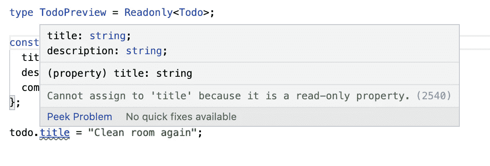

# 使用实用程序类型将您的类型脚本技能提升到一个新的水平

> 原文：<https://levelup.gitconnected.com/take-your-typescript-skills-to-the-next-level-with-utility-types-370c25153c2f>

在撰写本文时，Github 上有 65k 颗星，您可以很容易地得出结论，在开发基于 javascript 的应用程序时，这种语言已经成为开发人员的工具。根据 Stack Overflow 的年度开发人员调查(调查可在此处找到)Typescript 是第二受欢迎的语言，支持率为 67.1%，Javascript 以 58.3%的支持率排在第十位。

我经常听到日常使用普通 javascript 的人说，他们对 Typescript 和它所提供的东西很好奇，但也受到假设的约束，即他们会失去普通 javascript 所提供的一些灵活性。
你也可能是一名开发人员，专注于开发新的特性，并不断创建新的接口和类，每次出现新的数据模型时，它们的命名都略有不同，或者你一直将属性设置为可选的或 any 类型，以使 typescript 编译器在编写代码时不再抱怨。

如果您曾经发现自己处于上述情况之一，或者只是好奇如何使用实用程序类型来提高您的打字技能，那么您来对地方了。

## 什么是 Typescript 实用工具类型

实用工具类型是 Typescript 语言附带的特殊类型，可用于提高语言的可读性和灵活性，同时减少样板代码。

简单地说，您提供一个值，实用程序类型将在特定实用程序类型定义的约束下构造一个新类型。

只读实用程序类型

**只读<类型>**

上面的要点显示了一个使用内置 Readonly 实用程序类型的简单示例。
这里我们定义了一个简单的 Todo 接口，它有三个属性。假设我们想预览数据，并确保我们不能变异它。因此，我们创建了另一个名为 TodoPreview 的类型，它基于将 Todo 类型作为泛型参数应用于 Readonly 实用程序类型函数。现在，我们可以在创建一个新对象时使用该类型，并分配首字母值。
如果我们像在最后一行那样给属性分配一个新值，title 将获得一个新值“Clean room again ”,将会出现下面的错误消息。

现在，我们可以确保当您尝试分配新值时，typescript 编译器将抛出错误。请注意，Typescript 只是 Javascript 的超集，如果使用括号符号，您仍然可以为 todo 赋值，但这也可以用 tslint 规则进行限制。

**选择<类型，【prop 1】|【prop 2】>**

Pick 可用于从特定模型中挑选您想要的特定属性，以根据您的选择构建新模型。

在上面的要点中，我们创建了一个名为 TodoSummary 的新类型，它是由 Todo 模型构造的。这里的“标题”和“已完成”是精选的，这样我们就不会在 TodoSummary 上获得新属性的描述。现在，当我们使用 todo 对象时，我们不能使用 description 属性，并且 typescript 编译器会抱怨该类型上不存在“description”。

**省略<式，>prop 1**

省略实用程序类型与*选择实用程序类型*相同，但不是选择你想用来构造新类型的属性，而是提供你想从新类型的构造中省略/排除的属性

**偏<型>型**

Partial 也是一种常见的实用程序类型，它能够构造一种所有属性都设置为可选的新类型。

上面的场景说明了部分实用程序类型的一个简单而常见的用例。
假设您创建了一个动态对象，在更新状态时您不知道该对象的模型。然后可以添加一个 *Partial < Todo >* 作为类型，并将‘description’作为参数传递，而无需定义‘title’参数，typescript 编译器不会抱怨。如果没有部分实用程序类型，您还必须定义一个未更改或未提供值的“标题”。

**记录<键，键入>**

当您想要扩展键类型时，Record 是一个非常有用的类型，在本例中是*to state*并将值映射到一个新构造的类型。
上面的要点定义了一个名为 TodoState 的枚举，它描述了待办事项可能处于的不同状态。

该列有一个属性“title ”,它为该列添加了一个有意义的标题。
现在我们直接依赖于 TodoState，这将影响看板对象，因为它基于以 TodoState 为关键字的记录。
假设我们想要扩展 TodoState，并在完成之前和完成之后引入一个“测试”状态以保证质量。那么 typescript 编译器将抛出一个错误，因为 Kanban 对象没有用 ColumnInfo 值定义“Testing”属性名。

Typescript 还有 11 个内置的实用程序类型，可以进一步增强您的 typescript 代码，例如，如果提供的类型没有构造函数，则使用*instance Type<Type>*实用程序类型抛出错误。

## 甚至更多的实用工具类型！

当您对现有的实用程序类型有了深入的了解，并且可以看到它们的强大功能以及贯穿您代码的用例时，您可能会想要检查这个库

[**【https://github.com/piotrwitek/utility-types】T21**](https://github.com/piotrwitek/utility-types)

这是您可以在 Typescript 中使用所有不同种类的实用工具类型的集合。可以把它们看作静态类型的“lodash”。

希望这让您对如何使用实用程序类型改进一些代码有了一些了解，并且可能在不添加额外样板文件的情况下增加代码的可读性和可维护性。

现在，快乐编码！