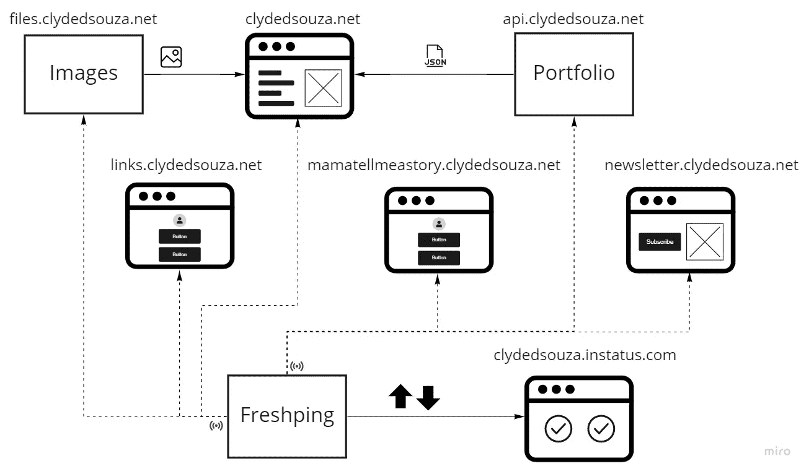

# 更新我的网站的收获

> 原文：<https://levelup.gitconnected.com/takeaways-from-updating-my-website-b211ac24a47f>

包括从 Markdown 文件生成 API 等等

照片来自 [Unsplash](https://unsplash.com/photos/gcsNOsPEXfs)

# 介绍

本月早些时候，我发布了我为之工作了几个月的[我的网站](https://clydedsouza.net/)的重大更新。这次更新包含了很多技术上的变化，比如重写和重新设计我的网站，添加 API 来托管我的投资组合信息，添加多个其他微型网站等等。这篇文章旨在揭示所有这些技术变化，并希望启发其他可能阅读这篇文章的人。

网站的高层架构图

# 网站重新设计和重写

## 用户体验

我的旧网站设计的一个缺点是，我所有的工作都需要放在一个项目标签下。随着项目列表逐年增加，这个屏幕变得非常大，需要滚动很多才能到达列表的底部。该屏幕也没有任何过滤器或搜索框来获得列表的精确视图。为了解决这个问题，新的网站设计包括屏幕顶部的导航标签，这让我可以将我的投资组合大致分为四类——项目、演讲、教学和书籍。这些屏幕中的每一个还包括一个搜索框，用于快速细化项目列表，以及一个切换按钮，用于显示非活动项目，其中包括未维护的项目，以及由于各种因素可能无法 100%运行的项目。

新—分类导航和可搜索结果。旧-没有搜索框的简单导航。

我还在主屏幕上添加了一个亮点部分，允许我展示某些项目。我试着在旧网站上用一张卡来做这件事，但是感觉受到了限制。

新-主页上的一个突出显示部分，允许我锁定选定的项目。旧—主屏幕中突出显示特定项目的单个卡片。

我还在侧边栏中添加了一个行动号召，巧妙地吸引用户的注意力——就像应用程序内的广告，但不是当着你的面。在手机屏幕上，这一部分被移到网站的页脚，背景颜色与网站的其他部分略有不同。

显示桌面和移动设备中的行动号召部分的 GIF。

旧网站在屏幕右下角有一个 Facebook Messenger 按钮，让访问者可以快速给我发消息。但是，我注意到邮件不会出现在我的收件箱中，而是会转到邮件请求屏幕，我永远不会检查。此外，这可能不是最好的主意，而且让访问者直接在脸书上给我发消息看起来也不太专业。所以，对于 2.0 版本，我用的是 [Tawk.to](https://www.tawk.to/) 这是一个实时的实时聊天软件。他们提供了一个 JavaScript 代码片段，我需要将这个代码片段[添加到我的网站](https://github.com/clydedsouza/clydedsouza.github.io/blob/v2.0.0/index.html#L177-L187)中，你瞧，我的网站上启用了实时聊天功能。Tawk.to 提供了一个很好的仪表盘，当有访客给我发信息时，即使我不在线，我也可以回复所有收到的信息。

新建—屏幕右下角的聊天图标。旧——屏幕右下角的 Facebook Messenger 图标。

我也离开了[的材料设计](https://material.io/design)，因为是时候进行视觉刷新了；我也离开了[的材料设计图标](https://materialdesignicons.com/)，因为[不再提供品牌图标](http://dev.materialdesignicons.com/roadmap/brand-icons)。网站的设计灵感来自于 [Gitfolio](https://imfunniee.github.io/gitfolio/) ，对于网站上使用的图标，我选择了[字体 Awesome](https://fontawesome.com/) 。然而，配色方案保持不变，因为我想为回访者保留品牌熟悉度。

展示新网站设计和旧网站设计的 GIF。

## 技术细节

我用的是 [Angular](https://angularjs.org/) 1.x 和 [Angular Material](https://material.angular.io/) 。Angular 1.x 很久以前就过时了，在撰写本文时，当前版本是 11.0.0。因此，对于我的网站的 2.0 版本，我已经完全去除了角度依赖性，并保持了技术的超级简单——HTML、CSS 和 JavaScript。

我正在使用一个名为 [Mustache.js](https://mustache.github.io/) 的模板库，它可以更容易地显示重复项目，比如项目列表。结合 [jQuery](https://jquery.com/) ，我也让网站感觉像是在使用单页面应用程序(SPA)。这是通过使大部分内容成为自己的局部视图，然后[根据点击的导航项目或访问的 URL 载入和输出](https://github.com/clydedsouza/clydedsouza.github.io/blob/v2.0.0/js/custom/templateEngine.js)来实现的。

我还使用了被编译成 CSS 的 [Sass](https://sass-lang.com/) 。Sass 提供了很好的特性，如变量、部分文件、嵌套规则和混合。一旦你开始使用 Sass，它会变得非常自然，你可能不想再使用 CSS 了。因为我使用 Visual Studio 进行开发，所以我使用这个 Visual Studio 扩展[将 Sass 编译成 CSS。](https://marketplace.visualstudio.com/items?itemName=MadsKristensen.WebCompiler)

我还使用了[Bundler&mini fier Visual Studio 扩展](https://marketplace.visualstudio.com/items?itemName=MadsKristensen.BundlerMinifier)将不同的 JavaScript 文件捆绑到一个文件中并缩小该文件。对于更快的页面加载，建议加载较少的文件。[捆绑](https://docs.microsoft.com/en-us/aspnet/mvc/overview/performance/bundling-and-minification#bundling)允许我们将多个 JavaScript 和 CSS 文件分别组合成一个 JavaScript 和 CSS 文件。这意味着当向网站发出请求时，浏览器现在只需要请求一个文件，而不是请求十个 JavaScript 文件。[缩小](https://docs.microsoft.com/en-us/aspnet/mvc/overview/performance/bundling-and-minification#minification)通过删除文件中的空白并执行各种代码优化，帮助减小文件大小，而不改变底层功能。

说到页面加载，由于网站上有大量的图像，我使用了[图像优化器 Visual Studio 扩展](https://marketplace.visualstudio.com/items?itemName=MadsKristensen.ImageOptimizer)来压缩图像大小，这将有助于加快页面加载。

我将继续使用 Google Analytics 对我网站的使用情况进行总体分析。除此之外，我还为热图添加了[清晰度](https://clarity.microsoft.com/)，因为我很想知道网站的哪些元素被点击得最多。

# 投资组合项目的 API

在我的网站的 1.0 版本中，我使用一个 JSON 文件来存储关于我的项目的信息。最初，这工作得很好，但是随着我的项目列表的增长，这个 JSON 文件变得难以维护。

所以对于 2.0 版本，我将我的项目信息转移到它自己的 [GitHub 仓库](https://github.com/clydedsouza/clydedsouza-web-api/settings)中，并开始使用 Markdown 文件来存储我的项目信息。我们的想法是每个项目都有一个 Markdown 文件——元信息将被存储为 [Front Matter](https://jekyllrb.com/docs/front-matter/) 并在下面，我有机会添加每个项目的更多细节，然后我可以在项目细节页面上显示这些细节——后一部分尚未上线，但已在路线图上。

概述通过 API 添加投资组合项以消费该数据的过程的高级图表

然后，在我的 Azure DevOps 构建管道中，我使用一个名为 [processmd](https://www.npmjs.com/package/processmd) 的 npm 包将这些 Markdown 文件转换成一个 JSON 文件。是的，网站最终使用了 JSON 文件，但重要的是，我不必编辑 JSON 文件。

我已经将这些 Markdown 文件组织到子文件夹中，让我可以将我的项目大致分类为——项目、教学、演讲和书籍——我认为所有这些都是不言自明的。在每一个类别中，我都按照文件制作的年份将它们组织到文件夹中。

在我网站的主页上，我展示了一个名为“亮点”的部分——这是我钉在主页上的一些项目。为了将一个项目标记为高亮，我必须将 Markdown 文件的文件扩展名从`filename.md`更改为`filename.pin.md`。

我正在使用一个 [PowerShell 脚本](https://github.com/clydedsouza/clydedsouza-web-api/blob/v1.0.2/Run-Portfolio-API.ps1)，它在我的项目文件夹上运行 processmd 来生成不同的 JSON 文件——每个类别一个 JSON 文件，每年一个 JSON 文件，所有突出显示的项目一个 JSON 文件——而不重复原始内容。这是将内容与实际交付格式分离的优势。

上面链接的 PowerShell 脚本使用了几个助手脚本。这些助手使用[perste](https://github.com/pester/Pester)进行单元测试，测试结果发布到 Azure DevOps 构建管道。

## 无头 CMS

我还将这个 GitHub 存储库与 [Forestry.io](https://forestry.io/) 连接起来，后者充当我的 Markdown 内容的无头 CMS。Forestry 提供了一个简洁的 UI 来更新我的项目信息。我还在我现有的项目页面中创建了一个[封面模板](https://forestry.io/docs/settings/front-matter-templates/)，允许我通过 Forestry 轻松添加新的项目文件，并让它自动将相同的封面结构添加到每个项目文件中。

以下是在林业中编辑项目内容的样子。

## 释放管道

在我的 Azure DevOps 发布管道中，我使用[GitHub Pages Publish](https://marketplace.visualstudio.com/items?itemName=AccidentalFish.githubpages-publish)market place 扩展将构建工件发布到同一个 GitHub 存储库的`gh-pages`分支。这些人工制品包括:

*   网站用来显示项目条目的经过处理的 JSON 文件；
*   网站将用来显示项目详细信息页面的原始降价文件；和
*   一个包含该站点子域的 [CNAME 文件](https://github.com/clydedsouza/clydedsouza-web-api/blob/master/output/CNAME)

> **提示**:在 [GitHub 页面发布](https://marketplace.visualstudio.com/items?itemName=AccidentalFish.githubpages-publish)中设置提交电子邮件地址时，您可以使用 GitHub 提供的不回复电子邮件地址，而不是您的个人电子邮件地址，其格式应为`username@users.noreply.github.com.`阅读更多信息[此处](https://docs.github.com/en/free-pro-team@latest/github/setting-up-and-managing-your-github-user-account/setting-your-commit-email-address)。

由于我已经在`gh-pages`分支启用了 GitHub 页面，我的 JSON 文件现在从[api.clydedsouza.net](https://api.clydedsouza.net/)提供。

# 托管静态文件

我最初是在我的[域名注册公司](https://register4less.com/?ref=clydedsouza.net)分配的免费空间中托管静态文件，如图像、CSS 和 JavaScript 文件。不幸的是，随着时间的推移，这个 10MB 的空间已经饱和，我需要将这些文件转移到其他地方。为了解决这个问题，我创建了一个 [GitHub 库](https://github.com/clydedsouza/clydedsouza-web-files)来托管这些静态文件，并让[启用 GitHub 页面](https://guides.github.com/features/pages/)，以便这些文件可以通过互联网提供。

我已经创建了一个构建管道，当包含这些静态文件的任何文件夹发生更改时，就会触发该管道。你可以在这里阅读更多关于使用路径过滤器来触发你的构建管道[。构建管道将内容归档，并为发布管道准备好 ZIP 文件。我使用相同的](https://docs.microsoft.com/en-us/azure/devops/pipelines/repos/azure-repos-git?view=azure-devops&tabs=classic#path-filters)[GitHub Pages Publish](https://marketplace.visualstudio.com/items?itemName=AccidentalFish.githubpages-publish)market place 扩展将这些文件从我的发布管道提交到 GitHub 库的主分支。

概述添加图像/CSS/JavaScript 文件以使用该文件的流程的高级图表。

由于最初托管在免费托管空间中的静态文件可以使用子域 static.clydedsouza.net 进行访问，并且这些文件在迁移后不再存在，因此我创建了一个 [Cloudflare 页面规则](https://support.cloudflare.com/hc/en-us/articles/218411427)来将所有请求从子域 static.clydedsouza.net 重定向到 files.clydedsouza.net。这确保了对旧静态站点的任何延迟引用都被重定向到新站点。

> **补充说明**:我正在使用 Cloudflare 管理我的 DNS 记录。Cloudflare 提供了大量功能，包括 DDoS 保护、SSL 证书、缓存等等。

# 公共状态页面

我真的想要一个单一窗口来查看我所有应用程序的运行状态，所以我使用了 [Instatus](https://instatus.com/) 和 [Freshping](https://www.freshworks.com/website-monitoring/) 来创建我自己的状态页面。下面是我如何一起使用这些服务的简要概述。

*   **Instatus** :为想要订阅停机通知、自动状态更新、计划维护消息、组件和组等的用户提供快速加载的状态页面，具有惊人的功能，如电子邮件、webhook 和 RSS 更新。
*   **Freshping** :每隔 1 分钟提供网站监控。免费计划允许您添加 50 台显示器。

要在 Instatus 中自动更改组件的运行状态，您需要按照[指南](https://instatus.com/help/automation/freshping)将您的 Freshping 帐户与 Instatus 连接起来。从本质上说，每当一个监视器出现故障时，通过电子邮件向 Instatus 组件发送消息，从而自动在您的状态页面上反映状态变化，这已经变得很新鲜了。

## 为什么我选择了 Instatus 而不是 Freshstatus？

你也可以使用[fresh status](https://www.freshworks.com/status-page/)——这是另一个提供状态页面的服务，而不是集成 Freshping 和 Instatus。我没有选择 Freshstatus，因为他们的[免费计划](https://www.freshworks.com/status-page/pricing/)只提供最多 250 个订户，尽管他们的免费计划提供了设置自定义域名的能力，但他们不提供 SSL，这意味着页面将通过 HTTP 而不是 HTTPS 提供服务，这并不理想。

# 其他变化

*   我介绍了[links.clydedsouza.net](http://links.clydedsouza.net/)和[mamatellmeastory.clydedsouza.net](http://mamatellmeastory.clydedsouza.net/)两个不同的微型网站，作为使用 Linktree 的替代方案。如果你想做一些类似的东西，可以看看 GitHub 上的这个模板，作者是 Michael Barney。我在这两个网站上添加了林业，为我提供了 CMS 功能。
*   我以前在我的旧网站上有一些格式为`clydedsouza.net/project-name`的重定向页面，它们会把你重定向到那个特定的项目。在我的网站的 2.0 版本中，我已经删除了所有的重定向，只包含了一个在[clydedsouza.net/blog](https://clydedsouza.net/blog/)上的重定向，将用户重定向到我的[媒体简介](https://medium.com/@clydedz)。我还添加了一个可以通过[blog.clydedsouza.net](https://blog.clydedsouza.net/)访问的微型网站，该网站还会将用户重定向到我的[中型简介](https://medium.com/@clydedz)。
*   最后，我使用 [ConvertKit](https://app.convertkit.com/referrals/l/f93185b0-a936-4f97-91f3-fcb140308045) (参考链接)来托管我的[时事通讯站点](https://newsletter.clydedsouza.net/)。

# 结论

哇，这是很多信息，我很高兴你坚持到最后。我也希望你喜欢这次旅行。如果你有过类似的经历，我想知道——请在下面的评论中告诉我。

就是这样！感谢阅读。