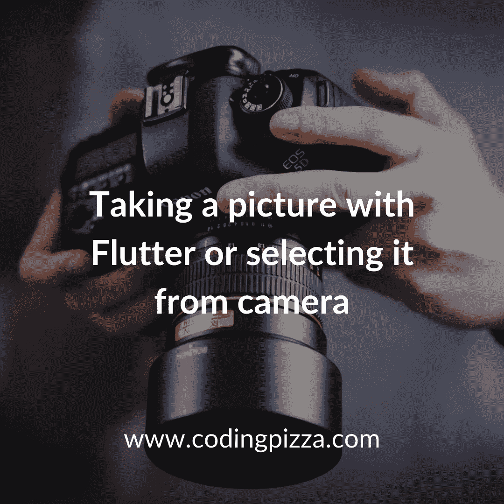
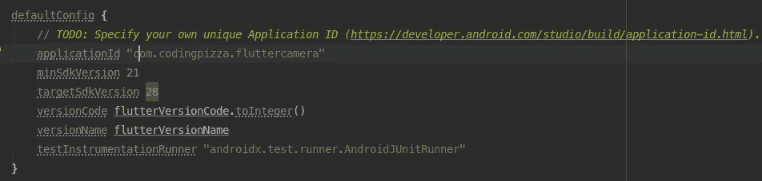
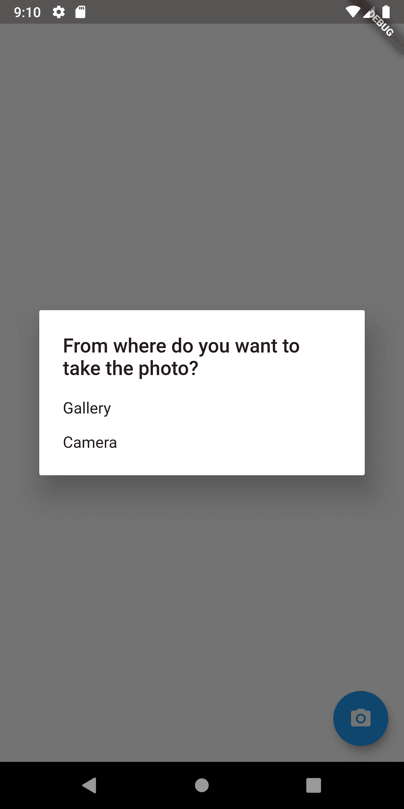
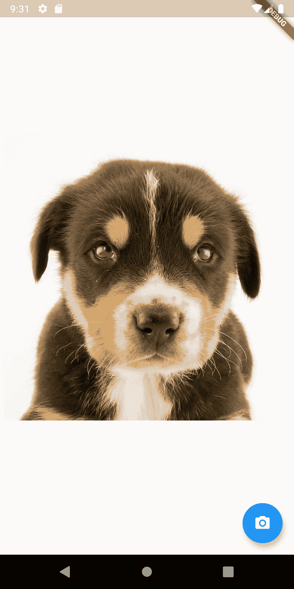

# 📸在 Flutter 中拍照并从图库中选择

> 原文：<https://levelup.gitconnected.com/taking-a-picture-and-selecting-from-gallery-in-flutter-908e75108d93>

照片由[威廉·拜罗伊特](https://unsplash.com/@wbayreuther?utm_source=unsplash&utm_medium=referral&utm_content=creditCopyText)在 [Unsplash](https://unsplash.com/@gvetri/likes?utm_source=unsplash&utm_medium=referral&utm_content=creditCopyText) 上拍摄

你好。我一直在一个应用程序中工作，要求从应用程序中拍照或从画廊中挑选照片。使用相机拍照有很多种方式。这次我们将使用 ImagePicker 插件。

作为第一步，我们需要添加新的插件到我们的依赖项中。在我们的 **pubspec.yaml** 中，我们将添加下一个插件:

*   **摄像头**帮助我们使用设备的摄像头。
*   **path_provider** 为我们提供了在设备中存储图像的正确路径。
*   **image_picker** 帮助我们从图库中选择照片。

在我们将它添加到我们的 **pubspec.yaml** 之后，它将看起来像这样。

# 添加一个最小的 Android SDK。

Flutter 相机插件只适用于 Android 中的 SDK 21 或更高版本。所以我们需要打开位于`android/app/build.gradle`的 build.gradle 文件并搜索行`minSdkVersion`。最后，我们需要将我们的 min SDK 版本从 16 升级到 21。如果你对 android 开发一无所知，这使得该应用程序只能在 Android OS Lollipop 或更高版本上使用。

这是做了更改后的样子。

# 让我们创建我们的第一个屏幕！

让我们创建我们的 **PhotoPreviewScreen** ，这是一个 StatefulWidget。一开始，它应该是这样的。

现在，我们将创建一个带有居中列的**脚手架**，在我们从图库中选择图像或从相机中拍照后，它将显示我们的图像预览。最后一步，我们将添加一个**浮动操作按钮**，它将显示选择对话框。

太好了！现在你可能会问 **_setImageView()** 和**_ showSelectionDialog(context)**是做什么的。 **_setImageView()** 是一个方法，当我们从图库中选取或从相机中获取的图像为空时，它会返回一个小部件。我们正在返回一个文本小部件，它有以下文本“请选择一张图片。”

**_ showSelectionDialog(context)**将显示一个带有两个选项的对话框，从图库或相机拍摄图像。让我们开始创建这个。此方法应使用函数 showDialog()并向其传递上下文和一个生成器，该生成器将创建一个带有标题和两个选项的 AlertDialog。

在 **AlertDialog** 构造函数中，我们将传递一个 **SingleChildScrollView** 作为内容，这是一个帮助我们滚动列表的小部件，作为这个小部件的子部件，我们将传递一个带有两个子部件的 **ListBody** ，这些子部件必须是一个 **GestureDetector** 来检测用户何时触摸文本。

每个 **GestureDetector** 子控件都将是一个文本小部件，分别包含“Gallery”文本和“Camera”文本，每个 onTap()方法都将是 **_openGallery()** 和 **_openCamera()** 。我们一会儿要创建的方法。你的**_ showSelectionDialog(context)**应该是这样的。

现在你的应用程序应该会显示这样一个对话框。

# 让我们使用那个插件。

现在让我们将逻辑添加到我们的 **_openGallery(context)** 方法中。我们首先要做的是创建一个名为 imageFile 的字段，它将是我们的 **_LandingScreenState** 类中的一个文件对象。创建之后，我们将使用 ImagePicker 函数**image picker . pick image()**向其传递枚举`**ImageSource.gallery**`该函数是异步的，因此我们将添加保留关键字 async 和 await，稍后我们将保存该变量并将其分配给我们的属性。作为我们的最后一步，我们将调用 **setState()** 方法来通知状态已经改变。

函数 **_openGallery(context)** 应该是这样的

_openCamera(context)函数几乎是一样的。我们唯一需要改变的是源代码，而不是 ImageSource.gallery。我们将使用 ImageSource.camera。这种简单性是我最喜欢这个插件的地方，非常简单。

# 显示预览

还记得当初那个 **_setImageView()** 吗？我们将验证 imageField 字段不为空，以返回一个 **Image** 小部件。如果图像字段为空，我们将返回一个**文本**小部件。

这就是结果。

这是你从图库中选择一张图片后，你的应用程序应该呈现的样子。

# 好了

我希望你喜欢它！如果你对更多扑/镖文章感兴趣，可以在社交上关注我，打个招呼！。

[**Instagram。**](http://www.instagram.com/codingpizza)

[**碎碎念。**](https://twitter.com/coding__pizza)

# [点击这里加入 codingpizza 简讯](http://eepurl.com/gcIboL)

*原载于 2020 年 3 月 5 日*[*【https://www.codingpizza.com】*](https://www.codingpizza.com/en/taking-a-picture-and-selecting-from-gallery-in-flutter/)*。*