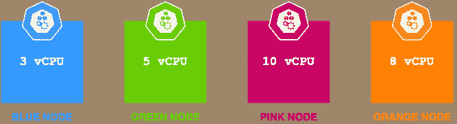
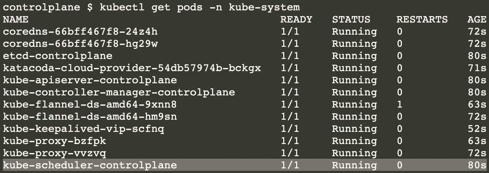
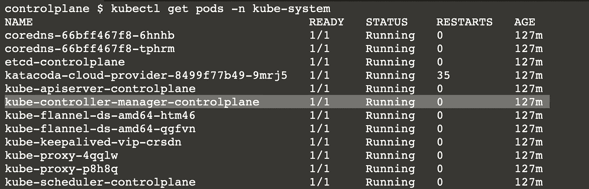
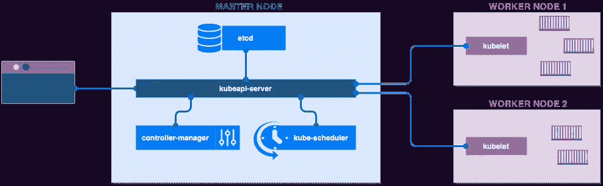

# 控制控制平面

> 原文：<https://levelup.gitconnected.com/taking-control-of-the-control-plane-30189b6706ec>

在[解开服务网](/untangling-the-service-mesh-24797e29eb92)和理解[ETCD——最简单的方式](https://medium.com/nerd-for-tech/etcd-the-easy-way-4c01e243f285)之后，让我们继续本系列的第三篇文章。这一次我们将关注 kubernetes 集群的一大块，即控制平面。

简而言之，控制平面是一组用于规划、管理、调度和监控群集其他元素的组件。它托管在群集的主节点上，从这里它与其余的工作节点进行交互。

那么，组成控制平面的这些组件是什么呢？

# 作文

一个基本控制平面有 4 个基本组件— etcd、kibe 调度程序、控制器管理器和 api 服务器。

## ETCD

正如在[上一篇博客](https://medium.com/nerd-for-tech/etcd-the-easy-way-4c01e243f285)中详细解释的那样，etcd 是一个分布式键值存储，存储关于集群的所有必要细节。这些数据是维护集群状态所必需的，也是所有`kubectl get`命令的重要来源。

在 etcd 中更新资源状态之前，对任何资源执行的所有操作都不会被视为完成。

## kube-调度程序

顾名思义，kube-scheduler 在不同的节点上调度容器。它根据容器对资源(如内存和 CPU)的要求、节点托管容器的能力、节点上已经运行的容器数量以及其他一些因素(如节点亲和力、污点和容忍度)来确定每个容器的正确节点。

调度器首先过滤掉没有足够容量来托管容器的节点。然后，它根据在剩余节点上调度 pod 后剩余的资源量对剩余节点进行排序。例如，假设有 4 个节点，CPU 容量分别为 3、5、10 和 8。



现在假设需要调度一个需要 6 个 vCPUs 的新容器。显然，蓝色和绿色节点无法处理它，因此被过滤掉了。
为了对剩余节点进行排序，计算调度容器后剩余的资源。这使得粉色节点的值为 4 vCPUs，橙色节点的值为 2 vCPUs。因此，粉色节点比橙色节点获得更高的等级，如果没有其他策略或规则阻止它，容器将被调度到粉色节点。

如果您使用 kubeadm 来设置集群，那么 kube 调度程序已经存在，作为一个 pod 运行。



但是如果你正在从头开始建立一个集群，你可以从发布页面下载二进制文件，并使用[这些命令](https://kubernetes.io/docs/reference/command-line-tools-reference/kube-scheduler/)解压运行它。或者，您可以编写您的调度程序，它将按照您指定的逻辑进行调度。为此，您必须与绑定 API 交互，并使用 pod 的 POST 调用设置`nodeName`的值。

## 控制者-管理者

对于维护 kubernetes 集群所需的几乎所有组件和主要功能，都有一个控制器。

> 将它们全部命名为— attachdetach、bootstrapsigner、cloud-node-lifecycle、clusterrole-aggregation、cronjob、csrapproving、csrcleaner、csrsigning、daemonset、deployment、disruption、endpointslice、endpointslicemirroring、prosper-volume、garbagecollector、horizontalpodautoscaling、job、namespace、nodeipam、nodelifecycle、persistentvolume-binder、persistentvolume-expander、podgc、pv-protection、pvc-protection、replicaset、replicaset

这需要很多控制器，需要有人来管理它们。这是由集群中运行的单个进程完成的。



默认情况下，它管理除 bootstrapsigner 和 tokencleaner 控制器之外的所有上述状态控制器，但是如果您手动部署控制器管理器，您可以使用`--controllers`选项选择特定的控制器，如这里的[所述](https://kubernetes.io/docs/reference/command-line-tools-reference/kube-controller-manager/)。

那么这么多控制器有什么用呢？
控制器持续监控给定组件的状态，并努力使组件的状态达到所需状态。让我们以其中的几个为例
**节点控制器** —它每 5 秒检查一次节点的状态(节点监控周期)。如果一个节点没有响应，那么它会等待 40 秒的宽限期来响应。等待 40 秒后，如果该节点仍然不可达，则该节点将被标记为不可达。一旦标记为不可访问，节点控制器会再等待 5 分钟(逐出超时)以使节点恢复。如果它无法恢复，则作为副本集一部分的该节点上托管的 pod 将被重新调度到其他节点上
**复制控制器** —监控所有副本集中 pod 的状态。当容器由于不健康或报废的容器而低于最小限度时，复制控制器发出命令来创建新的容器，以便保持容器的期望数量。

## kube API-服务器

kubernetes 集群中所有管理组件之间的通信基于中心辐射模型，kubeapi-server 位于其中心。



kubeapi 服务器以多种方式用于实现不同的功能。外部用户使用它通过像 kubectl 这样的 API 包装器与集群进行交互。控制器也用它来监视不同资源的状态。工作节点使用 kubelets 与主节点通信，这种通信是通过 kubeapi-server 完成的。

> **快速事实检查:**
> kube let——运行在每个工作者节点上的进程，充当与主节点的所有通信的端点。它还负责按照 kube-scheduler 的指示在节点上创建 pod

通常，与 kubeapi 服务器的所有通信都发生在 HTTPS(端口 443)上，并且启用了一种或多种形式的身份验证。理想情况下，应该为节点提供集群的公共根证书，以便它们可以使用有效的客户端凭证安全地连接到 apiserver。
然而，以下从 apiserver 到节点、pod 和服务的连接是通过普通 HTTP 进行的。

# 设置

设置控制平面是创建 kubernetes 集群的第一步。要使用`kubeadm`设置控制平面，只需运行

```
kubeadm init
```

您可以选择使用 DNS 提供商或使用`--control-plane-endpoint`选项的负载平衡器来公开控制平面。当您有多个控制平面节点以实现高可用性和弹性时，可以使用这种设置。要参考定制配置的其他选项，请在此处选择。

完成后，该命令将输出一个`kubeadm join`命令，您应该注意这个命令，因为它将用于将新节点加入集群。

现在你有了，你的控制平面设置好了。

# 离别赠言

至此，我们完成了本系列的第三篇博客。希望它能帮助您理解 kubernetes 集群的概念和另一个组件。下次见！