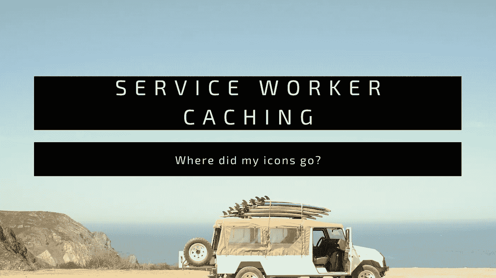
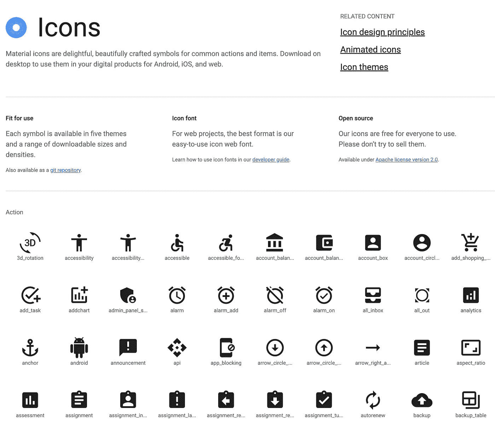
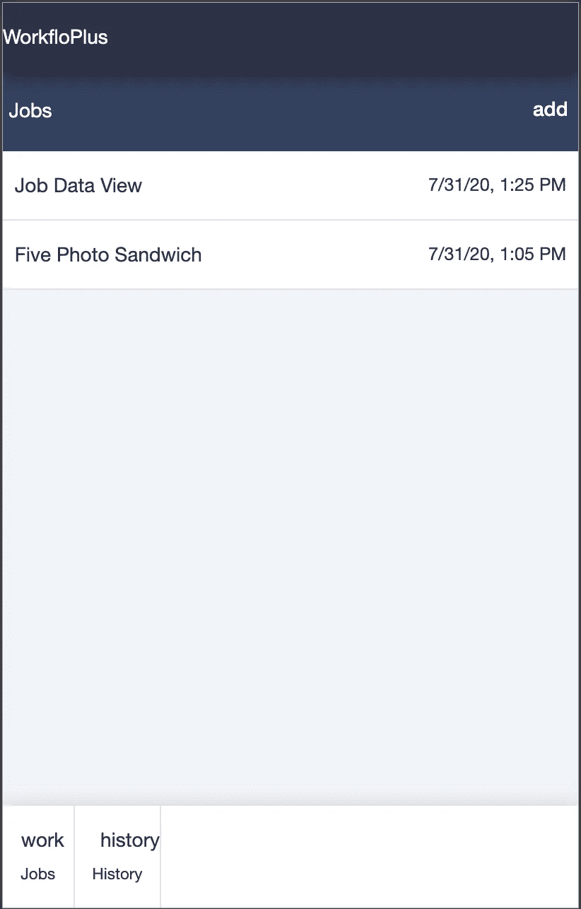
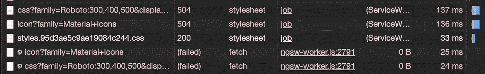
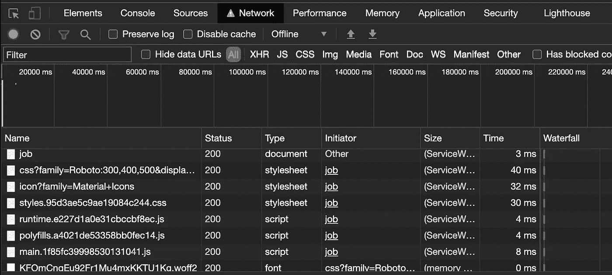
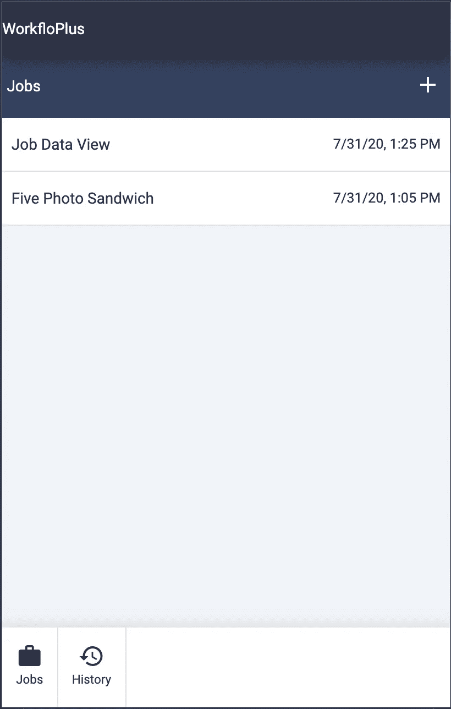

# PWA 服务人员提示—角形材料图标

> 原文：<https://levelup.gitconnected.com/tales-from-the-angular-service-worker-pt-1-material-fonts-90c300f81de5>

修复 PWA 的离线图标缓存



最近，我一直在[角服务人员](https://angular.io/guide/service-worker-intro)内工作。如果您想轻松地为您的 PWA 提供离线优先浏览体验，它提供了一个非常棒的开箱即用的服务工作者实现。

而且，这真的很棒，直到…

> 当我离线时，我的材料图标不显示。

这篇文章描述了我的旅程和决心。享受吧。

# 什么是服务人员？

这是一个相当大的话题，但是，简单地说:

> 服务工作者是在您的网站中运行的后台脚本，提供与网络相关的服务，如缓存、后台同步、推送通知等等…

大多数浏览器现在都支持服务工作者(hurrah ),他们是任何有自尊的渐进式 Web 应用程序的核心租户。

服务人员是一个 javascript 文件，当您的页面加载时，您可以“安装”它。然后，浏览器将在一个单独的线程中运行服务工作器。

*我想我会再写几篇关于服务人员的文章，所以我希望在接下来的几个月里扩展这个话题。*

# 棱角分明的服务人员

使用 Angular CLI 实现服务工作者非常容易。从版本 5 开始，Angular 包括了一个功能性的服务人员，开箱即用！你需要做的就是:

```
ng add @angular/pwa
ng build — prod
// Profit
```

这样做之后，一个服务人员将为您注册，并开始缓存您的整个应用程序。如果用户离线，那么该页面将仍然存在。而且，当他们返回到您的应用程序时，它会立即加载，因为服务人员已经缓存了您的整个应用程序。

但是，如果您决定“自己开发”服务人员(您没有义务使用 Angular 提供的实现)，那么您需要自己实现所有的缓存逻辑。所以，棱角分明的服务人员为你做这些真的很方便，你不需要拿起一把钥匙。

## 资产

默认情况下，Angular service worker 将缓存以下文件:

```
/assets/**, // **Anything in the assets directory**
/*.(eot|svg|cur|jpg|png|webp|gif|otf|ttf|woff|woff2|ani)
/favicon.ico
/index.html
/*.js
/*.css
/manifest.webmanifest
```

一般来说，这意味着*你应用程序中的任何*静态文件都将被服务人员缓存。

那么，c̶a̶c̶h̶e̶有什么阴谋？

## 角状材料

一个非常简单的库可以帮助你在你的应用上创建一个谷歌材质设计 UX，它就是 [Angular Material](https://material.angular.io/) 。这附带了一些简单(和先进)的组件来活跃你的网站。此外，它还捆绑了真正有用的[材质图标库](https://material.io/resources/icons/?style=baseline)。



许多可用图标中的一些

找到喜欢的图标后，只需使用:

```
<mat-icon>article</mat-icon>
```

*注意，确保你将* `*MatIconModule*` *导入到你的* `*app.module*` *文件中以使其工作。*

这很有效，直到你离线尝试。因为，即使 Angular service worker 缓存了所有的静态文件，字体(图标所依赖的)也有自己的思想。



我可爱的图标去哪里了？

# 问题空间

将角度材质添加到项目中时，CLI 会通过以下方式更新项目:

*   NPM 安装所有需要的模块
*   更新您的 SCSS 以使用合适的材质主题
*   给你的*index.html*文件添加字体<link>标签

当您的 Angular 项目构建完成时，一切都被很好地捆绑(通过一些 Webpack 技巧)到一个单独的 *main.js* 文件中。并且，你的样式被放到一个 *styles.css* 文件中。根据您的构建模式(prod 或 dev ),您可能还会得到一个针对生产优化的难看的缩小文件。

然而，如果你仔细检查你的*index.html*，你会看到进口的款式是:

```
<link href="https://fonts.googleapis.com/css?family=Roboto:300,400,500&amp;display=swap" rel="stylesheet">
<link href="https://fonts.googleapis.com/icon?family=Material+Icons" rel="stylesheet">
```

因为这些在技术上并不*。css 文件，Angular service worker 跳过它们，不缓存它们。所以，如果你偷看 Chrome 开发工具，你会看到这些错误。



这些不是你要找的字体

原来，在快速挖掘之后，棱角分明的服务人员提供了一些配置选项。但是，快速转移为“互联网”有其他建议。

# 捆绑材料图标

从与谷歌博士的咨询中，相当多的人建议将 NPM 图标材料打包到这个项目中。虽然这是可以做到的，但我真的不喜欢这样的声音。

是的，字体将被捆绑并包含在我的可分发文件中。但是，这无疑会增加我的包的大小，增加我可能不一定需要的东西。

由于我更喜欢网页浏览器处理从谷歌 CDN 下载字体的想法，我决定寻找一个不同的选择。

# 定制缓存

当你在 Angular 项目中添加一个服务人员时，就会包含`ngsw-config.json`文件。这将告诉服务人员您的应用程序应该采用什么样的缓存策略。它包括上面添加的所有选项，但还包括指定其他文件的选项。

如果您将您的 URL 部分更改为如下所示，那么服务人员现在将缓存材料中的所有字体和图标。

```
"urls": [
          "[https://fonts.googleapis.com/**](https://fonts.googleapis.com/**)",
          "[https://fonts.gstatic.com/**](https://fonts.gstatic.com/**)"
        ]
```

这些行实际上是告诉服务人员自动缓存来自 Google Fonts CDN 的任何文件(它使用两个域)。因此，当你的应用第一次访问这些位置时(它会在第一次加载时访问)，服务人员就会施展魔法。

通过这样做，服务人员将照顾所有的谷歌字体，即使你离线！



离线浏览—由服务人员提供缓存的样式表和字体

而且，结果正是你所期望的。



图标，不出所料。

# 结论

我真的很喜欢解决这个问题。这让我更加欣赏服务人员，我当然也很感激 Angular 提供的开箱即用服务人员所提供的彻底实现。

当然还有更多的文章可以发表在 PWA 和 Angular 上。让我们看看这会把我们带到哪里。