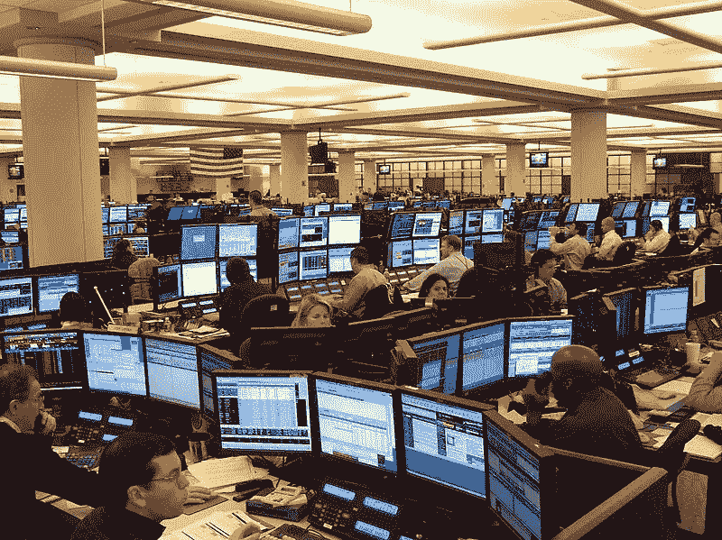

# 交易大厅的故事

> 原文：<https://levelup.gitconnected.com/tales-from-the-trading-floor-1a943b62851b>

## 为华尔街之狼编写软件的有趣和恐怖的故事！

由 [Wiki commons](https://commons.wikimedia.org/wiki/File:A1_Houston_Office_Oil_Traders_on_Monday.jpg) 提供的交易台视图

我在其中一些交易大厅工作过，就像上面的照片一样。在显示器和尖叫的销售和交易的迷宫中，坐着一个像我一样谦逊的程序员。

环境相当势利，由大人物操盘(赚所有的钱)——其他人都在那里为赚钱的人服务。你可以有麻省理工的物理学博士学位，但对交易者来说，你和电话助手或倒垃圾的人没什么区别。

我有很多这样的故事，但这里有几个:

## 1.下午 5 点的会议

有一个期货交易者，我们必须得到技术变革的批准。向交易员展示屏幕并获得口头确认需要 2 分钟。

上午 8 点:“太忙了市场就要开始了”

中午 12 点:“太忙了，下午 5 点收市后再来”

下午 5 点 05 分:他走了…他今天已经离开了

这种类型的例行公事是典型的，因为他们不太关心你的 UAT 和发布时间表。我不得不从下午 4 点 45 分到他的办公桌前，耐心地等待..然后在下午 5 点市场关闭时，他转向我说:“等一下，让我用一下厕所”。我有一种不好的预感…你可以猜到接下来的故事。我最终找到了他…

## 2.最终请求

我曾经遇到过一个债券交易员，他要求对一个新的首次展示进行一系列修饰性的改变——比如将按钮移动几个像素，或者改变标签和列宽。在一个周四，我们见面了，他讨论了他认为****必须改变**的 3-4 件事——所以我们开始着手制作它的原型，供他在周五审阅。**

**星期五来——他不在座位上。我们四处打听，“托德今天出去了吗？”沉默…原来**他辞职了！那家伙一定知道他第二天就要辞职，但却浪费我们的时间给我们新的要求？？这种情况经常发生，我们得到需求，用户退出——但是一天之后，这是一个记录！****

## **3.因为进展缓慢而被责骂**

**交易风险负责人打电话给我，开始咆哮，说他在过去的两周里没有看到任何进展。他问我一直在做什么，团队在做什么？到底是什么花了这么长时间？**

**我能够回答一些问题，但它在咆哮中迷失了。我挂了电话，焦急地想着他是否会打电话给我的老板。**

**一个小时后，那个人给我回电话说，哎呀，对不起，我看到你所有的邮件更新都在我的垃圾邮件文件夹里。银行业教会你的一件事就是脸皮要厚——现在我已经离开了银行业，当人们对我发脾气时，我甚至都不会注意到。**

## **4.生产缺陷**

****

**照片由[亚采克·乌林斯基](https://unsplash.com/@juli63?utm_source=medium&utm_medium=referral)在 [Unsplash](https://unsplash.com?utm_source=medium&utm_medium=referral) 上拍摄**

**我们有一个配置错误，在 PROD 中的一个字段上留下了一个测试标志。这是因为部署依赖于部署时的配置更改$ENV={PROD|TEST}。实时市场上的漏洞很严重——你会赔钱或者和联邦政府有麻烦——这两种情况都会惹恼合规和交易。**

**这一次，自交易所要求标记不正确的交易标志以来，我们都在遵守规定。有被交易所暂停交易的风险——这是一件大事。10 次会面后，他们要我保证这种事不会再发生。他们还说，虽然 1)我们不能在生产中测试，2)我们必须确保它在生产中工作。我不想太聪明，所以我说好吧，是的…虽然我在想薛定谔的猫，你永远不会知道，直到你在 PROD 中运行它…这就是在脸书上编码的好处——当然他们有 5 亿用户，但你可以用几千人进行金丝雀测试，没有人真正关心..**

## **5.认为自己还能编码的经理**

**我们有这样一位高级经理，甚至是董事总经理，我猜他曾经是技术人员，当股票系统出现大问题时，他决定亲自解决这个问题。**

**他开始打印出大约 200 页的代码(我猜他是守旧派)，然后把自己锁在办公室里一个星期。我实际上不记得之后发生了什么，但是很明显，他没有找到也没有修复这个 bug。但这是一个有趣的故事——我希望他循环使用打印输出。他最终辞职或被解雇了…**

## **6.我没有按按钮！！**

**我们有一个交易系统，交易者在 RFQ 系统上“接受”客户的交易(他得到“报价请求”，并有一个最终的“批准或拒绝”按钮)。该交易员声称，最终的“批准”按钮从未弹出，系统错误导致他在这笔交易中亏损！**

**我们在日志中什么也没发现(不是说日志告诉你一个按钮是否弹出)。所以我告诉 compliance，我不能证明弹出窗口没有发生，但这就像说我单击了电源按钮，但什么也没有发生(诚然，有时在这种情况下什么也没有发生)。但是这个系统已经运行了一段时间，所以不太可能有如此明显缺陷。**

**然而，这位交易员态度坚决，与技术和合规斗争到了几乎让自己被解雇的地步。在这之后，他对 Tech 非常生气(直到他最终被解雇，谢天谢地)。我建议合规部在未来安装摄像头，这样我们就可以验证每一次鼠标点击和按键操作…**

## **7.我也没按按钮！**

****

**汤姆·威尔森在 [Unsplash](https://unsplash.com?utm_source=medium&utm_medium=referral) 上的照片**

**第二个按键故事！一天早上，我们发现一些神秘的交易在晚上进入。该交易员声称他没有做这些(亏损的)交易，但日志显示交易是在他的电脑上完成的。调查:**

*   **进出日志证明交易者在交易前离开了大楼**
*   **交易者没有退出(过去这很常见，因为他们有市场监控屏幕，而且一直开着)**
*   **入口日志显示清洁人员在交易前进入…**
*   **结论——清洁工触摸了键盘并执行了交易！？(或者她坐下来开始交易？？)**

**真的吗？？很难相信，但合规决定清洁女工在清洁时触摸了键盘，这成为不注销的结局。注意，当偶然的交易产生利润时，这种事情从来不会被报道。**

## **8.你不知道这个系统是如何运作的？？？**

**我是交易者的新手，当首席交易者问我什么有效时，我的回答是:“我认为系统向上舍入了”，他惊呼“什么？你说认为是什么意思？你不知道？?"—让我焦虑不安，然后回去更详细地确认事情。**

**这实际上是一个很好的教训——我们应该知道，而不是猜测——尤其是涉及到金钱的时候。或者至少我们应该假装知道。需要注意的是，如今这些系统非常复杂，一个人想要真正了解一个系统是如何工作的变得越来越难。所以这有点不公平——就像你真的不知道 pyfork.c 中的第 278 行做了什么？？呃…**

**我可能太冷酷和讽刺了。交易大厅实际上是一个非常有趣和快节奏的地方，但它充满了与电影只有一发之差的华尔街人物。实际上，我很享受在交易大厅的日子里每天的滑稽动作，并对它们有着美好的回忆(也许还有一些噩梦)。**