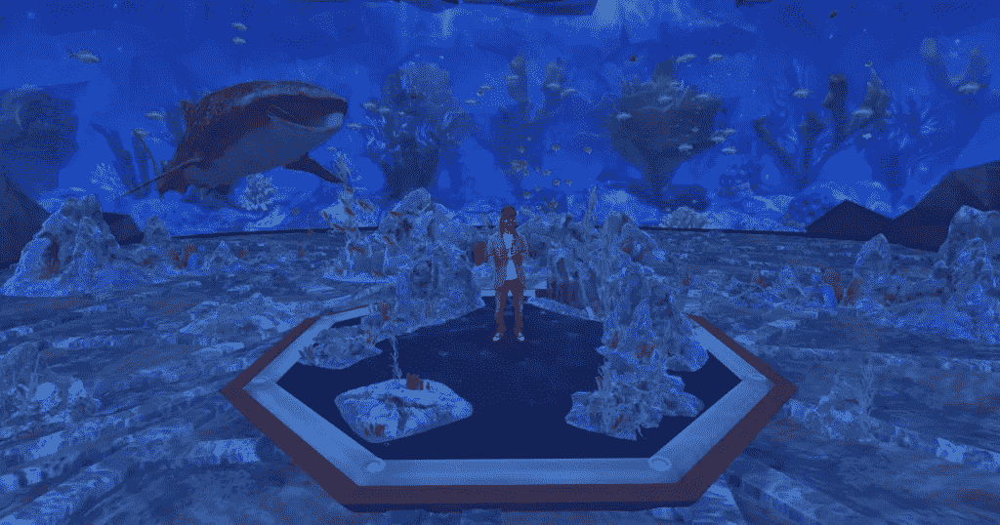
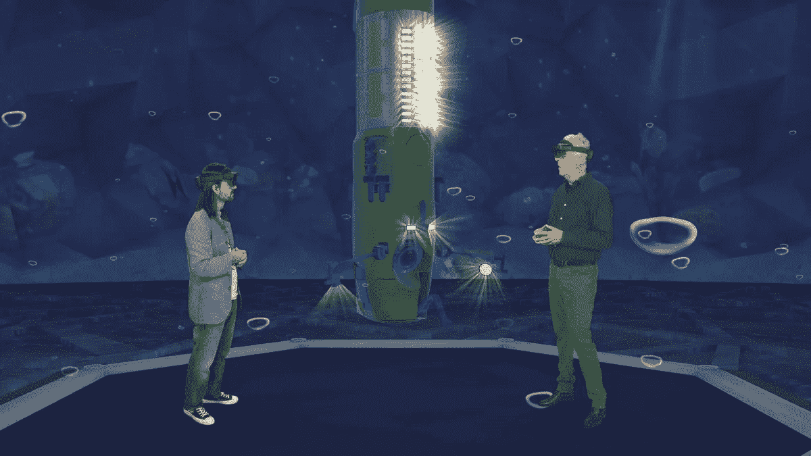
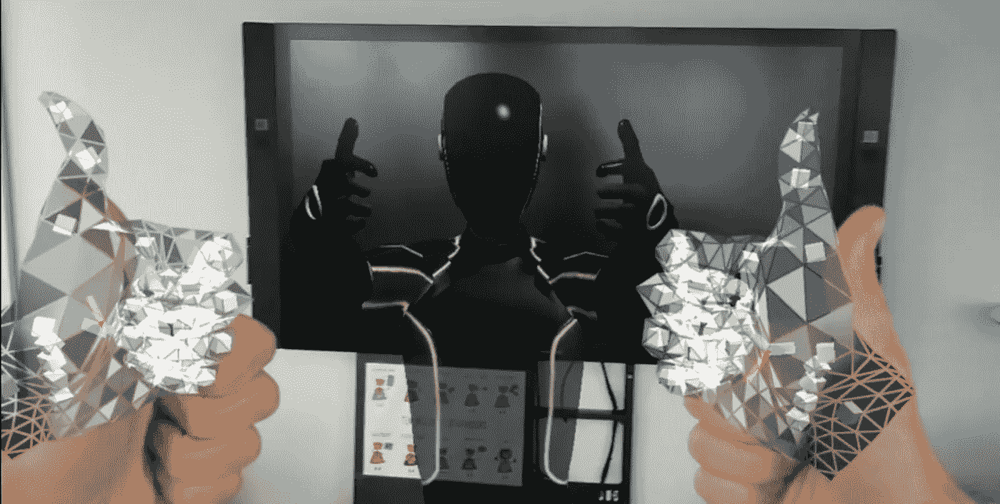
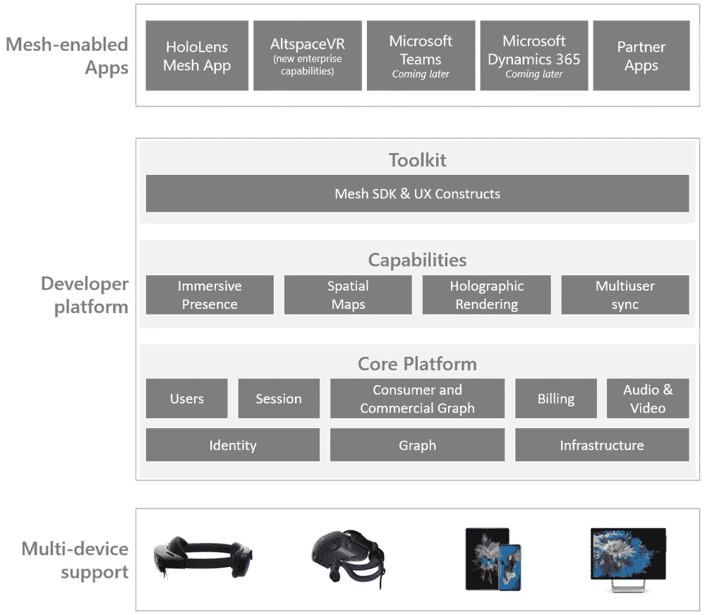
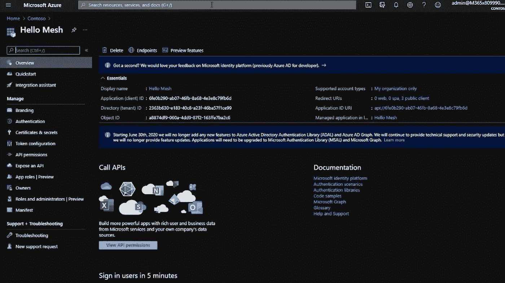
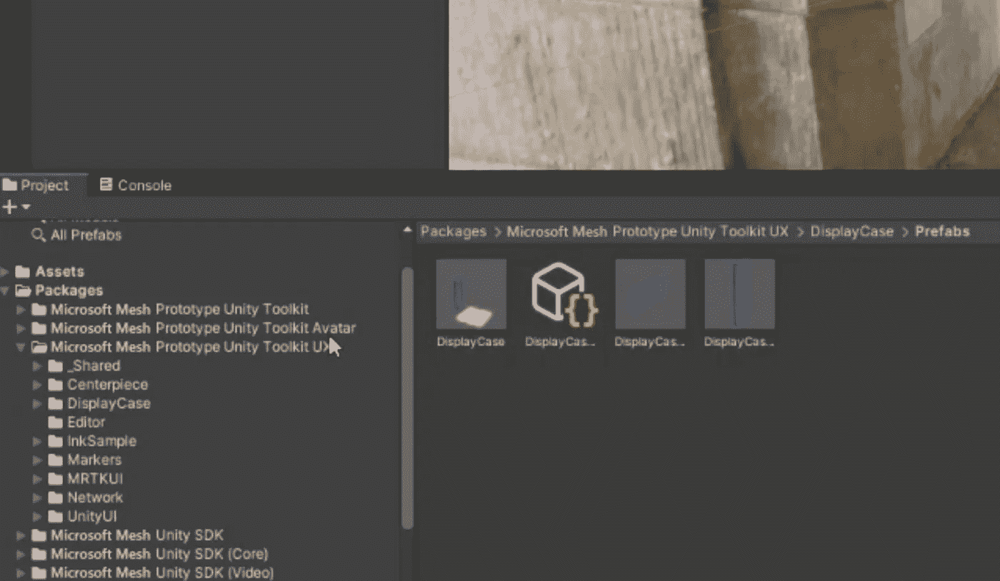
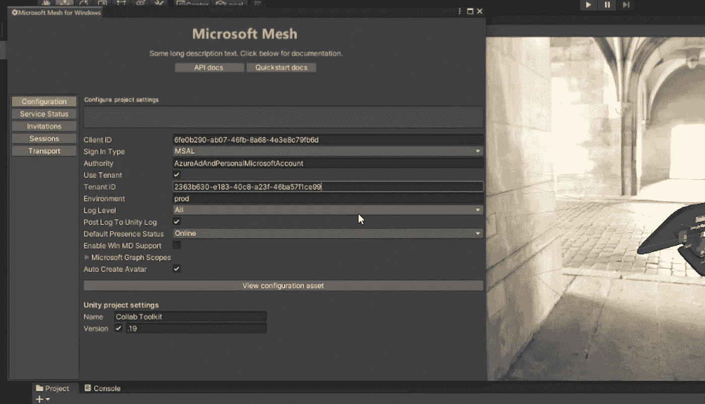

# 从开发人员的角度谈全新的微软网格平台

> 原文：<https://levelup.gitconnected.com/talk-about-the-brand-new-microsoft-mesh-platform-from-a-developers-perspective-3ded4d951303>

作为一名 Unity/Azure 开发者，我非常兴奋地看到微软在 Ignite 大会上宣布了他们全新的微软网格平台。

Ignite keynote 是在 [AltspaceVR](https://altvr.com/) 中创建和交付的，并由使用早期网格工具构建的体验提供支持。他们很快发布了适用于 HoloLens 2 的微软 Mesh 预览应用程序，因此 HoloLens 2 用户现在可以体验由 Mesh 平台支持的应用程序。

然而，作为一名开发人员，我渴望从开发人员的角度了解这个有趣的平台。以下是我收集的信息和一些想法，我想与你分享。

# 为什么选择微软 Mesh？

所以第一个问题是为什么微软向客户/开发者介绍网格平台？这真的有必要吗？

实际上，Mesh 平台主要是为**多用户 MR 应用**搭建的。在开发多用户 MR 应用程序时，您可能会遇到一些问题。

例如，在地理上分散的会话中同步动作和表情是复杂的，并且很难在 MR 应用程序中带来高保真的 3D 模型/逼真地表现人。当你创建一个多用户应用时，这些是真正的挑战。我认为微软根据 VR Ignite 主题演讲解决了其中的一些挑战。正如你在下图中看到的，詹姆斯·卡梅隆从新西兰加入了主题演讲！

*微软与詹姆斯·卡梅隆的 Ignite VR 主题演讲。*图片:微软

为什么不是所有这些挑战都被“解决”了？因为作为一名开发人员，我仍然对 keynote 中 3D 立体捕捉的要求感到好奇。

正如你在上面的视频中看到的，3D 捕捉令人印象深刻，很可能是在微软混合现实捕捉工作室捕捉的。而且这些类型的设备价格昂贵，并不适合所有的开发者。

 [## 在混合现实捕捉工作室将生活带入混合现实

### 如果你拍过视频，你会对我们的拍摄过程感到熟悉。我们在指导您的…

www.microsoft.com](https://www.microsoft.com/en-us/mixed-reality/capture-studios) 

或者，您可以选择使用头像来呈现该人。

# 微软 Mesh 是什么？

那么，另一个问题是微软 Mesh 是什么？

说实话，当我在 ignite 大会之前第一次听说这项技术时，内容是在 [AltspaceVR](https://altvr.com/) 中创建和交付的。认为这项技术是一种应用程序可能会产生误导。实际上，不仅是 AltspaceVR，连 HoloLens 2 的微软 Mesh 预览应用都是支持 Mesh 的应用，而不是 Mesh 平台本身。

正如你从下图中看到的，有一些支持网格的应用程序可用，网格平台支持多种设备，我认为这是因为大量的计算将在 Azure 云上完成。而作为一个 Azure/Unity 开发者，我最关注的是中间部分——**开发者平台**。

Mesh 开发者平台建立在 Azure 之上，你可以在图中的**核心平台**部分找到一些熟悉的词汇，比如身份、图、基础设施等等。Mesh 提供的功能包括沉浸式呈现、空间地图、全息渲染和多用户同步，可以解决我上面提到的挑战。

从开发人员的角度来看，开发人员使用最多的仍然是 Mesh SDK，在图中的**工具包**部分。Mesh 提供了一个跨平台的开发者 SDK，就像微软的混合现实 SDK 一样，支持 Unity，native C++，C#。

然而，Mesh SDK 目前处于有限的私有预览中。希望微软能尽快向大家开放，虽然可能需要几个月的时间。

# 我们如何使用微软 Mesh 开发自己的产品？

而最后一个问题是，我们如何利用 Mesh 平台开发自己的产品？尽管 Mesh SDK 仍然处于私有预览阶段，但是，从 Azure/Unity 开发者的角度来看，我发现它与微软之前提供给 Unity 开发者的其他 SDK 非常相似。

对于 Azure 部分，我们应该在 Azure 上创建一个新的 App 注册，将 Mesh SDK 连接到云端，我们可以获得稍后将在 Unity 的 SDK 中使用的客户端 ID 和租户 ID。

对于 Unity 部分，除了核心工具包，看起来微软还分别为《阿凡达》和《UX》提供了包。

然后，我们可以在 Unity Editor 中打开一个 Microsoft Mesh 面板，并从应用程序注册中提供客户端 ID 和租户 ID 来连接到云。

实际上，因为 Mesh SDK 仍处于私人预览阶段，所以我不知道更多关于使用 Mesh SDK 开发的细节，但正如我之前提到的，它看起来像微软之前提供给 Unity 开发者的其他 SDK。

# 结论

Microsoft Mesh 平台旨在帮助开发人员构建自己的多用户 MR 应用。从我的角度来看，Mesh 平台很好地解决了多用户同步的挑战，并提供了一个有趣的化身系统。

然而，我相信制作 Ignite VR keynote 上展示的令人惊叹的 3D 捕捉是要花钱的，而且它并不适合所有开发者。

它建立在蔚蓝色之上，站在巨人的肩膀上。但是目前，SDK 仍然没有提供给开发者。我期待着用它自己开发一些应用程序。AltspaceVR 和用于 HoloLens 2 的微软 Mesh 预览应用很酷，但它还需要更多的案例来证明它的成熟。

总之，微软 Mesh 平台对于多用户 MR 应用来说是一个很有前途的解决方案，希望微软能把它开放给大家，不要等太久。: )

感谢您的阅读，希望对您有所帮助。

在聊天

 [## 陈家东-高级软件开发人员-X 公司| LinkedIn

### 起亚·奥拉，我是个有经验的人。NET/Unity/Azure Developer @ Company-X 而我是 2015 年 10 月起的微软 MVP。之前…

www.linkedin.com](https://www.linkedin.com/in/chenjd/)