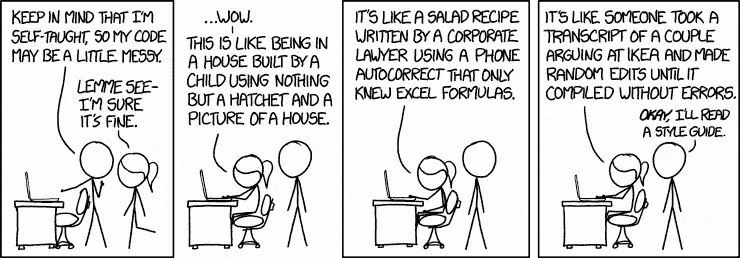

# 驯服你内心的 Javascript

> 原文：<https://levelup.gitconnected.com/taming-your-inner-javascript-1d48c1bd365a>

如何控制前端项目中的代码库

## TLDR；

> 用预提交挂钩检查代码样式。用预推挂钩检查代码覆盖率。务实一点，把感情放在一边。

# 问题是

Javascript 是最受欢迎的语言之一，在调查中有 60%以上的市场份额。作为一门语言，它非常灵活，允许许多不同的编码风格和方法，但这是有代价的。即使你拿了打字稿之类的东西，也有很多需要解释的地方。

如果你不够小心，项目在 loc、依赖项和人力资源中增长，代码库最终会变得一团糟。在一个项目中，不止一种编码风格是很常见的，每个新人做的事情都会略有不同。

这是灾难的最佳配方，我认为最有问题的方面是非常低的团队士气，因此是次优的产品。

从 https://xkcd.com/1513/[借来的](https://xkcd.com/1513/)

# 解决方案

一个非常简单而优雅的方法是**用 GIT 钩子**强制代码风格和代码覆盖率。这种方法足够灵活，因为任何项目都可以适应这些原则，而不管其背后的技术栈。重要的目标是我们最终想要降低认知负荷，提高质量和可维护性，并最终让每个人都更快乐。

最受欢迎的选择是 [ESLint](https://eslint.org/) 搭配[更漂亮的](https://prettier.io/)。已经有很多文章介绍了如何配置这些工具，所以我现在不再重点讨论这个话题。需要记住的是**结合 GIT 钩子**使用这些工具。我喜欢在我们自己的项目中使用的一个推荐模式是**使用一个预提交和一个预推挂钩**。

## 提交前挂钩

在这里，您应该检查进入您的代码库的所有内容是否都是正确的。在 package.json 中设置一个 **lint:fix** 脚本，每当有人想要添加一个提交时，就会触发这个脚本。它将自动重新格式化，并检查所有符合约定标准的内容。

自动化通过 [Husky](https://github.com/typicode/husky) 和 [Lint Staged](https://github.com/okonet/lint-staged) 完成。只需将它们添加到您的项目中，并根据下面的代码片段进行配置。不要忘记设置您的 IDE 在每次保存文件时运行 lint:fix。

[https://gist . github . com/filipcieker/9185d 14 ee 5 D1 E1 d 12 e 20 b 841 a6 cf 15 fc](https://gist.github.com/filipcieker/9185d14ee5d1e1d12e20b841a6cf15fc)

## 预推钩

您应该检查您的代码覆盖率是否符合标准。在预提交钩子中检查这一点可能会太死板，会让很多人抱怨。另一方面，等待云中的管道告诉某人他没有为新功能编写足够的测试是浪费时间和资源。

缩短反馈周期，并在每次推送之前运行单元测试。我通常通过 [Jest](https://jestjs.io/) 和一个定制的测试脚本定义有一个默认的测试观察器，这与我的 package.json 中的 CI/CD 管道中发生的事情完全相同。

[https://gist . github . com/filipcieker/9185d 14 ee 5 D1 E1 d 12 e 20 b 841 a6 cf 15 fc](https://gist.github.com/filipcieker/9185d14ee5d1e1d12e20b841a6cf15fc)

# 结论

使用这些原则时，我遇到的最大问题是自我。我的自我。我在使用类似于[sonar cube](https://www.sonarqube.org/)的工具时也遇到了同样的问题。他们只是对我们开发人员所犯的错误非常诚实。

经理和销售部门会告诉你跳过技术和流程投资。但你永远不要忘记，从长远来看，它总会回来咬你。

永远不要退而求其次，而是要务实。

借自[https://xkcd.com/927/](https://xkcd.com/927/)

> 让“不核实”的旗帜在你痛苦和绝望的时候指引你。