# 使用 Vue.js 的任务管理应用程序—第 1 部分

> 原文：<https://levelup.gitconnected.com/task-management-application-using-vue-js-part-1-df607ca30f48>

# 介绍

在[使用 vue.js](https://medium.com/@_shirish/thinking-in-components-with-vue-js-a35b5af12df) 思考组件中，我们了解了 vue 组件以及如何使用它们来创建 web 应用程序。在这篇文章中，我们将学习如何使用 Vue.js 构建一个类似于 Trello 的**任务管理应用**。

这个应用程序允许你使用一个董事会直观地管理项目和任务。一个董事会代表一个项目。一个董事会包含一个或多个名单。每个列表代表任务的类别，如`Todo`、`Doing`和`Done`。您可以通过拖放来更改列表的顺序以及列表中任务的顺序，还可以将任务从一个列表移动到另一个列表，以便在项目经过不同阶段时对其进行管理。

请记住，这不是一个循序渐进的教程。本文的主要目标是帮助您了解设计复杂用户界面的幕后过程，并逐步学习一些高级主题，如拖放界面、使用 Vuex 的状态管理、Form Validation、Custom Vue.js Plugin、Bundle 优化。

## 我们将建设什么？

这是完整应用程序的屏幕截图。

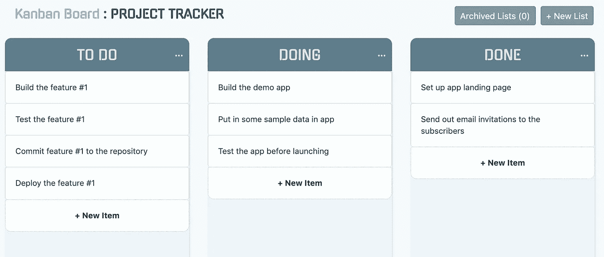

任务管理应用程序

**应用演示:**

*   关于浪涌。sh—[http://看板-电路板-演示。浪涌。sh](http://kanban-board-demo.surge.sh)
*   关于 netlify.com—[https://task-management-app.netlify.com](https://task-management-app.netlify.com/)

**Github 储备库:**[https://github.com/techlab23/task-management-app](https://github.com/techlab23/task-management-app)

## 应用特性

这是一个多页应用程序，从一开始就实现了丰富的功能集。下面是此应用程序的功能列表。

**董事会**

允许用户，

*   在控制面板中查看现有板
*   存档和恢复董事会
*   查看个别董事会内容
*   创建新董事会
*   编辑现有董事会信息

**列表**

允许用户，

*   创建新列表
*   编辑列表名称
*   存档和还原列表
*   使用拖放重新排列板中的列表

**清单项目**

允许用户，

*   在列表中创建新项目并更新现有项目
*   通过拖放重新排列列表中的项目
*   使用拖放在列表之间移动任务

## 你会在这篇文章里学到什么？

*   如何将用户界面分解为更小的组件？(也称为组件思维)
*   如何构建可重用的组件？
*   如何使用事件总线进行组件通信？
*   如何使用 Vuex 管理应用程序状态？

# 组件思维

构建更大更复杂的用户界面需要大量的前期思考和对底层框架的良好理解。

在基于组件的设计中，有两种类型的组件，`specialised`和`generic`。专用组件是为一个特定的目的而构建的，而通用组件封装了通用的行为或功能。通用组件促进可重用性。请注意，如果需要，通用组件可以用于构建专用组件。

在软件开发方法论中，你可以使用`Top-down`或者`Bottom-up`方法来构建更大的用户界面。

在`Top-down`方法中，你首先构建高层组件，然后将它们分解成更小的专业或通用组件。使用这种方法，您可以渐进式地设计用户界面，并在单个组件上实现应用程序功能。这种方法通常更受精益敏捷团队的青睐。

而在`Bottom-up`方法中，首先构建一组通用组件，然后用它们构建专用组件，最后用特定组件构建整个用户界面。这种方法需要对底层技术有深入的理解，并且通常是有经验的开发团队的首选。

在构建这个应用程序时，我使用了自顶向下的方法，这样我就可以逐步构建应用程序，并逐个功能地实现。为了直观地向您展示，下面是应用程序中组件的组成。

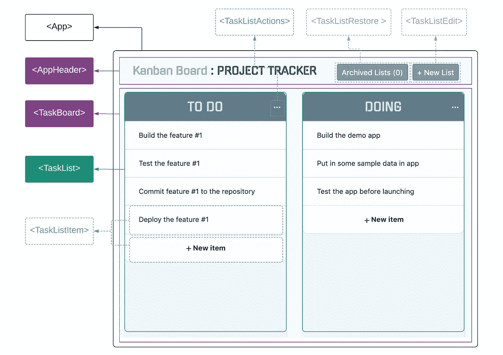

组件的组成

## 采用自上而下的方法

在第一轮开发中，我开始构建专门的高级组件，如`AppHeader`、`Dashboard`和`TaskBoard`、`AppLoadingIndicator`组件。

除了这些组件，我还使用`Vue-Router`配置了应用程序路由，将`Dashboard`和`TaskBoard`显示为页面。

然后在第二轮，我重构了`TaskBoard`组件，构建了`TaskList`、`TaskListItem`组件，并实现了&拖放功能，以完成关键功能。

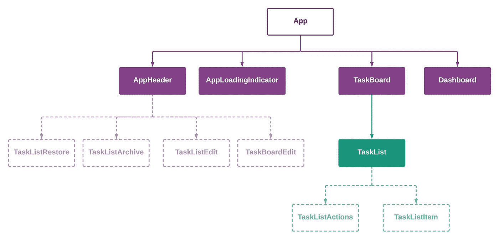

组件层次结构

一旦完成了关键特性，那么在第三轮重构中，我开始通过设计剩余的专门组件来处理剩余的特性，例如`TaskListRestore`、`TaskListArchive`、`TaskListEdit`、`TaskBoardEdit`和`TaskListActions`。

在我完成了用户界面的第一稿后，我重新审视了组件，并开始寻找通用行为来提取和构建通用组件，以便我可以重用逻辑。

在这一轮的重构中，我把常见的行为提取出来，分离成一个通用的组件，可以在 app 的任何地方重用，比如 Show Popup feature，被`TaskListRestore`、`TaskListArchive`、`TaskListEdit`、`TaskBoardEdit`、`TaskListActions`使用。这个通用组件变成了`DetailsPopup`和`DetailsDropdown`组件。

现在我们已经了解了组件设计方法，让我们更深入地了解单个应用程序组件及其在应用程序中的用途。

# 应用程序组件及其用途

将整个用户界面分解成更小的组件不一定是一个复杂的过程，但是它需要在代码重构方面做一些额外的工作，但是它促进了代码的长期可维护性的模块化结构。

在分解应用程序用户界面时，最好定义或至少考虑组件的用途或职责。因为通常情况下，组件的责任会驱动其行为，如果行为过于复杂，那么这是进一步重构的良好迹象。

根据我的经验，大多数时候，组件的职责满足应用程序的特定特性。

让我们简单看一下应用程序组件及其职责。

## 应用

App 组件是 Vue.js 初始化时挂载在 DOM 上的最顶层组件。我们将使用`Vue-Router`库来构建这个使用`<router-view>`标签显示页面的多页面应用程序。


App.vue

App 组件负责托管顶层组件，如`AppHeader`、`RouterView`、`AppLoadingIndicator`组件。此外，我们还将使用由 Vue.js 提供的`transition`组件包装`router-view`,以显示平滑的页面过渡。

## AppHeader

组件负责显示基于页面的应用程序导航栏及相关操作。

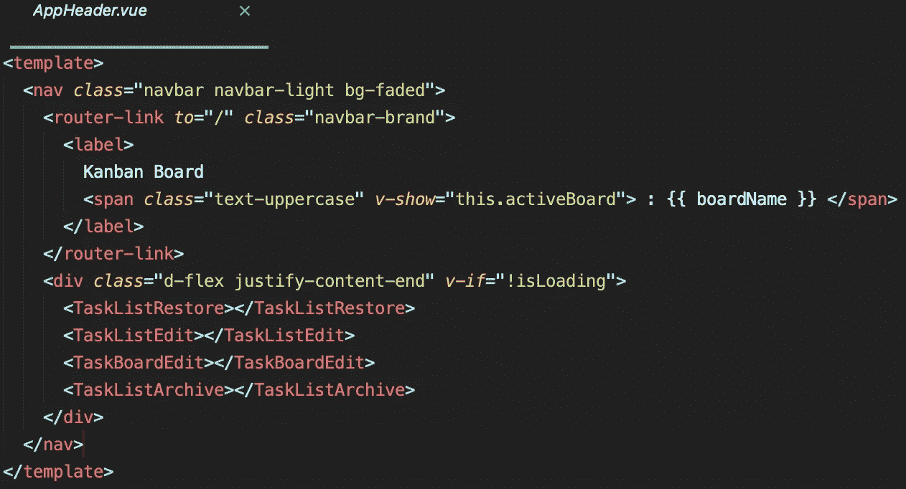

AppHeader.vue

例如，当用户在`Dashboard`页面时，`AppHeader`将显示`TaskBoardEdit`组件，允许用户创建新的或编辑现有的电路板。

或者，当用户在`TaskBoard`页面上查看单个电路板时，将显示`TaskListEdit`和`TaskListRestore`组件。

它们允许用户创建新列表或编辑现有列表以及恢复任何存档列表。如果用户想要存档任何单个列表，则`TaskListArchive`将可见。

## 应用指示器

该组件负责显示 SVG 加载动画，这表明应用程序此刻正忙于获取信息。

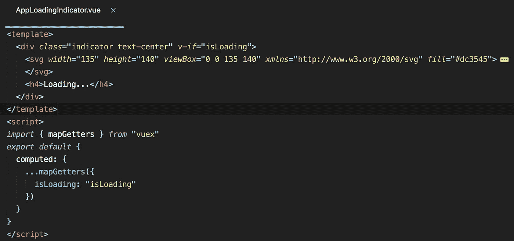

apploadingdindicator . vue

如上面的代码片段所示，这个组件没有本地状态，而是使用`isLoading` Vuex getter 来显示和隐藏加载指示器动画。

**注:** [山姆·赫伯特](https://samherbert.net/svg-loaders/)创作了优秀的 [SVG 动画](https://github.com/SamHerbert/SVG-Loaders)并公之于众，我用它作为加载指标。

## 仪表盘

该组件负责:

*   显示活动和存档的公告板，
*   开始编辑公告板信息，并
*   允许用户存档、恢复和导航到单个电路板。

## 任务板

该组件负责使用`TaskList`组件显示各个电路板的内容，并允许用户使用拖放功能对列表进行重新排序。此外，该组件还使用`setActiveBoard` Vuex 动作将当前板卡设置为活动。

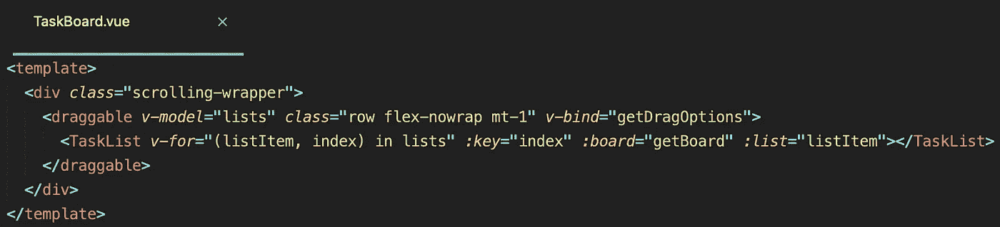

TaskBoard.vue

我们正在遍历列表，并使用`TaskList`组件以列格式显示它们。为了实现列表的拖放重新排序，我们用`draggable`组件包装了`TaskList`组件。

## 任务列表

`TaskList`组件的作用是使用`TaskListItem`组件显示可拖动和可编辑的项目，并允许用户使用`TaskListActions`组件编辑和归档列表。

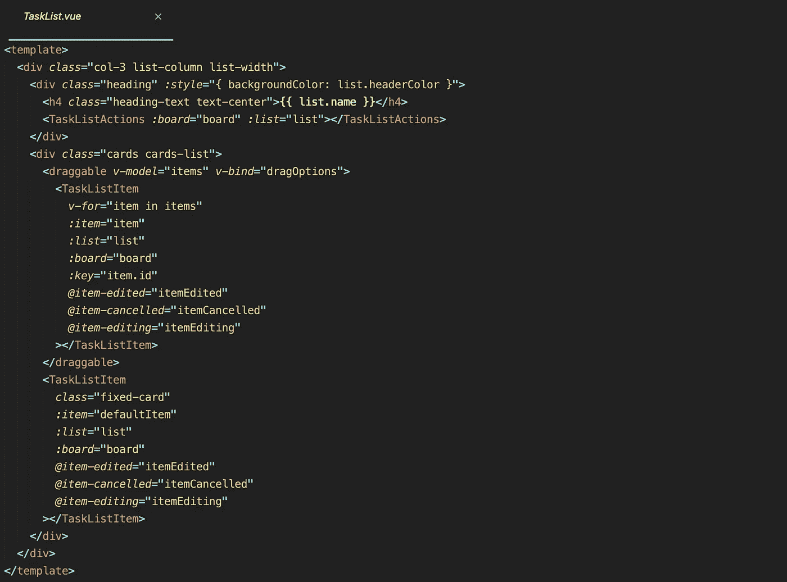

TaskList.vue

可拖动组件`TaskListItem`用可拖动组件包装。它将为列表中的每一项进行渲染。而`TaskListItem`在可拖动组件之外，用于添加一个新的`TaskListItem`。

## 任务列表项

`TaskListItem`组件负责，

*   显示个别项目的详细信息
*   添加新项目
*   更新现有项目并
*   删除现有项目

该组件可以在任何给定时间处于显示或编辑模式，并且`isEditing`组件状态变量用于在显示和编辑模式之间切换组件。

最初，对于显示模式，组件使用`isNewItem`和`displayText`计算属性来显示适当的文本，当用户单击一个项目时，然后`isEditing`变量被设置为 true，组件显示表单。

需要注意的是，就组件而言，添加和更新是非常相似的操作，决定是添加还是更新数据不是组件的工作。

因此，组件只会在单击保存按钮时验证数据，然后简单地用数据调用`saveTaskListItem` Vuex 动作。该动作使用`SAVE_TASKLIST_ITEM` Vuex 变异，它将决定是更新一个现有的项目还是在列表中添加一个新的项目。

## 任务列表操作

组件`TaskListActions`的职责是当用户点击列表标题中的“…”时显示编辑和存档动作。

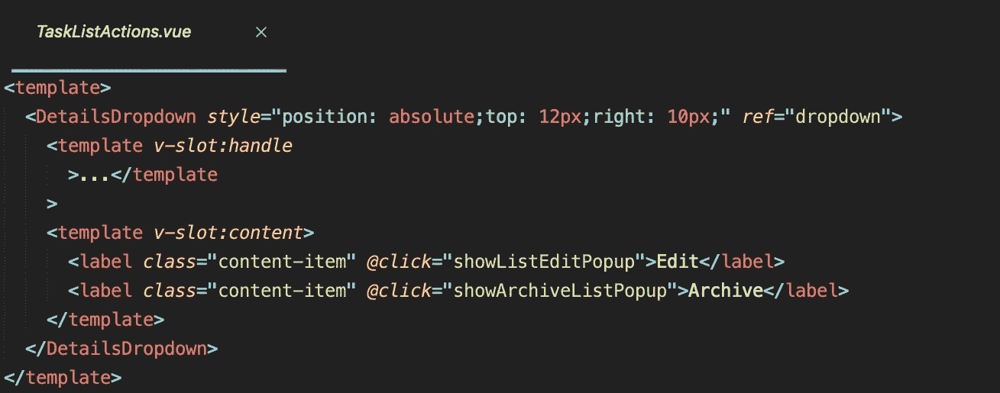

TaskListActions.vue

编辑动作允许用户编辑`list`细节，存档动作允许用户存档`list`。

## 任务列表存档

`TaskListArchive`组件的作用是显示一个弹出窗口来确认列表存档动作。

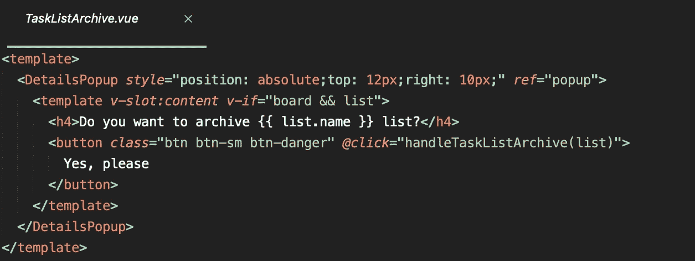

TaskListArchive.vue

如果用户点击“Yes，please”按钮，则调用`archiveTaskList` Vuex 动作来存档列表。

## 任务列表编辑

该组件的职责是显示一个带有表单的弹出窗口，以更新列表名称。

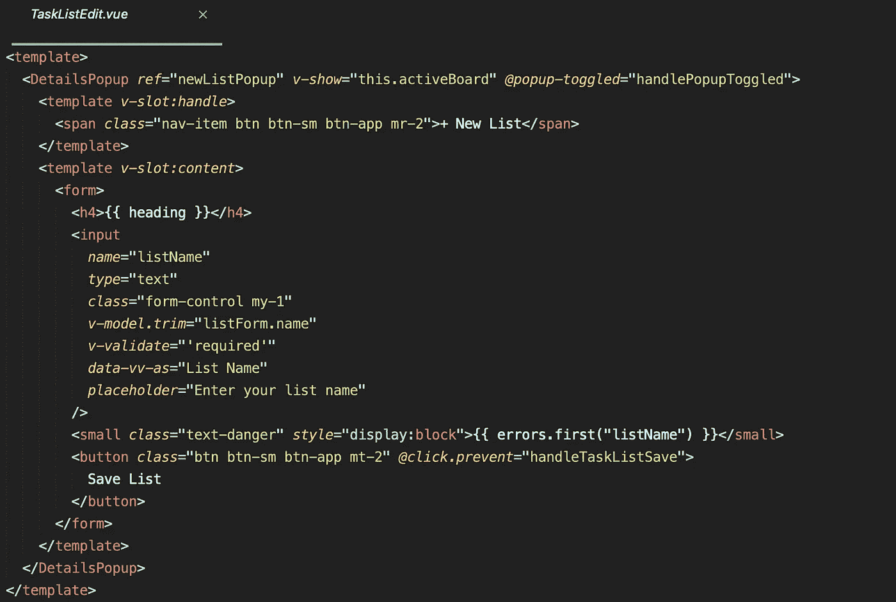

TaskListEdit.vue

当用户保存表单时，`handleTaskListSave`方法验证表单，如果验证成功，则调用`saveTaskList` Vuex 动作保存列表细节。

注意，`TaskListEdit`组件也被用来创建一个新的任务列表。

## 任务列表还原

该组件的职责是显示一个带有已存档任务列表的弹出窗口。该组件遍历`archivedLists`数组，并用`Restore`按钮显示任务列表。

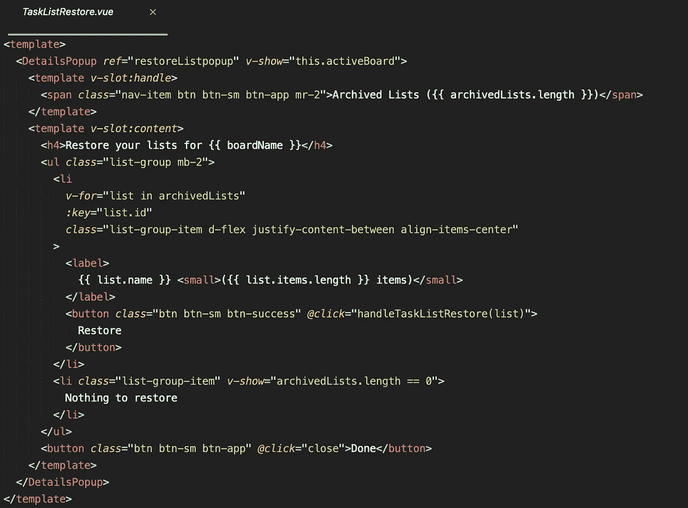

TaskListRestore.vue

当用户点击恢复按钮时，就会调用`restoreTaskList` Vuex 动作来恢复列表。

## 任务板编辑

该组件的职责是显示一个带有表单的弹出窗口，以更新电路板`name`和`description`的详细信息。

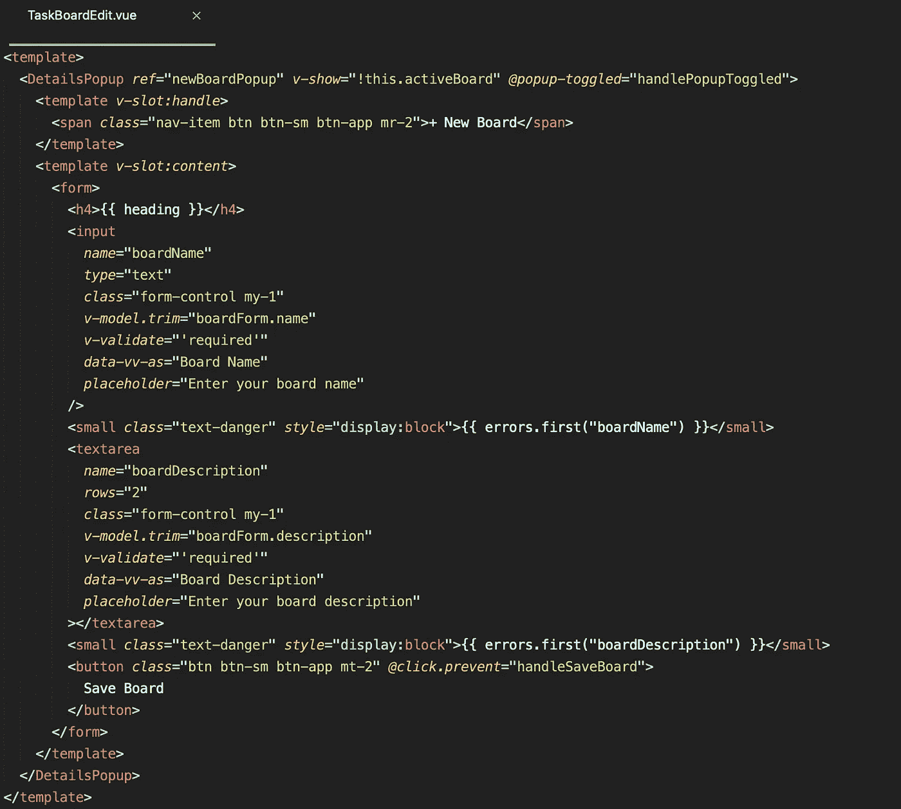

当用户保存表单时，然后`handleSaveBoard`方法验证表单，如果验证成功，则调用`saveTaskBoard` Vuex 动作来保存板细节。

注意，相同的组件用于处理新任务板的创建。

在本节中，我们已经了解了应用程序组件及其职责，现在让我们仔细看看拖放功能是如何工作的，因为它是该应用程序的关键功能。

# 实现拖放

HTML5 提供了本地事件来实现拖放功能，但是，当你需要用多个组件实现相同的事件时，你的用户界面组件就会变得非常复杂。

因此，为了减少应用程序的样板代码，我使用了来自`sortable.js`库的`VueDraggable`组件。这使我能够用几行代码在任务列表和任务列表项上快速实现拖放。

让我们看看如何使用`VueDraggable`组件的简单例子。

拖放单个列表中的项目

在演示中，我们有一个带有`items`数组的`list`对象，如下所示

```
list: {
 id: "1",
 name: "todo",
 items: [
  { 
   id: "1",
   text: "Build the feature #1"
  },
  { 
   id: "2",
   text:"Test the feature #1"
  },
  ...
  ...
 ]
}
```

现在，为了在列表中的单个项目上实现拖放，我们创建了`TaskList`和`TaskListItem`组件。

`TaskList`组件通过`props`从父组件接收`list`对象，然后迭代`items`计算属性以显示单个`TaskListItem`组件。

```
**// task-list-template** 
<div class="col-3 list-column list-width">
    <div class="heading">
      <h4 class="heading-text text-center">
        {{ list.name }}
      </h4>
    </div>
  <draggable 
    **v-model="items"** 
    **v-bind="dragOptions"**>
      <TaskListItem
        class="task-item" 
        v-for="(item,index) in items" 
        :key="index" 
        :item="item">
      </TaskListItem>
  </draggable>
  </div>
```

在上面的代码片段中，需要注意的一个关键点是，我们用`draggable`组件包装了`TaskListItem`,并使用带有`v-model`指令的`items`计算属性来让可拖动组件管理所提供数据中单个项目的索引。

此外，我们使用`v-bind`指令将组件的各种选项与`dragOptions`计算属性绑定在一起。

```
computed: {
 dragOptions() {
  return {
   animation: "200",
   ghostClass: "ghost",
   **group: "task-list-items"**
  }
 }
}
```

`dragOptions` computed property 将返回一个带有`animation`、`ghostClass`和`group`属性的 JavaScript 对象。

在`dragOptions`对象中，

*   `animation`将控制动画拖放效果的持续时间
*   `ghostClass`将在预期的拖放位置显示一个占位符，
*   `group`属性非常重要，因为它是在用户界面中启用拖放并共同识别和分组可拖动元素的关键。

**现在，让我们了解一下单个项目的指数是如何更新的。**

下面的代码片段显示了用`get`和`set`函数以详细格式编写的`items`计算属性。

```
**// TaskList component** 
computed: {
 items: {
  get(){
   return this.list.items
  },
  set(value){
   this.list.items=value
  }
 }
}
```

由于`draggable`组件使用带有`v-model`指令的`items` computed 属性，因此每次拖放，它都会调用带有更新数据的`set`函数。现在为了持久化，我们简单地用接收到的数据更新 list 对象的`items`属性。

> ***提示:*** *如果您正在使用 Vuex 进行数据处理，那么，在* `*set*` *功能中，您可以使用 Vuex 动作/突变来更新 Vuex 存储器中的状态。事实上，我们在应用程序中使用带有可拖动组件的 Vuex。*

到目前为止，我们已经看到了如何使用`draggable`组件来实现单个列表中的拖放项目。

现在让我们更上一层楼，

*   拖放整个列表
*   在列表中拖放项目

看看下面的演示。

我们显示多个列表而不是一个列表，允许整个列表重新排列，项目也可以在列表中移动。

任务板实施

为了显示多个列表，我们更新了数据，将`board`作为顶层对象，该对象使用`lists`数组属性来表示多个列表，每个列表使用`items`数组属性来表示单个列表项。

```
**board**: {
 id:"1",
 name:"Project Tracker",
 description: "A board to track a project",
 lists: [
  {
   id: "1",
   name: "todo",
   items: [ ... ]
  },
  {
   id: "2",
   name: "doing",
   items: [ ... ]
  },
  {
   id: "3",
   name: "done",
   items: [ ... ]
  },
  {
   id: "4",
   name: "deploy",
   items: [ ... ]
  }
 ]
}
```

为了展示单板，我们构建了一个名为`TaskBoard`的新组件。`TaskBoard`组件用于显示多个列表和管理列表的重新排序。而列表中的单个项目由前面演示中看到的`TaskList`组件管理。

为了实现列表的重新排序，在`TaskBoard`组件中，我们现在用`draggable`组件包装`TaskList`组件，并用`v-model`指令使用`lists`计算属性。它将管理所提供数据中各个列表的索引。

```
<draggable 
  v-model="lists" 
  v-bind="dragOptions" 
  class="row flex-nowrap my-3"
 >
  <TaskList 
    v-for="(listItem, index) in lists"
    :key="index"
    :list="listItem">
  </TaskList>
</draggable>
```

除此之外，我们通过使用带有`v-bind`指令的`dragOptions`计算属性来绑定`draggable`组件的多个属性。

`dragOptions` computed 属性将返回一个包含`animation`、`ghostClass`、`handle`和`group`属性的普通 JavaScript 对象。

```
computed: {
 dragOptions() {
  return {
   animation: "200",
   ghostClass: "ghost",
   handle: ".heading",
   **group: "task-board-lists"**
  }
 }
}
```

类似于先前讨论的`dragOptions`物体，

*   `animation`将控制动画拖放效果的持续时间
*   `ghostClass`将在预期的拖放位置显示一个占位符
*   `handle`将识别拖动手柄元素，并
*   `group`将在用户界面中共同识别和分组可拖动的元素。

注意，列表元素组的名称`task-board-lists`不同于项目组`task-list-items`。这是为了帮助`draggable`组件正确区分两组不同的可拖动元素。

`draggable`组件足够聪明，能够理解我们有多个属于不同组的列表和项目，它只允许在**同一个**组的元素之间拖放。

通过明确命名不同的拖放组，我们可以将一个项目从一个列表移动到另一个列表，而不会有任何戏剧性的变化，并且允许列表被重新排序。

现在让我们看看重新排序的列表是如何持久化的。与前面的演示相似，我们也使用详细格式的`lists`计算属性。

```
computed: {
 lists: {
  get() {
   return this.board.lists
  },
  set(value) {
   this.board.lists = value
  }
 }
 ...
}
```

当任务列表被重新排序后，`draggable`组件将调用`lists`计算属性的`set`函数，用更新后的数组来反映列表的新位置。为了保持更改，我们只需用接收到的数据覆盖 board 对象中的列表数组。

如本节所演示的，使用`draggable`组件，拖放的概念非常容易在多个层次上实现(重新排序整个列表和在列表间重新排序/移动项目)。

您甚至可以进一步发展这一概念，并从构建更复杂的拖放界面中获得乐趣，

*   带有组件小部件的管理仪表板(例如 Salesforce 管理仪表板)
*   面向客户的网站/页面生成器(例如网站生成器、WordPress 主题生成器)

在下一节中，我们将深入挖掘并理解`slots`的概念，以设计应用程序中使用的可重用组件。

# 构建可重用组件

有几种不同的框架特性和设计模式可以用来在 Vue.js 中创建可重用的组件，如混合、插槽、作用域插槽、功能组件和无渲染组件等。

在开发这个应用程序时，我遇到了一些具有共同行为的组件，例如，内容需要在弹出窗口中显示，但内容具有不同的标记，并实现了不同的功能集。因此，我决定用`slots`来设计一个通用的 popup 组件。

对于插槽，子组件通常在标记中有一个或多个`<slot></slot>`标签，它们只是内容的占位符。当父组件使用子组件时，这个`slot`将为内容提供一个空间，甚至可以在其中实现交互性。

为了用通俗的语言理解插槽，以一个带有空白页面的笔记本为例。横线页可以被认为是槽，因为它们将由购买该笔记本的人来填写。

现在，如果笔记本被一个学校的孩子买走，那么它将成为一个学校笔记本，并且可能包含课堂笔记。同样，如果是上班族买的，那么很可能里面会有会议纪要。

因此，我们可以看到这种模式，即同一台笔记本可以由不同的用户用于不同的目的。然而，notebook 只提供空行页面，至于往里面放什么内容完全由用户决定。

让我们看一个带有演示的老虎机示例。我构建了一个`DetailsPopup`组件，它使用 html5 `<details>`和`<summary>`标签来构建一个可重用的弹出组件。

使用 Vue.js 插槽

在 summary 标签中，我们使用一个名为`handle`的`slot`来显示打开弹出窗口的标记，在 div 标签中，我们使用一个名为`content`的`slot`来显示弹出窗口的内容。

`DetailsPopup`组件有额外的方法`open`和`close`，这将简单地添加和删除`open`属性来显示和隐藏弹出窗口。除了这些方法之外，组件还发出带有弹出窗口当前状态的`popup-toggled`自定义事件，以指示它当前是打开还是关闭。

在应用程序中，我们有使用`DetailsPopup`组件的`TaskListRestore`、`TaskListArchive`、`TaskListEdit`、`TaskBoardEdit`组件。

我们以`TaskListEdit`组件为例。

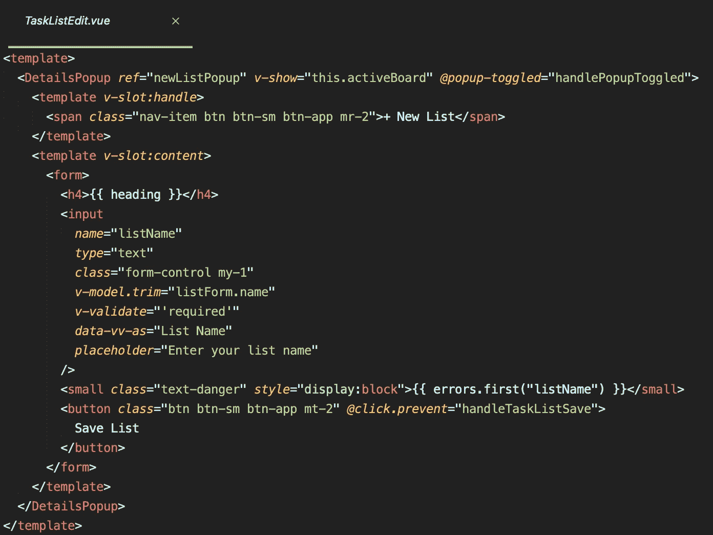

TaskListEdit.vue —使用 DetailsPopup 组件的专用包装组件

在上面的代码片段中，`TaskListEdit`组件使用`DetailsPopup`作为子组件，并为名为`handle`和`content`的槽提供标记，还实现了验证和保存表单的功能。

由于`TaskListRestore`、`TaskListArchive`、`TaskListEdit`、`TaskBoardEdit`被放置在`AppHeader`组件中，由于组件不遵循`parent→child`组件组合模型，这带来了另一个与组件通信相关的问题。我们不能简单地使用 props 向它们传递数据，因为它们被放在不同的组件中。

因此，在下一节中，我们将讨论组合环境中的组件通信。

# 组件通信

在`parent→child`关系这样的基本组件组合中，推荐的从父组件传递数据到子组件的方式是通过`props`，子组件可以通过使用`$emit`发出一个事件与父组件进行通信。

当组件不适合传统的`parent→child`组合时，情况变得复杂。在这种情况下，您可以使用`EventBus`模式在组件之间进行通信，这些组件可以放置在用户界面的任何位置，并且仍然可以监听和响应定制事件。

在事件总线模式中，我们使用一个 Vue 实例来发出、监听和响应应用程序中的自定义事件。这是一个通用但强大的模式，Vuex 动作也可以使用它来发出或监听定制事件。

只用两行代码就可以建立事件总线。

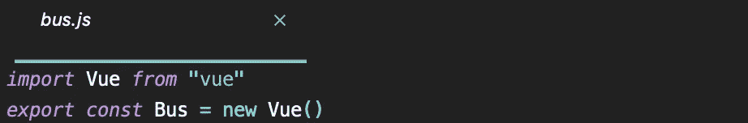

设置事件总线— utils/bus.js

然后可以使用`Bus`来发出和监听自定义事件，如下所示。

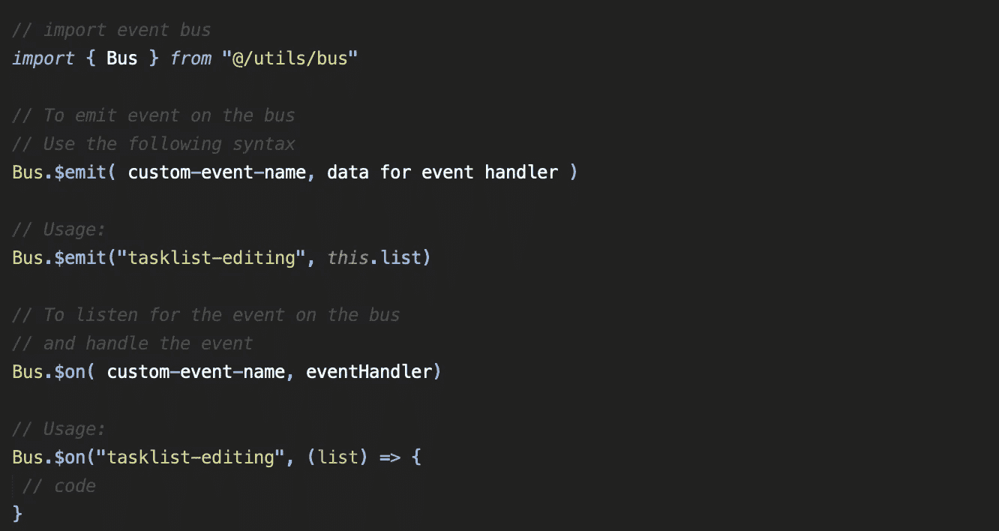

事件总线模式的使用

让我们以`TaskList`、`TaskListActions`和`TaskListEdit`元件为例。

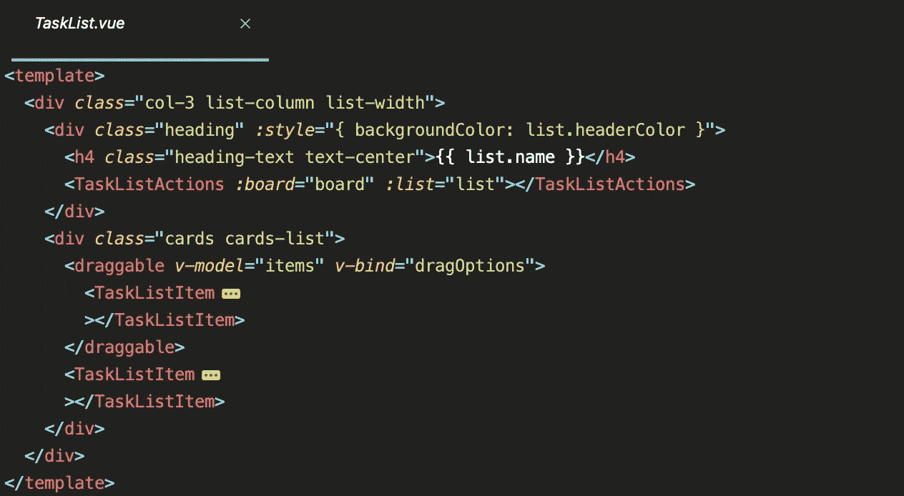

TaskList.vue

`TaskListActions`组件被用作`TaskList`组件的子组件，我们将`board`和`list`信息作为道具传递给`TaskListActions`组件。

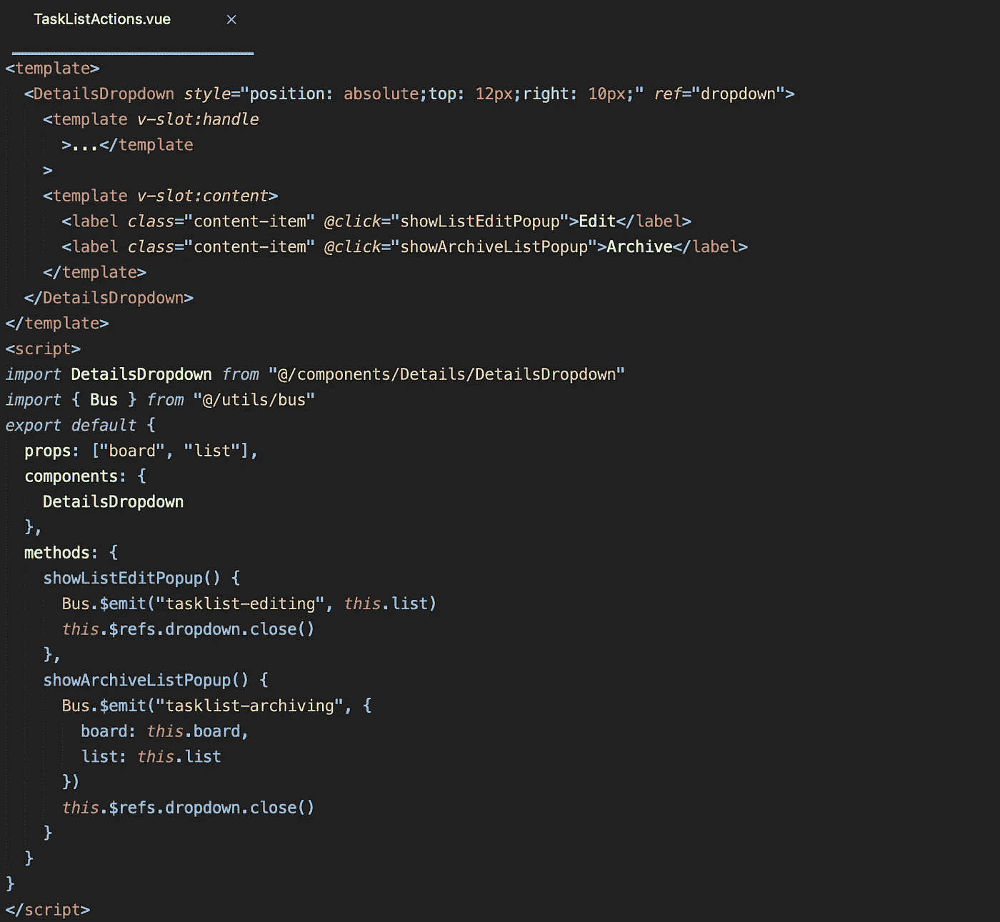

TaskListActions.vue

在上面的`TaskListActions`组件中，`showListEditPopup`方法以`tasklist-editing`事件和`list`数据作为有效载荷发出，而`showArchiveListPopup`方法以`list`和`board`数据作为有效载荷在事件总线上发出`tasklist-archiving`事件。

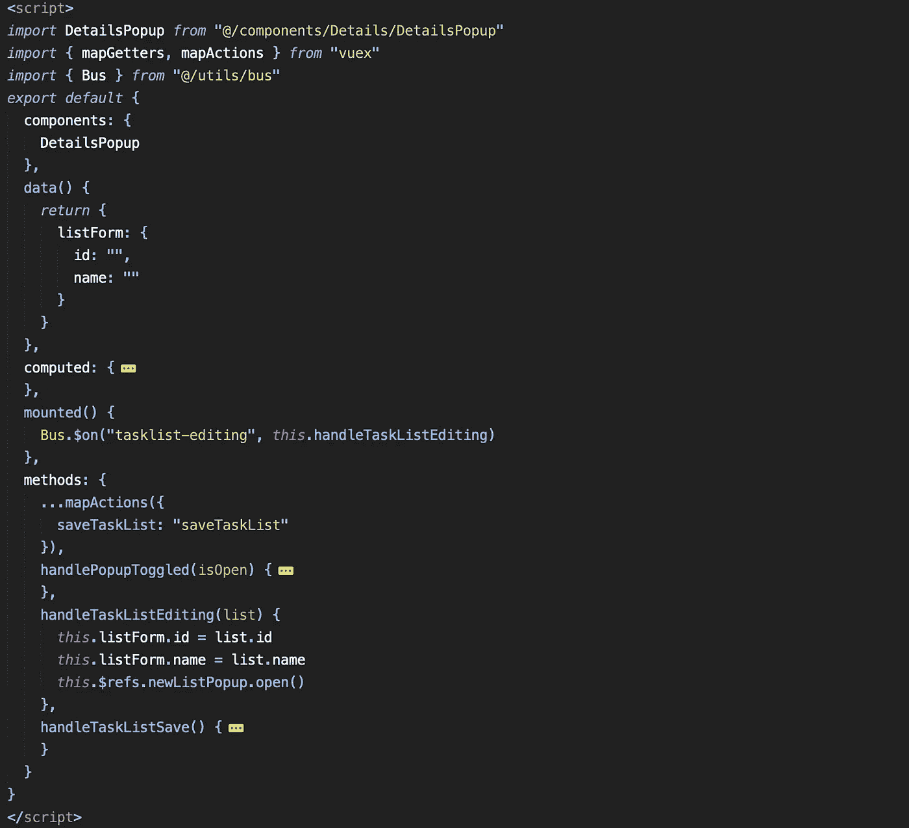

TaskListEdit.vue

在接收端，在`TaskListEdit`组件中，我们在`mounted()`生命周期钩子中设置了一个事件监听器和事件处理器。

```
Bus.$on("tasklist-editing", this.handleTaskListEditing)
```

我们使用`Bus`对象的`$on`方法开始监听事件，并提供`handleTaskListEditing`函数来处理事件。`handleTaskListEditing`方法的职责是用接收到的数据更新`listForm`变量，并显示用于编辑的弹出窗口。

实际上，事件总线模式与`Vuex`密切相关，大多数时候接收组件使用`Vuex actions`用新信息更新状态。

让我们来看看使用 Vuex 的数据和状态管理。

# 数据和状态管理

在这个应用程序中，我们以分层格式组织了我们的电路板数据。这意味着，我们有一个板的数组，其中每个板可以有多个列表，每个列表中可以有一个或多个项目。

这是应用程序中单个电路板的样本数据。

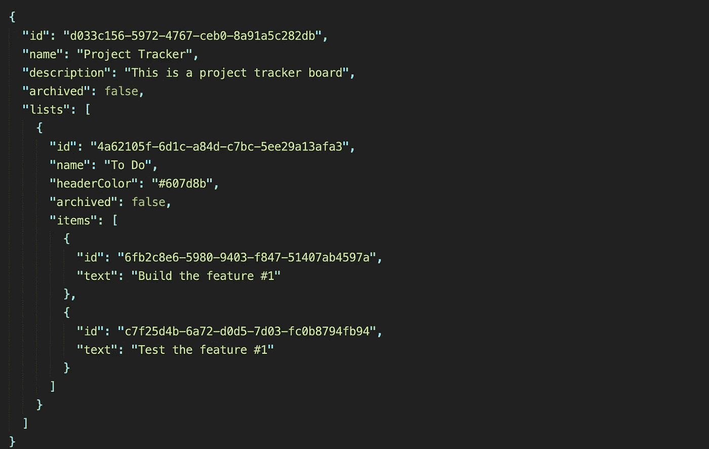

单个电路板的数据格式

上面的片段显示了单个电路板的格式。每个棋盘都有`id`、`name`、`description`、`archived`、`lists`字段。`archived`是一个布尔型字段，表示电路板是否存档，而`lists`字段是一个列表对象数组。

每个列表包含`id`、`name`、`headerColor`、`archived`和`items`字段。其中`archived`字段表示列表是否存档，`items`字段是包含`id`和`text`字段的项目对象数组。

现在我们已经了解了数据的结构，让我们看看`Vuex`是如何在应用程序中使用的。

## 状态管理

Vue 应用程序中有两种状态，本地组件状态和全局应用程序状态。局部组件状态对于定义单个组件的行为很有用，而全局应用程序状态在多个组件共享某个数据时很有用。

对于全局应用状态，我们使用由 Vue.js 团队开发和维护的`Vuex`库。

Vuex 用作集中式状态管理解决方案，它通过动作和突变提供应用程序状态的受控更新。当我说受控更新时，这意味着你不能仅仅修改全局状态，对状态的任何更新都必须经历突变。

以下是 Vuex 在应用环境中的快速入门。

## Vuex 商店

Vuex store 是一个封装应用`state`、`getters`、`mutations`和`actions`并使应用状态可反应的容器。当应用程序状态变量被更新时，任何使用该状态变量的用户界面组件将自动用新信息更新。

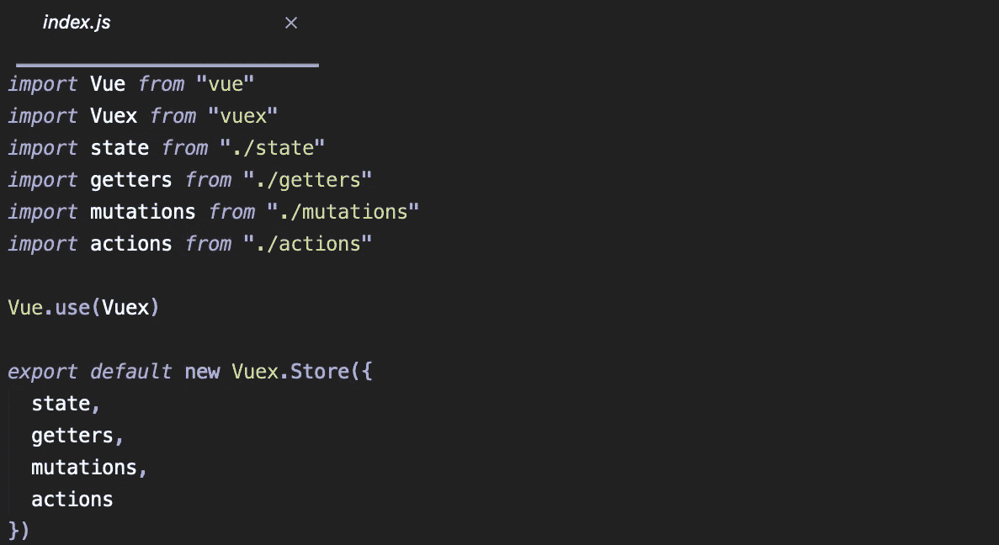

Vuex store — store/index.js

## Vuex 状态

Vuex state 是此应用程序使用的集中式共享数据。它是一个普通的老式 javascript 对象(POJO ),变量以键值对格式定义。

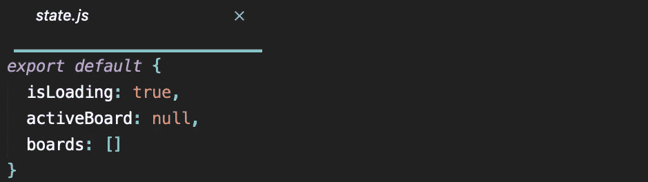

Vuex state — store/state.js

在上面的代码中，`AppLoadingIndicator`组件使用`isLoading`状态变量来显示 Vuex 动作获取数据并将其加载到状态时的加载指示器动画。

`activeBoard`变量保存用户当前打开的电路板的引用。`boards`变量是一个数组，包含各个单板的信息。

## 真空吸气剂

Vuex getters 是用来访问状态变量的函数，但是如果需要的话，你也可以用它们来返回转换后的数据。

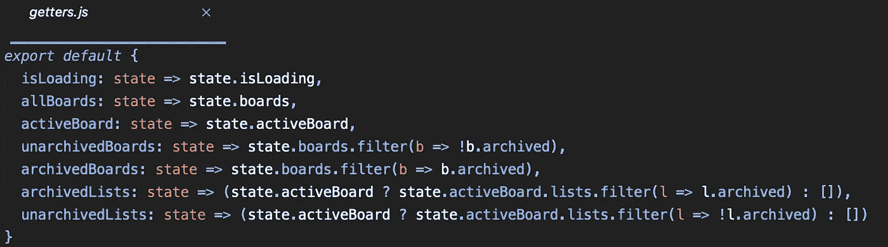

Vuex Getters — store/getters.js

例如，在上面的代码片段中，`archivedBoards`过滤了`boards` 状态变量，并只返回存档的电路板。然而，`archivedLists` getter 检查是否设置了`activeBoard`，然后只有它返回存档列表，否则返回一个空数组。

## Vuex 突变

Vuex 突变是唯一可以用新数据更新状态变量的函数。变异函数接收`state`对象作为第一个参数，后跟任何有效载荷参数。

```
**// store/mutations.js** // Set Initial Boards DataSET_INITIAL_DATA(state, payload) {
  state.boards = payload
}
```

上面的代码片段声明了一个`SET_INITIAL_DATA`变异，它接收`state`对象和有效负载作为参数。通过状态对象，我们可以访问`boards`变量并用有效载荷更新它。

通过使用 Vuex 的`mapMutations`助手，可以在 Vue 组件中直接访问 Vuex 突变，但是随着应用程序的增长，您需要处理某些任务，例如，

*   调用外部 API 获取或更新数据
*   显示 toast 通知
*   发送电子邮件通知
*   将用户路由到特定路由

使用上述实现，您的组件代码会变得不必要的复杂。

一种更好的组织代码的方式是通过`Vuex actions`，因为它们提供了一个围绕`Vuex mutations`的抽象层，而且由于它们本质上是异步的，它们更适合在调用`Vuex mutations`之前或之后调用任何业务逻辑。

你可以在 Vuex 官方文档中阅读更多关于 Vuex 突变的信息。

下面的片段显示了该应用程序使用的所有 Vuex 突变。

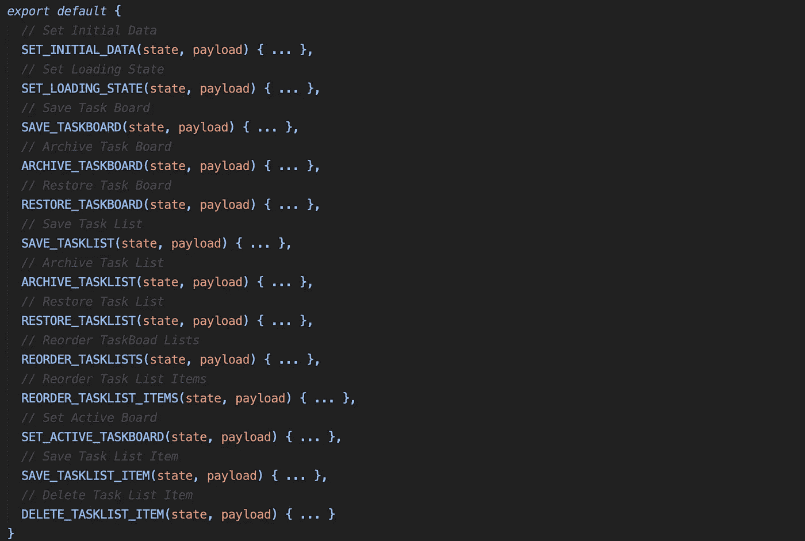

Vuex 突变— store/mutations.js

## Vuex 操作

Vuex 动作使用突变来操作状态中的数据。突变和动作的关键区别在于，Vuex 同步**调用突变**，而动作本质上是**异步**。因此，您可以在操作中使用业务逻辑，然后调用适当的变异来更新状态。

你可以在 Vuex 官方文档中阅读更多关于 Vuex 动作的信息。

为了获取和加载数据，我将样本数据存储在一个 [github 存储库](https://github.com/techlab23/data-repository)中，并在应用程序第一次启动时使用`[axios](https://github.com/axios/axios)`获取数据。

我们举一个`fetchData` Vuex 动作的例子，这个动作用于获取和加载 app 使用的样本数据。因为所有的 Vuex 动作都接收一个`context`对象作为第一个参数，所以我们只是简单地析构该对象并取出`commit`方法来调用我们的突变。

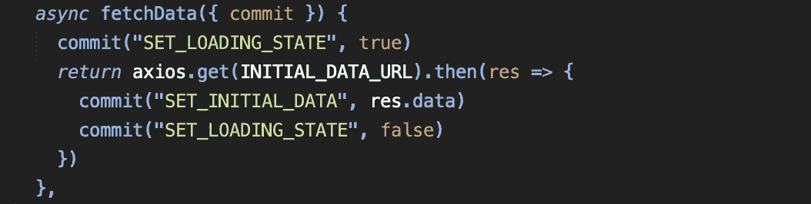

Vuex 操作—提取数据

在上面的代码片段中，我调用了`SET_LOADING_STATE`突变来更新`isLoading`状态变量，这将使`AppLoadingIndicator`组件在 axios 从 URL 获取样本数据时显示加载指示器动画。

接收到数据后，我调用`SET_INITIAL_DATA`突变用接收到的数据更新`boards`状态变量，然后调用`SET_LOADING_STATE`突变将`isLoading`状态变量更新为 false，这将使`AppLoadingIndicator`组件隐藏加载指示器动画。

下面的代码片段显示了应用程序中使用的所有 Vuex 操作。

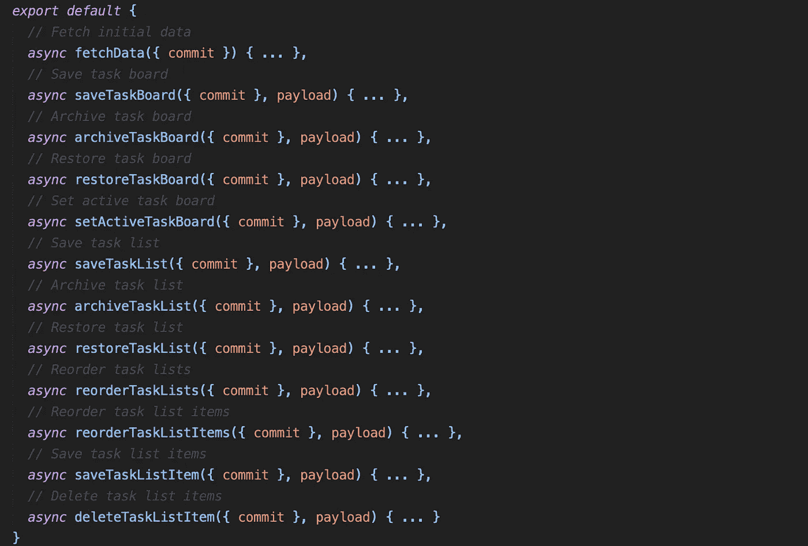

Vuex 操作— store/actions.js

本地组件状态可帮助您在组件中实现特定行为，而 Vuex 提供可由多个组件使用的全局应用程序状态，由于它是反应性的，因此对特定状态数据的任何更新都会自动触发依赖于状态数据的组件的重新呈现。

Vuex 通过动作和突变向应用程序提供结构化和受控的状态更新机制，这使得调试您的应用程序更加容易。

实现 Vuex 后，您可能会看到的一个好处是本地组件状态减少到最小或不存在，这是因为组件开始更多地依赖于通过`Vuex getters`共享的状态，而不是本地组件状态。

# 下一步是什么？

在本文中，我们讨论了使用通用和专用的 Vue 组件逐步构建用户界面的`top-down`方法，并理解了如何在应用程序的上下文中应用该方法。

我们还讨论了作为构建可重用组件的方法之一的`slots`,并学习了当`Parent→Child`的组件组合不能满足目的时，如何实现拖放以及应用`Event Bus`模式在组件之间进行通信。

最后，我们讨论了应用程序的数据结构，并了解了如何使用`Vuex`来管理使用`store`、`state`、`getters`、`mutations`和`actions`的全局应用程序状态。

我们将在本文的下一部分讨论表单验证、Vue.js 插件、包优化和应用程序部署。

## **更新:**

## 使用 Vue.js 的任务管理应用程序—第 2 部分

[https://level up . git connected . com/task-management-application-using-vue-js-part-2-d 785 a 96 acda 6](/task-management-application-using-vue-js-part-2-d785a96acda6)