# 使用 Vue.js 的任务管理应用程序—第 2 部分

> 原文：<https://levelup.gitconnected.com/task-management-application-using-vue-js-part-2-d785a96acda6>

# 介绍

在[使用 Vue.js 的任务管理应用—第 1 部分](/task-management-application-using-vue-js-part-1-df607ca30f48)中，我们讨论了如何将较大的用户界面分解成较小的组件，以及`top-down`和`bottom-up`方法。此外，我们讨论了如何在应用程序的上下文中使用插槽和 Vuex 来构建可重用的组件。

在本文中，您将了解到，

*   如何实现表单验证
*   创建和使用 Vue.js 插件
*   如何针对生产部署优化您的应用捆绑包
*   在何处以及如何部署您的应用

## 我们将会建造什么

这是完成的应用程序的截图。


任务管理应用

## **应用演示**

*   上 surge . sh—[http://kanban-board-demo . surge . sh](http://kanban-board-demo.surge.sh)
*   论 netlify.com—[https://task-management-app.netlify.com](https://task-management-app.netlify.com/)

## **Github 库**

*   [https://github.com/techlab23/task-management-app](https://github.com/techlab23/task-management-app)

# 表单验证

表单验证在任何应用程序中都是一个棘手的问题，可以用很多方法来完成。对于简单的场景，您甚至可以编写自己的表单验证功能，但是当您必须在应用程序的多个地方这样做时，这就变得很乏味了。

为了解决客户端表单验证问题，Vue 生态系统中有一些经过充分测试的库。像`[Vuelidate](https://vuelidate.netlify.com/)`、`[Vee-validate](https://baianat.github.io/vee-validate/)`这样的库非常有助于用几行代码集成表单验证。

为了在这个应用程序中实现表单验证，我使用了`Vee-validate`库。设置`Vee-validate`最简单的方法是使用`Vue.use()`惯例导入并注册 Vue，如下面的代码片段所示。

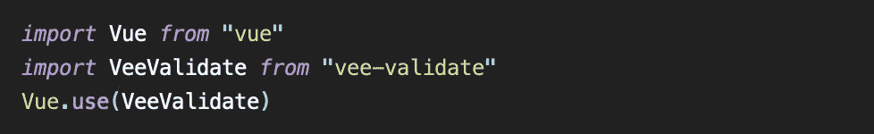

设置 Vee-验证

上面的代码将从`vee-validate`库中导入并注册所有验证规则、mixins 和 locale。请注意，这种方法会增加应用程序的最终 JavaScript 供应商捆绑包的大小。

然而，在研究过程中，我在`Vee-validate`的文档中发现，我不必导入整个库，相反，我可以只导入必要的函数、验证规则和验证消息的语言环境，以保持包的大小较小。我将在**捆绑包优化**部分检查这个设置。

我们使用表单进行以下操作:

*   创建和更新任务板
*   创建和更新任务列表，并
*   创建和更新任务列表项

下面我们来看看`TaskListEdit`组件中`vee-validate`的用法。

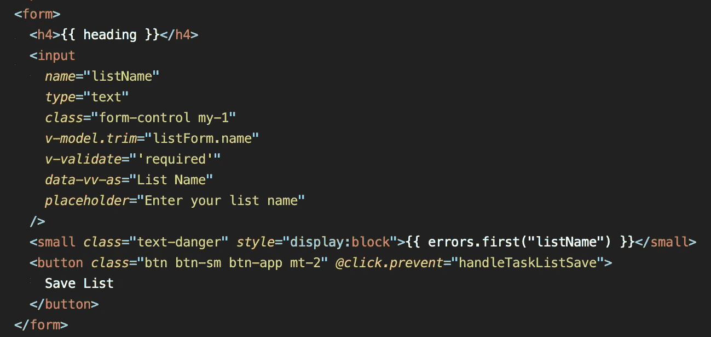

TaskListEdit.vue

在`TaskListEdit`组件中，我们使用带有`v-validate`指令的`required`规则。注意，我们在带有`vee-validate`指令(即`vee-validate="'required'"`)的模板中直接使用验证规则。因此，我们必须用单引号将所需的验证规则括起来。

如果您愿意，那么您也可以使用对象格式来编写有效性规则。在这种情况下，语法应该类似于`v-validate="{ required: true }"`。

当您有一个以上的验证规则，或者您想要动态地在表单中添加或删除验证规则时，对象语法提供了一种更加简洁的方法。你可以在 [vee-validate 文档](https://baianat.github.io/vee-validate/guide/syntax.html#rules-parameters)中阅读更多关于语法的内容。

除了`vee-validate`指令，我们还使用`data-vv-as`属性来提供可读的字段名称(即。列表名)用于显示验证错误。注意，`data-vv-as`需要输入字段中的`name`属性才能正常工作。

我们使用带有`errors.first("fieldName")`的`small` html 标签来显示一个字段的验证错误。`errors`对象由`vee-validate`库提供，用于访问验证错误。下面是显示验证错误的语法。

```
<small class="text-danger" style="display: block">
{{ errors.first("fieldName") }}
</small> 
```

最后，我们在`@click`事件上使用`prevent`修饰符来改变`Save List`按钮的默认行为，这将阻止按钮被点击时的表单提交和整个页面刷新。

现在，我们了解了使 vee-validate 工作所需的标记。让我们看看组件中的`handleTaskListSave`方法。

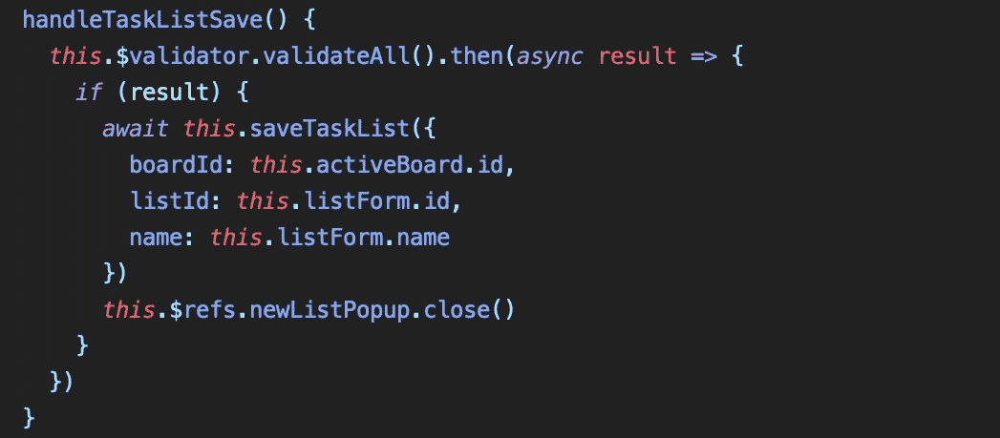

任务列表编辑— handleTaskListSave 方法

因为`vee-validate`是在全球范围内导入和注册的，所以它的基于承诺的`validator` API 对所有组件都可用。上面的代码片段验证表单，然后通过`result`参数提供验证结果以供进一步处理。

如果验证通过，那么我们将使用所有必要的数据调用`saveTaskList` Vuex 动作，然后关闭弹出窗口。如果验证失败，`vee-validate`将在表单中显示错误，弹出窗口将保持打开。

这就是我们使用`vee-validate`验证表单所需要做的一切。

`Vee-validate`是一个很棒的客户端验证库，拥有丰富的文档和 codesandbox 上的[工作样本。它是 CSS 框架不可知的，所以你可以随意显示错误。总而言之，它使得表单验证相当简单，只需对标记做很少的修改。](https://baianat.github.io/vee-validate/examples/)

客户端验证提供了更好的用户体验；但是，它不能替代服务器端验证。因此，在将用户提交的数据保存到数据库之前，必须在后端对其进行验证。

如果您正在构建一个多语言应用程序，那么将`vue-i18n`插件与`v-validate`连接起来，根据应用程序配置和支持的语言环境显示验证消息是非常简单的。您可以使用`dictionary api`来提供定制的验证消息。在 [vee-validate 文档](https://baianat.github.io/vee-validate/guide/localization.html#aliases)中了解更多相关信息。

该应用程序还有最后一个难题，即通过设备检测来启用和禁用功能。所以让我们在下一节讨论它。

# 设备检测

您可以使用 CSS 媒体查询来检测 Vue 组件`<template>`中的设备视口。然而，当检测 Vue 组件`<script>`中的设备时，就有点棘手了。现在，想象一下，如果您需要在应用程序中的几个或更多位置检测设备。

您肯定不希望在任何地方复制逻辑，或者即使您在脚本中提取了逻辑，您仍然需要在多个地方导入脚本。这就是 Vue.js 插件派上用场的地方。

根据定义，Vue.js 插件增加了某些全球可用的功能。Vue 插件可以添加，

*   全局方法或属性
*   一个或多个全局资产，如指令/过滤器/转换等
*   全球混合组件选项
*   将 Vue 实例方法附加到 Vue.prototype

一个 Vue 插件可以是一个提供自己 API 的库，同时它也可以注入上述的全部或部分组合。

在我们的例子中，我想检测设备(台式机、笔记本电脑和移动设备)，并基于此在应用程序中启用和禁用拖放功能。

为了实现设备检测，我借用了`[nuxt-device-detect](https://github.com/dotneet/nuxt-device-detect)`插件的代码，并做了一些修改，创建了一个 vue.js 插件。

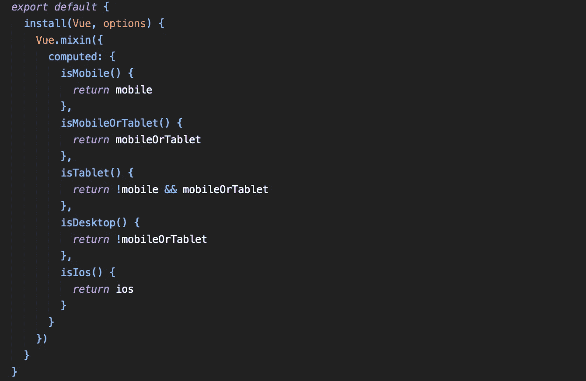

插件代码摘录自— plugins/device-detect.js

在上面的代码片段中，插件向 Vue 实例注册了一个`mixin`，并提供了对所有组件都可用的`isMobile`、`isMobileOrTablet`、`isTablet`、`isDesktop`、`isIos`计算属性。

```
**// plugins/index.js**
import Vue from "vue"
import DeviceDetect from "./device-detect"
Vue.use(DeviceDetect)
```

上面的代码片段使用`Vue.use(DeviceDetect)`语法导入并注册了`DeviceDetect`插件。

现在我们已经了解了如何注册一个插件，让我们看看如何使用它来启用和禁用我们的应用程序中的拖放功能。

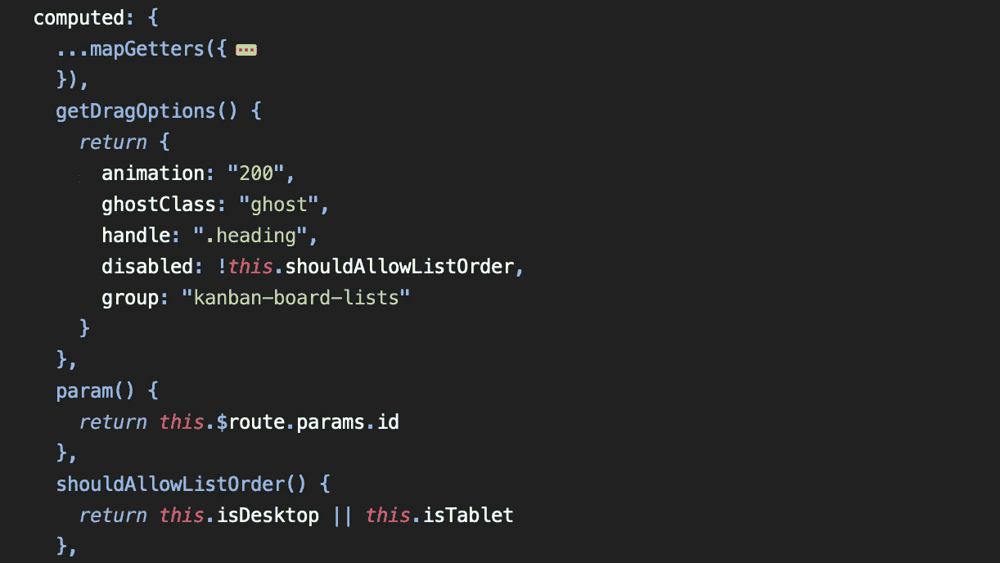

TaskBoard.vue

在上面来自`TaskBoard`组件的片段中，我使用了`draggable`组件的`disabled`属性来启用和禁用拖放行为。`shouldAllowListOrder`计算属性正在使用`isDesktop`和`isTablet`计算属性，它们由`device-detect`插件提供。

如果用户在桌面或平板设备上，那么`shouldAllowListOrder`属性将返回`true`，否则，它将返回`false`，从而根据设备启用或禁用拖放功能。

我们在`TaskList`组件中也使用了类似的概念，在移动设备上禁止拖放项目，而在台式机和笔记本设备上启用。

## 设备上的测试功能

在本地设备上测试这个特性的最快方法是使用下面截图所示的`npm run serve`运行你的项目，并在你的桌面、平板和移动设备上使用`Network` URL。在在线部署项目之前，这是在本地测试特定于设备的特性的最简单的方法。

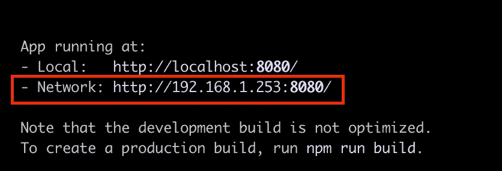

使用`**npm run serve**`在本地运行项目

插件非常强大，因为它们可以使某些变量、计算属性甚至方法对应用程序中的所有组件可用。

在这个应用程序中，设备检测功能为自定义插件提供了一个完美的用例，但你也可以使用插件来创建外部库，如 axios.js、moment.js 等。也适用于所有组件。

现在，我们已经涵盖了本应用程序中使用的所有必要概念。让我们来讨论捆绑包优化。

# 捆绑优化

使用 Vue 构建应用程序非常简单，而且有了许多组件和实用程序库，直接快速安装和使用它们总是一种诱惑。

但是，在使用任何组件或实用程序库之前，您应该始终考虑它对整个包大小的影响，并设法只导入和注册应用程序所需的组件或函数。

尽管有多种方法可以优化应用捆绑包，但在此应用的背景下，我们将关注以下内容:

*   **CSS 包优化**
*   **供应商捆绑包优化**

例如，在没有任何优化的情况下，当您使用`npm run build`构建应用程序时，在 Gzipped 之前，应用程序的整体包大小为 **~525 KB。**

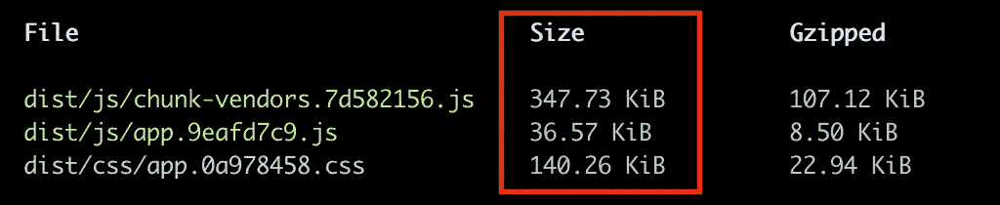

没有优化

现在让我们看看如何优化 CSS 包。

## CSS 包优化

app 打包的 CSS 大小为 **~140 KB** 。这是因为我们正在使用`Bootstrap CSS Framework v4.3.1`，没有任何优化，CSS 包将包括整个 CSS 框架。

我们可以使用`purgecss`和`postcss-purgecss`包从 CSS 包中移除不用的类。`purgecss`与 Vue-CLI 内部使用的`postcss`库完美配合。

`purgecss`和`postcss-purgecss`包应该作为**开发依赖**安装，以确保它们只用于构建 app。

```
$ npm i -D purgecss @fullhuman/postcss-purgecss
```

安装完成后，我修改了根文件夹中的`postcss.config.js`来配置`postcss`使用`purgecss`，只保留使用过的类，并从最终的 CSS 包中去掉其余的类。

```
const purgecss = require("[@fullhuman/postcss-purgecss](http://twitter.com/fullhuman/postcss-purgecss)")module.exports = {
 plugins: [
  //Only add purgecss in production
  process.env.NODE_ENV === "production"
   ? purgecss({
      content: ["./src/**/*.vue"]
     })
   : ""
 ]
}
```

上面的代码确保`purgecss`只在生产模式下运行，它将检查所有`.vue`文件中的 CSS 类，并排除任何未使用的类。

现在，在配置了`purgecss`之后，当我使用`npm run build`构建项目时，CSS 包的大小从**的 140.26 KB 减少到了**的 13.08 KB。****

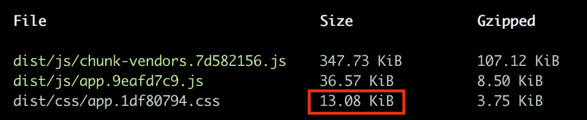

通过 postcss 完成 purgecss 安装和配置后

光是 CSS 包的大小就节省了 127KB！

但是我们的 JavaScript 供应商捆绑包的大小仍然有点大，所以我使用了 app bundle analyser 来查找哪个库负责更大的 JS 捆绑包大小。这样，我就可以研究并找出如何减少他们在我们的应用程序中的足迹。

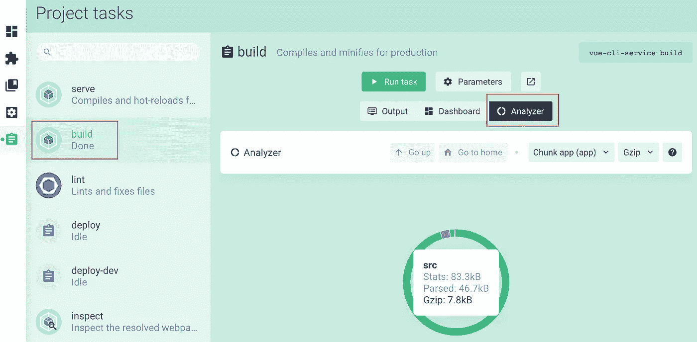

Vue-CLI — App 捆绑包分析器

## 供应商捆绑优化

在查看了 analyser 中的供应商捆绑包后，我发现 vee-validate 库已经完整地包含在内了。当我们使用下面的代码导入并注册`Vee-validate`库时，它包含了供应商捆绑包中的整个库。


vee 的默认安装-验证

但是，有一种更好的方法将`Vee-validate`包含在我们的应用程序中。我创建了一个单独的插件文件来保存与 vee-validate 导入和注册相关的代码。

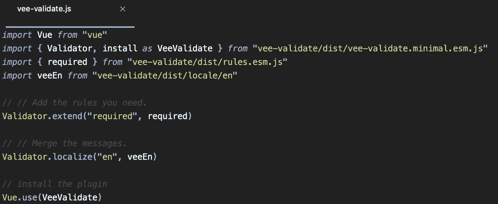

自定义安装 vee-validate-plugins/vee-validate . js

在上面的代码中，我们只从`vee-validate.minimal.esm.js`导入`Validator`和`install`方法，然后再一次只从`rules.esm.js`导入`required`验证规则。我们没有导入所有已定义的语言环境，而是专门为验证消息导入了`en`语言环境。

导入之后，我们简单地用 vee-validate 连接验证规则和区域设置，最后使用`Vue.use(VeeValidate)`命令向 Vue 注册`VeeValidate`。

现在，让我们再运行一次构建，看看有什么不同。

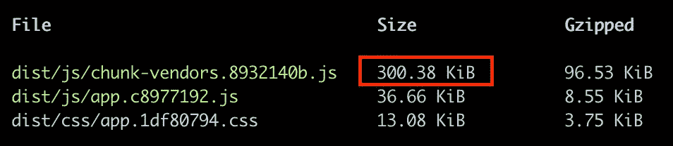

Vee 后-验证配置

在 vee-validate 相关优化之后，我们的供应商捆绑包大小已经从 **~347 KB** 下降到 **~300 KB** 。这让我们在供应商捆绑包大小上节省了 **~47 KB** 。

与我们开始时大约 525 KB 的整体包大小相比，我们现在已经将整体包大小减少到大约 350 KB。

经过优化后，我们节省了 **~174 KB** 的总捆绑包大小，这肯定会使我们的应用程序在较慢的连接上加载更快。

在构建应用程序时，捆绑包优化经常是事后才想到的，也就是说，它需要在应用程序构建完成后进行。这往往会让我们的应用捆绑包变得更大，到最后，优化变得更加困难。

因此，聪明的开发人员从一开始就监控包的大小，甚至鼓励团队成员导入特定的功能或组件，而不是导入整个库。这从一开始就控制了包的大小，使他们能够交付高质量和高性能的应用程序。

# 部署应用程序

在开发应用程序时，您可能希望将它部署到开发或临时服务器上进行测试。在这一点上，你可以选择将应用程序部署到你的私人网络托管服务器，或者使用云托管服务，如 [Netlify](https://www.netlify.com/) 、 [surge.sh](https://surge.sh/) 、 [heroku](https://heroku.com/) 、[zeit.co](https://zeit.co)、[亚马逊网络服务](https://aws.amazon.com/)甚至 [azure](https://azure.microsoft.com/en-us/) 。

在该应用的上下文中，我们将讨论到`Surge.sh`的应用部署，并演练`Netlify`持续部署设置。

请记住，`Surge.sh`纯粹是一个部署静态网站或应用的平台。同时，`Netlify`拥有更丰富的功能，如持续部署、表单、全球 CDN、无服务器功能等等。

## 部署到 surge.sh

如果你还没有安装 surge，那么我建议你全局安装，这样你就可以轻松地将任何 vue.js app 部署到`Surge.sh`上。

```
// To install surge globally
$ npm install -g surge
```

一旦你安装了它，然后在终端运行`surge login`登录或创建你的免费帐户。

为了简化从终端的快速部署，我在`package.json`中添加了一些额外的命令(`deploy`和`deploy-staging`)来构建应用程序，然后无缝地部署到`surge.sh`。

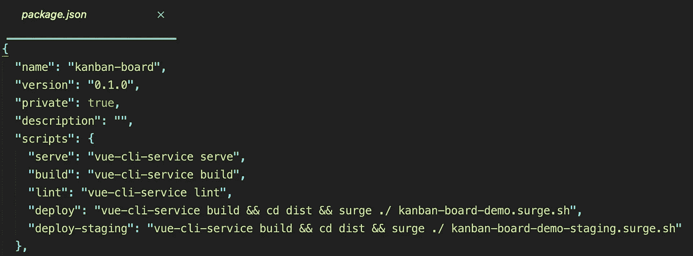

NPM 命令

`deploy` npm 命令将使用`vue-cli-service`构建 app，切换到`dist`目录，然后使用`surge` CLI 命令将 app 部署到`Surge.sh`。您可以运行以下命令来部署您的应用程序。

```
$ npm run deploy
```

`deploy-staging` npm 命令执行完全相同的操作，只是它被配置为将应用程序部署到不同的 URL。

```
npm run deploy-staging
```

请注意，您需要更改部署 URL 的。如果要部署到 surge.sh。

## 使用 netlify 的连续部署设置

部署到`Netlify`并为您的应用程序设置持续部署非常简单。使用`Netlify`的持续部署提供了最少摩擦和极其高效的工作流来构建应用程序。

通过持续部署，`Netlify`将使用您选择的 Git 提供者(Github，Gitlab，BitBucket)设置 webhooks，以接收关于您的在线 Git 存储库中提交的通知。

当你向一个在线 git 存储库推送一个新的提交时，`Netlify`会收到来自 webhook/s 的通知，这将触发`Netlify`机器人获取你的最新代码，然后构建并部署应用。

这是一次性的设置，可以简化应用程序的部署，甚至使应用程序开发过程变得愉快。

## 设置连续部署的步骤

在继续之前，请确保您已经在 Github、Gitlab 或 BitBucket 上创建了一个在线存储库，并将最新的代码推送到该存储库。

现在，前往[netlify.com](https://www.netlify.com/)创建你的账户。如果您已经有帐户，请随意跳过这一步。

在您登录到`Netlify`之后，您可以使用`New site from Git`按钮从您的存储库中创建一个站点。

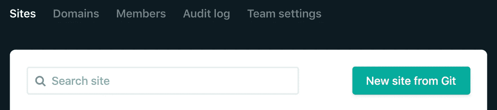

**站点- >** `**New site from Git**` **按钮**

一旦你点击按钮，然后`Netlify`将引导你通过一个三步的过程来建立你的网站。

## 步骤 1:连接到 Git 提供者

在下面的图片中，您可以选择一个 Git 提供者，在那里您已经创建了您的代码库。`Netlify`然后将向 Github 提供商进行认证，并要求您授权必要的权限。

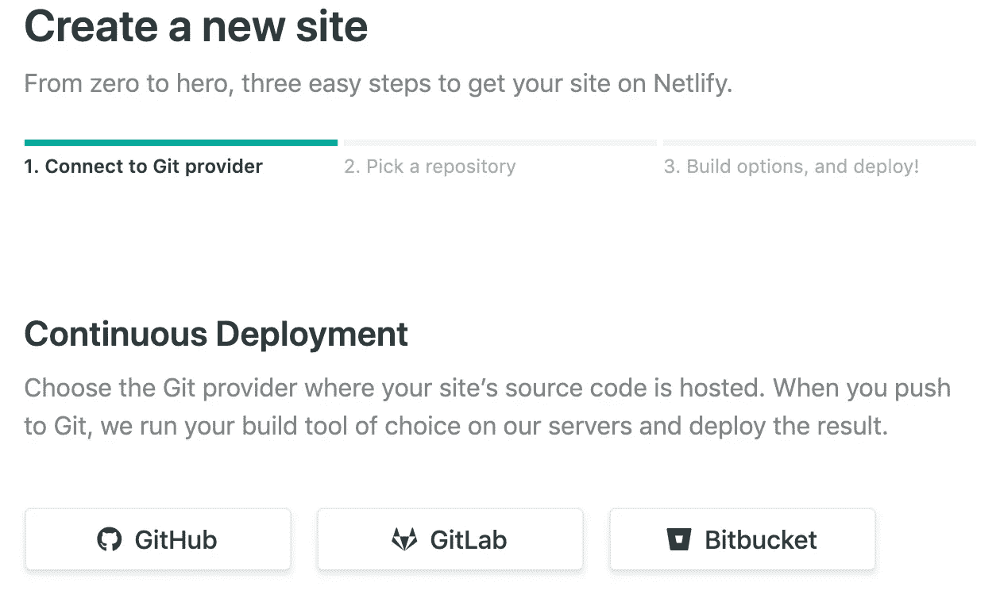

**连接到 Git 提供者**

## 步骤 2:选择一个存储库

在您授权了`Netlify`之后，您可以选择您想要部署的存储库。在我的例子中，我选择了`task-management-app`存储库。

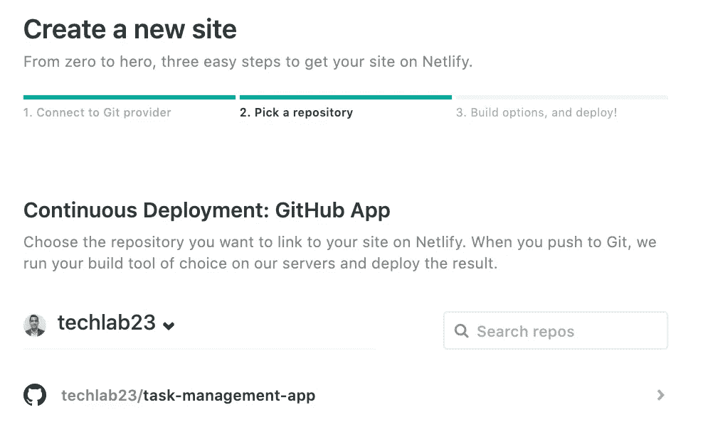

**挑选一个储存库**

## 步骤 3:构建选项和部署

在这一步中，我们将配置持续部署构建设置。

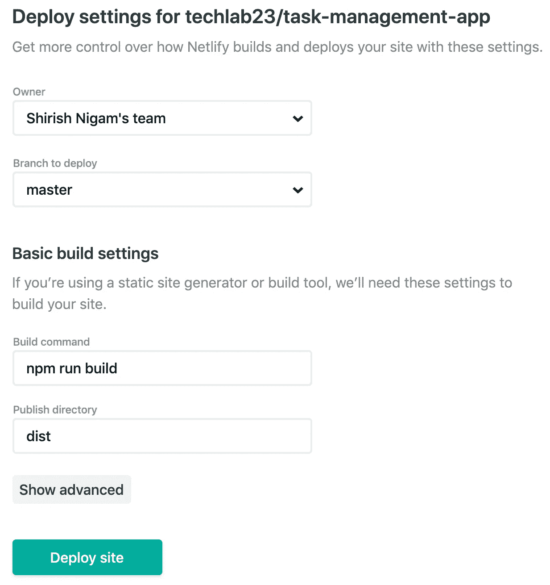

**持续部署构建设置**

您可以选择要部署的分支。默认情况下，`Netlify`将`master`分支视为`production`。对于构建设置，我使用`npm run build`作为构建命令，并使用`dist`文件夹进行部署。

一旦你完成了这一步，那么`Netlify`将设置 webhooks 按照这个顺序执行下面的动作。

*   要从 Git 提供者接收提交信息，
*   从 Git 仓库中提取代码并构建它
*   以随机名称将其部署到新站点。

## 更改网站名称

为了给站点起一个更有意义的名字，你可以转到`settings->site details`部分并点击`Change site name`按钮。

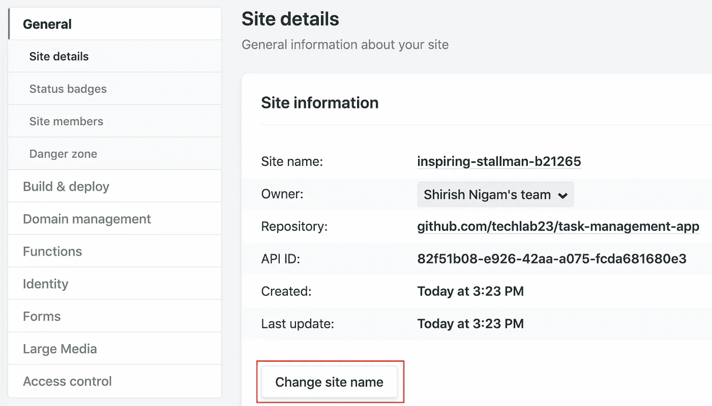

设置->站点详细信息->更改站点名称

这就是使用`Netlify`设置持续部署所需要做的全部工作。

现在，每当你向主分支提交时,`Netlify`就会自动拉取、构建和部署你的应用。

## 部署另一个 Git 分支

有些情况下，当您在另一个 Git 分支中工作(例如，开发或登台)并且想要在推进到生产分支之前首先进行部署和测试，那么您也可以为项目的单个分支设置连续部署，如下所示。

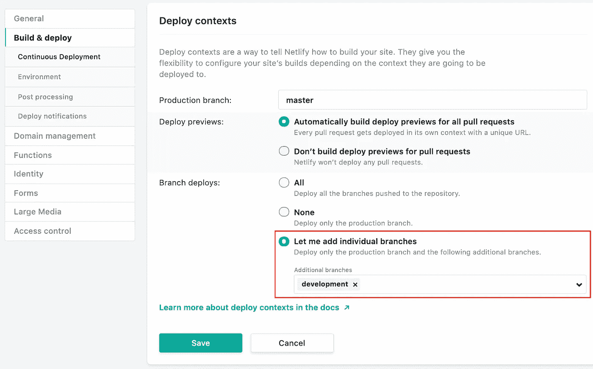

设置好之后，当您提交到`development`分支时，`Netlify`将从`development`分支中提取代码，然后自动为您构建和部署。

根据配置的站点名称和选择的分支，您将获得该分支的站点 URL。分支机构的站点 URL 遵循一定的格式。

`https://<branch-name>--<site-name>.netlify.com`

**例如:**如果你的分支名称是`development`，站点名称是`task-management-app`，那么部署 URL 将会是，

`https://development--task-management-app.netlify.com`

## 通过 netlify.toml 构建配置

除了在创建站点时提供构建设置之外，您还可以在项目的根文件夹中创建一个`Netlify`配置文件`netify.toml`。该文件用于覆盖构建和部署设置，并为`Netlify`构建机器人提供额外的站点配置设置。

这里是我们项目中使用的`netlify.toml`文件的例子。

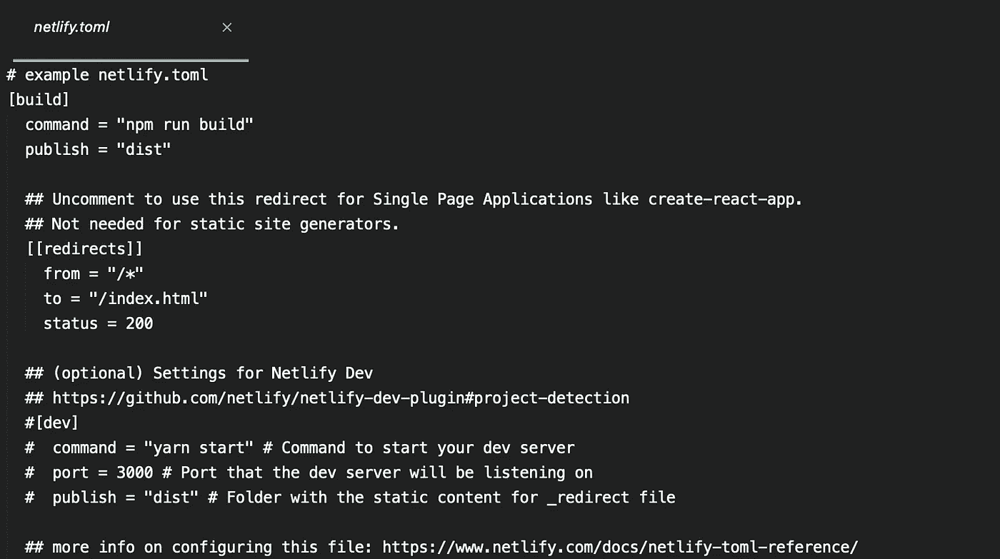

netlify.toml

在`netlify.toml`文件中，我们有`build`和`redirects`部分。在构建部分，我们提供了一个`command`来构建项目，并提供了`publish`来发布目录。`redirects`部分用于定义网站的重定向规则。这里是关于`[netlify.toml](https://www.netlify.com/docs/netlify-toml-reference/)`文件的文档。

在`Surge.sh`上部署应用程序非常简单，非常适合静态网站、个人作品集、原型和演示等。

相比之下，`Netlify`为您的应用程序提供了一个完整的平台，并提供了卓越的开发者体验。`Netlify`无论是开发爱好类 app，还是企业级应用，都适合。在`Surge.sh`和`Netlify`上部署这个应用程序后，我享受到了`Netlify`提供的无缝开发体验，从 Git 存储库中连续部署应用程序。

# 结论

在这个由两部分组成的系列文章中，我们了解了设计复杂用户界面的幕后过程和技术，以及将较大的界面分解成较小的专用和通用/可重用组件的几种方法，这有助于我们分阶段构建应用程序。我们还了解到，考虑每个组件的责任有多重要，因为通常情况下，组件的责任满足应用程序中的一个特性。

当我们需要在多个组件之间共享应用程序数据时，我们使用 Vuex 来管理共享数据的应用程序范围状态。除了使用 EventBus 模式来简化整个应用程序中的组件通信，我们还使用插槽来构建可重用的组件。

在应用程序环境中，我们讨论了拖放功能的实现、使用 Vee-Validate 的表单验证、用于设备检测的自定义 Vue.js 插件、捆绑包优化以及通过持续部署管道将应用程序部署到 Surge.sh 和 Netlify 以简化开发工作流程。

虽然所有关键的前端功能都在应用程序中实现，但您可以添加更多的功能，如任务项中的图像上传支持，允许存储任务的优先级标签，按日期或优先级排序等，以扩展应用程序，甚至开发您选择的后端，使该应用程序与数据库连接。

如果你错过了上面应用程序代码的链接，这里是 [Github 库](https://github.com/techlab23/task-management-app)。

如果你是初学者，想更好的理解 Vue.js，那就用 Vue.js 读《组件中的 [**思维》。**](https://medium.com/@_shirish/thinking-in-components-with-vue-js-a35b5af12df)

> 由于这篇文章不是 medium 的计量付费墙的一部分，请通过在你的网络中分享它来帮助我接触更多的人，如果你觉得慷慨，那么给这篇文章更多的掌声。
> 
> 也别忘了在推特上关注我 [@_shirish](https://twitter.com/_shirish) 。