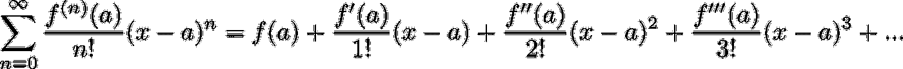
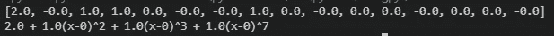
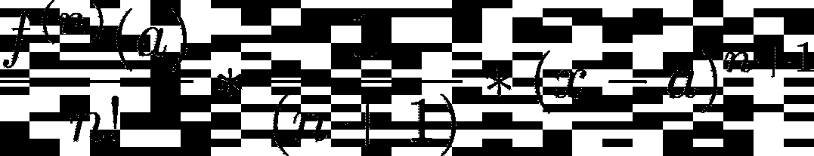

# Python 中的泰勒级数

> 原文：<https://levelup.gitconnected.com/taylor-series-in-python-4354e448c1cc>

函数的[泰勒级数](https://en.wikipedia.org/wiki/Taylor_series)是一个无穷多项的和，它使用关于函数导数的信息来创建一个逼近该函数的多项式。更精确的近似可以通过取高阶导数和使用高阶多项式来确定。许多[关于](https://medium.com/search?q=taylor%20series)[泰勒级数](https://www.cantorsparadise.com/taylor-series-and-the-power-of-approximation-7d2c16596f89)的帖子(以及[一些 YouTube 视频](https://www.youtube.com/watch?v=3d6DsjIBzJ4&ab_channel=3Blue1Brown))通过展示高阶项如何提供更接近基础函数的近似值(假设级数收敛)来帮助建立对无穷级数的直觉。然而，没有多少表明为什么我们真的应该关心。

照片由[吕山德·袁](https://unsplash.com/@lysanderyuen?utm_source=medium&utm_medium=referral)在 [Unsplash](https://unsplash.com?utm_source=medium&utm_medium=referral)

当我在攻读本科学位期间第一次面对泰勒级数时，它们似乎只是另一回事。最近，在准备 GRE 数学科目考试时，我对泰勒级数有了更深的理解，并决定用 Python 实现它们。这种实现只需要被逼近的函数的定义，其余的用数字处理。在这篇文章中，我们将讨论和展示 Python 的实现，以及泰勒级数的一些潜在用途。

# 履行

函数的泰勒级数项 *f(x)* 需要连续的高阶导数 f^(n)(x 来确定多项式的系数。因此，一个泰勒级数只有对 *f(x)* 无穷可微才能确定。级数的项由下式给出

其中 *a* 是泰勒级数的中心。当级数的中心为 0，即 *a=0* 时，该级数也称为马克劳林级数。

为了能够以编程方式确定函数的泰勒级数，我们真正需要做的就是确定系数

对于足够多的术语。请注意，我们在泰勒级数中使用的项越多，近似值就越精确。幸运的是，在 [scipy Python 包](https://docs.scipy.org/doc/scipy/getting_started.html)中，有一个内置函数，用于计算函数在指定点的导数。我们将使用这个函数来确定多项式的系数。

在上面的逻辑中，我们首先定义一个类来存储泰勒级数信息。构造函数将一个指针指向一个*函数*，我们正在为其寻找泰勒级数、泰勒级数的*阶*(即项数)，以及级数的*中心*，该级数默认为 Maclaurin 级数。在[*scipy . misc . derivative*函数](https://docs.scipy.org/doc/scipy/reference/generated/scipy.misc.derivative.html)中使用了一些动态计算的变量。立即调用私有的 *__find_coefficients(…)* 方法来确定泰勒级数中每一项的系数值。这是通过在数值上确定泰勒级数的每一项的导数并除以阶乘来实现的，如上所述。

实际上，这就是用 Python 表示泰勒级数所需要做的全部工作。泰勒级数的其余能力将仅仅使用这些系数来执行不同的运算。在此之前，让我们通过确定一些多项式的系数来验证这是可行的(泰勒级数应该是精确的函数)。为了验证这一点，定义了两个打印函数来查看系数和表示泰勒级数的结果方程。

第一个函数， *print_equation(…)* ，将泰勒级数打印为以级数中心为中心的方程。 *print_coefficients(…)* 将只打印代表系数的列表，而 *get_coefficients(…)* 将返回该列表。

下面的代码用于查找代表 Python 函数 *f(x)* 中函数的泰勒级数的系数

运行此逻辑将产生一个大小为 15 的列表，其中包含泰勒级数的系数，还将打印多项式方程。在这种情况下，用 15 项泰勒级数“逼近”的函数为

由于这只是一个多项式，泰勒级数应该能够通过第一个系数(常数)为 2.0、索引 2、3 和 7 处的系数为 1.0 以及其他所有地方的系数为 0.0 来准确表示。这将代表上面所示的多项式。实际上，运行该脚本会产生以下输出

上面 Python 脚本的输出显示系数确定正确，原始多项式由泰勒级数生成。

为不同的多项式更改上面 Python 脚本中的函数 *f(x)* 会产生相同的结果，每个多项式都精确地用泰勒级数表示。这不是很有趣，但这是验证逻辑是否如预期那样工作的好方法。泰勒级数广为人知的更有趣的函数，例如 sin(x)，cos(x)，e^x 等。，也通过这种实现提供正确的结果。这些功能将在以下应用中使用。

# 应用程序

因为多项式通常比大多数函数更容易处理，所以泰勒级数近似有助于确定与这些函数相关的不同运算的近似值。

# 无效的

## 区别

函数的泰勒级数可以用来逼近函数在特定点的导数。泰勒级数中的各项可以单独微分，其形式如下

其简单地是通过幂法则的多项式项的导数乘以泰勒级数的系数。请注意，在代码中，这将剔除泰勒级数未表示的项，因为系数将为 0。

这些计算是在 Python 逻辑中用下面的函数完成的

在这个函数中，函数的导数的近似值是通过迭代系数，如上所述计算导数值，并将它们相加得到的。将值插入到该函数中提供了基础函数的导数的精确近似值，如下所示用于 *cos(x)*

如此处所示，使用值 0、pi/6、pi/4、pi/3、pi/2、pi，并显示函数值 cos(x)和近似导数(注意，实际导数为-sin(x))。观察几个点，我们发现，一般来说，这给出了 cos(x)在这些点的导数的良好近似值。例如，在点 pi/4 处，函数值是 0.707 = sqrt(2)/2 是正确的，因为它的导数是-0.707。

不幸的是，这基本上是无用的，因为泰勒级数需要关于导数的信息来确定其系数。当我们需要知道*f’(x)*的一般形式(即实际值)来确定这个近似值时，为什么我们想要一个*f’(x)*的近似值呢？此外，有许多不同的数值方法可以近似计算导数，而不需要通过分析找到函数的导数(例如有限差分方法)，这些方法更适合这项任务。

# 更有用

## 价值逼近

泰勒级数的一个广泛使用的目的是逼近基础函数的值。为了逼近函数值，该值被插入到泰勒级数项中，这些项相加在一起。这是在下面的 Python 逻辑中完成的。

## 定积分

泰勒级数可以用来近似基本函数的积分，因为泰勒级数的各项可以单独积分，就像微分一样。积分近似值中的各项将采取以下形式

这里再一次，这只是积分的幂律乘以泰勒级数系数。

然而，在数值上，我们只能确定函数的定积分，否则，缺少积分常数的值会导致不正确的结果。考虑以 0 为中心的泰勒级数 f(x) = sin(x)

将这一项一项地积分得到以下多项式

现在，假设这是对 *sin(x)* (我们知道实际积分是 *-cos(x)* )的积分的适当近似，并尝试在 0 处评估该函数。这样做的价值是 0。在这种情况下，这可以通过设置积分常数 *C=-1* 来弥补，但我们必须为函数定义域中的每个值确定该常数，以“修复”积分，这使得不定积分变得毫无用处。

另一方面，定积分可以通过对泰勒级数逐项积分并插入积分极限来轻松计算，如下面的 Python 代码所示。

对几个值运行该函数，可以得到 sin(x)、cos(x)、x + x、e^x 以及一个更难积分的 e^x*sin(x).的理想结果由于这篇文章的长度，这些结果将被省略。对于那些好奇的人来说，下面可以使用完整的代码，并且可以更改 *def f(x)* 函数来亲自查看这些结果。

## 限制

我不会展示如何用数字来近似极限并在 Python 中实现它，而是仅仅看一个极限的例子，这个例子可能很难通过分析来确定，但可以通过代入泰勒级数很容易地找到。

考虑极限

这个极限可以很容易地通过重复应用 L'Hospitals 规则来确定，因为它具有 0/0 的形式，但是让我们假设我们不知道这个(或者我们对 L ' hospitals 规则一无所知)，那么我们将如何确定这个极限呢？事实证明，泰勒级数可以通过用近似值代替极限中的 *sin(x)* 来帮助我们解决这个问题。对于这个例子，将使用一个三项泰勒级数

由于极限中的 x /120 项变为 0，因此结果为-1/6，如果通过 L'Hospitals 进行评估，结果与预期一致。

# 结论

上面介绍的是泰勒级数的概念，这是一种数学工具，用于仅使用关于函数导数的信息，用多项式逼近任何连续可微函数。提供了一个 Python 实现，并讨论了泰勒级数的一些应用。下面提供了带有一些示例用法的完整代码，我鼓励对该工具感兴趣的任何人复制并使用它，以进一步了解泰勒级数。

# 完整代码

## 用法. py

## 泰勒系列. py

*原载于 2021 年 10 月 3 日*[*【https://www.anthonymorast.com】*](https://www.anthonymorast.com/blog/2021/10/03/taylor-series-in-python/)*。*