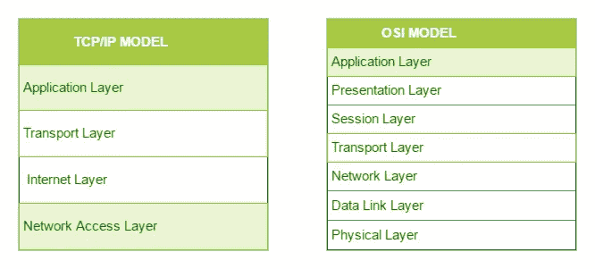
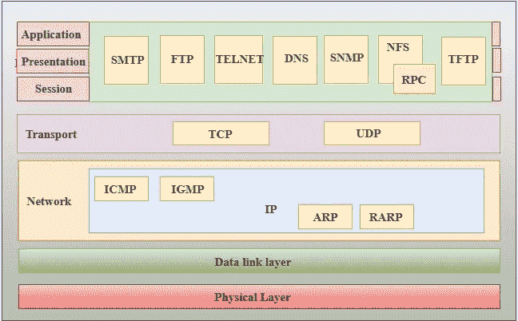

# 网络通信的 TCP/IP 模型

> 原文：<https://levelup.gitconnected.com/tcp-ip-model-for-network-communication-9838b33a48e1>

## **T** 传输 **C** 控制 **P** 协议(TCP)是最常见的网络协议，它使用互联网协议(IP)来创建面向连接的通信，这有助于网络设备之间共享消息。让我们检查一下 TCP/IP 模型的细节

照片由 [Jainath Ponnala](https://unsplash.com/@jainath?utm_source=unsplash&utm_medium=referral&utm_content=creditCopyText) 在 [Unsplash](https://unsplash.com/s/photos/network-protocols?utm_source=unsplash&utm_medium=referral&utm_content=creditCopyText) 上拍摄

在了解 TCP/IP 模型之前，您需要对 OSI 模型及其各层有一个基本的了解。点击这里查看我关于 OSI 模型[的博客。](/functions-of-networking-system-osi-model-e596705f0f6c)

# 什么是 TCP/IP？

如前所述，TCP 代表传输控制协议，IP 代表互联网协议。这个 TCP/IP 模型是在 20 世纪 60 年代 OSI 模型之前开发的。如 OSI 模型中所讨论的，只是网络间通信的一个概念。它被设计成通过将通信过程分成七个简单的层来保持通信。但是在 TCP/IP 中，只考虑了从 OSI 模型派生出来的四层。

TCP 将来自应用程序/服务器的消息分成数据包，然后由交换机、路由器和安全网关等网络设备转发到目的地。TCP 对每个数据包进行编号和重组，然后将其传递给应用程序/服务器接收器。因为它是面向连接的，所以它确保在发送和接收消息的应用程序/服务器之间的交换完成之前形成并保持链接。

# TCP/IP 模型的层次

TCP/IP 模型有四层，类似于 OSI 模型，描述如下:

1.  应用层
2.  传输层
3.  互联网层
4.  网络接入层

极客对极客:TCP/IP 和 OSI 的比较

## 网络接入层

TCP/IP 模型的底层。这一层是使用 OSI 模型的数据链路和物理层设计的。网络接入层的主要目的是检查硬件寻址和网络接入层允许数据物理传输的协议。这一层的协议有以太网、令牌环、FDDI、X.25 和帧中继。此外，ARP 也包含在这一层中，但是在将 ARP 协议分配给网络接入层和互联网层时会出现混淆。因此，它可以被描述为驻留在 3 层中，但由 2 层协议封装。

## 互联网层

这一互联网层类似于 OSI 模型中的网络层。互联网层协议的职责是将数据逻辑传输到整个计算机网络。对逻辑传输的简单理解是从任何网络发送数据包，而不依赖于它们遵循的路由。

在互联网层中可以识别出以下协议。

1.  **IP**—**I**internet**P**rotocol 是通过验证报头中的 IP 地址来共享从主机到目的地源的数据包的主要负责协议。IP 地址有两个主要版本。

IPv4 : IPv4 是最常见的 IP 地址版本，目前大多数网站都在使用这个版本。但是 IPv4 地址受到用户数量的限制

IPv6 是 IP 地址的一个不断发展的版本，它有助于减少限制。

2. **ICMP** — ICMP 协议代表 **I** 互联网 **C** 控制 **M** 消息 **P** 协议。它负责向主机提供有关网络问题的知识，并封装在 IP 数据报中。

3. **ARP — ARP** 代表 **A** 地址 **R** 分辨率 **P** 协议。它旨在从已知的 IP 地址中识别主机的硬件地址。APR 有自己的内部层，即反向 ARP，代理 ARP，无偿 ARP 和反向 ARP。

## 传输层

传输层与 OSI 模型中的传输层相同。这一层的主要职责是控制端到端的无错数据通信。此外，传输层必须是可靠的来源，并且应该能够控制通信中的数据流。传输层内部有两种主要协议。

1.**TCP——传输控制协议**是一种面向连接的可靠方式，可提供无错误的端到端数据传输。它执行数据分段和排序。它还具有确认功能，并使用流控制系统来控制数据流。这是一个非常强大的协议，但是由于这些特性，它有很大的开销。增加的开销意味着更高的成本。

2. **UDP —** 与面向连接的协议 TCP 不同，**用户数据报协议**为端到端的数据传输提供无连接服务。但是它可以被识别为不可靠的协议，因为它包含一些非特定的错误。所以可以性价比高。

## 应用层

TCP/IP 模型中的顶层执行 OSI 模型中最上面三层(应用层、表示层和会话层)的功能。它控制着节点到节点的连接和用户界面需求。 **HTTP、HTTPS、FTP、TFTP、Telnet、SSH、SMTP、SNMP、NTP、DNS、DHCP、NFS、X Window** 和 **LPD** 是这一层中的一些协议。

当应用层要与另一层通信时，它会将数据转发到传输层。在应用层，有一些不确定性。除了与通信系统通信的应用程序之外，任何应用程序都不能放在应用层中。例如，当 web 浏览器使用 HTTP 协议(一种应用层协议)与网络进行交互时，不能将文本编辑器视为应用层协议。下面是这一层的一些主要协议。

1.  **HTTP 和 HTTPS-**HTTP 代表超文本传输协议。万维网利用它来处理浏览器和服务器之间的联系。HTTPS 代表超文本传输协议安全。它是 HTTP 和 SSL(安全套接字层)的混合体。当浏览器必须填写表单、登录、验证和进行金融交易时，这很有用。
2.  **SSH-** Secure Shell (SSH)是 Secure Shell 的缩写。这是一个终端模拟器软件，工作方式类似于 Telnet。建立加密链接的能力是 SSH 受欢迎的原因之一。它使用 TCP/IP 连接建立安全链接。
3.  **NTP-** 网络时间协议(NTP)是网络时间协议的缩写。它被用来同步我们所有计算机的时钟到一个单一的标准时间源。在银行转账等情况下，它会派上用场。考虑以下没有 NTP 的情况。考虑一个交易，其中您的机器在下午 2:30 读取时间，但服务器在下午 2:28 记录它。如果服务器过载，它可能会灾难性地崩溃。

javapoint.com 的 TCP/IP 层的功能

# TCP/IP 与 OSI 的主要区别

1.  TCP/IP 指的是传输控制，OSI 指的是开放系统互连
2.  TCP/IP 层由四层组成，这四层是从 OSI 模型的七层中派生出来的
3.  当考虑可靠性时，TCP/IP 比 OSI 模型具有更高的可靠性
4.  OSI 模型有严格的界限，但 TCP/IP 没有这样的限制
5.  就方法而言，TCP/IP 遵循水平方法，而 OSI 遵循垂直方法。
6.  OSI 模型有不同的会话层和表示层
7.  在考虑开发时，TCP/IP 最初开发了协议，然后开发了模型。但是对于 OSI 模型来说，情况正好相反。
8.  TCP/IP 模型不提供数据包传送的保证，但是 OSI 模型中的传输层提供这种保证
9.  OSI 模型提供无连接和面向连接的服务，但在 TCP/IP 模型中只有网络层提供无连接服务
10.  在 TCP/IP 层，协议不容易被取代。但是在 OSI 模型中，协议可以随着技术的发展而改变。

***详情请参考以下文章..***

1.  *TCP/IP 模型由* [*极客为极客*](https://www.geeksforgeeks.org/tcp-ip-model/)
2.  *计算机网络:TCP/IP 模型由* [*java 点*](https://www.javatpoint.com/computer-network-tcp-ip-model#:~:text=The%20TCP%2FIP%20model%20was,link%20layer%20and%20physical%20layer.)

*快乐编码！！！*