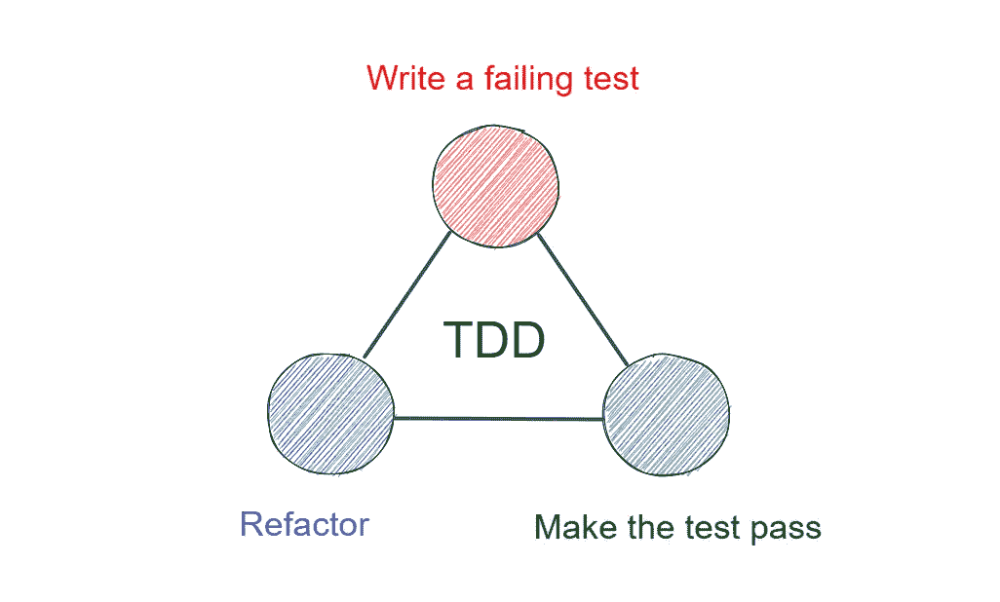

# TDD 可以让你成为更好的程序员

> 原文：<https://levelup.gitconnected.com/tdd-can-make-you-a-better-programmer-8098982e04>

## TDD 如何提高代码质量和生产率？

[JESHOOTS.COM](https://unsplash.com/@jeshoots?utm_source=medium&utm_medium=referral)在 [Unsplash](https://unsplash.com?utm_source=medium&utm_medium=referral) 上拍照

也许你听说过 TDD，也许没有，但没关系。这篇文章将告诉你关于 TDD，以及如何正确有效地使用它，让你成为更好的程序员。

# 什么是 TDD？

TDD 是**测试驱动开发**的缩写。因[肯特·贝克](https://en.wikipedia.org/wiki/Kent_Beck)的知名软件工程书籍《*极限编程讲解*》而在业内广为人知。这是一本介绍一种软件开发方法的重要著作:[极限编程](http://en.wikipedia.org/wiki/Extreme_programming)。

极限编程之所以被称为“极限”，是因为其背后的思想是将好的实践推到极限。TDD 是一个非常好的实践。

下图是一个经典的 TDD 模型:

从上图也可以看出，TDD 有三点:

1.  为该特性编写一个失败的测试
2.  为该特性编写正确的代码以通过测试
3.  重构代码

很多人认为 TDD 就是先写测试，再写代码。这种理解是错误的。先写测试，后写代码是指测试优先的开发。而不是测试驱动的开发。

两者的区别在于“**驱动**”，更确切的说，两者有一步之差:

> 重构**！**

在日常开发中，许多人通过了测试，认为特性已经结束了。这其实是忽略了新代码可能带来的“[代码味](https://en.wikipedia.org/wiki/Code_smell)”。

而重构可以让代码变得更好，消除那些“代码味”。它与测试一起工作，“驱动”你写更好的代码。

这也意味着测试和重构是相辅相成的。没有测试，只有可怕的重构。没有重构，代码的杂乱会逐渐增加，测试会变得越来越复杂。

# 如何做好 TDD？

如果你想做好 TDD，那就来看看高手们是怎么做的吧。

随着 TDD 变得越来越流行，Kent Beck 写了一本关于 TDD 的书，名为“*测试驱动开发*”。这本书的主要精髓是**任务分解**。

当肯特·贝克面临一个大任务时，他会把它分解成几个小任务，并把它们写在一个清单上。然后他开始写测试，写代码，重构。每个小循环完成后，划掉已完成的任务，开始下一个。

一旦他在做小任务的过程中遇到任何新的问题，他都会把问题记录在检查表上，确保问题不丢失。然后他会回来做这件事。当他一个一个完成任务，问题就解决了。

似乎很容易，不是吗？

但在实际操作中，大多数人做不到。为什么？

**原因是 Kent Beck 将任务分解得足够小，以确保代码可以在每个任务完成后提交。**

升级一个依赖版本，做一个变量名的更改可以是一个单独的任务，你可能觉得不值得做一个单独的事情。但这也有好处，那就是:

> 它让您编写目标测试，并保证您可以随时停止。

那么这有什么好处呢？

**这确保了你关注的内容是有限的，所以你可以更清楚地思考这些内容的细节。对于大多数人来说，可以考虑的问题规模是有限的，很难面面俱到。**

而且每一个被分解改动的代码都不会太多，这样会把影响控制在可控范围内。

# 更好的程序员

所以 TDD 给我们带来了新的软件开发思路。将任务分解成足够小的部分，不断循环“编写测试”、“通过测试”和“重构”这三个步骤。这不仅促使我们提高代码的质量，也提高了我们的生产率。

所以如果你想成为一个更好的程序员，就从 TDD 开始吧！

*今天就到这里。我是 Zachary，我将继续输出与 web 开发相关的故事。如果你喜欢这样的故事，想支持我，请考虑成为* [*中会员*](https://medium.com/@islizeqiang/membership) *。每月 5 美元，你可以无限制地访问媒体内容。如果你通过* [*我的链接*](https://medium.com/@islizeqiang/membership) *报名，我会得到一点佣金。*

你的支持对我来说非常重要——谢谢。