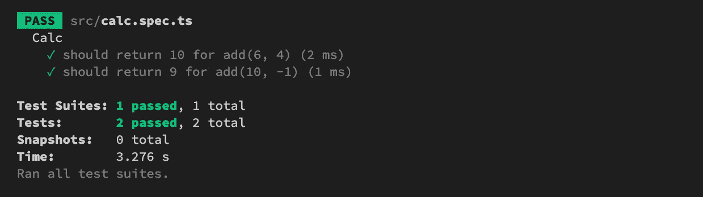

# 带有 Typescript 和 Jest 的 TDD:Starter 项目

> 原文：<https://levelup.gitconnected.com/tdd-with-typescript-and-jest-starter-project-cca94fd089f5>


Adi Goldstein 在 [Unsplash](https://unsplash.com/?utm_source=medium&utm_medium=referral) 上拍摄的照片。

这是第一篇用 Typescript end Jest 建立后端项目的文章。

这不是一个系列，但我会用 Typescript 和 Jest 发布一些关于 TDD 的文章。这意味着，用 Typescript“重新”写一些例子，并遵循 TDD 风格。这篇文章将成为同类文章的第一篇。

# 创建并初始化项目

让我们用这个命令创建一个简单的 nodejs 项目:

```
npm init -y
```

该命令将生成`package.json`文件。

# 安装开发依赖项

我们将在这个项目中使用 Typescript，然后`typescript`是第一个依赖项。

```
npm install typescript -D
```

`-D`选项表示`typescript`仅用于开发。

# 配置 TypeScript 编译器

`Typescript`将把`ts`代码转换成`js`代码，输出的代码将遵循一些规则，我们需要为我们的项目定义规则。

生成默认的`tsconfig.json`文件:

```
npx tsc --init
```

`tsconfig.json`将使用一些默认设置创建文件。作为一个普通的 Typescript 项目，配置文件将如下所示:

```
{
  "compilerOptions": {
    "target": "es5",
    "module": "commonjs",
    "sourceMap": true,
    "outDir": "./dist",
    "rootDir": "./src",
    "strict": true,
    "esModuleInterop": true,
    "skipLibCheck": true,
    "forceConsistentCasingInFileNames": true
  },
  "exclude": [
    "node_modules",
    "**/*.spec.ts"
  ]
}
```

# 添加构建命令

当您希望将项目部署为普通的 Javascript 项目时，您必须将项目转换为目标 Javascript 代码。为了简单起见，让我们创建一个 npm 脚本来构建您的项目。在您的`package.json`中，更新`scripts`块:

```
"scripts": {
    "build": "tsc",
},
```

从现在开始，您可以通过命令`npm run build`构建您的脚本。其实同样的事情你还有另外一种方式，但我觉得这是一种常见的方式。

# 添加一个简单的类型脚本代码

为了确保您以正确的方式进行操作，我们将创建一个简单的示例来检查它。

在您的项目中，创建一个路径和名称为`src/calc.ts`的文件(所有 ts 文件将存储在`src`文件夹下)。

```
class Calc {
  add(a: number, b: number): number {
    return a + b;
  }
}export default new Calc();
```

带有函数的简单类— `add`。

运行构建命令`npm run build`。如果一切正常，您将在`dist/calc.js`看到输出文件

# 添加和配置 Jest

这是一个重要的部分，因为我们将使用 Jest 作为这个项目的测试运行程序。

安装 Jest 和 Jest 类型定义:

```
npm i -D jest ts-jest @types/jest
```

`jest` — [测试运行器，测试框架](https://jestjs.io/)

`ts-jest`—[Jest 的打字稿预处理支持](https://github.com/kulshekhar/ts-jest)

`@types/jest` —对笑话的类型定义。

Jest 的配置:在项目的根目录下创建`jest.config.js`文件。

```
module.exports = {
  roots: [
    "<rootDir>/src"
  ],
  testMatch: [
    "**/__tests__/**/*.+(ts|tsx|js)",
    "**/?(*.)+(spec|test).+(ts|tsx|js)"
  ],
  transform: {
    "^.+\\.(ts|tsx)$": "ts-jest"
  },
  collectCoverageFrom: [
    "**/*.{js,jsx,ts,tsx}",
    "!**/*.d.ts",
    "!**/node_modules/**",
  ],
  globals: {
    "ts-jest": {
      tsconfig: "tsconfig.json",
    },
  },
}
```

最后，添加一个测试命令:我们向`package.json`的脚本块添加一个新命令:

```
"test": "jest"
```

# 简单测试用例

如果您运行`npm run test`，它将抛出一个错误，因为项目不包含任何测试用例。

现在，我们将为`add`函数创建一个测试用例。我的建议是在产品文件附近创建一个单元测试文件。创建`src/calc.spec.ts`(接下来是`src/calc.ts`)。`.spec.ts`使这个文件成为一个单元测试文件(你可以使用`.test.ts`代替，这些关键字在`jest.config.js`的`testMatch`中定义)

```
import calc from './calc';describe('Calc', () => {
  test('should return 10 for add(6, 4)', () => {
    expect(calc.add(6, 4)).toBe(10);
  });test('should return 9 for add(10, -1)', () => {
    expect(calc.add(10, -1)).toBe(9);
  });
});
```

看起来很简单，`add`函数是一个纯函数，那么我们不需要`mock, spy...`任何东西。

再次运行测试`npm run test`。终端的结果应该类似于:



单元测试结果

这对于带有 Typescript 和 Jest 的 TDD starter 项目来说已经足够了，下面的部分是额外的选项，这些选项有助于保持项目看起来总是干净的。

# 埃斯林特

我们使用 Eslint 格式化代码，保持项目的编码标准。

安装 eslint 和插件

```
npm install eslint @typescript-eslint/parser @typescript-eslint/eslint-plugin -D
```

创建 eslint 配置(您可以通过回答一些问题运行`npx eslint --init`来创建 eslint 配置)

`.eslintrc.js`

```
module.exports = {
  "env": {
    "browser": true,
    "commonjs": true,
    "es2021": true
  },
  "extends": [
    "eslint:recommended",
    "plugin:[@typescript](http://twitter.com/typescript)-eslint/recommended"
  ],
  "parser": "[@typescript](http://twitter.com/typescript)-eslint/parser",
  "parserOptions": {
    "ecmaVersion": 12
  },
  "plugins": [
    "[@typescript](http://twitter.com/typescript)-eslint"
  ],
  "ignorePatterns": [
    "dist"
  ],
  "rules": {
    "no-console": 2,
  }
};
```

将 lint 命令作为 npm 脚本添加:

```
"lint": "eslint ./src --ext .ts"
```

# 强壮的

Husky 是一个小工具，它迫使你在使用 git 时做一些事情。

添加哈士奇:

```
npm install husky -D
```

为项目初始化 husky:

```
npx husky install
```

提交前添加钩子:(提交前运行命令)执行`npm run lint`

```
npx husky add .husky/pre-commit "npm run lint"
```

推送挂钩前添加:(推送前运行命令)执行`npm run test`

```
npx husky add .husky/pre-push "npm run test"
```

仅此而已！

# 摘要

我认为这对于一个起步项目来说足够了。我还把完成的源代码推送到 [Github](https://github.com/hoangsetup/ts-jest-tdd-starter) 。

在源代码中，我使用了 [Codetour vscode extension](https://marketplace.visualstudio.com/items?itemName=vsls-contrib.codetour) ，它允许您回放这个代码库的引导式遍历。

谢谢大家！