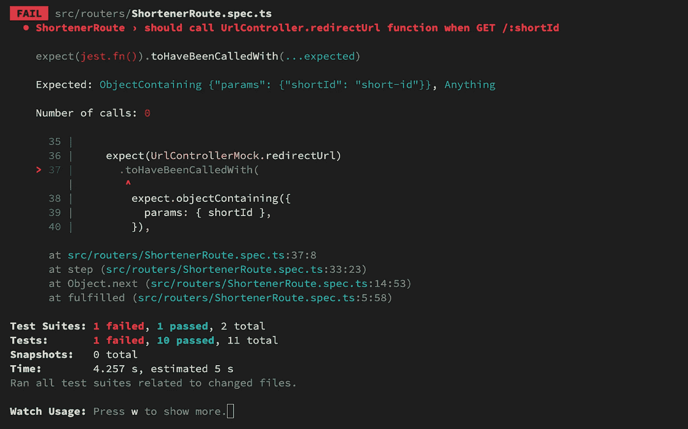
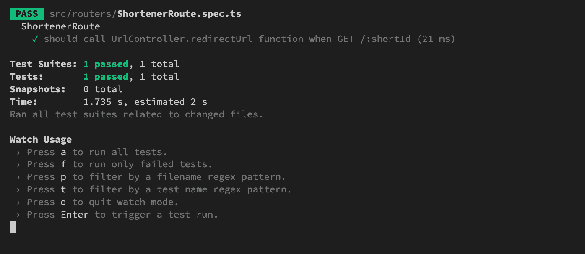
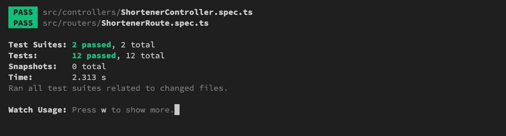
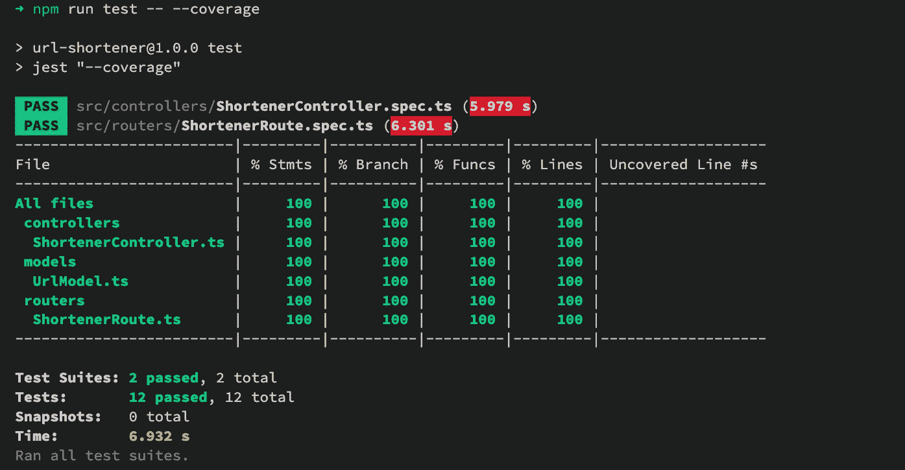

# 带有 Typescript 和 Jest 的 TDD:Url shorter

> 原文：<https://levelup.gitconnected.com/tdd-with-typescript-and-jest-url-shortener-6956e2387ce8>


[钳工](https://unsplash.com/@benchaccounting)在 [Unsplash](https://unsplash.com/?utm_source=medium&utm_medium=referral) 上拍照。

这是一个简单的项目——编写一个在 Nodejs 上运行的 API 服务。该服务是 URL 缩短服务。该服务也是使用 Typescript、Jest、Express 和 Mongoose 的 TDD 风格的一个例子。

# 创建并初始化项目

这个项目将基于 [TDD 与 Typescript 和 Jest: Starter 项目](https://hoangdv.medium.com/tdd-with-typescript-and-jest-starter-project-cca94fd089f5)。

只需从 [Github](https://github.com/hoangsetup/ts-jest-tdd-starter) 中克隆启动项目:

```
$ git clone [https://github.com/hoangsetup/ts-jest-tdd-starter](https://github.com/hoangsetup/ts-jest-tdd-starter.git).git url-shortener
$ cd url-shortener
$ npm ci
```

带`url-shortener`的是这个项目的名称。您也可以更新`package.json`文件中的项目名称。

```
{
  "name": "url-shortener",
  "version": "1.0.0",
  "description": "",
  "main": "index.js",
  ...
```

# 安装所需的依赖项

首先，让我们安装一些构建服务所需的外部依赖包。

```
$ npm install dotenv express mongoose shortid validator -S
```

我们需要它们的类型定义:

```
$ npm install @types/dotenv @types/express @types/mongoose @types/shortid @types/validator supertest nodemon -D
```

# MongoDB 服务

这是一个可选的部分，在这篇关于 TDD 的文章中，我试图把重点放在“如何编写单元测试？”。

我用 docker 运行了一个 MongoDB 服务实例，你可以随意用你的方式创建 DB 服务实例。

```
$ docker run -it --rm -p 27017:27017 mongo
```

# 简单快速服务器和 mongoose 模型

在这一步中，我们将使用 Express 创建一个 API 服务器，并设置一个开发环境。

## Api 应用程序类

该类将提供 express 的一个实例，该实例将与完整的功能一起导出。

创建`src/ApiApp.ts`文件:

我们可以通过`getApplication`函数获得 express 实例。

## 用于开发的服务器和设置

如您所见，我们需要一些逻辑来启动基于 express 应用程序的 HTTP 服务器。

创造`src/server.ts`

该文件是服务的起点。我们尝试连接到 MongoDB 服务，然后在来自`PORT`环境变量的端口或默认端口— 3000 上为应用程序提供服务。

它还需要`MONGO_URI`环境变量。您可以通过创建内容如下的`.env`文件来传递这些环境变量:

```
PORT=3000
MONGO_URI="mongodb://localhost:27017/url-shortener"
```

尝试启动服务器，首先我们要构建 TS 到 JS 的代码:

```
$ npm build
$ node ./dist/server.js
```

如果一切正常，您将看到如下消息:

```
listening on port 3000
```

并且，发送`GET /`请求你会得到一条问候信息:

```
$ curl --request GET '[http://localhost:3000'](http://localhost:3000')
{"message":"Welcome to our service!"}
```

# TimeDivisionDuplex 时分双工

我们将进入高级类，然后进入较低级别的依赖类。

对于每个文件或类，我们定义它的需求，然后尝试按照 TDD 风格实现需求。

总的来说，最小缩短 URL 服务的用户故事是:

*   缩短 URL——用户向我们的服务发送一个“长”URL，服务将返回一个短 id 字符串。
*   反转“短”url —用户使用浏览器请求短 id 字符串，如果 id 与目标 URL 映射，则将浏览器重定向到目标 URL。如果没有，则返回一个错误。

我们的项目将有这样的结构:

```
Router -> Controller -> Model
```

*   路由器:注册 HTTP 请求处理程序，它调用参数为`request, response`的`Controller`函数。
*   控制器:我们服务的主要逻辑，通过使用模型获取 URL 信息。
*   模型:定义 URL 文档模式，以便在 MongoDB 中使用`urls`文档。

## Url 模型

模型类就像一个配置，那么不需要为这个类编写测试。

URL 记录的主要属性:

*   `url` —字符串，目的 url。
*   `shortId` —字符串，目标 url 的缩写 id。

创建`src/models/UrlModel.ts`:

默认导出— `UrlModel`，用于在 MongoDB 中处理 url 文档。

`IUrlDocument` —从`UrlModel`查询返回的 url 项目的类型。

## 路由器

本课程的要求是:

*   导出和快速路由器实例
*   向路由器注册`GET /:shortId`，调用，并将`req, res`传递给`Controller.redirectUrl`。
*   向路由器注册`POST /`，调用，并将`req, res`传递给`Controller.shortenUrl`。

首先，通过创建规格文件`src/routers/ShortenerUrl.spec.ts`得到一个`Red code`

```
import ShortenerRoute from './ShortenerRoute';
```

**红色** : *找不到模块。/ShortenerRoute”或其相应的类型声明。*

通过创建生产代码文件— `src/routers/ShortenUrl.ts`修复**红色**代码

```
class ShortenerRoute {}export default new ShortenerRoute();
```

导出`ShortenerUrl`类的一个实例。

因为路由器类将调用控制器函数，但是控制器是另一个单元，所以在这个规范文件中我们必须模拟控制器的一些函数。

为此，我们将使用`jest.mock`函数— *在需要的时候用自动模仿的版本来模仿一个模块。*

对等级库文件的更新:

```
import ShortenerRoute from './ShortenerRoute';import UrlController from '../controllers/ShortenerController'; jest.mock('../controllers/ShortenerController');
```

**红色** : *找不到模块'*../controllers/shorter controller*或其对应的类型声明。*

通过创建生产代码文件— `src/controllers/ShortenerController.ts`修复**红色**代码

```
class ShortenerController {

}export default new ShortenerController();
```

我们使用[超级测试](https://www.npmjs.com/package/supertest)来触发快速路由器中的注册请求处理。

让我们在规范文件中编写第一个测试块——“ShortenerRoute”

```
import express, { Application } from 'express';
import { MockedObject, mocked } from 'ts-jest/dist/utils/testing';
import supertest from 'supertest';import ShortenerRoute from './ShortenerRoute';
import UrlController from '../controllers/ShortenerController';jest.mock('../controllers/ShortenerController');describe('ShortenerRoute', () => {
  const shortId = 'short-id';
  const expectedResponse = expect.anything(); let app: Application;
  let request: supertest.SuperTest<supertest.Test>;
  let UrlControllerMock: MockedObject<typeof UrlController>; beforeEach(() => {
    UrlControllerMock = mocked(UrlController);
    UrlControllerMock.redirectUrl.mockImplementation(async (_, res) => {
      return res.json({});
    });app = express();
    app.use(express.json());
    app.use('/', ShortenerRoute.getRouter());
    request = supertest(app);
  });
});
```

在“beforeEach”块中，我们重新实现了控制器的`redirectUrl`功能——只是完成一个请求。而且，我们必须创建一个 express 应用程序实例，将`ShortenerRouter`附加到应用程序中，由`suprertest`通过 app 测试路由器。

**红色:** *属性“redirectUrl”在类型“mocked object<shortener controller>上不存在。*

**红色:** *属性“getRouter”在类型“ShortenerRoute”上不存在*

最佳实践是:出现错误时立即停止，并在继续之前修复它。但是在本文中，我会尝试在转到另一个文件之前完成一个文件(spec 文件)中已完成的部分。

要修复**红色**代码，只需为控制器创建`redirectUrl`函数，为路由器创建`getRouter`函数。

```
class ShortenerController {
  async redirectUrl(req: Request, res: Response) {
    throw new Error('Not implemented yet!');
  }
}
export default new ShortenerController();
```

对管制员来说这就够了。这个时候不要在意`redirectUrl`函数的逻辑。

```
import { Router } from 'express';import UrlController from '../controllers/ShortenerController';class ShortenerRoute {
  private router: Router; constructor() {
    this.router = Router();
    this.setupRouter();
  } private setupRouter() { } getRouter() {
    return this.router;
  }
}export default new ShortenerRoute();
```

创建一个私有属性— `router`是一个快速路由器的实例，我们通过`getRouter`函数导出这个变量。

第一个测试用例——我们期望用`req`对象调用`redirectUrl`,该对象在其`params`对象中包含`shortId`。

```
it('should call UrlController.redirectUrl function when GET /:shortId', async () => {
  await request.get(`/${shortId}`); expect(UrlControllerMock.redirectUrl)
    .toHaveBeenCalledWith(
      expect.objectContaining({
        params: { shortId },
      }),
      expectedResponse,
    );
});
```

我们在 IDE 上没有得到任何错误，是时候运行测试脚本了:

```
npm run test -- --watch
```

`--watch` flag 帮助我们观察项目中的任何变化，并重新运行测试脚本。

如果一切运行“良好”,您将得到如下结果:



我们期望调用控制器函数，但是`Number of calls: 0`。

修复它，为`GET /:shortId`请求注册一个处理程序。更新路由器类的`setupRouter`功能

```
private setupRouter() {
  this.router.get('/:shortId', async (req, res) => {
    await UrlController.redirectUrl(req, res);
  });
}
```

保存文件，测试结果应该是这样的:



对第二条路线进行同样的操作，

测试规格:

```
it('should call UrlController.shortenUrl function when POST /', async () => {
  const body = { url: 'too-long-url' };await request.post(`/`).send(body);expect(UrlControllerMock.shortenUrl)
    .toHaveBeenCalledWith(
      expect.objectContaining({
        body,
      }), expectedResponse,
    );
});
```

生产代码:

```
this.router.post('/', async (req, res) => {
  await UrlController.shortenUrl(req, res);
});
```

我们已经完成了`ShortenerRouter`课。

## 控制器

本课程的要求:

*   函数`redirectUrl`
    -如果`shortId`不在请求中，响应状态 400，消息`shortId is not provide`
    -如果`shortId`不在 DB 中，响应状态 400，消息`shortId is invalid`
    -否则，将请求重定向到目的 url。
    -如果出现问题，响应状态 500，消息`Some thing went wrong!`
*   函数`shortenUrl`
    -如果`url`不存在于请求中，响应状态为 400，消息`url is not provided`
    -如果`url`不是有效的 url，响应状态为 400，消息`url is invalid`
    -否则，如果`url`已经存在于 DB 中，响应状态为 200，主体响应包括`url`和已存在的`shortId`
    -否则，如果`url`不存在于 DB 中，创建一个新的 url 项，将其保存到 DB 中，并响应

为了避免长篇大论，我将推出完整的规范文件和产品文件。

`src/controllers/ShortenerController.spec.ts`

生产文件:

`src/controllers/ShortenerController.ts`

最终测试结果:



使用`--coverage`标志执行测试时:

```
npm run test -- --coverage
```



## 将路由器应用于快速应用

因为现在，我们没有为`src/ApiApp.ts`编写测试，所以不能使用单元测试来检测缺失——我们还没有使用`ShortenerRouter`类。

当我们使用手动测试时，将会发现缺失。现在，让我们使用它。更新`ApiApp`类的`setupRouters`功能:

```
import router from './routers/ShortenerRoute';...
  private setupRouters() {
    this.application.get('/', (_, res) => {
      res.json({ message: 'Welcome to our service!'});
    }); this.application.use('/urls', router.getRouter());
  }
...
```

仅此而已！

# 摘要

当你得到至少一个“**红色代码”时，只需更新你的生产代码。**

该项目的完整代码已经发布在 [Github](https://github.com/hoangsetup/url-shortener) 上。

感谢您的阅读！