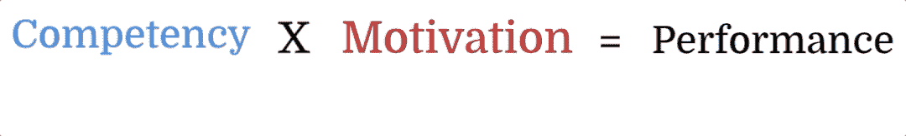
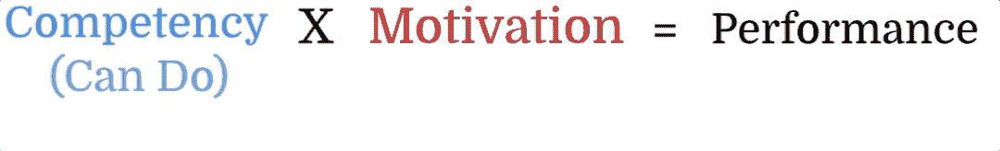
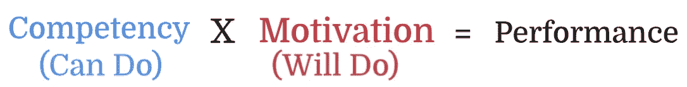

# 团队表现

> 原文：<https://levelup.gitconnected.com/teams-performance-6c4acd8cd3aa>

# 团队的表现有两部分:

*   **每个团队成员的个人表现**
*   **全队表演**

# 个人表现

在处理人的发展时，我们需要明白我们是在处理人类。光有技术是不够的。动机也是一个重要因素。

我一直使用下面的等式:

能力 x 动机=绩效

# 能力 x 动机=绩效

随着你能力和动力的提高，你会获得最佳的表现。

***能力=能做的事=已经需要的技能和知识。***

例如，如果有人向你提出用 50 万英镑建立一家电子商务公司，而你从未做过软件工程，你将无法做到这一点。即使你想做并且有动力，你也没有技能。

***动机=会做***

动机也一样。你可能有技能，但你没有动机。我一直在顶级性能中看到这一点。他们希望总是做令人兴奋的、有影响力的、新的事情。让他们一直处于遗留系统支持下将保证他们逃脱。

现在，我将讨论开发每个方程因子

# 发展一项能力

要培养一种能力，要么是缺乏教育可以帮助的知识，要么是一种技能，培训可以提高这种技能。这方面的一个例子是开车。如果你以前从未开过车，你首先需要学习交通规则和驾驶的基本知识。不过要开一段时间(培训)才会熟练。现在，我不认为驾驶的下一步是什么。它变成了自然——类似于软件工程。

# 现实生活中的例子

之前，在我的一个团队中，我们正在从单一服务转向 GraphQL 无服务器微服务。我的团队从未研究过我们使用的任何技术。因此，我开始让他们接受足够的教育和课程来获得知识。为了进行一些培训和实践，我要求他们获得 AWS 解决方案架构师证书，以便对不同的技术进行一些实际操作培训。最后，我让团队使用所需的技术构建概念验证和黑客马拉松项目。我开发了他们的知识和技能来完成这个案例中的工作。

您可以在以下文章和视频中找到有关该项目的技术细节的更多信息:

 [## 从整体架构迁移到微服务实际案例研究

### 在本文和附带的视频中，我将经历一次从……迁移的真实经历

medium.com](https://medium.com/nerd-for-tech/migrating-from-monolithic-architecture-to-microservices-hands-on-real-world-case-study-2aa81c579084) 

# 能力发展模型:

很久以前，我在微软参加了管理培训。我学到的一个有趣的模型是 JIT(工作指导培训)和它对软件开发的修改。这些年来，我能够调整模型，并使用*米勒的修改*，直到我想出一个很好的灵活模型用于能力发展。在过去的 15 年里，我一直在成功地应用这个模型。

1.  在需求最终确定之前尽早开始，了解项目可能需要的技能和技术(例如:GraphQL、无服务器、微服务设计……)
2.  调查好的培训材料和认证(例如:Udemy 和 AWS 认证)
3.  把团队作为一个整体来看，谁能采用哪种技术，谁能为此而努力。

4.让每个人做好准备，确保他们感到兴奋

5.指定课程的时间表

6.要求获得知识证书(熟能生巧)

7.通过概念验证或黑客马拉松项目来构建项目

8.利用学到的技能(在职培训)构建项目

9.如果团队需要时间来提升新技术，我会聘请一家咨询公司来帮助完成 MVP 并过渡到团队。团队成员将从与专家的交流中学习。

10.遗留系统向离岸公司/顾问的过渡支持，使工程师能够专注于新系统

在这种情况下，这份工作就变成了一个训练营。开发人员可以在任何其他地方轻松使用这些技能。敏捷最大的好处是，如果你不想的话，可以避免被一种技术困住。我让开发人员从前端转向全栈、管理、领导或产品管理。允许他们不断学习是灵活的。

# 动机

这个团队工作和谐。

每个人都有一个动力点。激励他们每天来工作的事情。但是，各有不同。我花时间倾听和了解团队的需求。金钱激励一些人，而另一些人则关心晋升和认可。新技术、学习和编写代码激励着开发人员。把你的团队作为一个整体来看待，用别人的长处来弥补自己的短处，这一点至关重要。当齿轮装配在一起时，每个团队成员都应该帮助其他人。

我的团队一直都是多元化的。开发人员喜欢把大部分时间花在编码上，而其他人则喜欢系统设计。他们总是互相补充。

## 愿景、使命、北极星和信条？

为了激励团队，你需要回答著名的问题“为什么？”我们为什么要这么做？能够回答“为什么？”问题，你需要从北极星和远景开始。愿景陈述必须简单而雄心勃勃。我遵循以下五个步骤的过程:

1.  让团队参与进来
2.  回答以下问题:

> 我们的北极星是什么(我们要去哪里？)?
> 
> 我们为谁服务？
> 
> 我们为什么要这么做？

3.鼓舞

4.获得承诺

5.发展有助于他们实现目标的原则

# 参考资料:

 [## 经理激励和打击员工的 7 种方式

### 很少有事情像打击士气的经理们那样代价高昂，破坏性极大。士气低落的员工表现不佳，然后走人…

www.linkedin.com](https://www.linkedin.com/pulse/7-ways-managers-motivate-demotivate-employees-dr-travis-bradberry/?trackingId=%2BsSwamq%2BS9NFbsaMu1EBsw%3D%3D) 

法拉利，菲利普。(2010).工作绩效=能力 x 动机:人力资源管理的双边模型。SSRN 电子杂志。10.2139/ssrn

 [## 团队形:成为高效团队的指南

### 团队形:你的指南，成为一个高性能的团队。下载一次，然后…

www.amazon.com](https://www.amazon.com/gp/product/B00LJ0MA0S/ref=dbs_a_def_rwt_hsch_vapi_tkin_p1_i3)  [## 精益领导技能、精益文化和精益管理

### 拉里·米勒现在在 Udemy 上给 170 多个国家的 10 万多名学生授课

www.udemy.com](https://www.udemy.com/course/lean-leadership-lean-culture-change-management/) 

普法乌(1988 年)*作业指导培训*。DC，华盛顿:美国教育部，教育研究和改进办公室。