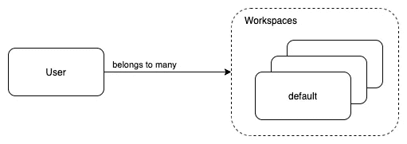

# React 原生应用的技术特征

> 原文：<https://levelup.gitconnected.com/tech-characteristics-of-a-react-native-app-756ba40e7af5>

在您自己的应用程序中使用的指示性列表


图片来自 [Pixabay](https://pixabay.com/?utm_source=link-attribution&amp;utm_medium=referral&amp;utm_campaign=image&amp;utm_content=3325080)

# 介绍

在这个故事中，我给出了我在[我自己的 React 原生应用](https://www.wheelrun.biz/)中介绍的技术特征列表。你也可以考虑在自己的应用程序中使用。

# 三层架构

我决定采用三层架构，如下图所示:


因此，我谈论的是一个网络化的 React 本地应用程序。为了运行它，需要网络存在。

# GraphQL

与 API 服务器的通信是使用 GraphQL 完成的。

## GraphQL 客户端


我需要使用任何特殊的库来构建我的 GraphQL 查询吗？

不，我没有。我使用标准的[获取](https://developer.mozilla.org/en-US/docs/Web/API/Fetch_API) JavaScript 库。然而，你可能想考虑使用 [Apollo GraphQL 客户端](https://www.apollographql.com/docs/react/)库。我没有使用它，因为我发现它对我的情况来说相当复杂，并且我希望对我的 GraphQL 查询的构造和处理有更多的控制。

## GraphQL 服务器

在服务器端，我使用 Ruby 和 gem [graphql](https://graphql-ruby.org/) 。根据您将决定采用的服务器技术，您可以选择最好的库来合并。GraphQL 官方网站[列出了您偏好的服务器技术的编程语言的各种选项。](https://graphql.org/code)

# WebSockets 应用更新

我发现当后台有事情发生时，应用程序的状态被即时更新是非常重要的。


我用来将状态变化从服务器传播到移动应用程序的技术是 [WebSockets](https://developer.mozilla.org/en-US/docs/Web/API/WebSocket) 。

因此，当应用程序启动时，它连接到 WebSockets 服务器并订阅一系列通道。


## WebSockets 服务器

如您所见，我为 WebSockets 使用了不同的服务器。不是 GraphQL API 的那个。它是在 Go 中实现的专用服务器。特别是，我使用 [AnyCable-Go](https://docs.anycable.io/anycable-go/getting_started) 。AnyCable-Go 是一个用于 AnyCable 的 WebSockets 服务器(见下一段)。

## WebSockets 客户端

对于 WebSockets 客户端，我使用包 [action-cable-react-jwt](https://www.npmjs.com/package/action-cable-react-jwt) 。这是一个 JavaScript 库，通过 WebSockets 实现了 [ActionCable](https://docs.anycable.io/misc/action_cable_protocol) 协议。

## WebSockets 注释

结合 WebSockets 技术可能具有挑战性，这取决于您决定采用的服务器和客户端协议。您可能想考虑将这一负担交给第三方服务，如 [Pusher](https://pusher.com/) 或 [OneSignal](https://onesignal.com/) 。

# 媒体服务器

我的 React 本地应用程序大量使用媒体、图像和视频。用户生成的内容。

为了减轻主 API 服务器处理和提供媒体内容的负担，我决定使用 [Cloudinary](https://cloudinary.com/) 集成。


从上图可以看出，React 原生应用直接与 Cloudinary 服务器对话。然后，它使用 API 服务器来存储和获取媒体的 URL。因此，API 服务器是卸载的，并且不处理媒体本身。

# 后台作业

我确保任何耗时的处理任务都由后台作业执行。例如，发送电子邮件。我使用 [Sidekiq](https://sidekiq.org/) 和 [Redis](https://redis.io/) 进行后台作业的存储和处理。

# SMTP 服务器

对于我的 SMTP 服务器，我使用 [SendGrid](https://sendgrid.com/) 。但是，还有许多其他好的替代方案，比如邮戳。

对于您的交易电子邮件，我的建议是使用 SMTP 服务器，它允许您定义和使用动态内容电子邮件模板。 [SendGrid 在这里支持这个特性](https://sendgrid.com/solutions/email-api/dynamic-email-templates/)。

# 社交登录

除了标准的电子邮件/密码功能，我决定提供社交登录功能。特别是，我已经决定去谷歌和苹果签到。

**重要提示:**如果你决定实现社交登录，你至少要实现苹果登录。否则，你的申请不会被苹果批准。

## 使用 Google 登录


在客户端，有一个 React 本地库，它可以很好地将你的应用程序与 Google Sign In 集成。它就是[@ react-native-Google-sign in/Google-sign in](https://www.npmjs.com/package/@react-native-google-signin/google-signin)包。

我已经决定使用客户端登录，但也在服务器端确认谷歌登录令牌。只有在我确认了提供给后端服务器的身份验证令牌是有效的之后，我才使用从 Google 登录过程中获得的用户信息。

在服务器端，自从我使用 Ruby 以来，我已经集成了 gem [google-id-token](https://github.com/google/google-id-token/) 。

注意:我不得不在这里[派生这个 gem](https://github.com/pmatsinopoulos/google-id-token)和[创建一个 commit](https://github.com/pmatsinopoulos/google-id-token/commit/2ecc89a974d3724b502eff8fdab5eeab8762a5bd) ，这将允许我使用最新的 [jwt](https://github.com/jwt/ruby-jwt) gem。

## 登录 Apple


在客户端，我用的是 React Native[@转化酶/React-Native-apple-authentic ation](https://www.npmjs.com/package/@invertase/react-native-apple-authentication)，也真的很牛逼。

同样，客户端生成的苹果令牌被发送到服务器，我进行服务器端验证。我用的是宝石 [apple_id_token](https://rubygems.org/gems/apple_id_token) 。

## 创建用户帐户时要小心

成功社交登录后，在您的数据库中创建用户帐户时，请确保您始终如一地处理用户的电子邮件。例如，用户可能决定某一天使用标准电子邮件和密码帐户创建一个帐户，第二天使用他们的社交登录来登录。这意味着当用户使用社交网站登录时，您需要确保首先尝试查找他们是否已经拥有帐户。

用户帐户的创建，尤其是当你的应用程序提供各种注册/登录方法时，可能是相当复杂的。它需要仔细设计，并且您需要确保同一用户不会在您的应用程序中创建不同的帐户。

# 证明

应用程序和后端服务器之间的查询和变化需要进行身份验证。换句话说，对于每个请求，我需要有一种方法来识别当前登录的用户。

我使用值为`Bearer <authentication_token>`的 HTTP 头`Authorization`来做这件事。每个需要认证的请求都有这个头。用户每次登录时都会生成`<authentication_token>`。是一个`JWT`令牌。JWT 规范是一种使用各种算法对请求进行加密签名的技术。


# 用户和工作区

我发现对于同一个用户来说，能够加入多个工作空间是一个非常酷和重要的特性。

为了支持这个特性，我实现了这样一个模型:



因此，用户可以属于一个或多个工作空间。用户注册后，我会创建该用户所属的第一个工作区，并将该用户附加到这个工作区。这是他们的默认工作空间。

如果我想对模型更精确一点，我已经在用户和工作空间之间创建了一个关联模型。像这样:


这个关联模型非常重要，因为它允许我根据当前登录的工作空间来调整用户的行为。

用户可以通过应用程序主菜单中的中心选项从一个工作区切换到另一个工作区。


跟踪最后登录的工作区很重要，这样当用户重新登录时就可以自动切换到那个工作区。

这也意味着，在用户登录之后，我需要作为 HTTP 响应的一部分发送回最后登录的工作区。

# 批准

除了识别登录的用户和他们当前的工作空间，我还需要找出用户在工作空间中扮演什么角色。

因此，我有一个我称之为 Role 的模型，我将它与 UserWorkspace 进行多对多的关联。


上面的数据模型允许我根据用户所属的工作空间给同一个用户不同的角色。

对于管理角色和授权用户，我还得到了 Ruby 世界中两个非常流行的宝石的帮助。[灿灿](https://rubygems.org/gems/cancancan)宝石和[罗利弗](https://rubygems.org/gems/rolify)宝石。

# 局部存储器

我使用手机设备本地存储最少的应用程序和用户相关信息。特别是，我使用了包[@ react-native-async-storage/async-storage](https://www.npmjs.com/package/@react-native-async-storage/async-storage)，它隐藏了 Android 和 iOS 在本地存储管理方面的差异。

# 应用程序状态—反应还原

我使用 [React-Redux](https://www.npmjs.com/package/react-redux) 来建模和管理应用程序状态。我相信 redux 使得对应用程序状态的内容进行建模和管理变得非常容易。

我使用动作和减速器，就像这里的文档中描述的一样:[结构化减速器](https://redux.js.org/usage/structuring-reducers/structuring-reducers)。

# 唯一设备 Id

我使用包 [react-native-device-info](https://www.npmjs.com/package/react-native-device-info) ，以便获得设备的唯一 id。

设备的唯一 id 对我来说相当有用。当用户登录时，我也会注册他们登录的设备。此外，每个进入 API 服务器的请求在头中都有设备 id。因此，用户可以从不同的设备登录，服务器知道请求来自哪个设备。


这允许我将更新信息仅推回到我必须推回的设备。例如，如果用户 Panos M .从他的 iPhone 上传图像，同时也从 iPad 登录，服务器仅向 iPad 设备推送更新，以便 iPad 应用程序状态与 iPhone 应用程序状态保持同步。

# 样式组件

我使用 [styled-components](https://www.npmjs.com/package/styled-components) 库来创建带有样式的组件。这真的很强大，也确保了我的组件代码是干净的。

# 反应导航

对于应用程序不同屏幕之间的用户导航，我使用 [React Navigation Native](https://reactnavigation.org/) 。

该应用程序的导航非常简单(至少目前如此)。我使用两个专门工作的堆栈导航器:

1.  用户未登录时屏幕的堆栈导航器。
2.  用户登录时屏幕的堆栈导航器。

因此，组件代码或多或少是这样的:

```
{isLoggedIn && <Stack.Navigator ...> ... </Stack.Navigator>}
{!isLoggedIn && <Stack.Navigator ...> ... </Stack.Navigator>}
```

现在，用户登录时的堆栈导航器有不同的屏幕，但它也有一个带选项卡屏幕的选项卡导航器。所以，就像下面这样:

```
<Stack.Navigator ...>
   <Stack.Screen component={MyTabNavigator}.../>
   <Stack.Screen ...>
...
</Stack.Navigator>
```

这里的`MyTabNavigator`是这样的:

```
<Tab.Navigator ...>
  <Tab.Screen .../>
  <Tab.Screen .../>
...</Tab.Navigator>
```

# 深层链接

React 导航支持深度链接，真的很酷。

首先，您像这样定义一个配置:

```
const linking = {
    prefixes: ['myapp://'],
    config: {
      screens: {
        ActivateYourAccount: 'users/signup/confirmemail/:code/:email',
        EditCustomer:
          'customers/:id',
        EditInvoice:
          'invoices/:id',
        PasswordReset: 'users/password/reset/:code/:email',        
      },
    },
  };
```

然后，将它作为值传递给`NavigationContainer`:

```
<NavigationContainer linking={linking}>
  <StackNavigator...>...
</NavigationContainer>
```

在如何定义深层链接、它们如何是动态的以及如何解析任何查询参数方面有很大的灵活性。在[深度链接指南](https://reactnavigation.org/docs/deep-linking)中有更多关于这个的信息。

# 推送通知

对于移动推送通知，我决定使用 [OneSignal](https://onesignal.com/) ，尽管还有很多其他选择。

推送通知的客户端使用 React Native OneSignal 库进行处理，即 [react-native-onesignal](https://www.npmjs.com/package/react-native-onesignal) 。我使用允许我的应用程序接收推送通知的最低配置。

在服务器端，我使用我围绕 [OneSignal REST API](https://documentation.onesignal.com/docs/onesignal-api) 开发的定制库包装器发送推送通知。

OneSignal 功能非常丰富。我用它来发送包括文本、图像和启动网址的通知。

# 反应原生纸

我需要一套 React 本地组件来帮助我引导应用程序。我选择了 [React 原生纸](https://callstack.github.io/react-native-paper/)。

这是 React 本地组件的丰富库，如按钮、头像、标签等

我的建议是，如果你决定像这样使用一个库，试着在你自己的包装组件中包装所有你使用的第三方库组件。因此，您的应用程序将使用您自己的组件，而不是直接对本机纸张组件做出反应。使用这种技术，如果您决定要这样做，那么更改/切换到另一个组件库将会容易得多。

例如，下面这段代码将 React Native Paper `Caption`组件包装到我自己的`Caption`组件中:

```
import ***React*** from 'react';
import {***Caption*** as RNPCaption} from 'react-native-paper';

const Caption = props => {
  return <RNPCaption {...props}>{props.children}</RNPCaption>;
};

export default Caption;
```

然后，在我的应用程序的其余部分，每当我想使用一个`Caption`，我从我自己的文件导入，而不是从`react-native-paper.`

# 反应原生矢量图标

React Native Paper 有许多组件需要使用[react-Native-vector-icons](https://github.com/oblador/react-native-vector-icons)。这是一个非常酷的库，因为它允许你使用一个非常大的图标列表，这些图标来自著名的库，比如 FontAwesome、Ionicons、MaterialCommunityIcons 等等。该项目还有一个非常有用的页面，你可以浏览它支持的所有图标。

# 日期时间选择器

允许用户选择日期和/或时间是非常常见的用户体验情况。

我选择了[@ react-native-community/datetime picker](https://www.npmjs.com/package/@react-native-community/datetimepicker)。这是一个 React Native datetime picker 组件，在 Android 和 iOS 上都能很好地工作。

# 快速图像

我的应用程序大量使用图像。我想找到一种方法来缓存图像，直到它们被改变。React Native `Image`组件像浏览器一样缓存图像，但用户遇到了各种问题，如闪烁、缓存缺失等。 [react-native-fast-image](https://www.npmjs.com/package/react-native-fast-image) 组件在解决这些问题上表现出色。

# 图像裁剪选择器

我在应用程序中引入的下一个与图像相关的功能是，用户可以在上传之前裁剪图像。

我使用包[react-native-image-crop-picker](https://www.npmjs.com/package/react-native-image-crop-picker)。这个库允许用户上传图像和视频。从电话的照片/视频库中或者使用照相机。

# 图像缩放查看器

我发现用户能够放大他们上传到我的应用程序的照片非常有用。为此，我使用了包[react-native-image-zoom-viewer](https://www.npmjs.com/package/react-native-image-zoom-viewer)。

# 随机图像

应用程序 UX 设计严重依赖于图像的存在。不然看起来很丑。然而，这些图像需要由用户上传。

在用户上传他们自己的图片之前，我一直使用随机图片，这些图片是我根据具体情况从两个不同的地方收集的:

*   [LoremFlickr](https://loremflickr.com/) 。我用它来获得各种物体类型的随机图像。试试这里的这个链接:【https://loremflickr.com/320/240/car?random=1】T4。你会得到一个随机的汽车图像。很酷的一点是，对于相同的对象和随机查询参数值，您将获得相同的图像，这对缓存非常有用。
*   [随机用户生成器](https://randomuser.me/)。这提供了一个 API([https://randomuser.me/api](https://randomuser.me/api))，它返回随机的用户数据，包括一张图片。同样，对缓存有用的是，API 允许您传递带有您控制的值的`seed`查询参数，因此为相同的`seed`值返回相同的数据。

# 反应本机版本号

告知用户他们正在使用的应用程序的当前版本是非常有用的。以一个*关于*的屏幕为例。为了获得应用版本号和编译号，我使用了库[react-native-version-number](https://www.npmjs.com/package/react-native-version-number)。

# 其他有用的 JavaScript 库

这里值得一提的其他一些有用的库有:

## 数组移动

[数组移动](https://www.npmjs.com/package/array-move)允许我将对象从一个数组位置移动到另一个。

## 洛达什

我使用 [lodash](https://lodash.com/) 库主要是为了[去抖()](https://lodash.com/docs/4.17.15#debounce)函数。去抖确保作为对用户动作的响应而被调用的函数不会被调用两次，例如，作为双击的结果。

# 调试工具

## 鳍状肢

为了调试，我经常使用[脚蹼](https://github.com/facebook/flipper)。这是非常容易使用，并有很多功能。它可以使用各种插件进行扩展。

## Redux Flipper

因为我正在使用 Redux，我发现 [redux-flipper](https://www.npmjs.com/package/redux-flipper) 插件非常有用。它允许我看到应用程序状态如何从一个动作变化到下一个动作。

# 监控应用程序稳定性和崩溃报告

为了监控应用程序的稳定性和获得崩溃报告，我决定集成 [BugSnag](https://www.bugsnag.com/) 。

BugSnag 有一个 React 原生库，允许您轻松地与您的应用程序集成。它有一个非常实用的 API，其中你可以标记错误报告给当前登录的用户。此外，它还集成了我用来导航的 React 导航库。

# 服务器端错误报告

对于服务器端错误报告，我使用 [Sentry](https://sentry.io/) 。

# 部署

应用程序的服务器端部署在 [Heroku](https://www.heroku.com/) 上。

# 结束语

这是我在[自己的 React 原生应用](https://www.wheelrun.biz/)中加入的一些技术特征的指示性列表。你可能会发现它们中的一些在你自己的应用中也很有用。

不用说，我从你身上学到的比你从我身上学到的要多得多。因此，我们非常欢迎您的反馈和意见。