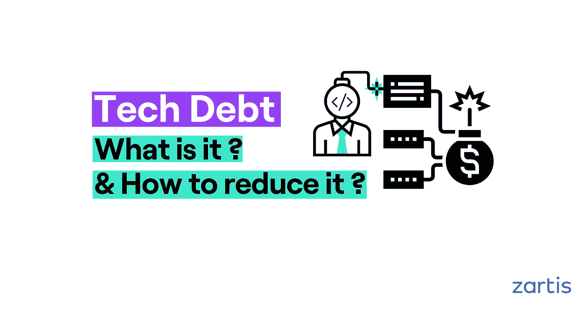
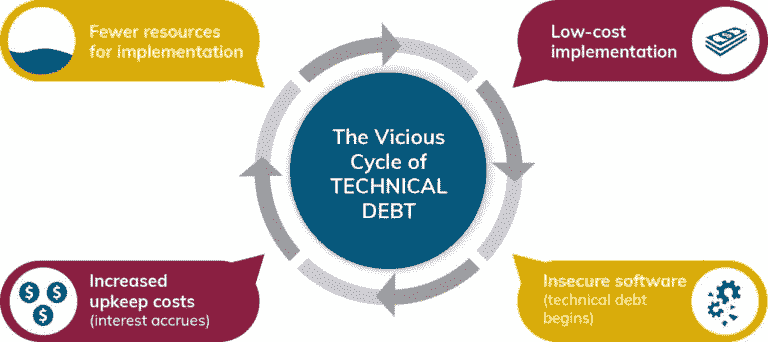
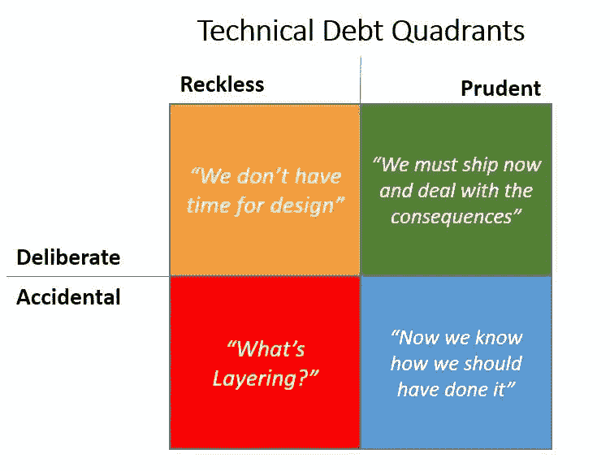
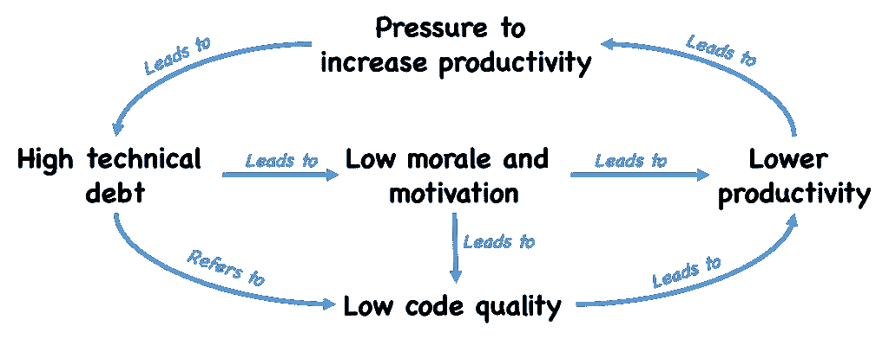

# 技术债务管理

> 原文：<https://levelup.gitconnected.com/technical-debt-management-675d62b17039>

## 什么是科技债务&你如何减少它？

让我们从定义什么是技术债务开始，为什么它降低了我们作为开发人员的工作质量，为什么它如此糟糕以至于我们不能简单地忽略它。

# 什么是技术债？

技术债务(也称为技术债务或代码债务)描述了当开发团队采取行动来加速一项功能或一个项目的交付时会产生什么结果，这些功能或项目随后需要进行重构。换句话说，这是[优先考虑快速交付而不是完美代码](https://www.productplan.com/glossary/technical-debt/)的结果。

它是软件开发中的一个概念，反映了由于现在选择一个简单的(有限的)解决方案而不是使用一个更好的需要更长时间的方法所导致的额外返工的隐含成本。

# 我们为什么要关心科技债务？

*来源:* [*Fionta*](https://fionta.com/news/taming-the-beast-managing-your-organizations-technical-debt/)

重要的是不要让技术债务堆积如山，主要是为了软件产品的长期成功和可持续性。您的系统可能有来自过去团队成员的技术债务，这需要当前的工程团队成员弄清楚为什么有人做了他们做的事情，以及他们到底是如何做的，以便他们可以回溯并修复它。对于软件质量来说，这显然是一个很大的漏洞，而且可能会降低生产率，因为这非常耗时。

如果你的技术债务随着项目的发展而增长，也会影响软件团队的动力和精神健康。您需要执行额外的任务来找出如何修复当前的解决方案或使其适合手头的模型，而不是专注于您知道可以编写的好代码。因此，团队内部会有持续的挫败感。因此，尽快处理这件事对我们有好处。

最突出的问题之一是技术债务在整个代码中的扩散，因为它不仅影响开发团队，还影响任何其他与手头产品一起工作的部门。它可能会导致特性发布延迟的问题，潜在地影响性能、可伸缩性和可维护性。如果你欠了太多的技术债，它甚至会带来很多问题。

# 在管理你的科技债务时，应该避免哪些错误？

在这里，有一些事情需要注意和避免。

第一个是所谓的破窗理论。想象有一栋建筑，它维护得很好，没有破损的窗户等等。所以你要确保它保持原样。然而，当有一扇窗户被打破，但似乎没有人愿意去修理它时，不关心的心态会在团队中蔓延，或者开始寻找替罪羊，直到任务被人工钉在某人身上。然而，如果你看到建筑物定期维护，而你弄坏了什么东西，那么你会修好它，因为你不想成为第一个弄坏它的人。

此外，如果一切都坏了，为什么你个人需要成为真正修复它的人呢？这种思路带来了滚雪球效应，这与上面的利率类比有关，当您让非优化代码导致的问题感染系统的更多部分时，债务会呈指数增长。

你不应该忘记，即使你认为你在控制，现实是你的技术债务正在控制你，并通过限制你的选择和能力来决定你能做什么和不能做什么，当谈到最佳实践时。您的系统在寻找既支持旧代码又支持新代码的解决方案时受到的限制是不容忽视的。

最后但同样重要的是，忽略技术债务来节省上市时间，从长远来看会导致业务损失。在今天的市场中，可用性和性能是非常重要的，如果体验没有得到优化，客户最终会离开。如果他们面临性能问题、bug、可扩展性问题以及累积的技术债务，导致您需要两个月的时间来解决问题，那么您的客户在此期间可能会选择更好的解决方案。

# 科技债务有哪些不同的类型？

*来源:* [*DevIQ*](https://deviq.com/terms/technical-debt)

左边的象限对科技债务进行分类。

出于这样或那样的原因，你可能会有故意收购的科技债务，你把它留给未来。可能你需要去市场，现在没有时间去做完美的事情，但是你有一个计划，或者你意识到你需要在某个时候还清。

你也可能无意中欠下科技债务。这可能包括早期错误的计划，或者不知道应该遵循什么样的最佳实践。团队将只关注交付他们被要求的东西，而不遵循设计模式、坚实的原则和编写可测试的代码等。在保证 100%失败的情况下，这可能是最糟糕的途径。

看上面的图表，你可以说健康的技术债务在右边，不健康的在左边。本质上，背景中有一个问题，在右边你意识到了这个问题，而在左边，你没有意识到这些问题，它们会在未来出现，让你措手不及。

# 科技债务的主要原因是什么？

## 代码债务产生的原因是什么，是什么让它随着时间积累？

## 领导不力

在我们看来，领导不力是允许技术债务增加和增长的主要原因之一。在一天结束的时候，它可能会影响不同的部门，但它是在开发团队的盘子里。我们不能对产品团队说，你来处理，对吗？我们需要对团队进行培训，让他们在公司范围内传播技术愿景，并对质量、性能、可伸缩性、可维护性等有所认识。

上面所有的需求都是非功能性的需求，它们应该随着功能的设计自动出现，嵌入到软件设计过程中。这是向团队展示什么是优先考虑的，花时间考虑这些事情是可以的。

未知的需求也可以归因于领导层，因为他们决定如何处理这些问题。产品团队可能会在不了解技术需求的情况下提出要求，这是正常的。然而，这可能会导致以后需要改变一些东西，因为客户想要别的东西。只要管理层能够承认，这是一件健康的事情；我们达成了共识，但我们需要重构，然后用不同的方式解决问题。需要有一个阶段，让领导层意识到‘我们需要清理，我们需要进行重构，我们需要一些时间来弄清楚这次如何做对’。

此外，对最后一分钟变更的请求需要以非常相似的方式处理。领导需要成为团队的保护伞，这意味着不要成为压力的代理人，要为他们创造一劳永逸地解决问题的空间。

## 文化问题

科技债务收购的另一个主要原因是——正如我们上面提到的——整个公司或者至少是开发和产品部门没有正确的思维模式。

一个显而易见的文化问题是没有一个协作处理问题的环境，在一个跟踪系统中，让人们负责而不贬低他们。

另一个是没有测试的文化，这导致很多人害怕对系统做出大的改变。比方说，在这个过程中，有人犯了一个错误，因为没有测试，它破坏了其他元素。这种恐惧只会在整个公司蔓延，然后没有人愿意重构东西。

此外，还缺乏文档和协作。你一定在某个时候遇到过这种情况，或者目睹过这种情况，有人寻求帮助，却没有人回应。现在，如果你不知道如何解决某个问题，如果没有人愿意帮忙或者没有相关的文档，你可以尝试逆向工程来解决这个问题，但是这不是最好的方法。

## 时间限制

最后但同样重要的是时间限制，这在某些场景中比其他场景更有意义。例如，如果您正在开发一个 MVP，您希望尽快进入市场以获得一个概念证明并在此基础上进行改进。我们在这里不是说这不好，这是大多数敏捷过程的工作方式，但是你需要为你今天忽略的东西腾出资源。

技术和业务部门之间的沟通不畅或知识转移的缺乏也会导致不正确的时间表估计。我们在这里的建议是，总是假设估计是不正确的，并考虑一些额外的时间作为缓冲。

管理客户期望也起到了作用。业务团队自然会渴望与客户和买家达成协议，这可能并不总是涉及技术团队成员在那一刻的投入。如果你的团队有在与客户达成交易前与工程师核实的思维模式，你可以通过不遵守最初的时间表来避免不切实际的期望和让客户失望。

# 如何避免科技债的恶性循环？

*来源:* [*夏尔马 2018*](https://devopedia.org/technical-debt)

从左边开始，当你有很高的技术债务时，你的代码质量会因为这些债务而变得更差。一个例子可能是，你正在进行一个重建，它甚至没有单元测试，或者没有足够的测试需求——你将会有很低的代码质量，这将会对生产力产生影响。从长远来看，较低的代码质量会产生更多的错误和问题。这意味着你将花费比平时更多的时间来解决问题，如果你在问题发生时就实时处理的话。这将软件团队置于一种被动的模式中，在这种模式中，您致力于修补问题，而不是致力于设计持久的、高质量的系统。

显然，当生产力下降时，业务方面就会有麻烦，他们会问为什么我们现在不能部署新功能，尽管我们在最初的几次部署中速度很快。六个月后，即使我们有了更多的开发人员，我们可能也不会生产任何东西，也不会进行危机管理。

为提高生产率而产生的技术债务现在又带着更大的压力回来了，因为我们现在需要通过消除债务来提高生产率。

此外，每个开发人员都希望在一个健康的环境中工作，在那里你可以做到最好，提高你的工作技能，并致力于创新的解决方案。如果你在一个技术债务很高的环境中工作，那么发生的事情是你只是试图不破坏东西，并且可能需要在你的代码上妥协来维持它。

这就是软件团队的恶性循环加倍的地方，因为在这种心态下，没有动力，没有工作环境，增加的压力和比以前更复杂的问题需要处理。

我们已经多次看到，软件工程师跳槽是理所当然的，因为市场上有大量的机会来开发更具创新性和现代化的解决方案，而不是试图修复遗留系统。如果您的开发人员保留率下降，并且那些开发人员带着获得的所有知识离开，新的团队成员将会发现他们自己处于混乱中，他们开始一个项目，并发现如何解决问题。也就是说，如果你能找到有足够动力接受这样一个挑战的合适的人。

向产品、业务和管理团队传达收购技术债务可能产生的潜在问题至关重要。他们需要知道这些，以及它对以后产品的可能影响。这样对团队的信任就不会被替罪羔羊打破。一旦业务团队认识到这个问题，他们将把它纳入他们的时间表，并给开发团队空间来偿还技术债务。在理想的情况下，这需要成为公司消除代码债务的战略和目标的一部分。

# 你如何防止技术债务的积累？

## 1)有一个垂直的视野

*   该公司旨在创造一个伟大的产品，而不仅仅是功能。
*   所有相关部门都参与其中，并意识到技术债务。
*   每个人都应该知道构建伟大的软件需要时间

## 2)有意识的领导

*   强有力的领导者建立技术愿景
*   减轻来自业务/产品团队的开发人员的压力
*   管理和控制技术债务增长

## 3)适当的流程和标准

*   利益相关方批准的设计文件
*   记录和跟踪技术债务
*   定义明确并记录在案的标准、最佳实践、设计模式和原则
*   代码审查和定期测试，寻找未被承认的技术债务
*   每次冲刺留出固定比例的时间来清理技术债务
*   允许从一个特征到另一个特征进行清理的时间

# 关于科技债务调查的最后思考

因此，拥有技术债务并不是世界上最糟糕的事情——当需要它的时候，它就像你在需要的时候获得信贷一样被需要。这只是资源的转移。导致技术债务产生不良后果的原因是没有很好地管理它。你需要掌控全局，循序渐进地解决问题，即使不能一蹴而就。

不言而喻，如今质量在软件企业的成功中起着重要作用——如果不是对所有企业都是如此的话。随着市场竞争的加剧和选择的丰富，发布一个劣质产品来抢人市场或在短期内满足客户将会影响你的产品的寿命。客户对稳定性和一致性的要求不亚于他们对交付速度的要求。他们有时可能会不耐烦，但如果你用超出他们期望的优质产品来满足他们的需求，他们就会对你的产品忠诚。