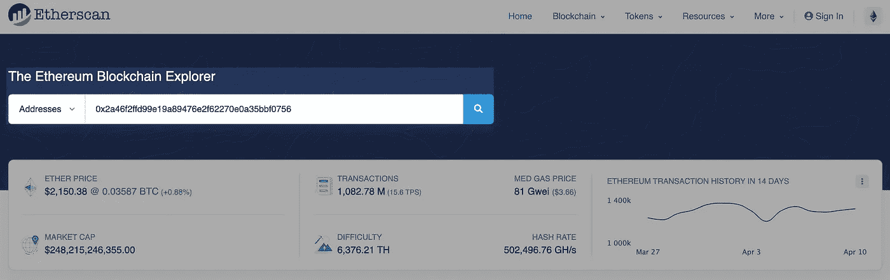
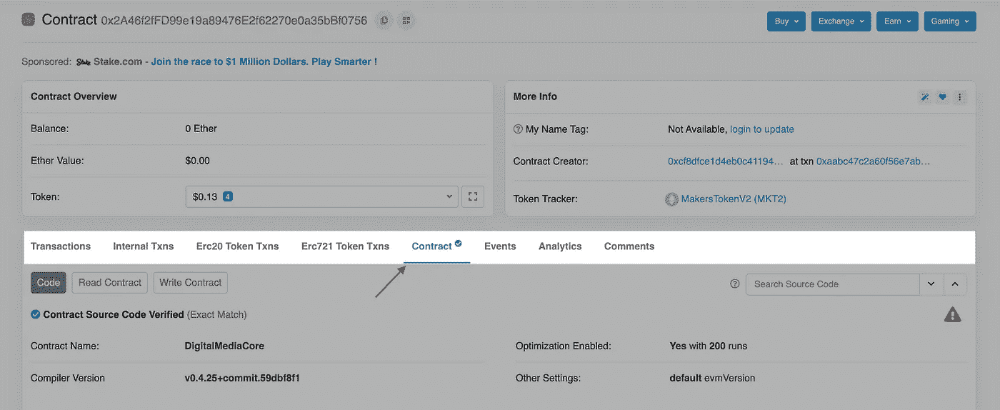
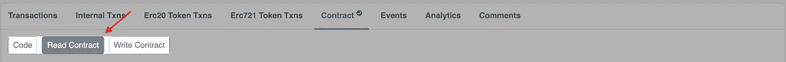
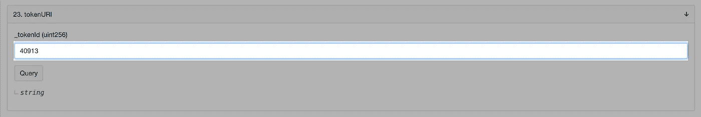

# 非功能性测试是如何存储在以太坊上的:ERC-721 技术深度探究

> 原文：<https://levelup.gitconnected.com/technical-deep-dive-into-ethereums-nft-erc-721-70ee37f09104>

## 数字艺术是如何以 NFTs 的形式存储在以太坊上的


[每一天:前 5000 天](https://onlineonly.christies.com/s/first-open-beeple/beeple-b-1981-1/112924)由[人](https://www.beeple-crap.com)

不可替代令牌(NFT)在新闻中频频出现。虽然它们已经存在了几年，但最近的事件，如数字艺术家 Beeple 的数字艺术“EVERYDAYS:THE FIRST 5000 DAYS”的[销售，其售价超过 6900 万美元，引起了人们对支持在线收藏品的技术的关注，其中最突出的是](https://www.theverge.com/2021/3/11/22325054/beeple-christies-nft-sale-cost-everydays-69-million)[以太坊](https://ethereum.org/en/whitepaper)。

这个数字艺术，一个 JPEG 文件，怎么会值这么多钱？可惜这不是我能回答的问题。我在这里不是要辩论非功能性测试的合法性，也不是要给它们的经济价值定价。这个就留给你自己判断了。然而，我确实想澄清一些技术问题，例如:NFT 人在区块链是如何被代表的？以太坊上存储的是 JPEG 文件吗？如果没有，JPEG 文件具体存储在哪里？

为了回答这些问题，我们将从以太坊上运行的实时智能合约中的 NFT 检索 Beeple 的图像。这一切都是从 EIP-721 开始的。

*我将假设您已经知道什么是以太坊和智能合约，尽管对智能合约编程语言*[*solidity*](https://docs.soliditylang.org/en/v0.7.4)*的一些基本熟悉会有所帮助，但这不是必需的。*

# EIP-721

> 以太坊改进提案(EIP)描述了以太坊平台的标准，包括核心协议规范、客户端 API 和合同标准。

改进建议并不局限于任何特定的群体。任何人都可以通过写一份详细说明为什么和如何做的规范来想出一个，并在公开网站上发布以供审查。以太坊社区由技术人员(客户开发人员、核心开发人员、矿工等)和非技术人员(用户、交易者等)组成，他们将审查提案并达成共识:推迟、拒绝或接受。

EIP-721 就是这样的提案之一，属于“合同标准”提案的范畴。您可以在下面找到被跟踪的 EIP 的完整列表:

[](https://github.com/ethereum/EIPs/tree/master/EIPS) [## 以太坊/EIPs

### 以太坊改进提案库。在 GitHub 上创建一个帐户，为以太坊/EIPs 的开发做出贡献。

github.com](https://github.com/ethereum/EIPs/tree/master/EIPS) 

[EIP-721](https://eips.ethereum.org/EIPS/eip-721) 描述了一种标准，通过该标准可以实施智能合约来跟踪和转移非功能性交易。下面提供了 EIP 界面的快照。

```
**interface** ERC721 {
    **event** Transfer(...);    **event** Approval(**...**);    **event** ApprovalForAll(**...**);
    **function** balanceOf(**...**);    **function** ownerOf(**...**);    **function** safeTransferFrom(**...**);    **function** safeTransferFrom(...);    **function** transferFrom(...);    **function** approve(**...**);    **function** setApprovalForAll(...);    **function** getApproved(...);    **function** isApprovedForAll(...);
}**interface** ERC721Metadata {    **function** name(...);    **function** symbol(...);    **function** tokenURI(...);
}
```

注意，我已经去掉了函数参数和返回类型，以保持简单易读。你可以前往官方规格[了解全部细节。](https://eips.ethereum.org/EIPS/eip-721#specification)

基本接口`ERC721`是 NFT 的核心，提供一组要处理的功能；令牌存储、令牌所有权的转移，以及一些允许任何人查询谁拥有哪个令牌的 getters 等等。出于我们的目的，我们将忽略它的大部分，主要关注扩展接口，更具体地说是函数`tokenURI`。

```
**function** tokenURI(**uint256** _tokenId) **external** **view** **returns** (**string**);
```

函数签名声明它使用一个参数，一个`uint256`，并返回一个`string`。我们现在有了第一个问题的答案。

> 区块链上的 NFT 是如何表现的？—它简单地表示为一个数字(tokenId)，更准确地说是一个无符号的 256 位整数。

# 智能合同

有了 NFT 智能合同代码组成的一般概念，我们就可以开始挖掘合同本身来检索原始图像。为此，我们需要两条重要的信息:

1.  令牌 Id: ***40913***
2.  合同地址:***0x2a 46 F2 ffd 99 e 19 a 89476 e2f 62270 e0a 35 bbf 0756***

我从克里斯蒂拍卖行找到了这些数据，NFT 的拍卖就是在那里进行的。

需要合同地址来定位负责创建、转移和存储人口 NFT 的实时合同代码。我们将使用 [etherscan.io](https://etherscan.io/address/0x2a46f2ffd99e19a89476e2f62270e0a35bbf0756) 作为我们的块浏览器。与以太坊区块链的交互通常通过事务来完成，在这种情况下，我们需要一些以太来支付提交事务的`gas`成本。但是幸运的是，我们无意改变链的状态，只想从中查询一些数据。这是没有成本的，我们将很快看到为什么。

让我们看一下部署的契约的代码。在浏览器上打开 [etherscan.io](https://etherscan.io) ，在浏览器搜索工具中输入合同地址:



以太扫描. io 区块链资源管理器

你现在应该可以看到合同的[地址页](https://etherscan.io/address/0x2a46f2ffd99e19a89476e2f62270e0a35bbf0756)。导航到**联系人**选项卡，您将看到该地址的相关合同源代码:



etherscan.io 合同源代码

我仅摘录了以下最相关的信息:

```
contract **ERC721Token** is ERC721, ERC721BasicToken {
  ...

  mapping(uint256 => string) internal **tokenURIs**;
  ... function **tokenURI**(uint256 _tokenId) public view returns (string) {
    require(exists(_tokenId));
    return tokenURIs[_tokenId];
  }
}
```

令牌数据存储在一个`[mapping](https://docs.soliditylang.org/en/v0.5.3/types.html#mapping-types)`中，如果你以前从未见过任何 solidity 代码，它类似于 Go `[map](https://blog.golang.org/maps)`或 Python `[dict](https://docs.python.org/3/library/stdtypes.html?highlight=dict#mapping-types-dict)`。密钥是令牌 id `uint256`，值是令牌 URI `string`，因为它是内部映射，所以不能从契约外部访问。所以我们需要调用`tokenURI`来检索 URI 值。函数`tokenURI`用以下关键字声明:

*   **public** :使其可从契约外部访问(外部拥有的帐户或其他智能契约)。
*   **视图**:使其成为[视图函数](https://docs.soliditylang.org/en/v0.8.3/contracts.html?highlight=view#view-functions)，这意味着该函数不会更新任何状态，并且将在单个节点(很可能是由 etherscan.io 运行的以太坊节点)上执行，而不是从网络本身执行，因此不需要`gas`。

所以现在的问题是 URI 的令牌到底是什么`string`东西？让我们执行函数吧！点击**阅读合同**标签页:



etherscan.io 读取合同

向下滚动到`tokenURI`卡，输入令牌 id `40913`，点击**查询**:



etherscan.io 函数令牌 URI

只需不到几秒钟，结果就会出现:

```
*>> string* **:**  ipfs://ipfs/QmPAg1mjxcEQPPtqsLoEcauVedaeMH81WXDPvPx3VC5zUz
```

你可能已经明白了，记号 URI `string`不可能是图像本身，因此是我们第二个问题的答案。

> 以太坊上存储的是 JPEG 文件吗？没有。该令牌是对代表数字艺术的 URI 的引用

# IPFS

> 星际文件系统(IPFS)是一个分布式系统，用于存储和访问文件、网站、应用程序和数据。— [ipfs.io](https://docs.ipfs.io/concepts/what-is-ipfs)

我们如何使用找到的 URI 访问存储在 IPFS 网络上的资源？有几种方法可以做到这一点。我们可以运行[本地 ipfs 守护进程](https://docs.ipfs.io/install/command-line/)并使用 IPFS 命令直接通信，使用本机支持 IPFS 协议的浏览器，如 Brave 或 Firefox，或者最简单的方法是使用公开可用的 HTTP 网关，如 [infura](https://infura.io/.) 或 [ipfs.io](https://ipfs.io/) 。这些网关允许我们请求类似于访问网站 URL 的数据，它会将我们的请求代理到连接到网络的 IPFS 节点以检索数据。我选择了使用 ipfs.io。

通过将令牌 URI 的方案从`ipfs://`替换为`[https://ipfs.io/](https://ipfs.io/,)`:

## [https://ipfs . io/ipfs/QM PAG 1 mjxceqppt qsloecouvedaemh 81 wxdvpx 3 VC 5 zuz](https://ipfs.io/ipfs/QmPAg1mjxcEQPPtqsLoEcauVedaeMH81WXDPvPx3VC5zUz)

这将把它变成您熟悉的 URL，并且像任何其他 web 链接一样，您应该能够看到以下 JSON 格式的数据:

JSON 保存资源所代表的元数据，即 Beeple 的图像。我们一直在寻找的属性是:`imageUrl`或`properties`下的`raw_media_file`。URL 已经被格式化为熟悉的 HTTP URL，现在就有了。你所要做的就是访问这个链接，然后你就会有一张价值 6900 万美元的原始图片加载到你的浏览器中。

> 文件具体存放在哪里？—在 IPFS，一个由计算机节点组成的网络，将 JPEG 文件的片段存储在磁盘上。

你可能会惊讶地发现，图像本身并没有存储在区块链上，我知道我是。但是仔细想想，为什么会这样确实很有道理。

归根结底，以太坊是一个数据库，对于 Cassandra、MongoDB、Postgres 等任何数据库来说，直接在其中存储二进制大文件(BLOB)在运营成本和性能方面都是不可行的。数据库不是为这种用例设计的，但文件系统是。

每个智能合同都有自己的存储 trie(自己的持久数据库),在区块链上存储数据的成本很高。让我们做一些餐巾纸数学来估算一下存储完整图像可能需要多少钱(美元)。

> 图片大小:~319 MB

以下计算中使用的所有相关数据(如天然气成本和 ETH 价格)均基于 NFT 的铸造日期，即 2021 年 2 月 16 日。

> 气价:~ [**12** Gwei](https://blockchair.com/ethereum/charts/average-gas-price)
> 
> ETH 价格:~[**1781 美元**](https://coinmarketcap.com/currencies/ethereum/historical-data)

Gwei 是以太的命名单位之一，其中 10⁹ Gwei = 1 ETH。从这些数据中，我们可以推导出每种气体的美元成本:

> (12 格威/ 10⁹格威)* 1781 美元= ~0.000021372 美元

现在我们知道了每份汽油的价格，让我们算出需要多少来存储完整的图像。

每笔交易的基本费率为 **21，000** gas，这是以太坊收取的处理交易的默认费用。根据[以太坊黄皮书](https://ethereum.github.io/yellowpaper/paper.pdf)，操作码`SSTORE`消耗 **20，000** gas 并存储 **32** 字节的数据。因此，存储大小为 **319，168，313** 字节的完整图像将花费:

> (319168313 字节/ 32 字节)* 20 000 气体+ 21000 气体= ~ 199480216625 气体

将所需的天然气乘以每种天然气的价格，即可得出:

> 0.000021372 美元/气* 199480216625 气= ~ 4263291**美元**

是的，存储一个 319 MB 的图像要花费 400 多万美元！以太坊也有一个 gas 限制，每块 [**12，491，798**](https://etherscan.io/chart/gaslimit) gas，因此您将需要竞争所有大约 16，000 块的整个事务集(199480216625 gas / 12491798 gas)，至少可以说，这需要巨大的成本。因此，需要一个替代方案，IPFS 就是其中之一。

# 结论

概括地说，一个 NFT 是一个引用一个链接(URI)的数字，这个链接包含一些关于令牌资源的元数据。换句话说，NFT 是其所代表的资源的唯一签名或所有权证明。

我没有详细介绍图像数据是如何被分割、分配一个 [CID](https://docs.ipfs.io/concepts/content-addressing) (内容标识符)、查询以及物理存储在参与 IPFS 网络的机器的磁盘上的。IPFS 是一个复杂的系统，正在迅速发展，它值得自己的报道。我将在后续文章中解决剩下的问题，敬请关注！

# 资源

*   https://ethereum.org/en/developers/docs/gas
*   【https://github.com/ethereum/EIPs 
*   [https://github.com/ethereumbook/ethereumbook](https://github.com/ethereumbook/ethereumbook)
*   [https://docs . ipfs . io/concepts/how-ipfs-works/# content-addressing](https://docs.ipfs.io/concepts/how-ipfs-works/#content-addressing)
*   [https://blog.ipfs.io/2021-04-05-storing-nfts-on-ipfs](https://blog.ipfs.io/2021-04-05-storing-nfts-on-ipfs/)
*   [https://hackernoon.com/ether-purchase-power-df40a38c5a2f](https://hackernoon.com/ether-purchase-power-df40a38c5a2f?source=linkShare-d607259e3794-1501842018)