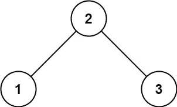

# Swift 解决的技术面试问题—第 2 部分

> 原文：<https://levelup.gitconnected.com/technical-interview-questions-solved-in-swift-part-2-648449da82ba>

## 有效括号、二叉树和对称树


照片由 [Maranda Vandergriff](https://unsplash.com/@mkvandergriff?utm_source=medium&utm_medium=referral) 在 [Unsplash](https://unsplash.com?utm_source=medium&utm_medium=referral) 上拍摄

在这篇文章中，我们将解决更多的技术面试问题。下面所有的问题都来自我用来练习的 LeetCode。其他提供技术面试问题的网站有 hackerRank 和 geeksforgeeks。

检查下面的第一部分:

[](/technical-interview-questions-solved-in-swift-4b773a9678f7) [## Swift 解决的技术面试问题

### 两个和、回文数、最多水的容器、最长的公共前缀和最接近的 3 个和

levelup.gitconnected.com](/technical-interview-questions-solved-in-swift-4b773a9678f7) 

## [有效括号](https://leetcode.com/problems/valid-parentheses/)

给定一个仅包含字符`'('`、`')'`、`'{'`、`'['`和`']'`的字符串`s`，确定输入的字符串是否有效。

在以下情况下，输入字符串有效:

1.  左括号必须用相同类型的括号括起来。
2.  左括号必须以正确的顺序结束。

**例 1:**

```
**Input:** s = "()"
**Output:** true
```

**例 2:**

```
**Input:** s = "()[]{}"
**Output:** true
```

## 解决办法

## [二叉树的有序遍历](https://leetcode.com/problems/binary-tree-inorder-traversal/)

给定二叉树的`root`，返回*其节点值*的有序遍历。

**例 1:**


```
**Input:** root = [1,null,2,3]
**Output:** [1,3,2]
```

**例二:**

```
**Input:** root = []
**Output:** []
```

**例 3:**

```
**Input:** root = [1]
**Output:** [1]
```

**约束:**

*   树中的节点数量在范围`[0, 100]`内。
*   `-100 <= Node.val <= 100`

## 解决办法

## [验证二叉查找树](https://leetcode.com/problems/validate-binary-search-tree/)

给定二叉树的`root`，*确定它是否是有效的二叉查找树(BST)* 。

一个**有效 BST** 定义如下:

*   节点的左子树只包含键**小于节点键**的节点。
*   节点的右边子树只包含键**大于节点键**的节点。
*   左右子树也必须是二分搜索法树。

**例 1:**



```
**Input:** root = [2,1,3]
**Output:** true
```

**例 2:**


```
**Input:** root = [5,1,4,null,null,3,6]
**Output:** false
**Explanation:** The root node's value is 5 but its right child's value is 4.
```

**约束:**

*   树中的节点数在范围`[1, 104]`内。
*   `-231 <= Node.val <= 231 - 1`

## 解决办法

## [对称树](https://leetcode.com/problems/symmetric-tree/)

给定一棵二叉树，检查它是否是自身的镜像(即围绕其中心对称)。

例如，这个二叉树`[1,2,2,3,4,4,3]`是对称的:

```
1
   / \
  2   2
 / \ / \
3  4 4  3
```

但是下面的`[1,2,2,null,3,null,3]`不是:

```
1
   / \
  2   2
   \   \
   3    3
```

## 解决办法

感谢阅读！