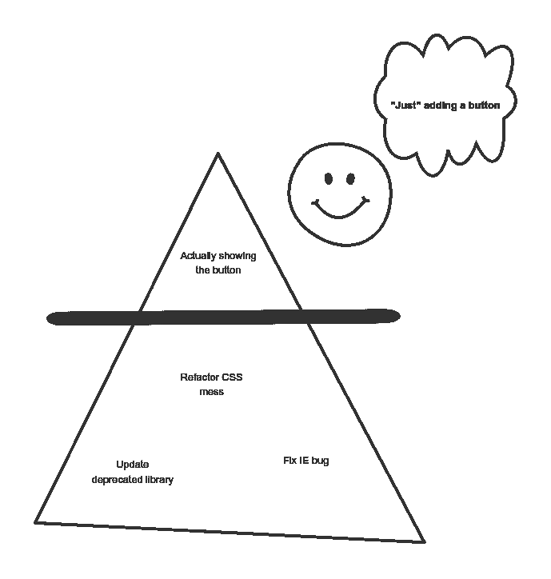

# 技术故事，敏捷开发的一个错误产物

> 原文：<https://levelup.gitconnected.com/technical-stories-a-miscast-artifact-of-agile-development-ed77d34cd018>


技术故事在敏捷世界中是一个有争议的话题。如果你在谷歌上搜索[技术故事反模式](https://www.google.com/search?q=technical+stories+antipattern)，你会发现很多人主张永远不要这么做。另一方面，一些团队虔诚地将任何重构外包给技术故事。

我们应该完全避开技术故事吗？或者我们应该拥抱他们，把我们所有的(技术)梦想和希望都放在他们身上？

我相信这种故事属于健康的积压，只要我们不利用它来隐藏我们的尸体。

# 不管怎样，什么是技术故事？

我会引用我自己的话，因为没有一个通用的定义。

> *技术故事是指团队中的主要利益相关者是开发人员。*

最终用户只是间接地从这样的故事中受益。理论上，随着我们的系统变得更好，我们将更容易交付实际的用户故事。

# 技术故事是反模式吗？

回到原来的问题。为了回答这个问题，让我们把一个用户故事想象成一座冰山。


会有多难呢？

可见部分在水面上。你的利益相关者可能不太关心水下发生了什么。然而，复杂性隐藏在下面。大部分精力都将花在那里。

当技术故事被用来画一条人为的线时，问题就来了。我们做可见的部分，然后将其余部分提取到技术故事中。我们的速度有了多大的提高！



只不过，这是一个**至关重要的错误**。我们避开了必要的技术工作，试图以错误的方式更快地前进。剥离底层部分**的*用户故事*就是**反模式。这导致了一个无止境的清单，在积压的门票，永远不会发生。它鼓励偷工减料和短期思维。

如果故事太大，让我们商定一个较小的范围，仍然交付有意义的价值。

# 既然我们知道这项工作如此重要，为什么还要提取出来呢？

这种情况在你的团队中发生过吗？你并不孤单。许多团队都在为此挣扎。原因有很多，其中包括:


采购订单和开发符合预期

*避免冲突*。如果产品所有者和开发人员朝着相反的方向推进，就有需要解决的矛盾。避免冲突解决不了任何问题，但这是阻力最小的途径。

*输送压力*。是的，功能几乎总是优先。技术工作是特性的催化剂。可能有真正的紧迫性，在这种情况下，有必要讨论一下如何管理新产生的科技债务。

*缺乏授权*。开发人员有时会觉得他们不能坚持他们认为必要的东西，或者他们的声音不会被听到。也许他们真的没有被倾听，或者他们的声音太轻了。

实话实说吧；这些都是比写一些故事(或者不写)更深层次问题的症状。然而，保持平台健康符合每个人的最佳利益。

# 那你什么时候创作技术故事？

我以为你不会问。创造技术故事最自然的地方是[开发者大会](https://hceris.com/dev-huddle-as-a-tool-to-achieve-alignment-among-developers/)。作为一次成功的开发会议的结果，开发团队将会就某些实验、重构或者要做的改变达成一致。任何足够大的行动都是技术故事的主要候选。举几个例子:

*   重构我们产品卡的布局，使用[柔性盒](https://css-tricks.com/snippets/css/a-guide-to-flexbox/)。
*   让我们试试新的断言库 [strikt](https://strikt.io/) 。
*   重构我们的 API 调用，使用 [React 钩子](https://reactjs.org/docs/hooks-intro.html)。

一旦团队达成一致，在故事中反映这些观点有助于建立团队的技术愿景。这些故事(希望)会很快发生，并提高系统的质量。反过来，这意味着冰山的可见部分将更容易漂浮，这将为我们快乐的利益相关者带来更多花哨的功能。

# 监控你积压的技术故事的数量！

技术故事数是一个有用的[健身函数](https://www.thoughtworks.com/radar/techniques/architectural-fitness-function)。如果这个数字越来越大，整个过程就不会很顺利。如果有的话，它甚至会阻止进一步改善这种状况的努力。

# 好的技术故事的原则

假设你勉强同意开始写技术故事。你是怎么做到的？这是一个开发者可能会写的故事。公平地说，许多人缺乏经验。


像其他事情一样，好的写作需要练习

可悲的是，写得不好的技术故事太普遍了。它们很密集。他们没有说到点子上。他们对所提供的价值含糊其辞。正因为如此，他们在积压中煎熬。这导致重要的话题没有得到解决。这个循环很难逃脱。

**技术故事必须与用户故事保持同样的标准**。像*将 Rails 升级到新版本*这样只有一行描述的故事是不够的。要求用户故事是描述性的、完整的和清晰的是不公平的，如果这不适用于技术故事的话。

关于[如何写一般的用户故事](https://www.mountaingoatsoftware.com/books/user-stories-applied)有很多资源。甚至还有一个首字母缩写， [INVEST](https://www.agilealliance.org/glossary/invest) 。在运用你的最佳判断时，遵循这些实践。基于我过去五年的故事诗，这里有五个建议的部分。

```
- Context 
- What's the value 
- What to do (Acceptance Criteria) 
- Out of scope 
- Tech hint
```

我将解释我认为应该是每个的一部分，加上一些坏的和好的例子。

# 语境

这个故事从何而来？了解背景可以防止误解。它让我们了解某些部分是否比其他部分更重要。

❌ *我们现在要用* `*flexbox*` *。*

✅ *当我们启动这个应用程序时，我们必须支持旧版本的 Internet Explorer。对他们来说，对* `*flexbox*` *的支持是有限的，所以我们决定使用更传统的内嵌块布局来构建我们的产品卡，以避免不兼容。这个要求已经被放弃了，所以我们可以自由地切换到一个更现代的技术。*

# 有什么价值

技术故事永远在为生存而战。在一天结束的时候，是产品负责人控制着积压。没有明确价值的故事被忽略了，取而代之的是带来切实利益的用户故事。获得确切的数字是理想的，尽管并不总是可能的。对我们想要改进的东西进行定性判断是很有帮助的。

✅ *使用* `*flexbox*` *会导致 CSS 结构更简单，从而减少维护工作量。我们期待更少的视觉缺陷和更少的困难，典型的任务，如居中元素。*

# 做什么(验收标准)

是的，这似乎是不言自明的。尽管如此，你还是会发现一些既不可操作也不可证实的故事。清楚我们想做什么吗？我们怎么知道什么时候结束？团队中没有写故事的人能捡起来吗？

❌ *整理产品卡片。*

✅ *将基于嵌入式显示的布局替换为用于产品卡的 flexbox。*

# 超出范围

技术故事可以非常广泛。如果我们不想触及人们期望成为这个故事一部分的某些部分，那么明确一点是很有用的。最后，你想要小的、渐进的改进。不是完全重写。

✅ *客户预览版使用了类似的布局，但是在我们完成产品卡片的更换之前，我们不会去碰它。*

# 技术提示

通过给你的队友一些指导来帮助他们。如果是关于升级*反应*，我们已经检查了什么？是否有一些陷阱需要考虑？通常，有一个事先调查，这是我们不想重新发现的无价信息。

但是，要注意不要写指令表。没有人愿意被人呼来喝去。此外，写下一个非常详细的步骤清单可能和一开始就写故事一样费力。


一份精确的蓝图将会避免许多不必要的讨论

# 技术故事是腰带中的另一个工具

技术故事帮助了我所在的团队管理演进和改进。我想再次强调的两个基本点是:

*   *不要把一个故事的潜在复杂性剥离出来，放入你“以后会做的”技术故事中*
*   帮自己一个忙，像对待用户故事一样尊重和关心技术故事。

请注意，我还没有谈到在迭代中包含用户故事和技术故事之间的紧张关系。这涉及到建立技术储备和评估系统的健康状况。我计划在它自己的帖子中深入探讨这一点。

感谢 Anna、Rachael 和 Felix 的反馈。

*原载于 2020 年 9 月 24 日 https://hceris.com*[](https://hceris.com/technical-stories-a-miscast-artifact-of-agile-development/)**。**