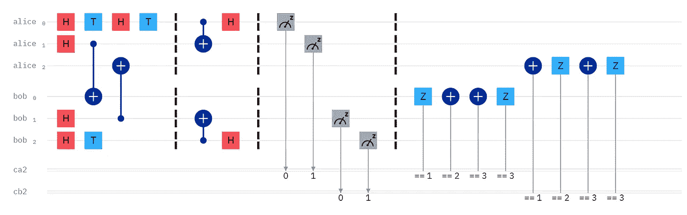
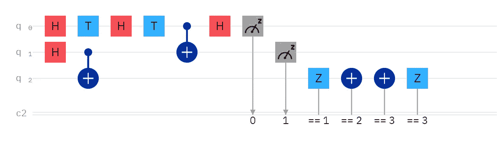
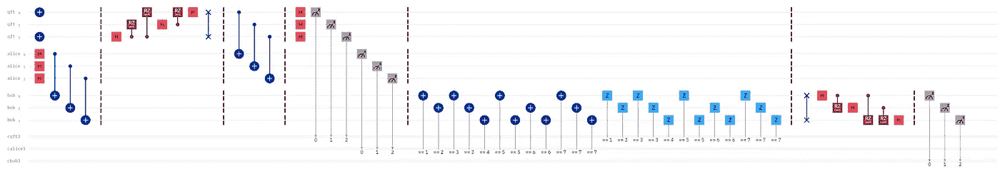
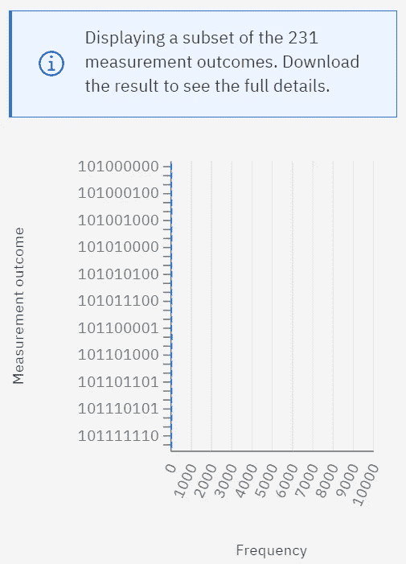

# 传送量子信息

> 原文：<https://levelup.gitconnected.com/teleport-quantum-information-7ea4e499c76>

无交换交换传送，双

# 安全地传送经典信息

教科书上的量子隐形传态有很多缺陷。潜在的前提是，我们可以使用它进行安全的通信，但它强加的限制应该会让您感到困惑，不知道谁会以这种方式进行通信。

1.  不允许发送者 Alice 知道她正在发送什么消息。出于交流的目的，这是荒谬的。她不是通过测量她的量子位来了解她拥有什么；她在测量她的量子位，以破坏她的量子信息，这样接收器鲍勃就可以接收它。除了六个例外，量子信息不能被精确复制，只能被移动，因此必须通过测量来破坏源。
2.  一旦鲍勃从爱丽丝那里接收到经典信息，他就知道“信息”是什么*，根本不用使用量子位*。
3.  鲍勃销毁了“信息”以确认传送成功。换句话说:这是一个传送如何工作的演示，与实际交流无关。

那么，有传送的实际实现吗？

## 交换隐形传送

[克雷格·吉德尼](https://twitter.com/craiggidney),[怪癖](https://algassert.com/quirk)的创造者，早在 2017 年就写了关于[双交换传送](https://algassert.com/post/1717)的博客。算是吧。他实际上没有解释，但他展示了电路。有了它，爱丽丝和鲍勃可以各自从自己的量子态开始。最后，他们交换了量子态，这样爱丽丝就有了鲍勃开始时的量子态，鲍勃也有了爱丽丝开始时的量子态。他们没有发送经典信息，但他们交换了量子信息。

无交换交换传送，单个

## 无交换交换传送

然而，事实证明交换操作是不必要的。我们可以将 CNOT-H 应用于不同的量子位，而不是交换 CNOT-H，它仍然有效。在上面的电路中，Alice 传送 H-T-H-T。如果我们使用 IBM Quantum Experience 或 Quirk，我们有可视化工具显示 Bob 实际上以 H-T-H-T 结束。此外，如果您查看本文最上方的电路，您会看到 Craig Gidney 电路的变体，它允许 Alice 和 Bob 交换量子状态，而无需交换操作。我用 Quirk 设置了这些，这样你就可以自己试验一下[单实现](https://cb.run/kIzX)和[双实现](https://cb.run/u0gP)。

量子傅立叶隐形传态电路

## 量子傅里叶变换(QFT)隐形传态

我喜欢称之为“量子傅立叶传送”，简称。如果爱丽丝不想发送量子信息或者概率信息怎么办？如果她想传递一个特定的信息，就像她在教科书中所说的那样，该怎么办？

一种选择是使用量子傅立叶变换。在上面的电路中，从左到右:

1.  爱丽丝和鲍勃纠缠他们的量子位，然后他们分道扬镳。或者，更有可能的是，他们使用纠缠交换在远处纠缠他们的量子位，但这将需要更大的电路和更长的文章。不管怎样，它们以某种方式纠缠它们的量子位。稍后，或者同时，如果他们已经在地理上分离，Alice 在 QFT 寄存器中对消息“101”进行编码。三个量子位给了她八条可能发送的信息，每条信息都有预先确定的含义。观看《奇异博士》中的这个场景，看看发送代码是如何工作的。
2.  爱丽丝用量子傅立叶变换(QFT)对她的信息进行编码。它相当于一个数模转换器，把她的数字位串转换成模拟波。
3.  爱丽丝把 QFT 语域和她的语域纠缠在一起，而她的语域是和鲍勃的语域预先纠缠在一起的。为什么她不能把信息编码在她的登记簿上？她可以。但是，使用两个寄存器允许她发送幅度和相位信息。
4.  Alice 在 QFT 寄存器上执行 x 测量，在她自己的寄存器上执行 z 测量。前者用于相位信息，后者用于振幅信息。
5.  爱丽丝把经典片段发给鲍勃。对于 Alice 寄存器中测量为 1 的每个量子位，Bob 将 Pauli-X 门应用于其关联的量子位:量子位 0 到量子位 0，依此类推。然后，对于 QFT 寄存器中测量为 1 的每一个量子位，鲍勃对其关联的量子位应用一个泡利-Z 门:量子位 0 到量子位 0，依此类推。
6.  Bob 执行量子傅里叶逆变换(iQFT)，它相当于一个模数转换器，将模拟波转换回数字位串。
7.  Bob 执行 z 测量，在本例中，测量值为“101”然后，他在他受《奇异博士》启发的密码本中查找那个特定的信息，并按照爱丽丝的指示去做。

量子傅立叶隐形传态结果

看上面的直方图，特别是最左边的三个数字，我们可以看到 Bob 的测量值总是“101”顺便说一下，这是在 IBM 量子模拟器上运行的，所以没有噪音。但是，我在寻找的是爱丽丝的经典信息中的一种模式，她必须发送给鲍勃的信息。有了量子隐形传态教程，我们可以在完全不使用量子比特的情况下，查看爱丽丝的比特，知道消息是什么。然而，使用 QFT，单单古典位元看起来就像是噪音。他们不断重复。对于 Eve 截获的任何位串窃听者来说，多条消息都可能被解码，所以她不可能确切地知道哪条消息是给 Bob Alice 的。

量子傅立叶隐形传态在 Quirk 中更难设置，但我为你的教育娱乐设置了一个[两量子位实现](https://cb.run/RzKn)。

## 结论

有趣的是，爱丽丝的古典位仍然是必不可少的。它们最初是为了防止我们进行超光速通信(比光还快):传送本身是瞬时的，但在那些经典比特到达之前，我们无法检索信息。您可以使用 IBM Quantum 和 Quirk 可视化工具来查看 Bob 的量子状态实际上是不正确的，而无需应用 Alice 的经典比特所规定的 X 和/或 Z 门。或者，如果他不必对他的量子位进行任何运算，在经典位到达之前，他无法确定他的解码是正确的。

长寿繁荣。