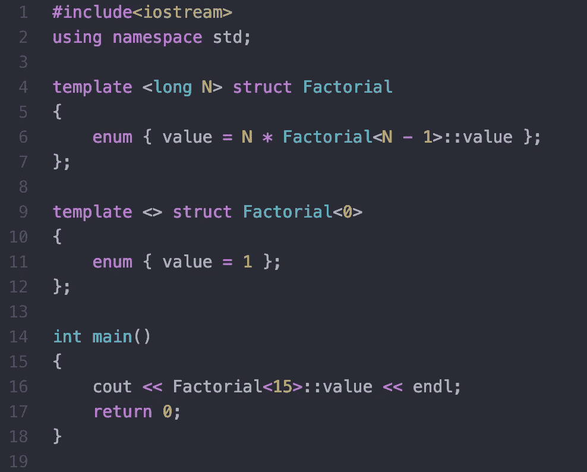

# 模板元编程:C++演练

> 原文：<https://levelup.gitconnected.com/template-metaprogramming-a-c-walkthrough-a7c6db0b4148>

**更新**:有人在 [Reddit](https://www.reddit.com/r/cpp/comments/gyby5v) 上告诉我，这是 C++编程和编译器优化的老观点。如果你对模板元编程很熟悉，并且想更新最新的模板元编程，可以去看看 Reddit [帖子](https://www.reddit.com/r/cpp/comments/gyby5v)上的评论。



阶乘的模板及其用法。

# 什么是模板元编程？

**元编程指的是一个程序了解自身或者能够操纵自身的各种方式阅读维基百科。我第一次读这本书的时候，还是一个研究生新手，我对人工智能程序能够编写其他代码并接管世界的可能性感到震惊。虽然这是好莱坞的版本，但这是一个现实的版本，在业内使用 C++模板进行编译时优化。**

**我在研究一个涉及优化的副业项目时遇到了这个概念。虽然这不是一个远离 CS101 课程所涵盖的基础的概念，但它并不广为人知，因此博客对其进行了分解。**

**首先，让我们看看什么是模板:
模板是泛型编程的基础，泛型编程包括以独立于任何特定变量类型的方式编写代码。**

**以下面的代码为例:**

```
#include <iostream>**using** **namespace** std; // One function works for all data types. **template** <**typename** T>
T tMax(T x, T y) 
{ **return** (x > y)? x: y; } **int** main()
{cout << tMax<**int**>(3, 7) << endl; // Call myMax for type int
cout << tMax<**double**>(3.0, 7.0) << endl; // call myMax for type d
cout << tMax<**char**>(’g’, 'e’) << endl; // call myMax for type char**return** 0;
}
```

**模板`tMax`提供了一个通用函数，可以被所有数据类型使用。**

# **模板是如何工作的？**

> **模板被汇编器编译成实类型**

**在程序编译后，模板本身不作为泛型存在，即在汇编代码中。**

**正如我们在上面看到的`tMax`模板例子中一样，模板 tMax 被汇编器转换成代码中调用的每种类型的不同函数。
ref: [汇编代码](https://godbolt.org/z/dDfnJz)(第 38 行定义了函数 *int tMax < int > (int，int)* 这是 int 类型的 tMax)**

**你可能想分支到[教程点(C++模板)](https://www.tutorialspoint.com/cplusplus/cpp_templates.htm)来花一些时间在模板上。Java 提供的模板的等价构造是[泛型](https://www.geeksforgeeks.org/generics-in-java/)。**

# **使用模板进行优化**

**由于模板在编译时“展开”到函数中，并且编译器在编译时本身也执行不涉及变量的计算，因此一些*计算可以在编译时完成，并在运行时避免*。**

> ***计算可以在编译时完成，在运行时避免***

**假设您正在编写一段代码，并且您希望**使用**值 15！(15 阶乘)作为代码的一部分。
递归的方法是使用如下代码:**

```
long factorial(int n)
{
  if (n == 0)
    return 1;
  else
    return(n * factorial(n-1));
}int main()
{
  cout << factorial(15) << endl;
  return 0;
}
```

**这将编译成一个函数，并在运行时调用参数 n=15 的函数。
ref: [汇编代码](https://godbolt.org/z/PS5bM4)(你可以在第 17 行看到 factorial 函数和一个*调用 factorial(int)* )**

**现在让我们用模板转换成一个程序。**

```
template <long N>
struct Factorial 
{
    enum { value = N * Factorial<N - 1>::value };
};template <>
struct Factorial<0> 
{
    enum { value = 1 };
};int main()
{
    cout << Factorial<15>::value << endl;
    return 0;
}
```

**在编译期间，编译器展开参数 N=15 的阶乘模板，并遇到参数 N=14 的模板，以此类推，直到 N=0。由于在这些计算过程中没有遇到变量，它们在编译时被解析，阶乘<15>最终被解析为值 15！即 1307674368000，避免了任何运行时计算。你可以在汇编代码中看到，值 1307674368000 被直接使用，而不是调用一个函数。
ref: [汇编代码](https://godbolt.org/z/aLMcxq)(没有函数定义为 15 的值！已经由汇编程序计算并用于第 4 行)**

**执行带有时间剖析(和太多迭代)的两个实现向我们展示了优化的影响。[模板化代码](https://www.jdoodle.com/a/27mP)运行时间约为 0.03 毫秒，而[递归版本](https://www.jdoodle.com/a/27mN)运行时间至少是预期的 30 倍，在运行时计算阶乘并向下递归。**

# **其他例子:模板和特殊功能。**

**一个更深入(更复杂，更有益)的例子来自[模板元程序(Todd Veldhuizen)](http://www.cs.rpi.edu/~musser/design/blitz/meta-art.html) 。使用模板进行**冒泡排序**似乎不太直观，因为输入的不是一个单一的数字，但想法是创建一个模板，展开成一个`specialised function`冒泡排序，以迎合某个*数量的元素*。我强烈建议浏览一下这个例子，找出细节。**

# **这个用在哪里？**

**我首先想到的是，如果不涉及变量，为什么我们需要执行像调用模板这样的函数。这难道不等同于用值本身编写代码吗(比如用 1307674368000 代替` Factorial <15>`)。与此相反的观点是需要抽象函数，而不是在代码中散布随机值。**

**因此， [Boost](https://www.boost.org/) 的库利用模板为复杂的函数提供库，如阶乘、正弦、余弦等。确保在运行时不计算这些值，而在编译时可以计算这些值。**

**总而言之，模板是确保编译时计算和节省时间关键项目(高频交易，可能是航空和航天旅行)运行时间的一个巧妙技巧。**

**查看 [SO](https://stackoverflow.com/questions/63494/does-anyone-use-template-metaprogramming-in-real-life) 关于模板元编程的社区讨论。如果你在你的代码中使用了它，以及如何使用，请在下面评论。**