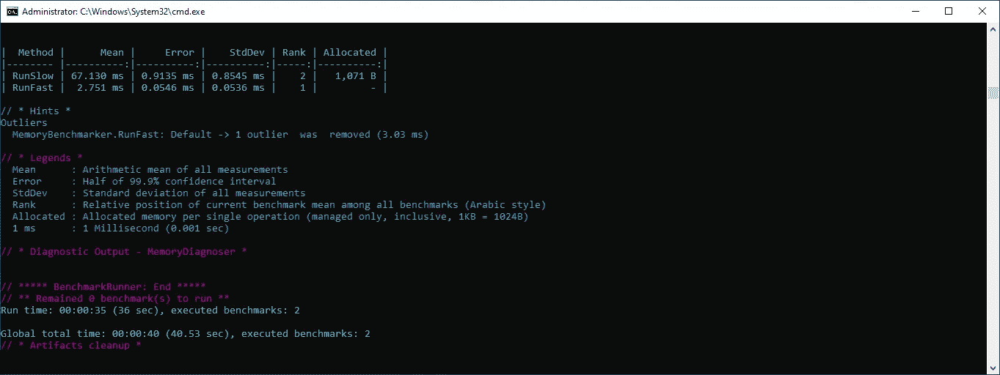
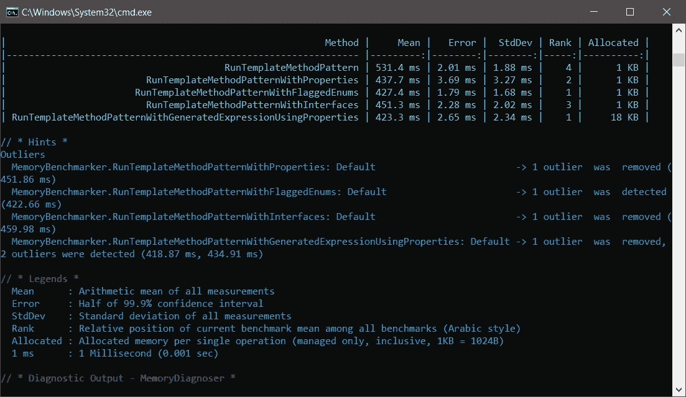
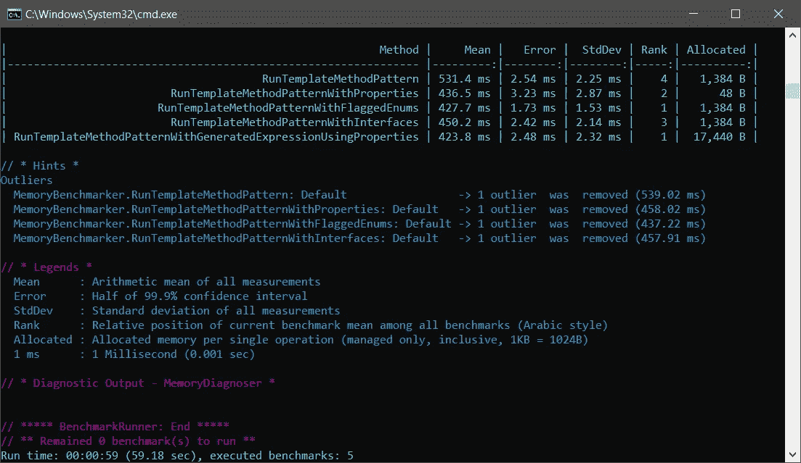

# 中模板方法设计模式的分析。NET C#

> 原文：<https://levelup.gitconnected.com/template-method-design-pattern-in-net-c-73d0be82571e>

## 设计模式

## 中学习模板方法设计模式。NET C#并探索不同的可能性。


**什么是模板方法设计模式**。由 [Unsplash](https://unsplash.com/?utm_source=unsplash&utm_medium=referral&utm_content=creditCopyText) 上的 [Kiwihug](https://unsplash.com/@kiwihug?utm_source=unsplash&utm_medium=referral&utm_content=creditCopyText) 拍摄，由 [Ahmed Tarek](https://medium.com/@eng_ahmed.tarek) 调整

# 什么是模板方法设计模式？

模板方法设计模式是广泛使用的设计模式之一，尤其是在处理算法模块或系统时。让我一步一步地告诉你。

有时候，当我们在系统的一个模块上工作时，我们发现我们需要按照一定的顺序遵循一些特定的步骤。但是，我们也发现这些步骤的实现并不总是相同的。在这种情况下，我们会怎么做？

这里**模板方法设计模式**来拯救。它是行为设计模式之一。它允许开发者在基类中定义算法或过程的程序序列，该基类将一些步骤的具体实现委托给子类，而不改变整体结构。

你明白了吗？没有吗？…让我演示给你看。

[](https://medium.com/subscribe/@eng_ahmed.tarek) [## 🔥订阅艾哈迈德的时事通讯🔥

### 订阅艾哈迈德的时事通讯📰直接获得最佳实践、教程、提示、技巧和许多其他很酷的东西…

medium.com](https://medium.com/subscribe/@eng_ahmed.tarek) 

**代码示例**。由 [Markus Spiske](https://unsplash.com/es/@markusspiske?utm_source=unsplash&utm_medium=referral&utm_content=creditCopyText) 在 [Unsplash](https://unsplash.com/?utm_source=unsplash&utm_medium=referral&utm_content=creditCopyText) 上拍摄，由 [Ahmed Tarek](https://medium.com/@eng_ahmed.tarek) 调整

# 代码示例

假设我们的系统是一个**税收计算器控制台应用程序**。咨询我们团队的会计师为我们提供了一个计算税收的通用公式，但他们告诉我们，通用公式的某些步骤会因人而异，取决于他们的婚姻状况。

换句话说，通式中的所有步骤都应该在主序列中，但在某些情况下，我们计算这些步骤的方式会有所不同。

因此，我们的团队试图提出最佳设计，并决定使用一些专家解决方案架构师推荐的**模板方法设计模式**。

因此，遵循**模板方法设计模式，我们的**解决方案将如下面的代码所示。

## 税收计算器

我们在这里可以注意到:

1.  这是一个抽象类，代表所有具体税收计算器的基类。
2.  关于`CalculateTaxes`方法，我们正在执行从我们的会计师那里得到的通用公式。
3.  我们将三种方法`CalculateExpenses`、`CalculateIncomeTax`和`CalculateVat`定义为`protected` `abstract`，因为这些方法有不同的实现，而这些实现将由我们具体的税收计算器提供。

## TaxCalculator1 和 TaxCalculator2

我们在这里可以注意到:

1.  这是我们拥有的两个具体的税收计算器实现。
2.  它们从我们的基类`TaxCalculator`继承而来。
3.  它们提供了三种方法`CalculateExpenses`、`CalculateIncomeTax`和`CalculateVat`的实现。
4.  有时，这些方法中的一个或多个可能需要一个虚拟实现(比如返回零)，就好像它们从未被调用过一样。

## 控制台应用程序

我们在这里可以注意到:

1.  这是控制台应用程序。
2.  在`Run`方法中，我们假设需要同时使用`TaxCalculator1`和`TaxCalculator2`，但在现实世界中，可能只有其中之一。
3.  现在，当在`TaxCalculator1`的实例上调用`CalculateTaxes`方法时，将执行`TaxCalculator1`提供的三个方法的实现。
4.  另一方面，当在`TaxCalculator2`的实例上调用`CalculateTaxes`方法时，将执行`TaxCalculator2`提供的三个方法的实现。

现在，运行这个应用程序将返回我们的会计师建议的预期计算结果。然而，这是最好的解决方案吗？


**设计挑战**。照片由[桑德·萨米](https://unsplash.com/@sammywilliams?utm_source=unsplash&utm_medium=referral&utm_content=creditCopyText)在 [Unsplash](https://unsplash.com/?utm_source=unsplash&utm_medium=referral&utm_content=creditCopyText) 拍摄，由[艾哈迈德·塔里克](https://medium.com/@eng_ahmed.tarek)调整

# 设计挑战

目前的设计是可行的，但是，这不是我们能想到的最好的设计。

以下是当前设计的一些问题:

1.  无用的/虚拟的方法调用有时会被执行，只是因为我们保持了基本公式的完整性。这对性能不好。
2.  违反了 SOL **(I)** D 原则的**界面分离原则**。出于与上面第一点相同的原因，很容易发现这一点。

因此，在接下来的章节中，我们将深入探讨这些设计问题，并尝试提出更好的设计。


**无用/虚拟方法调用**。由[雄心勃勃的创意公司——Rick Barrett](https://unsplash.com/@weareambitious?utm_source=unsplash&utm_medium=referral&utm_content=creditCopyText)在 [Unsplash](https://unsplash.com/?utm_source=unsplash&utm_medium=referral&utm_content=creditCopyText) 拍摄，由 [Ahmed Tarek](https://medium.com/@eng_ahmed.tarek) 调整

# 无用/虚假的方法调用

这里有一些开发者不认可的地方。当执行方法调用时，除非通过引用传递和返回，否则会为输入参数和返回对象分配一些内存。

因此，当我们只是调用一个方法时，即使不需要调用，这也不是最好的设计。

我现在可以听到有人说:

> 你只是夸大其词。这没什么大不了的。

好吧，也许你是正确的，如果它是在我们的税收计算器应用程序的当前实现。

然而，如果我们正在处理消耗更多内存的更复杂的对象和结构呢？

或者，如果我们的`CalculateTaxes`方法被调用**太多次**以至于一次调用的内存分配中即使最小的偏差最终也会变得很大怎么办？

假设我们的代码更新如下:

## 控制台应用程序

看到没，这里我们的`CalculateTaxes`方法叫做**一千万次**。

你能想象内存分配的巨大差异吗？没有吗？让我给你看看…


**比较无用的方法调用和无调用**。由 [Vanesa Giaconi](https://unsplash.com/@vanesagiaconi?utm_source=unsplash&utm_medium=referral&utm_content=creditCopyText) 在 [Unsplash](https://unsplash.com/?utm_source=unsplash&utm_medium=referral&utm_content=creditCopyText) 上拍摄，由 [Ahmed Tarek](https://medium.com/@eng_ahmed.tarek) 调整

# 将无用的方法调用与无调用进行比较

在这一节，我将向您展示调用一个空的/虚拟的/无用的方法和根本不调用它之间在性能和内存分配上的区别。

检查下面的代码:

我们在这里可以注意到:

1.  `Calc`方法实际上什么都不做。
2.  `RunSlow`方法调用`Calc`方法 **10，000，000 次**。
3.  `RunFast`方法只是循环 **10，000，000 次**。

因此，对这两种方法运行基准测试会产生以下结果。



**比较无用的方法调用和无调用**。图片由[艾哈迈德·塔里克](https://medium.com/@eng_ahmed.tarek)拍摄

看，差别是巨大的。因此，如果我们能够尽可能避免执行无用的调用，那就太好了。


**如何避免无用电话**。由 [Deva Darshan](https://unsplash.com/@darshan394?utm_source=unsplash&utm_medium=referral&utm_content=creditCopyText) 在 [Unsplash](https://unsplash.com/?utm_source=unsplash&utm_medium=referral&utm_content=creditCopyText) 上拍摄，由 [Ahmed Tarek](https://medium.com/@eng_ahmed.tarek) 调整

# 如何避免无用的电话？

我们可以使用多种方法来做到这一点，在接下来的章节中，我们将逐一尝试。


## 使用属性

在这种方法中，我们将定义三个布尔属性来表示每个具体实现可以提供的调用。然后，我们可以使用这些属性来检查一个调用是否有用。

现在，我们将代码更新如下。

**TaxCalculator**

在这里，我们只添加了以下内容:

```
protected abstract bool CanCalculateExpenses { get; }protected abstract bool CanCalculateIncomeTax { get; }protected abstract bool CanCalculateVat { get; }
```

然后，我们开始在`CalculateTaxes`方法中使用这三个布尔属性来决定是否需要执行一个调用。

现在，我能听到有人说:

> 好的，但是现在您添加了额外的代码行来检查属性。那不会影响表演吗？

我的回答是，可以。然而，这可能仍然比执行一个空的/无用的调用要好。

此外，我会在文章的最后向你展示一些有趣的东西，所以请耐心等待。

**TaxCalculator1 和 TaxCalculator2**

这里，我们只是覆盖布尔属性，将它们设置为正确的值。

**控制台应用**


## 使用标记枚举

在这种方法中，我们将定义一个标记枚举来表示每个具体实现可以提供的调用。然后，我们可以使用这个标记的枚举来检查一个调用是否有用。

N NET C# ，你可以查看这篇文章 [**标记枚举:如何将特性组合表示成一个字段**](/flagged-enumerations-how-to-represent-features-combinations-into-one-field-f32e46a0885?sk=38b7a167ac8bbcf3bbd876155c68039c) 。

现在，我们将代码更新如下。

**计税能力**

这里我们定义了标记的枚举`TaxCalculationCapabilities`。

**TaxCalculator**

在这里，我们只添加了以下内容:

```
protected abstract TaxCalculationCapabilities TaxCalculationCapabilities { get; }
```

然后，我们开始在`CalculateTaxes`方法中使用这个`TaxCalculationCapabilities`属性来决定是否需要执行一个调用。

**TaxCalculator1 和 TaxCalculator2**

这里，我们只是覆盖了`TaxCalculationCapabilities`属性，将其设置为正确的值。

**控制台应用**


## 使用接口

在这种方法中，我们将在三个方法各自的接口中对它们进行拆分和抽象。因此，只要具体的实现能够提供这些方法的合理实现，它只需要实现相应的接口。

现在，我们也可以从基类中移除这三个方法的抽象定义，因为不再需要它们了。

此外，基类现在会在调用相应的方法之前检查当前的具体实现是否实现了每个接口。

这样，我们解决了之前提到的两个问题:

1.  无用/虚拟的方法调用。
2.  违反 SOL **(I)** D 原则的**界面偏析原则**。

现在，我们将代码更新如下。

**伊 CalculateExpenses、伊 CalculateIncomeTax 和伊 CalculateVat**

很清楚，对吧？

**TaxCalculator1 和 TaxCalculator2**

如你所见，合同清晰简单。不再需要实现无用的方法。

**TaxCalculator**

同样在这里，实现现在清晰而简单。请注意，我们从这里删除了三个抽象方法的定义，因为不再需要它们，并且我们不想强制具体的实现来实现它们，即使实际上并不需要。

**控制台应用**


**我们完成了**。由[lex Rodriguez](https://unsplash.com/@alexabad?utm_source=unsplash&utm_medium=referral&utm_content=creditCopyText)在 [Unsplash](https://unsplash.com/?utm_source=unsplash&utm_medium=referral&utm_content=creditCopyText) 上拍摄，由 [Ahmed Tarek](https://medium.com/@eng_ahmed.tarek) 调整

# 完事了吗？

我知道你仍在等待对你的论点的答复:

> 好的，但是现在您添加了额外的代码行来检查属性。那不会影响表演吗？

我之前不想讨论这一点，因为我想把你的注意力转移到不打无用电话的重要性上。然而，现在我们可以讨论这个。

我们可以遵循第四种方法来避免无用的调用，也避免 if 条件检查。感兴趣了吗？让我们开始吧…


## 使用表达式树

这种方法背后的主要思想是编写一些代码，在运行时生成替代的`CalculateTaxes`方法。不明白吗？让我解释一下。

以下是我们应该思考的问题:

1.  我们的最佳目标是在没有任何不必要的调用的情况下实现`CalculateTaxes`方法，即使是 if 条件检查。
2.  但是，我们不能这样做，因为对于每个具体的实现，实现本身是不同的。
3.  因此，我们不能通过在设计/开发时定义`CalculateTaxes`方法的实现来实现这一点。
4.  但是，如果`CalculateTaxes`方法的实现可以在运行时根据具体的实现而改变，那该怎么办呢？

换句话说，举个例子，如果`CalculateTaxes`方法的实现在运行时自动更改为下面的`TaxCalculator1`会怎么样？

```
decimal total = 1436;
total += DoSomething1(124);
total += incomeTaxCalculator.CalculateIncomeTax(452);
total += DoSomething2(624);
return total;
```

另外，如果`CalculateTaxes`方法的实现在运行时自动更改为`TaxCalculator2`的实现，会怎么样？

```
decimal total = 1436;
total += expensesCalculator.CalculateExpenses(1436);
total += DoSomething1(124);
total += DoSomething2(624);
return total;
```

那不是很好吗？的确如此，但我们如何做到这一点呢？我们可以如下使用**表达式树**来做到这一点。在这个解决方案中，我们将使用**属性**方法结合**表达式树**。

**TaxCalculator1 和 TaxCalculator2**

这里没有什么新东西，它是我们使用**属性**的方法的相同实现。

**TaxCalculator**

这里我们应该注意的是:

1.  我们定义了`BuildExpression`方法。这就是奇迹发生的地方。
2.  在这个方法中，我们使用`Expression` API 来构建将在运行时执行的`CalculateTaxes`方法的表达式。
3.  在这样做的时候，我们检查传入的`TaxCalculator`以了解哪些方法调用应该被添加到表达式中，哪些应该被跳过。
4.  这样，检查本身就不会在执行`CalculateTaxes`方法的过程中完成，而这种情况会发生 **10，000，000** 次。
5.  这意味着调用这个`BuildExpression`方法，传入`TaxCalculator`的某个具体实现，将为该具体实现返回一个纯粹的、干净的`CalculateTaxes`方法实现。
6.  这是我们梦寐以求的。
7.  我们还需要知道将生成的表达式编译成实际的`Func<TaxCalculator, decimal>`代价太高。
8.  这就是为什么我们需要在`CalculateTaxes`方法调用之外一劳永逸地完成它。
9.  我们已经定义了`Func<TaxCalculator, decimal>`字段，并通过调用`BuildExpression`方法在构造函数中设置了它。
10.  然后在`CalculateTaxes`方法中，我们只调用保存在字段中的`Func<TaxCalculator, decimal>`。

**控制台应用**

我能听到你在问:

> 我应该总是使用这种方法吗？

如您所见，该解决方案在运行时性能方面是完美的，但在可读性和可扩展性方面并不完美。阅读、理解和扩展代码并不容易。

因此，我的建议是不要使用这种方法，除非某个模块的性能太重要，以至于您可以牺牲可读性和可扩展性。


**标杆管理**。由 [Kolleen Gladden](https://unsplash.com/@rockthechaos?utm_source=unsplash&utm_medium=referral&utm_content=creditCopyText) 在 [Unsplash](https://unsplash.com/?utm_source=unsplash&utm_medium=referral&utm_content=creditCopyText) 上拍摄，由 [Ahmed Tarek](https://medium.com/@eng_ahmed.tarek) 调整

# 标杆管理

现在你可能会问:

> 什么证明你的方法实际上更好？

是的，我同意你。你不应该只是相信我，你需要一些证据来证明它确实有效，并增加了价值。这就是我所做的…

我运行了一个基准项目，如下所示:

第一次运行产生了这个结果



**基准测试 01** 。图片由[艾哈迈德·塔里克](https://medium.com/@eng_ahmed.tarek)拍摄

第二次实验得出了这个结果



**基准测试 02** 。图片由[艾哈迈德·塔里克](https://medium.com/@eng_ahmed.tarek)拍摄

所以，如你所见，现在你可以想象所有方法之间的区别。


**结论**。照片由 [Aaron Burden](https://unsplash.com/@aaronburden?utm_source=unsplash&utm_medium=referral&utm_content=creditCopyText) 在 [Unsplash](https://unsplash.com/?utm_source=unsplash&utm_medium=referral&utm_content=creditCopyText) 上拍摄，由 [Ahmed Tarek](https://medium.com/@eng_ahmed.tarek) 调整

# 结论

好的，我们已经讨论了不止一种方法，但是现在我们不知道如何决定使用哪种方法。

如果你问我，我会说:

1.  我更喜欢使用**接口**解决方案，因为它很干净。
2.  除非真的需要，否则不要使用**表达式树**解决方案。
3.  偏爱**构图**胜过**传承**。在我看来，我认为用**组合**也能达到同样的效果，而且在设计和维护方面会更好。
4.  总是做你自己的现实**基准**和**测量**。对一种解决方案来说最好的可能对另一种解决方案来说是最坏的。
5.  你应该知道在内存分配(空间)和处理能力之间应该有一个权衡。因此，明智地选择适合你的情况。


**最终想法**。由[皮埃特罗·拉姆帕佐](https://unsplash.com/@peterampazzo?utm_source=unsplash&utm_medium=referral&utm_content=creditCopyText)在 [Unsplash](https://unsplash.com/?utm_source=unsplash&utm_medium=referral&utm_content=creditCopyText) 上拍摄，由[艾哈迈德·塔里克](https://medium.com/@eng_ahmed.tarek)调整

# 最后的想法

在本文中，我们讨论了**中的**模板方法设计模式**。NET C#** 。

我们还讨论了您在设计工作中可能遇到的一些挑战，并分析了解决这些挑战的多种方法。

现在你明白了**模板方法设计模式**是什么了。然而，这并不是故事的结尾。

您需要在互联网上搜索更多关于**模板方法设计模式**及其用法的文章和教程。这会帮助你更好地理解它。

最后，我希望你觉得读这个故事和我写它一样有趣。


# 希望这些内容对你有用。如果您想支持:

如果你还不是**中介**会员，你可以使用 [**我的推荐链接**](https://medium.com/@eng_ahmed.tarek/membership) ，这样我可以从**中介**那里得到你的一部分费用，你不需要支付任何额外费用。订阅 [**我的简讯**](https://medium.com/subscribe/@eng_ahmed.tarek) 将最佳实践、教程、提示、技巧和许多其他很酷的东西直接发送到您的收件箱。


# 其他资源

这些是你可能会发现有用的其他资源。

[](/memory-management-in-net-740b03d01e24) [## 中的内存管理。网

### 中关于内存管理的所有内容。NET 和重要的相关主题。

levelup.gitconnected.com](/memory-management-in-net-740b03d01e24) [](/protecting-public-methods-from-illogical-calls-in-net-c-91fcbb8bee33) [## 保护公共方法免受不合逻辑的调用。NET C#

### 包含代码示例和解释的完整指南。

levelup.gitconnected.com](/protecting-public-methods-from-illogical-calls-in-net-c-91fcbb8bee33) [](/what-is-caching-in-software-systems-cfa71c385bfc) [## 什么是软件系统中的缓存

### 软件系统中缓存的定义和最佳实践。

levelup.gitconnected.com](/what-is-caching-in-software-systems-cfa71c385bfc) [](/unit-testing-best-practices-in-net-c-3117ea4010b9) [## 中的单元测试最佳实践。NET C#

### 中单元测试的提示、技巧和最佳实践。NET C#使用 NUnit 和 Moq

levelup.gitconnected.com](/unit-testing-best-practices-in-net-c-3117ea4010b9) 

# 分级编码

感谢您成为我们社区的一员！更多内容见[级编码出版物](https://levelup.gitconnected.com/)。
跟随:[推特](https://twitter.com/gitconnected)，[领英](https://www.linkedin.com/company/gitconnected)，[通迅](https://newsletter.levelup.dev/)
**升一级正在改造理工大招聘➡️** [**加入我们的人才集体**](https://jobs.levelup.dev/talent/welcome?referral=true)