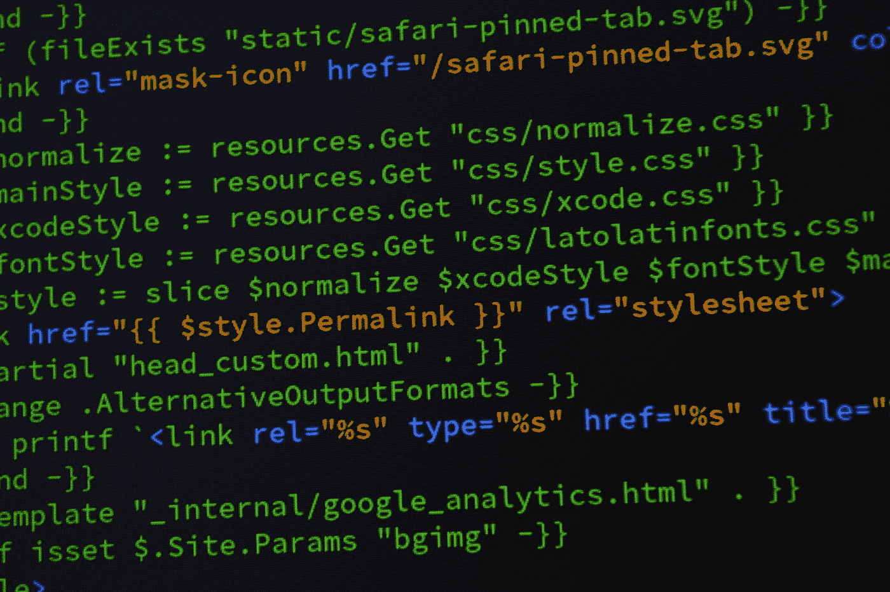

# JavaScript 中的模板字符串

> 原文：<https://levelup.gitconnected.com/template-strings-in-javascript-34b7fdc64b09>



托马斯·詹森在 [Unsplash](https://unsplash.com?utm_source=medium&utm_medium=referral) 上拍摄的照片

模板字符串是 ES6 中发布的现代 JavaScript 的一个强大特性。它允许我们将变量和表达式插入/插入到字符串中，而不需要像旧版本的 JavaScript 那样连接起来。它允许我们创建复杂的包含动态元素的字符串。模板字符串的另一个优点是标签。标签是将字符串和字符串的分解部分作为参数的函数，非常适合将字符串转换成不同的实体。

创建模板字符串的语法是使用反斜杠来分隔它们。例如，我们可以写:

```
`This is a string`
```

这是一个非常简单的模板字符串的例子。所有的内容都是常量，没有变量或表达式。要将变量和或表达式添加到字符串中，我们可以执行以下操作。

# 插值变量和表达式

```
// New JS with templates and interpolation
const oldEnoughToDrink = age >= 21;
const oldEnough = `You are ${oldEnoughToDrink ? 'old enough' : 'too young'} to drink.`
```

我们通过在字符串``${variable}``中添加美元符号`$`和花括号`{}`来插入变量或表达式。这比旧 JavaScript 中的替代方法要好得多，在旧 JavaScript 中，我们必须像下面这样连接一个字符串:

```
// Old JS using concatenation
const oldEnoughToDrink = age >= 21;
const oldEnough = 'You are ' + (oldEnoughToDrink ? 'old enough' : 'too young') + ' to drink.'
```

正如我们所看到的，如果我们有复杂的变量和表达式，旧的连接语法很容易出错。因此，模板字符串是对我们以前的一个很大的改进。

如果我们想在字符串的内容中使用反勾号字符，只需在字符串中的反勾号字符前加一个`\`。= > ``will have a literal \` back tick``

# 多行字符串

模板字符串的另一个重要特性是，我们可以使用多行字符串来提高代码的可读性。用旧风格的琴弦是无法轻易做到这一点的。对于旧的字符串样式，我们必须连接字符串的每一行，以便将长字符串放在多行中，如下例所示:

```
const multilineStr = 'This is a very long string' + 
  'that spans multiple lines.'const multllineStr2 = 'At vero eos et accusamus et iusto odio' + 'dignissimos ducimus qui blanditiis praesentium voluptatum ' + 'deleniti atque corrupti quos dolores et quas molestias ' + 'excepturi sint occaecati cupiditate non provident, ' + 
'similique sunt in culpa qui ' + 
'officia deserunt mollitia animi.'
```

正如我们所看到的，如果我们有更多的行，这将变得非常痛苦。拥有所有这些加号，并把字符串分成多行是非常令人沮丧的。

使用模板字符串，我们没有这个问题:

```
const longString = `At vero eos et accusamus et iusto odio dignissimos ducimus qui blanditiis praesentium voluptatum deleniti atque corrupti quos dolores et quas molestias excepturi sint occaecati cupiditate non provident, similique sunt in culpa qui officia deserunt mollitia animi.`
```

这比将字符串连接在一起要好得多。编写代码花费的时间更少，出现语法错误的可能性也更低。它的可读性也更好。

请注意，该方法确实向字符串`\n`添加了一个实际的新 like，如果您不希望字符串在其最终格式中有多行，只需在行尾添加一个`\`。

# 嵌套模板

模板字符串可以相互嵌套。这是一个很棒的特性，因为许多人想要创建动态字符串。模板字符串允许我们在模板字符串中嵌套常规字符串或模板字符串。例如，我们可以这样写:

```
const oldEnoughToDrink = age >= 21;
const oldEnough = `You are ${oldEnoughToDrink ? 'old enough' : 'too young'} to drink.`
```

我们可以用模板字符串将表达式插入字符串中来写同样的东西:

```
const TOO_YOUNG = 'too young';
const OLD_ENOUGH = 'old enough';const oldEnoughToDrink = age >= 21;const oldEnough = `You are ${oldEnoughToDrink ? OLD_ENOUGH : TOO_YOUNG} to drink.`
```

这个例子很简单，但是对于复杂的字符串组合，能够为我们如何构建字符串添加逻辑是非常强大的。


布雷特·乔丹在 [Unsplash](https://unsplash.com?utm_source=medium&utm_medium=referral) 上拍摄的照片

# 标记模板

有了模板字符串，我们可以在模板字符串前面添加一个叫做标签的东西。它们是将字符串和字符串的分解部分作为参数的函数。标记函数将模板字符串分解成一个数组作为第一个参数，数组中的每一项都是字符串的常量部分。函数的附加参数是所有变量和表达式，按照它们在字符串中出现的顺序排列。

```
const personOldTag = (strings, nameExp, ageExp, genderExp)=>{
  let str0 = strings[0]; // " is a "
  let str1 = strings[1]; // " year old "

  let oldStr;
  if (ageExp > 75){
    oldStr = 'senior';
  } else {
    oldStr = 'young';
  }

  // We can even return a string built using a template literal
  return `${nameExp}${str0}${oldStr}${genderExp}.`;
}const name = 'Bob'
const age = 80;
const gender = 'male;const result = personOldTag`${ name } is a ${ age } year old ${ gender }`;// result should be `Bob is a senior man.`
```

标记模板非常适合将字符串转换成你想要的任何格式，因为它只是一个普通的函数。但是，它是一个特殊的函数，因为第一个参数是一个包含字符串常量部分的数组。其余的参数包含每个表达式返回的返回值。这对于操作字符串和将返回值转换为我们想要的值非常有用。

标签的返回值可以是你想要的任何值。所以我们可以返回字符串，数组，对象，或者其他任何东西。

正如我们在上面的函数中看到的，在我们放在`personOldTag`旁边的字符串中，我们首先插入了`name`，然后是`age`，然后是`gender`。所以在参数中，它们也按这个顺序出现——`nameExp`、`ageEx`、`genderExp.`它们是模板字符串中`name`、`age`和`gender`的求值版本。

因为标签是函数，所以我们可以返回任何我们想要的东西:

```
const isOldTag = (strings, nameExp, ageExp, genderExp)=>{
  let str0 = strings[0]; // " is a "
  let str1 = strings[1]; // " year old "
  return ageExp > 75
}const name = 'Bob'
const age = 80;
const gender = 'male;const result = isOldTag`${ name } is a ${ age } year old ${ gender }`;// result is true
```

正如你所看到的，我们可以操作数据返回一个布尔值而不是一个字符串。模板标签是一种仅适用于模板字符串的功能。要对旧样式的字符串做同样的事情，我们必须用我们自己的字符串操作代码和内置的字符串操作函数来分解字符串，这远不如使用标签灵活。它将字符串的各个部分分解成参数，这些参数在模板标签中传递。

# 原始字符串

模板字符串有一个特殊的`raw`属性，可以从标签中获得。`raw`属性在不转义特殊字符的情况下获取字符串，因此该属性被称为`raw`。要访问一个字符串的`raw`属性，我们可以按照下面的例子:

```
const logTag = (strings) => {
  console.log(strings.raw[0]);
}

logTag`line 1 \r\n line 2`;
// logs "line 1 \r\n line 2" including characters '\', 'r' and 'n'
```

这有助于直观地显示带有完整特殊字符的字符串。

还有`String.raw`标签，在这里我们可以获取一个模板字符串并返回一个带有转义字符的字符串，而不需要对它们进行转义来查看字符串的完整形式。例如，用`String.raw`标签，我们可以写:

```
let hello = String.raw`Hello\n${'world'}!`;
// "Hi\nworld!"

hello.length;
// 13

hello.split('').join(',');
// "H,e,l,l,o,\,n,w,o,r,l,d,!"
```

正如我们所看到的，我们已经计算了表达式中的所有字符，但是我们保留了转义字符。

# 支持模板字符串

如今，几乎所有定期维护的浏览器都支持模板字符串。唯一一个不支持开箱即用的主要浏览器是 Internet Explorer。不过不支持的浏览器可以用 Babel 添加。Node.js 在版本 4 或更高版本中也支持它。

模板字符串是 JavaScript 字符串的新标准。它比 ES6 之前的字符串好得多，因为它支持字符串内部的插值表达式。我们也有标记模板，它们只是函数，模板字符串的分解部分作为参数。第一个参数中的常量字符串是分解后的数组形式的字符串，其余的参数是表达式在字符串中出现的顺序。标记模板函数可以返回任何变量类型。

用字符串的`raw`属性，这在标签中是可用的，可以得到带有未转义字符的字符串。