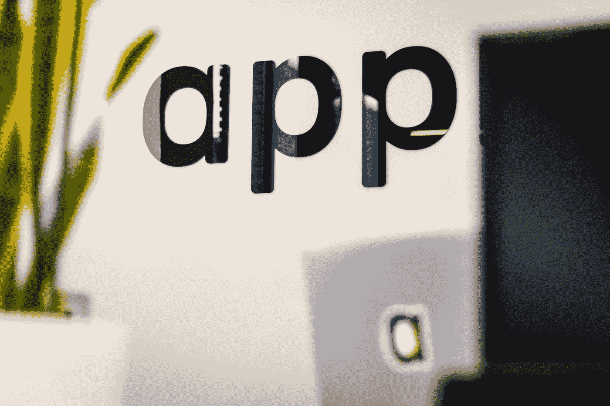

# 网站开发人员每月额外挣 1000 美元的十面骗局

> 原文：<https://levelup.gitconnected.com/ten-side-hustle-ideas-for-web-developers-to-make-extra-1k-a-month-f3fe0bb1bdc9>

## 任何开发人员如何在网上每月多赚 1000 美元

## 想法一:在介质上书写

J. Kelly Brito 在 [Unsplash](https://unsplash.com?utm_source=medium&utm_medium=referral) 上的照片

有了 Medium Partners 计划和付费墙，你可以通过在 Medium 上写作和在主要出版物上发表作品获得可观的收入。根据我的研究，Medium 上绝大多数顶级出版物都是关于自我提升的，其次是编程和创业。作为开发人员，这对您来说是个好消息，因为您可以撰写编程主题。

**你需要什么**:写作技巧和中等账户

## 想法二:通过在线课程教授一项技能

照片由 [Safar Safarov](https://unsplash.com/@codestorm?utm_source=medium&utm_medium=referral) 在 [Unsplash](https://unsplash.com?utm_source=medium&utm_medium=referral) 上拍摄

在线学习已经存在了一段时间，但随着远程工作、在家工作和社交距离的增加，它变得越来越受欢迎，成为共享知识的首选媒介。

你可以通过知名的教育平台，如 Coursea、udacity、skillshare 和 udeamy 来教授你的技能。

**你需要的:**一个你很精通的可以教给别人的技术技能(比如:Javascript、React、用 Chrome 调试等)和一个上面提到的有学习平台的账号。

## 想法三:成为虚拟主机和数字产品的代销商

由 [Markus Spiske](https://unsplash.com/@markusspiske?utm_source=medium&utm_medium=referral) 在 [Unsplash](https://unsplash.com?utm_source=medium&utm_medium=referral) 上拍摄的照片

几乎所有在线商品都有联盟计划。对于开发者，我建议与域名注册、虚拟主机、网页设计、模板设计和 WordPress 主题提供商合作。一旦你注册并成为其中一家供应商的合作伙伴，你就可以谈论他们，推广他们，并提供你对他们的真实看法。不过，要确保你的推荐是诚实的。

**你需要什么:**你可以在网上或电子邮件列表中推广代销商。众所周知，评论网站的转化率很高。

## 想法四:加入点击付费广告项目

米利安·耶西耶在 [Unsplash](https://unsplash.com?utm_source=medium&utm_medium=referral) 上拍摄的照片

我们都在网络上看到过网上横幅和文字广告。如果你有一个流量健康的网站，这个想法是可行的。

Google Adsense 是最受欢迎的点击付费广告程序，但也有其他替代程序，如 Mediavine、Infolinks、BuySellAds 和 Bidvertiser。

**你需要什么:**一个网页浏览量很大的网站。大多数广告项目要求你的网站在接受你成为发布者之前，每月至少有 10，000 的访问者。

## 想法 5:创造数字资产进行销售

照片由[迈克·彼得鲁奇](https://unsplash.com/@mikepetrucci?utm_source=medium&utm_medium=referral)在 [Unsplash](https://unsplash.com?utm_source=medium&utm_medium=referral) 上拍摄

像小工具、工具、WordPress 主题或 WordPress 插件这样的数字资产，如果有用的话，是值得花钱购买的。当我是一名开发者时，这曾经是我最喜欢的额外收入的方式。原因是我接触了不同的编程语言和框架，通常不是我在日常工作中使用的那些，构建和创建一些小而有用的东西并获得报酬。

一旦你创造了一些有用的、别人愿意为之付费的东西，你就可以把它放到 Envato、Gumroad、e-Junkie 等市场上。我的建议是选择一个有集市的平台，这样你的产品可以获得更多的曝光。你可以看看我的 [Gumroad 账号](https://gumroad.com/eisabai)寻找灵感。

开发者可以相对容易地创建的数字资产的例子有 WordPress 主题、网站模板、插件、电子书、pdf、教程和现成的代码。

**您需要什么:**一项数字资产和一个 marketplace 账户。如果你有自己的网站，你也可以在上面出售。

## 想法六:接下 Upwork 和 Fiverr 的合约工作

马库斯·温克勒在 [Unsplash](https://unsplash.com?utm_source=medium&utm_medium=referral) 上拍摄的照片

总有公司和个人寻找承包商来完成小项目，比如更新他们的网站，创建一个博客，维护一个 Shopify 网站等等。作为开发人员，您有技能和知识来几乎毫不费力地完成这些项目，并获得技能报酬。

## 想法 7:制作 YouTube 视频

克里斯蒂安·威迪格在 [Unsplash](https://unsplash.com?utm_source=medium&utm_medium=referral) 上拍摄的照片

在加入 YouTube 商业化项目之前，你需要大量的观众和稳定的观看时间，但不要让这成为使用 YouTube 作为额外收入平台的障碍。只要你发布几个 7-10 分钟长的视频，讨论一些常见的研究主题，如编码采访、调试常见的编程问题、启动 web 应用程序等，你的观看时间和订阅人数就会稳步增加。此外，你也可以使用 YouTube 作为一种方式，将流量导向你拥有的其他数字资产。做一名优步是一份不错的兼职，当然可以赚点外快。

**你需要的:**一个话题，例如，用 Python 编程，关于在硅谷做软件开发人员的 Vlog 等，有很多兴趣，一个摄像机(智能手机开始工作也不错)，一个电影编辑软件(例如:iMovie，ScreenFlow)和一个 YouTube 频道。

## 想法 8:写技术博客和教程赚钱

照片由[丹参赞](https://unsplash.com/@dancounsell?utm_source=medium&utm_medium=referral)在 [Unsplash](https://unsplash.com?utm_source=medium&utm_medium=referral) 上拍摄

有一些技术博客和网站会为你写他们选择的主题的文章付费。这非常类似于为媒体写作，但不同的是，你写完东西后会立即得到报酬，而且是有保证的收入。但不利的一面是，你可能无法像在 Medium 那样为你的个人品牌和经常性收入增值。

你需要什么:一个写作文件夹和写作技巧

## 想法 9:开发一款智能手机应用，并在 iTunes 或 Google Play 上销售

照片由 [Tim van der Kuip](https://unsplash.com/@timmykp?utm_source=medium&utm_medium=referral) 在 [Unsplash](https://unsplash.com?utm_source=medium&utm_medium=referral) 上拍摄

这是开发人员喜欢做的事情。当我是一名开发人员时，我只是喜欢构建东西。没有什么比做一件东西，然后看着它被很多人使用更令人满意的了。如果你能从中赚些外快，那就更好了。

你可以通过两种主要方式从应用程序中赚钱:要么使用免费增值模式，即免费下载和使用，但带有广告；要么使用付费模式，即某人必须付费才能使用你的应用程序。

可以获得额外收入的常见智能手机应用类型有:

1.  比赛
2.  生产力工具
3.  教育应用
4.  健康和保健应用

**你需要什么:**令人信服的应用理念和应用开发技能

## 想法十:建造一座 SaaS

斯蒂芬·菲利普斯-Hostreviews.co.uk 在 [Unsplash](https://unsplash.com?utm_source=medium&utm_medium=referral) 上的照片

与开发应用程序类似，开发 SaaS 并从中赚钱的想法也会吸引开发者。SaaS 代表软件即服务；在这里，用户可以通过互联网使用你的软件，作为一项服务，而不必安装在他们的机器上。开发者熟悉的流行 SaaS 有 Google Apps (G suite)、Dropbox、Slack 和 Zoom。

这一想法的投资成本高于其他想法，因为您需要投入时间来构建 SaaS 解决方案，并支付在提供商 AWS 上托管该解决方案的相关成本。

建立一个 SaaS 或应用程序作为一种手段来赚取额外收入并不适合胆小的人，因为一旦你建立了它，他们就不会来了。你需要学习如何推销它。但回报也可能是可观的——如果对您的解决方案有需求，每月可能轻松超过 1k。

你需要什么:一个解决特定问题的软件和全栈编程技巧

# 开发商一方应不应该催促？

照片由 [Louis Hansel @shotsoflouis](https://unsplash.com/@louishansel?utm_source=medium&utm_medium=referral) 在 [Unsplash](https://unsplash.com?utm_source=medium&utm_medium=referral) 上拍摄

side hustles 不仅是开发者赚取额外现金的好方法，也是一个重要的创意渠道。我知道一个事实，伟大的开发者喜欢叮当作响和制作东西。我进入软件开发和技术行业也是因为这个原因。这就是我至今仍在创作的原因，我有一个效率系统来帮助我保持有组织和有条不紊。只要你能很好地管理自己的时间，不为了几个额外的美元而忽视自己的职业目标，那么我想不出任何理由不去探索我在这篇文章中提到的一些想法。

📩[注册](https://eisabainyo.net/weblog/subscribe/)订阅作者的时事通讯，定期获得关于你科技职业的建议和资源。您还将立即收到一个链接和密码，为您的职业发展下载免费赠品。