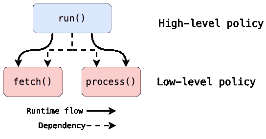
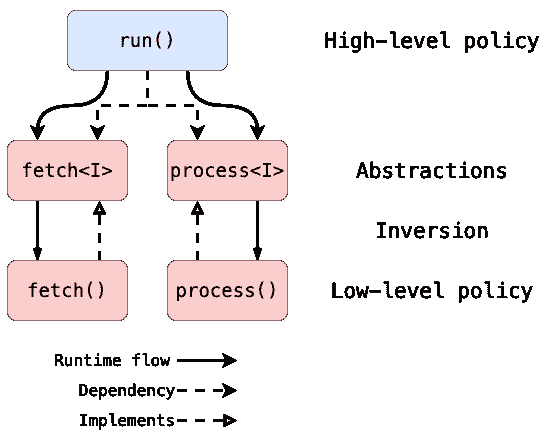

# Python 中的反转原则

> 原文：<https://levelup.gitconnected.com/tenet-of-inversion-with-python-9759ef73dbcf>

## Python 中的干净架构

## 打破依赖倒置原则。

**依赖倒置原则**经常在 **OOP** 范例中解释。关于这个概念我想分享另一个角度。在这篇短文中，我将走过一条从抽象到理解什么是真正倒置的道路。

# 介绍

自从第一批编程语言出现以来，它们的使用一直在持续增长。程序变得越来越庞大和复杂。软件开发转向工业。甚至编程的先驱们也开始把程序的大小视为一个难题。

> 我的基本问题是，正是这种规模上的差异是我们编程困难的主要来源之一！
> **——e . w .迪杰斯特拉。结构化程序设计笔记。1970 年**

随着规模的扩大，软件的成本也持续增长。开发软件变成了一个长期运行的过程。一旦开发出来，软件会随着时间和需求不断发展。事实证明，软件的主要成本可能不在最初的开发阶段，而在维护阶段。

工程师和科学家继续开发理论和方法来处理成本和复杂性。

> 相对于减少调试和修改时间，简单性是评估替代设计的主要衡量标准。
> **——w . p .史蒂文，G.J .迈尔斯，L.L .康斯坦丁。结构化设计。1974 年**

20 世纪 60、70 年代出现了大量的编程范式。而主导模型变成了**结构化设计**和**面向对象编程**。把程序分解成模块和相互通信的对象，这是一个绝妙的主意！

但是开发人员应该如何组织系统的各个部分来达到良好的质量。应该遵循哪些规则？

1994 年，罗伯特·马丁发表了一篇论文，研究了测量面向对象设计质量的标准。

> 本文介绍了简单地使用对象来建模应用程序不足以获得健壮的、可维护的和可重用的设计的情况。
> **——r·马丁。OO 设计质量度量。1994 年**

系统的各个部分如何组织和通信要重要得多。设计中子系统的相互依赖使得设计变得僵化和脆弱。

在下一篇论文中，马丁阐述了这个原理。

# 原则

> 1.高层模块不应该依赖低层模块。两者都应该依赖于抽象(例如接口)。
> 2。抽象不应该依赖于细节。细节(具体的实现)应该依赖于抽象。
> **——r·马丁。依存倒置原则。1996 年**

# 显示优点的东西

例如，让我们想出一个简单的**用例**。我们有一个脚本，接收一些输入数据，处理它，并打印结果。

为了简单起见，我用下面的方式写下来。

显示优点的东西

在我们的实验中，我们将思考**抽象**如何接收数据以及我们如何处理数据。我把它写成了`data = [1, 2, 3]`，但是也可以写成`requests.get(“[https://jsonplaceholder.typicode.com/users](https://jsonplaceholder.typicode.com/users)”)`或者更复杂的东西。`result = [each * each for each in data]`也是如此。这些细节我们不关心。

在那里，我们引入了抽象概念。

# 抽象

抽象思维被认为是人类思维的关键属性之一。这种能力很可能与人类语言的发展密切相关。

在软件工程和计算机科学中，**抽象**是去除时间细节以关注更重要的细节的过程。

抽象的技术形式可以是不同的，仅举几个例子:

*   **数据类型**的用法；
*   **程序**和**功能**的概念；
*   将普通行为从非抽象**类**重组为**“抽象类】**的过程。

我们可以使用函数作为抽象来重写代码。

作为抽象的功能

首先我们可以注意到代码变得越来越大。这是使用抽象的代价。

但是我们在代码中增加了结构。我们把**用例**分离到了`run()`函数，现在它读起来就像一个故事。是我们**高层**的政策。

> 获取数据并处理数据。
> - **用例。**

我们将**低级**细节隐藏在**抽象** `fetch()`和`process()`后面。

正如我们所见，我们的**高级**模块依赖于抽象，在我们的例子中，它们是函数。但是我们的底层抽象仍然依赖于细节。

我们的**依赖**感觉不对劲。

# **依赖关系**

当我们引入一个新的组件时，它并不存在于真空中。它与其他组件进行通信和连接。这种连接有一个专门的术语——一个**联轴器**。

并非所有的从属关系都是平等的。**耦合度**可以不同。

**高耦合—** 组件使用另一组件的**内部**细节。

**低耦合—** 组件依赖于另一个组件的**外部**名称或**接口**。

**外部**和**内部**关系与名称范围密切相关。

回到我们的例子，名字`fetch()`和`process()`是**全局**名字，直接用于`run()`函数的**内部**名字空间。这种用法在组件之间形成了刚性的**连接。**

如果我们想要低**耦合**，我们可以向`run()`函数添加参数，并使用这些名称作为对原始函数的引用。

分离抽象

通过这个简单的改变，我们使我们的`run()`更加灵活和可测试。我们可以使用类似**接口**的其他函数。我们可以使用模拟来测试或实现其他获取或处理过程。

这些函数的**接口**到底是什么？

# 多态性

参数`fetch`和`process`与`fetch()`和`process()`函数不是一回事。它们只是预期具有特定行为的东西的名称或者可以在`run()`函数中使用的**接口**。

在语言层面上，这种可能性被称为**多态性**。

现在我们的**依赖**将不是一个函数，而是一个多态的**接口。**因为 Python 有一个 **duck typing 多态**这个接口是隐式定义的。

我们可以使用类型提示来描述预期的**接口**。可能是这样的。

类型提示

现在我们将我们的**依赖**从函数转移到**多态**接口。

那就是**反转**发生的地方。

我在前面的故事中描述了 Python 中**多态性**的更多例子。

 [## Python 中多态隐藏的力量

### 如何在应用程序中实现多态接口？

levelup.gitconnected.com](/hidden-power-of-polymorphism-in-python-c9e2539c1633) 

# 倒置

我们将画出图来显示到底是什么在反转。

首先，是“作为抽象的功能”变体的模式。其中高级功能`run()`将低级功能作为依赖项。我们正在考虑将**功能**作为**抽象**。

作为抽象图的功能

但是抽象之间的**耦合**太严格了，我们的底层抽象依赖于细节。

我们向`run()`函数添加了参数。通过这样做，我们引入了新的**抽象**作为**多态**接口。

解耦抽象图

实线表示代码执行时的运行时流程。虚线是源代码流程。

**运行时**并不关心所有这些**反转**和**抽象**。它们只对开发人员有帮助。理解设计变得越来越容易，维护也越来越容易。

我们可以把**反转**看作是**低级**函数和该函数实现的**接口**之间的方向差异。

更多一些用 **DIP** 分层的例子可以在我的 GitHub repo**[**py-dependency-inversion-study**](https://github.com/pavel-fokin/py-dependency-inversion-study)**中找到。****

# ****结论****

**作为一门高度动态的语言，Python 有各种可能性来创建富有表现力和良好表达的应用程序。**

**使用 **DIP** 是在系统内创建干净架构的基本机制。它的正确应用将有助于进行分层良好的设计，将业务逻辑与其他细节分离开来。**

## **更多阅读**

**如果你喜欢这篇文章，你可以对以下内容感兴趣。**

**如何将**功能**和**面向对象**编程与 Python 中迭代器的组合结合起来**

** [## 如何用 Python 中迭代器的组合追踪危险的小行星

towardsdatascience.com](https://towardsdatascience.com/how-to-track-hazardous-asteroids-with-composition-of-iterators-in-python-3945cf8e8f84)**