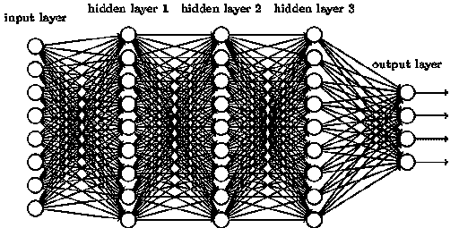

# 张量运算——深度学习的基本构件

> 原文：<https://levelup.gitconnected.com/tensor-operations-basic-building-blocks-of-deep-learning-244e11dce40e>

Pytorch 和使用 Pytorch 的核心矩阵运算简介

2012 —当前:深度学习爆炸的时代

在 2012 年的 [Imagenet](https://qz.com/1034972/the-data-that-changed-the-direction-of-ai-research-and-possibly-the-world/) 运动之后，深度学习取得了突飞猛进的发展。深度学习现在已经成为我们日常生活的一部分，当我们与语音助手交谈、使用家庭自动化系统、写电子邮件等时，许多算法都在运行。事实上，它的影响如此之大，以至于我们可以在:D 的[亚马逊](https://www.amazon.com/Neural-Networks-Babies-Baby-University/dp/1492671207)上看到名为《婴儿神经网络》的书籍

# **“深度”学习是如何发生的？**

从本质上来说，深度学习只不过是人脑如何工作的微缩版(忽略了我们人脑中存在的实际复杂性，这仍然非常非常难以复制)。计算机使用数百甚至数千个跨深层的神经元连接从其输入和输出中学习(因此有了“深度学习”一词)。这些神经元连接中的每一个都有不同的权重。

权重在每次迭代中得到优化，使得预测的损失最小化，并且以最高的精度预测输出。计算机是机器，而机器只理解数字。因此，在地面上，我们讨论的所有这些权重都是 n 维矩阵或**张量。**

由于每个权重是 n 维矩阵或张量，因此权重的学习和优化涉及数百万次矩阵乘法。在过去的 6-7 年中，我们已经看到许多简化这项任务的 DL 框架出现。

五大深度学习框架(Pytorch、Tensorflow、Keras、CNTK、Caffe)

# **py torch 是什么？**

Pytorch 是一个流行的深度学习框架，由脸书人工智能研究所(FAIR)开发和维护，用于处理张量。自 2016 年 1.0.0 版本发布以来，由于使用简单灵活，它越来越受欢迎。在本文中，我们将主要关注使用 Pytorch 的一些核心张量运算。你可能想浏览这个[博客](https://medium.com/@bryant.kou/how-to-install-pytorch-on-windows-step-by-step-cc4d004adb2a)来获得关于如何安装 PyTorch 的详细说明。

1.  火炬.尺寸
2.  火炬
3.  torch.cat
4.  火炬. mul
5.  火炬.反转

# **1。Torch.size**

Torch.size 返回任何输入张量的维数。

在上面的例子中，我创建了一个 3X2X4 张量和 torch.size 返回 3 个维度。我们的张量在外括号中有 3 个元素，每个元素是一个矩阵。每个矩阵又有 2 个元素，每个元素是一个包含 4 个元素的列表。

# **2。Torch.mm**

torch.mm 返回任意两个输入矩阵 mat1 和 mat2 的矩阵乘法(非元素方式)

在上面的例子中，mat1 和 mat2 的大小都是 3X3。因此 torch.mm 的输出大小也是 3X3。我们可以看到可以使用' @ '操作符代替 torch.mm 来执行相同的操作

*使用 torch 时的注意事项. mm()*

*   第一个输入矩阵的列大小应该等于第二个输入矩阵的行大小
*   对于不是矩阵或者维数大于 2 的张量，torch.mm 不起作用，我们可以使用 torch.mul 进行逐元素乘法
*   @ '运算符执行与 torch.mm 相同的操作

# **3。Torch.cat**

torch.cat 可以水平或垂直连接两个张量

我们可以看到张量 y 已经堆叠在张量 x 下面了。

通过使用 dim 参数并将其设置为 1，我们可以水平连接 2 个张量。默认设置为 0，表示垂直连接。

*使用 torch.cat 时的注意事项*

*   使用 dim = 1 水平连接张量
*   可以连接任意数量的张量，但是，要确保连接方向上的张量大小应该相同

# **4。Torch.mul**

torch.mul 在两个张量之间执行元素级乘法

我们可以看到，对任何维数的张量都可以进行逐元素乘法。应用 torch.mul 的另一种方法是使用*运算符和 a.mul(b ),其中 a 和 b 是输入张量

*使用 torch.mul 时的注意事项*

*   torch.mul 类似于两个向量之间的点积。
*   * '运算符或 a.mul(b)也执行与 torch.mm 相同的操作
*   输入张量应满足广播条件

# **5。Torch.inverse**

torch.inverse 计算任意张量的倒数

这里，我们使用 randn 函数创建了一个张量，用随机数填充 4X4 张量。然后 torch.inverse 计算 X 的逆，Inv(x) @ X 给我们一个单位矩阵

*使用火炬时的注意事项。反转:*

*   torch.inverse 只有在输入张量在所有维度上具有相同数量的元素时才能正常工作。
*   torch.inverse 也可以应用于 3d 张量。然而，张量应该在所有方向上有相同的维数，或者它应该是一个平方张量

# 结论

因此，在本文中，我介绍了以下内容:

*   什么是深度学习？
*   Pytorch 是什么？
*   有哪些重要的张量运算？
*   如何实现执行上述张量运算的核心函数
*   使用这些功能时有哪些典型的注意点？

# 参考链接

*   torch.tensor 的官方文档:[https://pytorch.org/docs/stable/tensors.html](https://jovian.ml/outlink?url=https%3A%2F%2Fpytorch.org%2Fdocs%2Fstable%2Ftensors.html)
*   Pytorch 从无到有简介:[https://www . analyticsvidhya . com/blog/2019/09/introduction-to-py torch-从无到有/](https://jovian.ml/outlink?url=https%3A%2F%2Fwww.analyticsvidhya.com%2Fblog%2F2019%2F09%2Fintroduction-to-pytorch-from-scratch%2F)
*   如何安装 py torch:[https://medium . com/@ Bryant . kou/how-to-install-py torch-on-windows-step-by-step-cc 4d 004 ADB 2 a](https://medium.com/@bryant.kou/how-to-install-pytorch-on-windows-step-by-step-cc4d004adb2a)