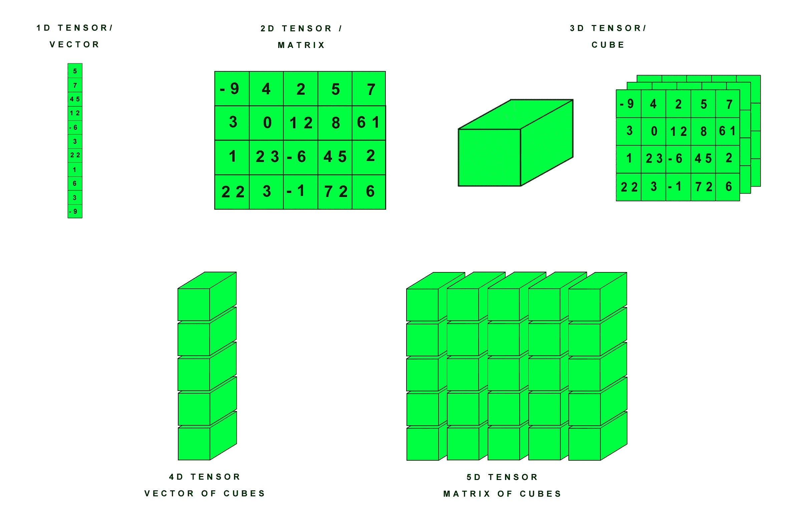

# PyTorch 中的张量运算

> 原文：<https://levelup.gitconnected.com/tensor-operations-in-pytorch-798d58e7adb2>

## *py torch 张量中我发现有用的 5 种运算*

PyTorch

PyTorch 是一个基于 Python 的科学包，它使用一种称为张量的特殊数据类型来执行高级操作。张量是具有规则形状和相同数据类型的数字的数字、向量、矩阵或多维数组。PyTorch 是 NumPy 包的替代产品，可以额外使用 GPU 的能力。它还被用作进行深度学习研究的框架。

理解张量

这 5 种操作是:

*   展开()
*   置换()
*   tolist()
*   狭窄()
*   哪里()

# 1.展开()

现有张量沿着值为 1 的维度扩展到新的维度。张量可以沿任何一维或多维展开。如果不想沿特定维度扩展张量，可以将其参数值设置为-1。

> 注意:只能扩展单一维度

在这个例子中，张量的原始维数为[1，2，3]。它被扩展到维度[2，2，3]。

该函数可用于沿单一维度扩展现有张量。它只返回一个新视图，不分配新内存。因此，它可以用来研究张量在更大维度下的行为。

# 2.置换()

这个函数返回一个张量视图，原始张量的维数顺序根据我们的选择而改变。比如原来的维度是[1，2，3]，我们可以改成[3，2，1]。该函数将所需的维度顺序作为其参数。

在这个例子中，原始张量的维数为[【1，2，3】](https://jovian.ml/samy-n/01-tensor-operations)。使用置换，我设置顺序为(2，1，0)，这意味着新的维度应该是[ [3，2，1](https://jovian.ml/samy-n/01-tensor-operations) ]。如所见，张量的新视图具有重新排列的数字，使得张量具有维度[【3，2，1】](https://jovian.ml/samy-n/01-tensor-operations)。

当我们想要重新排序并查看不同维度的张量，或者使用不同顺序的矩阵执行矩阵乘法时，可以使用该函数。

# 3.tolist()

这个函数以 Python 数字、列表或嵌套列表的形式返回张量。在此之后，我们可以对它执行任何 Pythonic 逻辑和运算。

在本例中，张量作为嵌套列表返回。

# 4.狭窄()

这个函数返回一个新的张量，它是原始张量的缩小版本。该函数的参数是输入张量、沿其缩小的维度、新张量沿该维度的起始索引和长度。它从 index start 到 index (start+length-1)获取该维度中的元素。

在这个例子中，张量将沿着第二维度变窄，第二维度是最里面的列表。它从索引 2 开始到索引 3(= 2+2–1，即 start+length-1)获取列表中的元素

Narrow()的工作方式类似于高级索引。例如，在 2D 张量中，使用 [[:，0:5](https://jovian.ml/samy-n/01-tensor-operations) 的高级索引选择从列 0 到列 5 的所有行。使用 torch.narrow(1，0，5)也可以达到同样的效果。然而，在更高维的张量中，对于每一维使用:来提及范围是很乏味的。使用 narrow()可以更快更方便地实现这一点。

# 5.哪里()

这个函数返回一个新的张量，每个索引的值根据给定的条件改变。这个函数的参数是条件，第一张量和第二张量。在张量(在条件中使用)的每个值处检查条件，如果为真，则用第一个张量中相同位置的值替换该值，如果为假，则用第二个张量中相同位置的值替换该值。

这里，它检查张量 a 中的值是否是偶数。如果是，它就被张量 b 中的值所代替，这些值都是零，否则它就和原来的一样。

该功能可用于设定阈值。如果张量中的值高于或低于某个数字，它们可以很容易地被替换。

# **结论**

这 5 个函数是 PyTorch 文档中提到的众多函数中的几个。更多操作可以参考。

# **参考文献**

*   PyTorch 张量文档-[https://pytorch.org/docs/stable/torch.html#](https://pytorch.org/docs/stable/torch.html#)
*   我的丘比特笔记本-[https://jovian.ml/samy-n/01-tensor-operations](https://jovian.ml/samy-n/01-tensor-operations)
*   深度学习用 PyTorch 教程-[https://www.youtube.com/watch?v=vo_fUOk-IKk&list = plwkjhjtqvabm 3 T2 eq1 _ kg loc 7 ogdxdra&index = 2&t = 0s](https://www.youtube.com/watch?v=vo_fUOk-IKk&list=PLWKjhJtqVAbm3T2Eq1_KgloC7ogdXxdRa&index=2&t=0s)
*   jovian . ml—[https://jovian.ml/forum/](https://jovian.ml/forum/)

 [## 编写面试问题

### 一个完整的平台，在这里我会教你找到下一份工作所需的一切，以及…

技术开发](https://skilled.dev)