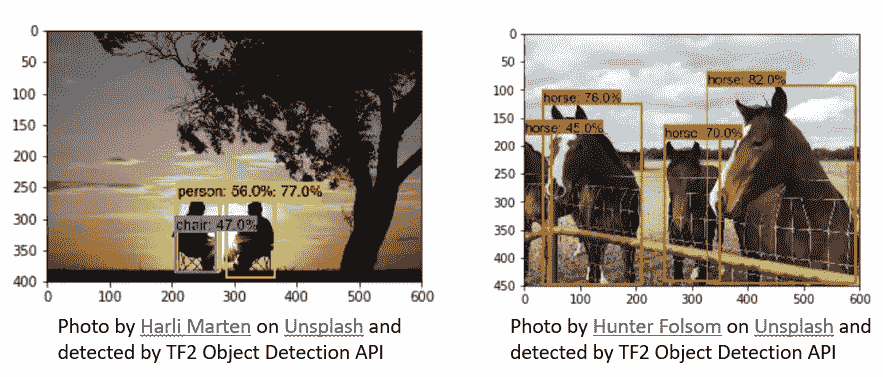
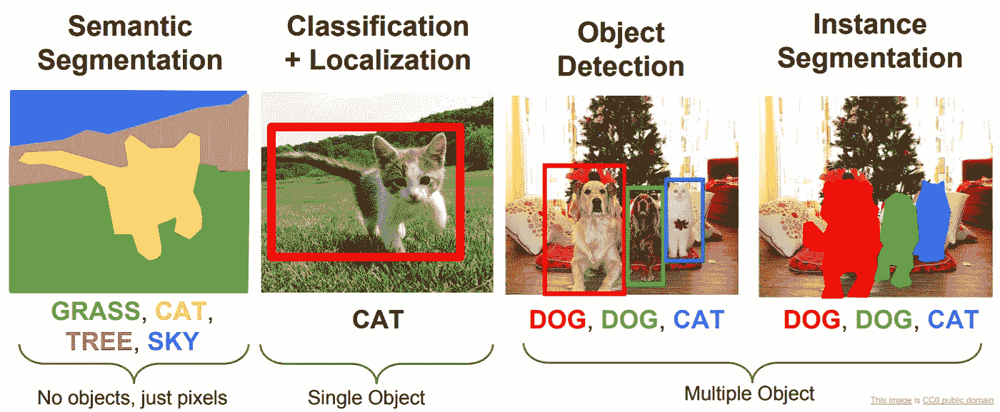
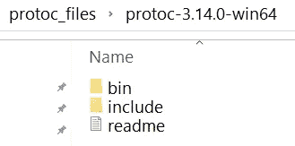
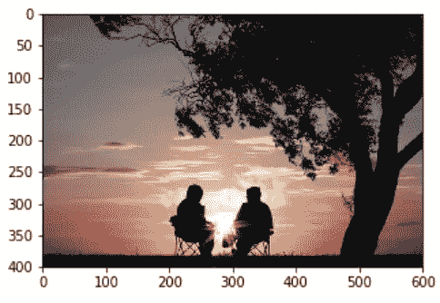
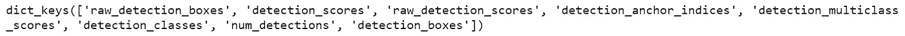
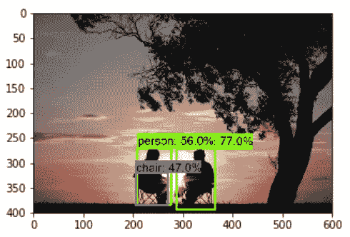

# TensorFlow 对象检测 API

> 原文：<https://levelup.gitconnected.com/tensorflow-object-detection-api-4bb324b130d2>

## 了解如何通过简单的步骤使用 TensorFlow 对象检测 API 执行对象检测。

***您将了解什么是对象检测，解决一些常见问题以使 TensorFlow 对象检测 API 工作，最后，使用在 COCO 2017 上培训的 TF2 对象检测 API 对一些图像进行推断。***



计算机视觉让我们能够

*   **通过给图像数据分配标签来对图像中出现的对象进行分类**。比如识别猫狗，对数字进行分类，或者对某些疾病的胸透进行分类。
*   **图像分类和定位**。这包括对图像进行分类，以及识别物体在边界框中的位置。定位是对象在图像中出现的位置。
*   **对象检测识别图像或视频中出现的所有不同对象及其位置**。围绕图像中出现的所有对象绘制一个边界框。**检测是识别图像中存在什么以及在哪里。**
*   **实例分割或语义分割**在像素级检测图像中存在的所有对象。输出具有不同类别或对象的区域



来源:[http://cs 231n . Stanford . edu/slides/2017/cs 231n _ 2017 _ lecture 11 . pdf](http://cs231n.stanford.edu/slides/2017/cs231n_2017_lecture11.pdf)

您将对一组图像运行现成的 TensorFlow 2 兼容对象检测模型推理，这些图像是对象检测模型已经训练过的对象类别。

> TensorFlow 2 物体检测模型是在 [COCO 2017 数据集](http://cocodataset.org/)上预训练的检测模型的[集合。](https://github.com/tensorflow/models/blob/master/research/object_detection/g3doc/tf2_detection_zoo.md)

## **tensor flow 2 对象检测 API 设置**

**克隆 TensorFlow 模型库**

```
**git clone https://github.com/tensorflow/models.git**
```

**安装 TensorFlow 2 对象检测 API**

TF2 对象检测 API 使用 protobuf 文件，您需要使用 protobuf 编译器将其转换为 python 文件。

为您的设置安装 [protobuf 编译器](https://github.com/protocolbuffers/protobuf/releases/tag/v3.14.0)版本> = 3。您可以通过键入以下命令来检查您的协议版本。

```
**protoc --version**
```

**通用协议问题**

*   **找不到“协议”命令**:我在 Windows10 上通过更新 PATH 环境变量解决了这个问题。当您在一个文件夹中解压 protobuf 文件时，您将有两个文件夹:bin 和 include。更新路径 environmental 以指向包含 protoc.exe 的 bin 目录。



我也读过一些解决方案，人们提供 protoc.exe 文件的完整路径。

您还需要确保将以下路径添加到 PYTHONPATH 环境变量中，以便 TF2 对象检测 API 在使用 Anaconda 时能够工作。

1.  通往…**\模型\研究的道路**
2.  通往…**\模型\研究\物体 _ 探测**
3.  通往… **\Continuum\anaconda3** 的路径
4.  路径到…**\ Continuum \ anaconda 3 \ Scripts**
5.  路径到…**\ Continuum \ anaconda 3 \ Library \ bin**

设置完成后，您可以执行以下命令

```
**%%bash
cd models/research/
protoc object_detection\protos\*.proto — python_out=.
cp object_detection\packages\tf2\setup.py .
python -m pip install .**
```

如果命令执行成功，那么所有的。**\ models \ research \ object _ detection \ protos**文件夹中的 proto 文件将被转换为。py 文件。

## 使用 TF2 对象检测 API 进行推理

**导入所需的库**

```
**import os
import matplotlib.pyplot as plt
import numpy as np
from PIL import Image
import tensorflow as tf
import tensorflow_hub as hub**# importing libraries from  object detection API **from object_detection.utils import label_map_util
from object_detection.utils import visualization_utils as viz_utils
from object_detection.utils import ops as utils_ops****%matplotlib inline**
```

**为 COCO 数据集创建标签文件。**

**' MSC oco _ label _ map . Pb txt '**文件存在于**\ models \ research \ object _ detection \ data**文件夹中

```
**LABEL_FILENAME = 'mscoco_label_map.pbtxt'
PATH_TO_LABELS = download_labels(LABEL_FILENAME)****category_index = label_map_util.create_category_index_from_labelmap(PATH_TO_LABELS,                                                                    use_display_name=True)**
```

**将图像加载到 numpy 数组**

将图像加载到一个 numpy 数组，以将其提供给张量流图

```
**def load_image_into_numpy_array(path):**
  """Puts image into numpy array to feed into tensorflow graph.
 Args:
    path: the file path to the image
Returns:
    uint8 numpy array with shape (img_height, img_width, 3)
  """
  **image = None
  image = Image.open(path)****(im_width, im_height) = image.size
  return np.array(image.getdata()).reshape((1, im_height, im_width, 3)).astype(np.uint8)**
```

**加载物体检测模型**

在这里，我正在加载 [EfficientDet D0 512x512](https://tfhub.dev/tensorflow/efficientdet/d0/1) 。用于对象检测的所有不同模型架构都可用[此处](https://tfhub.dev/tensorflow/collections/object_detection/1)

```
**print('loading model...')
model_handle='**[**https://tfhub.dev/tensorflow/efficientdet/d0/1'**](https://tfhub.dev/tensorflow/efficientdet/d0/1') **hub_model = hub.load(model_handle)
print('model loaded!')**
```

显示图像

```
**flip_image_horizontally = False 
convert_image_to_grayscale = False****image_path = r'people.jpg'
image_np = load_image_into_numpy_array(image_path)**# Flip horizontally
**if(flip_image_horizontally):
 image_np[0] = np.fliplr(image_np[0]).copy()**# Convert image to grayscale
**if(convert_image_to_grayscale):
 image_np[0] = np.tile(
 np.mean(image_np[0], 2, keepdims=True), (1, 1, 3)).astype(np.uint8)****plt.figure(figsize=(5,5))
plt.imshow(image_np[0])
plt.show()**
```



照片由[哈里·马腾](https://unsplash.com/@harlimarten?utm_source=unsplash&utm_medium=referral&utm_content=creditCopyText)在 [Unsplash](https://unsplash.com/s/photos/people?utm_source=unsplash&utm_medium=referral&utm_content=creditCopyText) 上拍摄

**对图像运行对象检测推理**

使用 EfficientDet D0 对上述图像运行对象检测

```
# running inference
**results = hub_model(image_np)**# different object detection models have additional results
**result = {key:value.numpy() for key,value in results.items()}
print(result.keys())**
```



**可视化对象检测结果**

使用 ***viz_utils*** 类的***visualize _ box _ and _ labels _ on _ image _ array***可视化结果。

***visualize _ boxes _ and _ labels _ on _ image _ array***函数将对应于相同位置的框分组，并为每个检测创建一个显示字符串，并将其叠加在图像上。

```
l**abel_id_offset = 0
image_np_with_detections = image_np.copy()
viz_utils.visualize_boxes_and_labels_on_image_array(
      image_np_with_detections[0],
      result['detection_boxes'][0],
      (result['detection_classes'][0] + label_id_offset).astype(int),
      result['detection_scores'][0],
      category_index,
      use_normalized_coordinates=True,
      max_boxes_to_draw=200,
      min_score_thresh=.30,
      agnostic_mode=False
     )****plt.figure(figsize=(5,5))
plt.imshow(image_np_with_detections[0])
plt.show()**
```



TF2 对象检测 API 的输出

## 结论:

TF2 对象检测 API 提供了一组在 COCO 2017 数据集上训练的对象检测模型，这些模型可用于进行推理，以识别模型已经训练过的对象。为了检测新的对象，你需要在一个新的数据集上训练对象检测模型，我们将在下一篇文章中探讨。

## 参考资料:

[http://cs 231n . Stanford . edu/slides/2017/cs 231n _ 2017 _ lecture 11 . pdf](http://cs231n.stanford.edu/slides/2017/cs231n_2017_lecture11.pdf)

[](https://github.com/tensorflow/models) [## 张量流/模型

### TensorFlow 模型花园是一个存储库，包含许多最新(SOTA)的不同实现…

github.com](https://github.com/tensorflow/models)  [## 张量流集线器

### 编辑描述

tfhub.dev](https://tfhub.dev/tensorflow/collections/object_detection/1) [](https://github.com/tensorflow/models/blob/master/research/object_detection/g3doc/tf2.md) [## 张量流/模型

### 您可以使用 Python 包安装程序(pip)或 Docker 安装 TensorFlow 对象检测 API。对于本地…

github.com](https://github.com/tensorflow/models/blob/master/research/object_detection/g3doc/tf2.md) [](https://www.tensorflow.org/hub/tutorials/tf2_object_detection) [## TensorFlow 集线器对象检测 Colab

### 欢迎使用 TensorFlow 中心对象检测 Colab！本笔记本将带您完成运行的步骤…

www.tensorflow.org](https://www.tensorflow.org/hub/tutorials/tf2_object_detection)