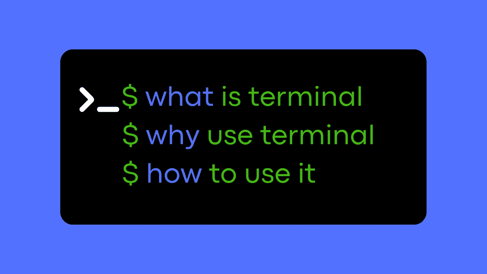
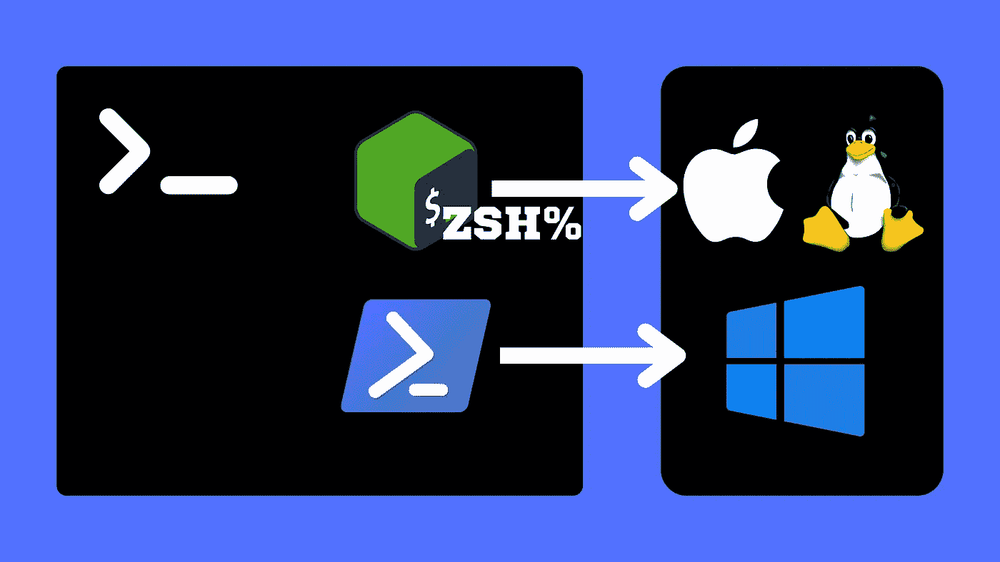
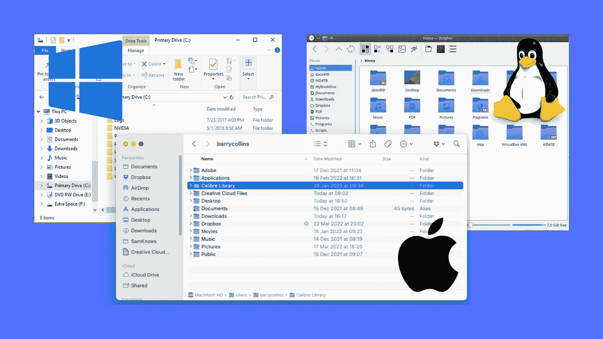

# 终端基础

> 原文：<https://levelup.gitconnected.com/terminal-basics-fa8010fb6b80>

# 终端简介

本文旨在为您提供在 Mac OS 或 Linux 计算机上开始使用终端的基本基础和最有用的终端命令。

## 什么是终端？

终端为您正在使用的操作系统提供了一个命令行界面，它是一个基于文本的界面，用于与计算机进行交互。

## 壳牌是什么？

您可能还听说过 shell 术语。 **Shell 是运行在终端上的程序(软件)。**

Mac 和大多数 Linux 系统上的默认 Shell 是 **Bash** ，在 Windows 上是 **PowerShell** ，另一个流行的 shell 是 **ZShell (ZSH)** ，它是 Bash 的替代产品，但是更加可定制。

我将要向您展示的命令在 Mac OS 和 Linux 上都有效。

# 但是为什么要用终端呢？

我们习惯使用的图形用户界面(GUI)如 Mac 上的 finder、Windows 上的 Explorer 或 Linux 上的 Dolphin 使体验变得更容易。

为什么我们要去终端而不是使用图形界面？

有很多事情只能从终端完成，比如使用 git 命令、与数据库交互、启动服务器、执行脚本等等。

此外，一旦你学会了基本的命令，浏览文件夹，查找或删除东西，运行不同的命令都会快得多。

# 最有用的命令

所以我们在图形用户界面上经常做一些基本的事情，比如浏览文件夹，或者查看我们当前所在的文件夹，让我们来看看终端中的相应功能。

## 航行

*   `ls` 我们通常打开 GUI 并查看打开目录中的文件和文件夹，我们可以在终端中用`ls`命令做同样的事情，这将列出当前目录的内容
*   `ls –l` 如果你添加了`-l`标志，它将列出当前目录的内容和额外的细节，比如最后修改日期，创建文件/文件夹的用户等等
*   `cd` 接下来，我们要做的是进入 finder 窗口中的一个文件夹，在终端中对应的是`cd`命令，后跟目录名(`cd Desktop/Sites` = >带我们进入站点文件夹)
*   `pwd` 我们还可以看到我们当前所在的文件夹路径，在终端中，我们可以使用`pwd`命令打印当前目录，并查看我们当前所在的位置(`pwd` = > `Users/admin/Desktop/Sites`)
*   为了在文件夹层次结构中向上一级，我们使用了`cd ..` ( `cd ..` = >带我们到桌面)
*   `cd -` finder 中有一个返回箭头，带我们回到上一个目录，在终端中我们使用`cd -`返回(`cd-` = >带我们回到站点文件夹)。这类似于前面的命令，但是它将您带回到层次结构中的上一级，而不是返回
*   当你打开终端时，你通常从主目录开始。要回到我们开始的主目录，我们可以`cd ~` ( `cd ~` = >带我们回到主~目录)

## 创建文件夹和文件

*   `mkdir` 我们右键单击，然后选择“新建文件夹”来创建一个新目录，同样可以在终端中使用`mkdir`命令，后跟我们正在创建的文件夹名称`mkdir dir_name`
*   `touch` 要在当前目录下创建一个文件，使用`touch`命令，后跟我们正在创建的文件名`touch file_name`
*   `cp` 要复制和粘贴一个文件，就像我们右键单击复制然后去某个地方粘贴一样，你可以使用`cp`命令，`cp current_file_name new_file_name`将当前文件复制到一个新文件中
*   `cp -r` 要复制并粘贴一个目录及其内容，使用带有`-r`(递归)标志的同一个`cp`命令，`cp –r dir_name newdir_name`复制整个目录及其内容

## 删除文件夹和文件

*   `rmdir` 要在 GUI 中删除一个文件夹，我们右键单击它并选择“移动到回收站”，在终端中做同样的事情，使用`rmdir`命令后跟您想要删除的目录名，`rmdir mydir`删除名为 mydir 的目录。mydir 必须为空
*   `rmdir -rf` 如果目录不为空，您应该使用`-rf`(递归和强制)标志删除它，`rm –rf mydir`这将删除目录 mydir 及其所有内容，而不需要您确认
*   `rm` 要删除一个文件，我们使用`rm`命令`rm myfile`删除名为 myfile 的文件
*   `rm -f` 要删除文件而不要求您确认，请在其前面添加`-f`标志`rm –f myfile`

## 移动和重命名事物

*   `mv`移动文件
    我们还在 GUI 中跨目录移动文件和文件夹，为了在终端中进行复制，我们使用`mv`命令`mv myfile newlocdir`将 myfile 移动到目标目录 newlocdir 中
*   `mv`重命名文件
    使用相同的`mv`命令重命名文件，这里第二个参数是你想要重命名的新文件名，用`mv myfile newname`将 myfile 重命名为 newname。如果名为 newname 的文件存在，这将覆盖它。
*   `mv`移动文件夹
    移动文件夹`mv dir subdir`将目录 dir 移动到目录 subdir
*   `mv`重命名文件夹
    重命名文件夹`mv dir newdirname`将目录 dir 重命名为 newdirname

# 终端快捷方式

**终端**中一些有用的快捷方式
-使用向上箭头调出您上次键入的命令
-使用 Tab 自动完成目录/文件名
-使用`history`命令查看您在终端中键入的历史日志
-使用`clear`命令清除终端

**定制你的终端**
- [定制终端](https://support.apple.com/en-in/guide/terminal/trml107/mac)窗口
-考虑用 [iTerm2](https://iterm2.com/) 代替默认的 mac 终端
- [为 Zshell 用户提供更多定制](https://ohmyz.sh/)

## 资源

[终端备忘单](https://sites.tufts.edu/cbi/files/2013/01/linux_cheat_sheet.pdf)

🔔感谢您的阅读，并关注每周的新文章