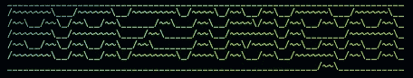
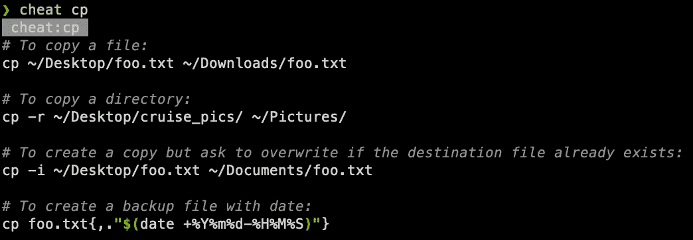
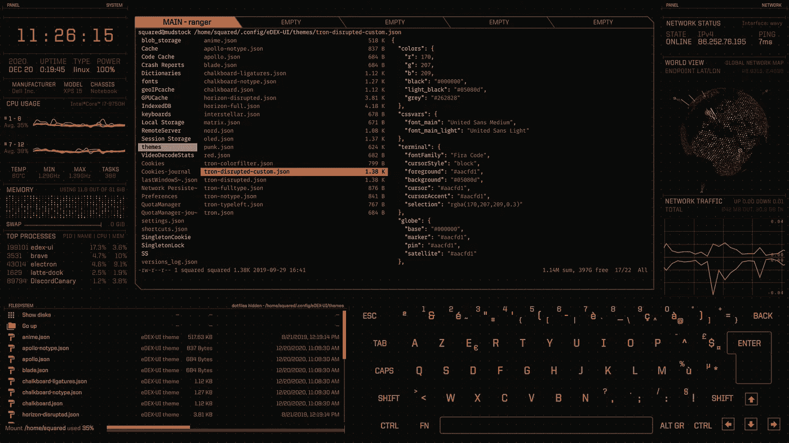
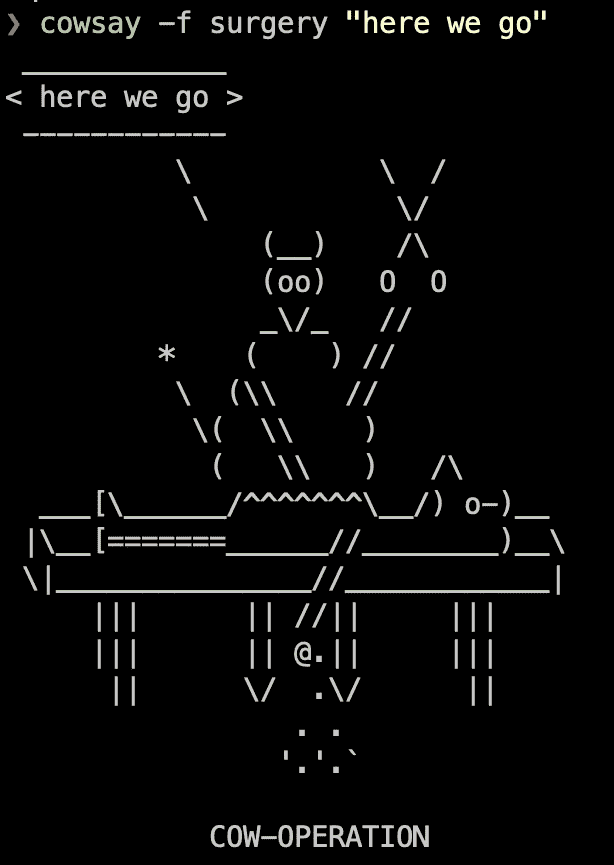
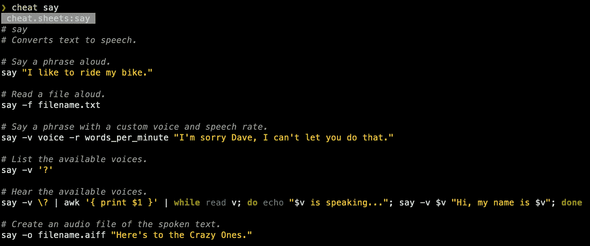
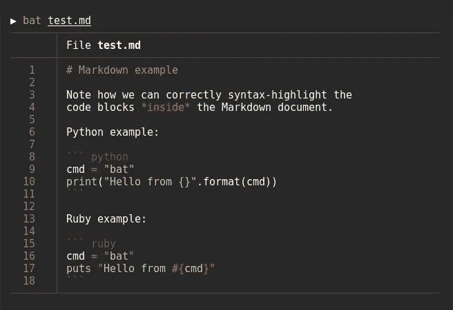

# 终极乐趣！

> 原文：<https://levelup.gitconnected.com/terminal-fun-482d3f7af99e>

edex-ui

## 有趣的事情，你可能不知道你可以在终端上做。

关于终端的事情是，它让你与你的系统互动。虽然您可以在终端上做一些严肃的事情，比如运行、监控和管理进程，或者制作一些有趣的自动化脚本，但是您也可以尝试这些有趣的脚本，并且熟悉命令行。

> 注意:macOS 使用' **brew'** ，linux 使用' **apt install'** 。

# 🔥FIGlet + lolcat(复古)

FIGlet 是一个计算机程序，可以生成各种字体的文本横幅，由较小的 ASCII 字符组成的字母组成。这是一个简洁的技巧，用在临时报告中很有趣。

Lolcat 在终端文本上产生彩虹效果。

斜视 80%阅读(字体:浮雕)

> 安装:brew 安装 figlet lolcat

# 🌟作弊(必备)

$欺骗 cp

[Cheat](https://github.com/cheat/cheat) 在终端上绝对省时。它在命令行选项上为您经常使用的命令提供了**实用的备忘单，但您使用的频率不足以记住**。

> 安装:brew 安装秘籍

# 🔥edex-ui

[edex-ui](https://github.com/GitSquared/edex-ui) 是一个跨平台、可定制的科幻小说终端仿真器，支持高级监控&触摸屏。

eDex-UI 制作精巧，但由于占用大量资源，几乎没有什么功能。这是你应该检查的东西，以后再装进去。用书呆子的方式超级酷。

> 安装:brew 安装—木桶 edex-ui

# 🐮考赛(葡萄酒)

cowsay 是一个古怪的程序，它可以生成带有信息的奶牛的 ASCII 艺术图片。快乐钓鱼！

> 安装:brew 安装 cowsay

# ⊹矩阵(经典)

事情就是这样。🔥

> 安装:brew install cmatrix

# 📢说

这正是它所说的。你可以用它以你喜欢的声音朗读文本文件。您也可以创建一个朗读文本的音频文件。可用于文本到语音转换或制作快速音频消息。

> 预装在 OSX。

# 🦇蝙蝠

[Bat](https://github.com/sharkdp/bat) 是轻量级脚本，在终端上提供语法高亮和 Git 集成！它在引擎盖下使用铁锈，速度非常快。

github 上有 30k 多颗星，它肯定非常受欢迎。Bat-extras 给你一些额外的功能。

# **高级**:

如果你打算花大量的时间在终端上，考虑下面的文章。

 [## 如何在 macOS 上像专业人士一样配置 iTerm2 和 Vim

### MAC OS+iterm 2+Oh My Zsh+power level 10k+Vim Airline+FZF+nerd tree](https://medium.com/@jeantimex/how-to-configure-iterm2-and-vim-like-a-pro-on-macos-e303d25d5b5c) 

W **蚂蚁制作一些很酷的脚本？**

如果您从未编写过 bash 脚本，并且想要开始，这里有一个惊人的 git repo，您可以查看一下。它从“hello word”发展成为一个成熟的命令行界面。

> github:【https://github.com/ruanyf/simple-bash-scripts 

## 看看我以前的文章！

 [## 设置完美的 MacOS 菜单栏！

### 按照下面的步骤建立一个整洁而实用的菜单栏。](/setting-up-the-perfect-macos-menu-bar-ba495b8f2db)