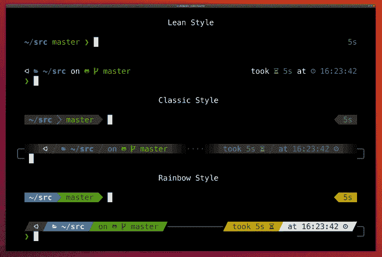
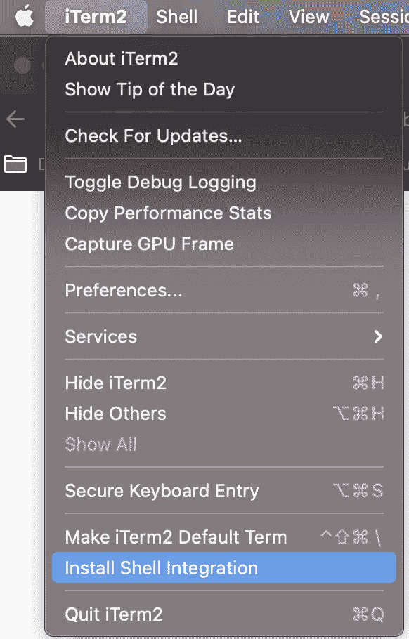

# 让您成为 2 倍开发者的 8 个终端技巧

> 原文：<https://levelup.gitconnected.com/terminal-tips-to-make-you-a-2x-developer-74fb32b07c07>


Marc-Olivier Jodoin 在 [Unsplash](https://unsplash.com/s/photos/speed?utm_source=unsplash&utm_medium=referral&utm_content=creditCopyText) 上拍摄的照片

我一生有三分之一的时间在睡觉，大概有四分之一的时间在我的终端里，我连 vim 都不用。

我想把这些时间花在完成事情上，而不是试图记住命令，或者第 n 次输入相同的命令，或者弄清楚哪个终端窗口在做什么。

以下工具帮助我优化我的终端以提高工作效率。就我个人而言，我使用带有 [zsh](https://github.com/ohmyzsh/ohmyzsh/wiki/Installing-ZSH%5D) 的 [iTerm](https://www.iterm2.com/downloads.html) 2 作为我的终端，但是下面的很多工具都是终端不可知的。

开始了…

## [1。哦，我的 zsh——比以往任何时候都更容易管理您的 zsh 插件](https://medium.com/r?url=https%3A%2F%2Fgithub.com%2Fohmyzsh%2Fohmyzsh)

哦，我的 zsh 允许你通过简单地更新你的。zshrc 文件。

这是插件管理，让你的奶奶也能轻松完成。比如你的~/。zshrc 可能如下所示:

```
plugins=(
  git
  bundler
  dotenv
  osx
  rake
)
```

**如果你用 zsh，这绝对是必备。**如果你还没有，就去[下载](https://github.com/ohmyzsh/ohmyzsh)它

> 哦，我的 Zsh 不会让你成为 10 倍的开发者…但你可能会觉得自己是。

— [哎呀我的 zsh 的 github 页面](https://github.com/ohmyzsh/ohmyzsh)

## [2。powerlevel10k 主题—让您的终端精彩绝伦](https://github.com/romkatv/powerlevel10k)

这是我用过的最好的 zsh 主题之一，我强烈推荐它。它是无限可配置的，同时仍然是友好和易于使用的。它有一个比大多数 SaaS 产品更好的入门指南，这使得你可以轻松地从当前的任何主题转换过来。



p10k 可以有不同的风格。信用: [Powerlevel10k 的 github](https://github.com/romkatv/powerlevel10k)

它的杀手锏之一就是 [**即时提示**](https://github.com/romkatv/powerlevel10k#instant-prompt) 。当我们在终端上安装插件时，它会变得很慢。即时提示就像它听起来的那样，即使 zsh 正在后台加载东西，它也会向您显示提示，以便您可以开始键入下一个命令。不用再等了！


鸣谢: [Powerlevel10k 的 github](https://github.com/romkatv/powerlevel10k)

## [3。fzf —模糊查找一切](https://medium.com/r?url=https%3A%2F%2Fgithub.com%2Fjunegunn%2Ffzf)

如果你从这个列表中得到一样东西，得到这个。

还记得三天前你运行的那个命令吗？没有吗？我也没有。

你可能使用`ctrl+r`进行反向搜索，希望得到你正在寻找的东西。停下来！使用 fzf，你只需输入一次`ctrl+r`就可以输入任何内容；它会模糊地找到你要找的东西，你只需从列表中选择。这个[视频](https://www.youtube.com/watch?v=1a5NiMhqAR0)很好地介绍了它的一些巧妙的特性，这些特性将使你成为至少 2 倍的开发者。


**不要忘记使用以下命令安装按键绑定**

```
$ $(brew --prefix)/opt/fzf/install
```

## [**4。zsh 自我暗示— T**](https://github.com/zsh-users/zsh-autosuggestions) **少打字，多做事**

让过去的你帮助现在的你！

您可能会多次键入相同的命令。例如，我曾经无数次地输入`npm run watch`。现在，有了 zsh 自动建议，我输入`n`，它显示`npm run watch`，我按下右箭头键，我就完成了。击键次数减少了近 85%。这是 2 倍的开发人员移动。


灰色部分是插件根据我目前的输入给出的建议

## [5。像兔八哥](https://github.com/agkozak/zsh-z)一样在目录中跳来跳去

你可能花了很多时间在相同的几个目录中。z 跟踪您最常访问的目录，并允许您通过很少的按键访问它们。这就像“cd”和“自我暗示”有了一个孩子。


信用: [z github](https://github.com/agkozak/zsh-z)

## [6。git 插件——少打字，多做事。](https://medium.com/r?url=https%3A%2F%2Fgithub.com%2Fohmyzsh%2Fohmyzsh%2Ftree%2Fmaster%2Fplugins%2Fgit)

git 插件[为 git 增加了一个便利层，提供了许多快捷方式和功能。`gl`到`git pull`、`gp`到`git push`、`gco`到`git checkout`。更少的单词，更快的速度！](https://medium.com/r?url=https%3A%2F%2Fgithub.com%2Fohmyzsh%2Fohmyzsh%2Ftree%2Fmaster%2Fplugins%2Fgit)

## [7。asdf —一个版本管理工具来管理它们](https://medium.com/r?url=https%3A%2F%2Fgithub.com%2Fasdf-vm%2Fasdf)

我曾经用 rvm 管理 ruby 版本，用 pyenv 管理 python，用 nvm 管理 node。现在我只有 [asdf](https://medium.com/r?url=https%3A%2F%2Fgithub.com%2Fasdf-vm%2Fasdf) 来满足我所有的版本管理需求。它可以与所有。nvmrc/。rvmrc 版本文件，设置起来很简单。

## 8.Iterm2 git 徽章—不要在您的终端中迷路

你通常打开多少个终端窗口？我通常在一个选项卡上运行后端服务器，在另一个选项卡上运行 webpack。在微服务世界中，您可能同时在多个选项卡中运行多个前端和后端服务。徽章让你很容易就能明白在哪里发生了什么。

**如何:**

1.  安装 iterm shell 集成



2.更新您的~/。zshrc 与以下。它设置了一个名为 gitProject 的项目变量。

```
function iterm2_print_user_vars() {
  iterm2_set_user_var gitProject $(basename $(git rev-parse --show-toplevel 2> /dev/null) 2> /dev/null)
}
```

3.更新您的 iterm 配置文件以使用我们创建的变量。`cmd + I`在 iterm 中调出配置文件。然后将`\(user.gitProject)`添加到徽章字段


你可以玩徽章来获得你需要的任何信息，并集中在你的终端上。

我希望这些提示和技巧能让你在成为 2x 开发者的道路上更进一步。

有那么[更多的插件](https://github.com/ohmyzsh/ohmyzsh/wiki/Plugins)。使用 oh-my-zsh 安装和删除插件是如此的容易，你真的应该玩玩那些能引起你兴趣的插件。你安装的下一个插件可能会改变你的生活。

# 奖金

自从我发表这篇文章后，我发现了更多的插件。我将把它们包括在本节中。

## [1。zsh-自动完成—针对 zsh 的即插即用自动完成](https://medium.com/r?url=https%3A%2F%2Fgithub.com%2Fmarlonrichert%2Fzsh-autocomplete)

这是一个很棒的工具，它将 fzf 和 zsh-autosuggestions 结合在一个插件中。很容易安装，从下面这张 gif 图看，它的好处马上就很明显了。


信用:[zsh-自动完成 github](https://github.com/marlonrichert/zsh-autocomplete)