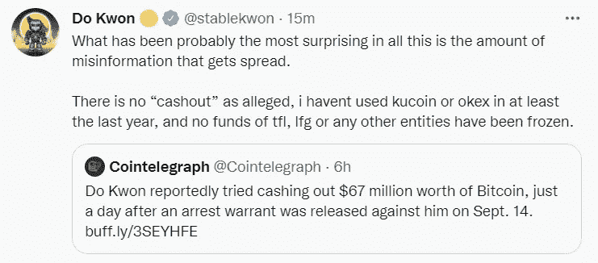

# Terra Luna 联合创始人 Do Kwon 在逮捕令发出后转移了 6200 万美元的比特币

> 原文：<https://levelup.gitconnected.com/terra-luna-co-founder-do-kwon-moved-62-million-of-bitcoin-after-arrest-warrant-bd07c90fcb0>

## 下面简单解释一下 Terra Luna 崩溃的原因。

来源— [跆拳道媒体账号](https://medium.com/@dokwon)

如果你对加密货币领域稍有了解，你就会听说过 Terra Luna 联合创始人的故事。

他损失了 400 亿美元，随后产生了连锁反应，导致主要投资公司倒闭，加密货币市值蒸发了 1 万亿美元。

Kwon 的死亡和 Terra 以及他们的姐妹 token Luna 的崩溃，目前被认为是全球加密市场崩溃的原因。

国际刑警组织对现在是国际逃犯的道权发出了红色通缉令，这太糟糕了。

罪犯逃到其他国家试图逃避法律制裁。红色通缉令提醒全球警方注意国际通缉的逃犯。

他们通常被称为国际刑警组织，这是一个促进全球犯罪控制的国际刑事警察组织。

# Terra、Luna 和 UST 崩溃是复杂的，所以我将在这里用简单易懂的语言解释它。

Terra 是一个区块链网络，[类似于以太坊](https://www.forbes.com/sites/qai/2022/09/15/can-ethereum-and-dogecoin-survive-a-global-recession/)或比特币，生产月神代币和姐妹代币 UST。

首先你需要明白什么是钱；对大多数人来说，它只是一张纸。但货币有价值，因为它在发行时与资产挂钩。

例如，如果美国发行 10 亿美元，他们应该有 10 亿美元的资产可以用来借款，通常是黄金或白银。

加密货币是互联网货币，不与传统投资者认为有价值的任何东西挂钩。

而是社会共识驱动价值；每个人都认为它现在有价值了。最近，认为加密有价值的想法创造了巨大的需求。

比特币是加密货币中最著名的例子，它不与任何东西挂钩，但具有价值。人们已经认识到它的重要性，它以黄金 2.0 的形式出现。

因为它不与固定资产挂钩，所以价格波动很大。

一些加密货币与法定货币或黄金挂钩，以抵御波动。

这些被称为 Stablecoins。

像露娜和 UST 这样的算法稳定币不同于系绳币或美元币，它由实际的美元或银行中的资产支持。

卢纳和 UST 是一种算法稳定的货币，只跟踪美元价格，如果形势恶化，没有基础资产可供清算。

Terra 的 Luna 和 UST token 与美元挂钩，一点也不稳定。

与那些在金库里持有黄金并以固定资产为抵押借款的国家不同，卢娜和 UST 没有什么可清算的。其复杂的算法使其价值只与美元价格挂钩和追踪。

对于你的非加密本地人来说，这种情况变得复杂，因为在 Terra 区块链上，价值 1 美元的 Luna 可以用 1 美元的 UST 烧掉，1 美元的 UST 可以用 1 美元的 Luna 烧掉。

假设对 UST 的需求增加，其价格比美元价格上涨 50%。如果你持有月神，你可以用 1.5 UST 币烧掉月神，然后用 UST 币换另一枚稳定币，这样你就可以立即获得 50%的利润。

这一套利机会让许多人迅速致富，把跆拳道变成了一个有点狂热的人物。

另一个重要的激励因素是，你可以将你持有的 UST 股票放在 Anchor lending 平台上，获得 20%的年收益率。

许多分析师认为，这种过高的增长率是不可持续的。他们是对的；的确是。

怀疑论者担心支付这些利率的资金从何而来。

事情在 2022 年 5 月 7 日开始出错，当时价值超过 20 亿美元的 UST 被解除锁定，随后被从锚协议中移除。

数亿 UST 被清算，价格开始下跌；价格暴跌导致了死亡螺旋，许多人都想把钱取出来。

没有人知道为什么会发生这种情况，无论是对 Terra 区块链的恶意攻击，还是对更广泛的宏观经济问题的回应。

大规模抛售意味着 UST 失去了盯住美元的政策，并导致 UST 汇率从 1 美元跌至 0.91 美元。

结果，交易者开始将价值 90 美分的 UST 兑换成 1 美元的卢纳，然后在硬币自由落体时立即卖出获利。

一些人从一开始就认为 Terra 是一个所谓的庞氏骗局，其中包括一名令牌经济学专家和加密货币思想领袖，他的假名是[豆豆](https://twitter.com/beaniemaxi)。

在 2021 年 12 月 9 日一句话的推文中；

> “Terra 是一个庞氏骗局；我研究过，这是庞氏数学。”

据报道，目前在逃的权在 2022 年 9 月 15 日创造了一个新钱包，就在一天前，[韩国法院签发了他的逮捕令](https://cointelegraph.com/news/south-korea-issues-arrest-warrant-for-terra-founder-do-kwon)。

韩国当局要求陷入似乎是邪恶活动的交叉火力中的加密交易所冻结与跆拳道有关的 3313 枚比特币( [BTC](https://cointelegraph.com/bitcoin-price) )。

分析集团 Cryptoquant 怀疑道权是名为露娜基金会卫士的匿名 BTC 钱包的创造者。

BTC 街 3313 号，然后被转到库科恩和奥克西交易所。

他们只在交易所冻结了 1354 个 BTC，所以还有 1959 个 BTC 没有被冻结，Kwon 似乎已经把 BTC 转移到其他平台了。

比特币的走势确实与 Kwon 之前的声明相矛盾，他曾使用 Terra 的所有比特币储备来保护该平台免受 UST 脱钩的影响。

尽管对他的逮捕发出了国际红色通缉令，Kwon 声称他既没有受到调查，也没有任何当局与他联系。

然而，就在公开逮捕令发出后，他逃到了新加坡，迫使当局向国际刑警组织寻求帮助。

他的下落不明，但 Kwon 坚持说，他没有兑现任何资金，因为他所有的商业实体都被冻结。

当我在他的推特账户上写这篇博客时，他发了这条推特，讽刺的是他的名字叫“稳定权”

来源— [跆拳道推特](https://twitter.com/stablekwon)

来源— [跆拳道推特](https://twitter.com/stablekwon)

> 如果你想在 Web3 上阅读更多我的观点，可以考虑成为会员。你的会员费直接支持你读的作家。如果你用我的链接[注册，我会赚一小笔佣金。](https://medium.com/@jayden_levitt/membership)

*本文仅供参考；不应将其视为财务、税务或法律建议。在做出任何重大财务决定之前，请咨询财务专家。*