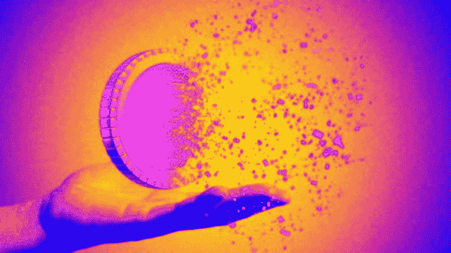

# Terra 储备基金消失得无影无踪

> 原文：<https://levelup.gitconnected.com/terra-reserve-fund-disappeared-without-a-trace-e3d5a399ae26>

私人加密货币调查公司 Elliptic 的专家报告称，Terra 的创造者获得的价值 35 亿美元的比特币被提取到两个加密交易所，之后它们消失得无影无踪，无法追踪它们的进一步命运。

5 月 9 日和 10 日，有权动用储备的人成功进行了两笔交易。

一半的金额(17 亿美元)进入了 Gemini crypto exchange，从那里进一步的资金行动无法被 hash 跟踪，另一半被转移到币安:在这种情况下，也没有办法确定硬币被送到了哪里。这些储备既可以分配给与露娜基金会护卫队(LFG)无关的私人钱包，也可以简单地作为虚拟货币提取到卡中。

让我提醒你，从一开始，稳定的货币 Terra 就不是由货币或证券支持的——它的利率必须由一种算法来支持，当利率下降时，它就会发行相关加密货币 Luna 的“硬币”。然而，5 月 9 日，Terra 报价开始大幅下跌，算法也无济于事:Luna 进入恶性通胀，几天内从 85 美元跌至 0.005 美元。该项目的“B 计划”是一个比特币储备基金，但它的命运现在不得而知。

📰 ***订阅*** [***斐波那契***](https://medium.com/@unclefibonacci) ***保持最新***